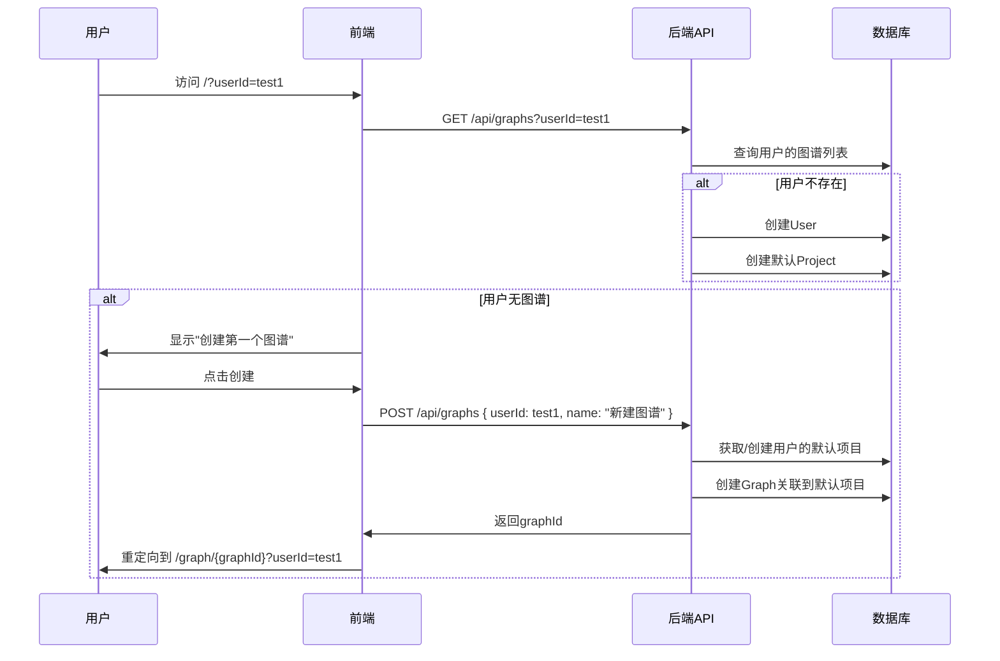

# 动态GraphID实施方案（调整版）

## 需求确认

根据最新讨论，确定以下方案：

1. ✅ **保留用户表** - 保持多用户数据结构
2. ✅ **URL参数传递用户** - 使用 `?userId=test1` 方式标记用户
3. ✅ **自动初始化项目** - 为每个用户创建默认项目（懒加载）

---

## 调整后的架构设计

### 路由结构

```
URL格式：
/                           -> Landing Page (可选：重定向到默认用户的图谱列表)
/?userId=test1              -> test1用户的图谱列表
/graph/[graphId]?userId=test1 -> 具体图谱页面
```

### 数据模型关系

```
User (保留)
  ├── Project (默认项目：自动创建)
  │     ├── Graph 1
  │     ├── Graph 2
  │     └── Graph n...
  └── Notifications
```

### 用户-项目-图谱初始化流程



---

## 具体实施方案

### Phase 1: 后端改造

#### 1.1 修改种子数据服务（保留但调整）

**文件：** `apps/api/src/demo/demo-seed.service.ts`

**变更：**
```typescript
import { Injectable, Logger } from '@nestjs/common';
import { prisma } from '@cdm/database';

/**
 * 只创建必要的测试用户，不创建项目和图谱
 * 项目和图谱将在用户首次访问时懒加载创建
 */
@Injectable()
export class DemoSeedService {
  private readonly logger = new Logger(DemoSeedService.name);

  /**
   * 确保测试用户存在
   */
  async ensureUser(userId: string): Promise<void> {
    await prisma.user.upsert({
      where: { id: userId },
      update: {},
      create: {
        id: userId,
        email: `${userId}@example.com`,
        name: `User ${userId}`,
      },
    });
    this.logger.log(`User ${userId} ready`);
  }

  /**
   * 获取或创建用户的默认项目
   */
  async getOrCreateDefaultProject(userId: string): Promise<string> {
    // 确保用户存在
    await this.ensureUser(userId);

    // 查找用户的第一个项目（作为默认项目）
    let project = await prisma.project.findFirst({
      where: { ownerId: userId },
    });

    // 如果不存在，创建默认项目
    if (!project) {
      project = await prisma.project.create({
        data: {
          name: `${userId}的工作空间`,
          ownerId: userId,
        },
      });
      this.logger.log(`Created default project for user ${userId}`);
    }

    return project.id;
  }
}
```

**说明：**
- ❌ 不再在启动时自动创建 demo-graph-1
- ✅ 保留用户创建逻辑（改为按需创建）
- ✅ 提供懒加载项目的方法

#### 1.2 创建Graph管理模块

**新建文件：** `apps/api/src/modules/graphs/graphs.service.ts`

```typescript
import { Injectable, NotFoundException } from '@nestjs/common';
import { prisma } from '@cdm/database';
import { DemoSeedService } from '../../demo/demo-seed.service';

export interface CreateGraphDto {
  userId: string;
  name?: string;
}

@Injectable()
export class GraphsService {
  constructor(private readonly demoSeedService: DemoSeedService) {}

  /**
   * 创建新图谱
   * 自动处理用户和项目的初始化
   */
  async create(dto: CreateGraphDto) {
    const { userId, name = '新建图谱' } = dto;

    // 获取或创建用户的默认项目
    const projectId = await this.demoSeedService.getOrCreateDefaultProject(userId);

    // 创建图谱
    const graph = await prisma.graph.create({
      data: {
        name,
        projectId,
        data: {},
      },
      include: {
        project: true,
      },
    });

    return graph;
  }

  /**
   * 获取用户的所有图谱
   */
  async findByUser(userId: string) {
    // 确保用户存在（但不创建项目）
    await this.demoSeedService.ensureUser(userId);

    const graphs = await prisma.graph.findMany({
      where: {
        project: {
          ownerId: userId,
        },
      },
      include: {
        project: {
          select: {
            id: true,
            name: true,
          },
        },
      },
      orderBy: {
        updatedAt: 'desc',
      },
    });

    return graphs;
  }

  /**
   * 获取单个图谱详情
   */
  async findOne(id: string) {
    const graph = await prisma.graph.findUnique({
      where: { id },
      include: {
        project: true,
      },
    });

    if (!graph) {
      throw new NotFoundException(`Graph ${id} not found`);
    }

    return graph;
  }

  /**
   * 删除图谱
   */
  async remove(id: string, userId: string) {
    // 验证所有权
    const graph = await prisma.graph.findUnique({
      where: { id },
      include: { project: true },
    });

    if (!graph) {
      throw new NotFoundException(`Graph ${id} not found`);
    }

    if (graph.project.ownerId !== userId) {
      throw new ForbiddenException('You do not own this graph');
    }

    await prisma.graph.delete({ where: { id } });
    return { message: 'Graph deleted successfully' };
  }
}
```

**新建文件：** `apps/api/src/modules/graphs/graphs.controller.ts`

```typescript
import { Controller, Get, Post, Delete, Body, Param, Query } from '@nestjs/common';
import { GraphsService } from './graphs.service';

@Controller('graphs')
export class GraphsController {
  constructor(private readonly graphsService: GraphsService) {}

  /**
   * 创建新图谱
   * POST /api/graphs
   */
  @Post()
  async create(
    @Body() body: { name?: string },
    @Query('userId') userId: string = 'test1',
  ) {
    return this.graphsService.create({
      userId,
      name: body.name,
    });
  }

  /**
   * 获取用户的图谱列表
   * GET /api/graphs?userId=test1
   */
  @Get()
  async findAll(@Query('userId') userId: string = 'test1') {
    return this.graphsService.findByUser(userId);
  }

  /**
   * 获取单个图谱
   * GET /api/graphs/:id
   */
  @Get(':id')
  async findOne(@Param('id') id: string) {
    return this.graphsService.findOne(id);
  }

  /**
   * 删除图谱
   * DELETE /api/graphs/:id?userId=test1
   */
  @Delete(':id')
  async remove(
    @Param('id') id: string,
    @Query('userId') userId: string = 'test1',
  ) {
    return this.graphsService.remove(id, userId);
  }
}
```

**新建文件：** `apps/api/src/modules/graphs/graphs.module.ts`

```typescript
import { Module } from '@nestjs/common';
import { GraphsController } from './graphs.controller';
import { GraphsService } from './graphs.service';
import { DemoSeedService } from '../../demo/demo-seed.service';

@Module({
  controllers: [GraphsController],
  providers: [GraphsService, DemoSeedService],
  exports: [GraphsService],
})
export class GraphsModule {}
```

**修改：** `apps/api/src/app.module.ts`

```typescript
import { Module } from '@nestjs/common';
// ... 其他imports
import { GraphsModule } from './modules/graphs/graphs.module';

@Module({
  imports: [
    // ... 其他imports
    GraphsModule, // 添加这行
  ],
  // ...
})
export class AppModule {}
```

---

### Phase 2: 前端改造

#### 2.1 创建路由结构

**新建文件：** `apps/web/app/page.tsx` (Landing Page)

```typescript
'use client';

import { useEffect } from 'react';
import { useRouter, useSearchParams } from 'next/navigation';

/**
 * Landing Page
 * 职责：获取userId并重定向到图谱列表
 */
export default function Home() {
  const router = useRouter();
  const searchParams = useSearchParams();
  const userId = searchParams.get('userId') || 'test1';

  useEffect(() => {
    // 重定向到图谱列表页
    router.push(`/graphs?userId=${userId}`);
  }, [router, userId]);

  return (
    <div className="flex items-center justify-center h-screen">
      <div className="text-center">
        <div className="animate-spin rounded-full h-12 w-12 border-b-2 border-blue-500 mx-auto"></div>
        <p className="mt-4 text-gray-600">加载中...</p>
      </div>
    </div>
  );
}
```

**新建文件：** `apps/web/app/graphs/page.tsx` (图谱列表页)

```typescript
'use client';

import { useEffect, useState } from 'react';
import { useRouter, useSearchParams } from 'next/navigation';
import { useGraphs } from '@/hooks/useGraphs';
import { PlusCircle, Folder } from 'lucide-react';

interface Graph {
  id: string;
  name: string;
  updatedAt: string;
  project: {
    id: string;
    name: string;
  };
}

export default function GraphsListPage() {
  const router = useRouter();
  const searchParams = useSearchParams();
  const userId = searchParams.get('userId') || 'test1';
  
  const { graphs, isLoading, createGraph, refreshGraphs } = useGraphs(userId);

  const handleCreateGraph = async () => {
    try {
      const newGraph = await createGraph('新建图谱');
      router.push(`/graph/${newGraph.id}?userId=${userId}`);
    } catch (error) {
      console.error('Failed to create graph:', error);
      alert('创建图谱失败');
    }
  };

  const handleOpenGraph = (graphId: string) => {
    router.push(`/graph/${graphId}?userId=${userId}`);
  };

  if (isLoading) {
    return (
      <div className="flex items-center justify-center h-screen">
        <div className="text-center">
          <div className="animate-spin rounded-full h-12 w-12 border-b-2 border-blue-500 mx-auto"></div>
          <p className="mt-4 text-gray-600">加载图谱列表...</p>
        </div>
      </div>
    );
  }

  return (
    <div className="min-h-screen bg-gradient-to-br from-blue-50 to-indigo-100 p-8">
      <div className="max-w-6xl mx-auto">
        {/* Header */}
        <div className="flex items-center justify-between mb-8">
          <div>
            <h1 className="text-3xl font-bold text-gray-900">我的图谱</h1>
            <p className="text-gray-600 mt-2">用户：{userId}</p>
          </div>
          <button
            onClick={handleCreateGraph}
            className="flex items-center gap-2 px-6 py-3 bg-blue-600 text-white 
                     rounded-lg hover:bg-blue-700 transition-colors shadow-lg"
          >
            <PlusCircle className="w-5 h-5" />
            创建新图谱
          </button>
        </div>

        {/* Empty State */}
        {graphs.length === 0 && (
          <div className="bg-white rounded-xl shadow-lg p-12 text-center">
            <Folder className="w-16 h-16 text-gray-300 mx-auto mb-4" />
            <h2 className="text-xl font-semibold text-gray-700 mb-2">
              还没有图谱
            </h2>
            <p className="text-gray-500 mb-6">创建你的第一个思维导图吧！</p>
            <button
              onClick={handleCreateGraph}
              className="inline-flex items-center gap-2 px-6 py-3 bg-blue-600 
                       text-white rounded-lg hover:bg-blue-700 transition-colors"
            >
              <PlusCircle className="w-5 h-5" />
              创建图谱
            </button>
          </div>
        )}

        {/* Graph Grid */}
        {graphs.length > 0 && (
          <div className="grid grid-cols-1 md:grid-cols-2 lg:grid-cols-3 gap-6">
            {graphs.map((graph) => (
              <div
                key={graph.id}
                onClick={() => handleOpenGraph(graph.id)}
                className="bg-white rounded-xl shadow-lg p-6 cursor-pointer 
                         hover:shadow-xl transition-shadow border-2 border-transparent
                         hover:border-blue-200"
              >
                <div className="flex items-start justify-between mb-4">
                  <Folder className="w-8 h-8 text-blue-500" />
                  <span className="text-xs text-gray-400">
                    {new Date(graph.updatedAt).toLocaleDateString('zh-CN')}
                  </span>
                </div>
                <h3 className="text-lg font-semibold text-gray-900 mb-2">
                  {graph.name}
                </h3>
                <p className="text-sm text-gray-500">
                  项目：{graph.project.name}
                </p>
              </div>
            ))}
          </div>
        )}
      </div>
    </div>
  );
}
```

**新建文件：** `apps/web/app/graph/[graphId]/page.tsx`

```typescript
'use client';

import { useState, useCallback, useEffect } from 'react';
import { useParams, useSearchParams } from 'next/navigation';
import { TopBar, LeftSidebar, RightSidebar } from '@/components/layout';
import type { Graph } from '@antv/x6';
import { LayoutMode } from '@cdm/types';
import { CollaborationUIProvider, GraphProvider } from '@/contexts';
import { ViewContainer } from '@/features/views';
import { useCollaboration } from '@/hooks/useCollaboration';
// ... 其他imports

export default function GraphPage() {
  const params = useParams();
  const searchParams = useSearchParams();
  
  const graphId = params.graphId as string;
  const userId = searchParams.get('userId') || 'test1';

  const [selectedNodeId, setSelectedNodeId] = useState<string | null>(null);
  const [graph, setGraph] = useState<Graph | null>(null);
  // ... 其他state（从原page.tsx复制）

  // Demo user（使用URL参数的userId）
  const DEMO_USER = {
    id: userId,
    name: `User ${userId}`,
    color: '#3b82f6',
  };

  // 使用URL参数的graphId
  const collab = useCollaboration({
    graphId,
    user: DEMO_USER,
    wsUrl: process.env.NEXT_PUBLIC_COLLAB_WS_URL || 'ws://localhost:1234',
  });

  // ... 其他逻辑（从原page.tsx复制）

  return (
    <CollaborationUIProvider
      onUserHoverExternal={handleUserHover}
      onUserClickExternal={handleUserClick}
    >
      <GraphProvider graph={graph} graphId={graphId} onNodeSelect={handleNodeSelect}>
        <div className="flex flex-col h-screen">
          <TopBar
            projectName="CDM图谱"
            currentLayout={layoutMode}
            onLayoutChange={handleLayoutChange}
            onGridToggle={handleGridToggle}
            gridEnabled={gridEnabled}
            isLoading={isLayoutLoading}
            viewMode={viewMode}
            onViewModeChange={setViewMode}
          />

          <div className="flex flex-1 overflow-hidden">
            <LeftSidebar
              isDependencyMode={isDependencyMode}
              onDependencyModeToggle={handleDependencyModeToggle}
            />

            <main className="flex-1 relative overflow-hidden">
              <ViewContainer
                graphId={graphId}
                user={DEMO_USER}
                collaboration={collab}
                onNodeSelect={handleNodeSelect}
                onLayoutChange={handleLayoutChange}
                onGridToggle={handleGridToggle}
                currentLayout={layoutMode}
                gridEnabled={gridEnabled}
                onGraphReady={setGraph}
                isDependencyMode={isDependencyMode}
                onExitDependencyMode={() => setIsDependencyMode(false)}
              />
            </main>

            <RightSidebar
              selectedNodeId={selectedNodeId}
              graph={graph}
              graphId={graphId}
              yDoc={collab.yDoc}
              creatorName={DEMO_USER.name}
              onClose={handleClosePanel}
            />
          </div>
        </div>
      </GraphProvider>
    </CollaborationUIProvider>
  );
}
```

#### 2.2 创建Graph管理Hook

**新建文件：** `apps/web/hooks/useGraphs.ts`

```typescript
'use client';

import { useState, useEffect, useCallback } from 'react';

const API_BASE_URL = process.env.NEXT_PUBLIC_API_URL || 'http://localhost:3001';

interface Graph {
  id: string;
  name: string;
  updatedAt: string;
  project: {
    id: string;
    name: string;
  };
}

export function useGraphs(userId: string) {
  const [graphs, setGraphs] = useState<Graph[]>([]);
  const [isLoading, setIsLoading] = useState(true);
  const [error, setError] = useState<Error | null>(null);

  const fetchGraphs = useCallback(async () => {
    try {
      setIsLoading(true);
      const response = await fetch(`${API_BASE_URL}/api/graphs?userId=${userId}`);
      if (!response.ok) {
        throw new Error('Failed to fetch graphs');
      }
      const data = await response.json();
      setGraphs(data);
    } catch (err) {
      setError(err as Error);
      console.error('Failed to fetch graphs:', err);
    } finally {
      setIsLoading(false);
    }
  }, [userId]);

  const createGraph = useCallback(
    async (name: string) => {
      const response = await fetch(`${API_BASE_URL}/api/graphs?userId=${userId}`, {
        method: 'POST',
        headers: { 'Content-Type': 'application/json' },
        body: JSON.stringify({ name }),
      });
      if (!response.ok) {
        throw new Error('Failed to create graph');
      }
      const newGraph = await response.json();
      await fetchGraphs(); // 刷新列表
      return newGraph;
    },
    [userId, fetchGraphs]
  );

  const deleteGraph = useCallback(
    async (graphId: string) => {
      const response = await fetch(
        `${API_BASE_URL}/api/graphs/${graphId}?userId=${userId}`,
        { method: 'DELETE' }
      );
      if (!response.ok) {
        throw new Error('Failed to delete graph');
      }
      await fetchGraphs(); // 刷新列表
    },
    [userId, fetchGraphs]
  );

  useEffect(() => {
    fetchGraphs();
  }, [fetchGraphs]);

  return {
    graphs,
    isLoading,
    error,
    createGraph,
    deleteGraph,
    refreshGraphs: fetchGraphs,
  };
}
```

---

### Phase 3: 数据库清理

#### 3.1 清理脚本

**新建文件：** `scripts/reset-for-dynamic-graph.sh`

```bash
#!/bin/bash

echo "🗑️  清理现有数据（保留schema和User表）..."

# 连接数据库并清空除User外的所有表
npx prisma db execute --stdin <<< "
TRUNCATE TABLE \"Notification\", \"Edge\", \"NodeTask\", \"NodeRequirement\", \"NodePBS\", \"NodeData\", \"Node\", \"Graph\", \"Project\" CASCADE;
"

echo "✅ 数据清理完成"
echo "📝 User表已保留，其他表已清空"
echo ""
echo "下次访问应用时，系统将自动为用户创建项目和图谱"
```

使用方法：
```bash
chmod +x scripts/reset-for-dynamic-graph.sh
./scripts/reset-for-dynamic-graph.sh
```

---

## 测试验证流程

### 1. 清空数据
```bash
./scripts/reset-for-dynamic-graph.sh
```

### 2. 重启后端
```bash
cd apps/api
npm run dev
```

### 3. 测试流程

**步骤1：首次访问**
```
访问：http://127.0.0.1:3000?userId=test1
预期：自动重定向到图谱列表页，显示"还没有图谱"
```

**步骤2：创建图谱**
```
点击"创建新图谱"
预期：
  - 后端自动创建User（如不存在）
  - 后端自动创建默认Project
  - 后端创建Graph
  - 前端重定向到 /graph/{newId}?userId=test1
```

**步骤3：验证数据库**
```sql
-- 应该看到：
SELECT * FROM "User" WHERE id = 'test1';
SELECT * FROM "Project" WHERE "ownerId" = 'test1';
SELECT * FROM "Graph" WHERE "projectId" IN (
  SELECT id FROM "Project" WHERE "ownerId" = 'test1'
);
```

**步骤4：切换用户**
```
访问：http://127.0.0.1:3000?userId=test2
预期：为test2创建独立的项目和图谱空间
```

---

## 迁移检查清单

### 后端
- [ ] 修改 `DemoSeedService` 为懒加载模式
- [ ] 创建 `GraphsModule`（controller, service, module）
- [ ] 在 `AppModule` 中注册 `GraphsModule`
- [ ] 测试API端点（Postman/curl）

### 前端
- [ ] 创建 `/app/graphs/page.tsx`（列表页）
- [ ] 创建 `/app/graph/[graphId]/page.tsx`（详情页）
- [ ] 更新 `/app/page.tsx` 为重定向页
- [ ] 创建 `useGraphs` hook
- [ ] 更新所有硬编码的 `DEMO_GRAPH_ID` 引用

### 数据库
- [ ] 运行清理脚本
- [ ] 验证User表保留
- [ ] 验证其他表清空

### 测试
- [ ] 首次访问流程
- [ ] 创建图谱流程
- [ ] 多用户隔离测试
- [ ] 协作功能测试

---

## 总结

这个方案的优势：

1. ✅ **保留User表** - 支持多用户
2. ✅ **URL参数传递userId** - 简单直接，无需复杂认证
3. ✅ **懒加载项目** - 首次创建图谱时自动初始化
4. ✅ **用户隔离** - 每个用户独立的项目空间
5. ✅ **向后兼容** - 保留schema结构，未来可扩展

预估工作量：**~16小时**
- 后端：6小时
- 前端：8小时
- 测试：2小时
