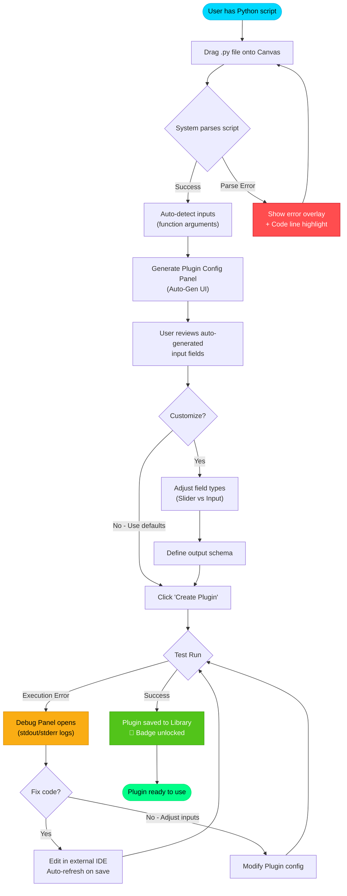
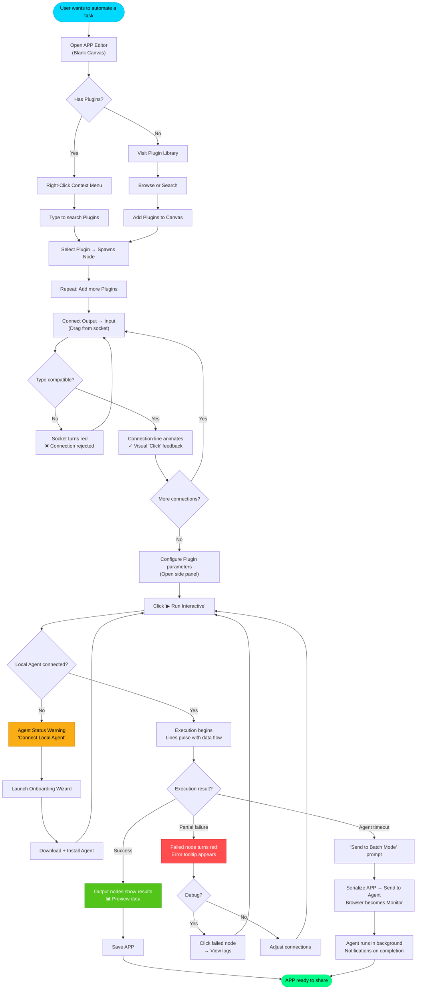
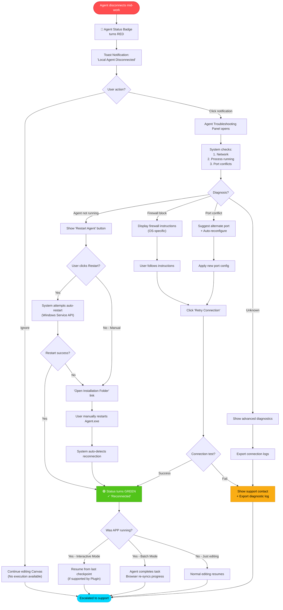
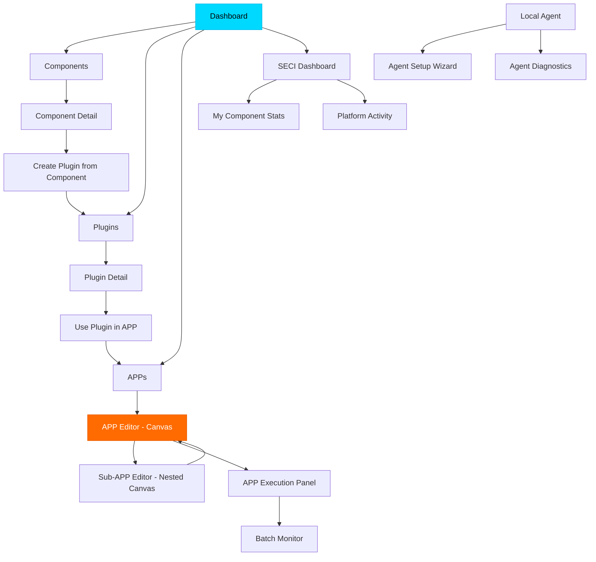

# UX Design Specification Industrial APP Module

**Author:** Enjoyjavapan
**Date:** 2026-01-24

---

<!-- UX design content will be appended sequentially through collaborative workflow steps -->

## Executive Summary

### Project Vision
To build a **web-based Low-Code Industrial Platform** that democratizes industrial knowledge. It enables experts to encapsulate raw capabilities (Components) into configurable tools (Plugins) and orchestrate them into visual workflows (APPs). The system uniquely bridges the gap between modern Web interfaces and legacy desktop capabilities through a **Web Canvas + Local Agent** architecture, driving the SECI knowledge cycle.

### Target Users
1.  **Technical Expert (The Creator):**
    *   **Persona:** Experienced Engineer/Developer (Python, CAD APIs).
    *   **Goals:** Encapsulate complex scripts/models into reusable plugins; Design robust standard workflows.
    *   **Needs:** Powerful debugging tools, flexible logic control, easy UI builder for end-users.
    *   **Key Insight (from Elicitation):** Needs **"Zero-Config" UI generation** (Auto-Gen) from scripts to reduce friction.
2.  **Domain Professional (The Consumer):**
    *   **Persona:** Mechanical Designer, Simulation Engineer.
    *   **Goals:** Quickly calculate parameters, run validations, generate reports without writing code.
    *   **Needs:** Intuitive "App-like" interface, fast feedback (Real-time preview), minimal friction setup.
    *   **Key Insight (from Elicitation):** Requires **"Surrogate Model" previews** (JS approximation) to mask the latency of heavy industrial solvers.

### Key Design Challenges
*   **Web-Desktop Hybrid Experience:** Making the interaction between the browser (React) and local software (NX/Ansys) feel seamless.
    *   *Strategy:* **Agent Liveness Detection** & Integrated Onboarding flow to prevent "Silent Failures" (Customer Support Theater insight).
*   **Visual Programming Complexity:** Managing large Rete.js graphs so they don't become "Spaghetti Code".
*   **Persona Conflict:** Experts want control, Consumers want simplicity.
    *   *Strategy:* **Progressive Disclosure (View Levels)** for Plugin UIs to satisfy both (Focus Group insight).

### Design Opportunities
*   **"Live" Component Cards:** Instead of static nodes, Plugin nodes can show mini-charts or progress bars directly on the canvas.
*   **Local Agent Status Tray:** A visible system tray indicator that builds trust by showing exactly what local command is running.
*   **SECI Dashboard:** A gamified "Knowledge Impact" panel showing experts how many times their component was used.

### Technical UX Decisions (Architecture & Recovery)

*   **Sub-graph Navigation Strategy:**
    *   *Challenge:* How to edit complex nested APPs without losing context.
    *   *Decision:* **Hybrid Navigation**.
        *   **Breadcrumbs:** Double-clicking a sub-graph node "drills down" into it, showing a breadcrumb bar (Main > SubApp > Component).
        *   **Tabs:** Users can distinctively "Open in New Tab" for parallel editing.
*   **Run Modes & Robustness:**
    *   *Challenge:* Protecting long-running industrial simulations from browser crashes or network hiccups.
    *   *Decision:* **Dual Execution Modes**.
        *   **Interactive Mode (Default):** Browser drives the flow. Best for debugging and designing.
        *   **Batch Mode:** "Send to Agent". The full graph is serialized and sent to the Local Agent. The Agent orchestrates it locally. The browser becomes a verified "Monitor". If the browser closes, the Agent continues working; re-opening the browser resumes monitoring.
*   **Connection Feedback:**
    *   The "Local Agent Status" in the UI must explicitly show connection type (WebSocket/HTTP) and latency, building trust in the hybrid bridge.

### Visual Clarity Decisions (From Party Mode)

*   **Cable Management Strategy:**
    *   *Problem:* Complex APPs with 50+ lines create visual stress.
    *   *Solution:* **"Wireless" Mode & Bus Routing**.
        *   **Wireless:** Allow input/output sockets to be "tagged" (e.g., Tag "Force"). Another node can read "Force" remotely without a visible line.
        *   **Bus:** Bundle multiple wires into a single thick "Cable" to reduce clutter.

### Core User Experience

#### Defining Experience
The core loop is **"Connect -> Visualize -> Act"**. Users are not "coding"; they are assembling capabilities. The experience must feel like a **physical workbench** where tools snap together.

#### Platform Strategy
**Hybrid Native**: 100% Web UI for access everywhere, coupled with a Windows-only Local Agent for heavy lifting.
*   **Constraint:** Mobile is for *viewing results* only. Editing requires Desktop (Mouse + Keyboard).

#### Effortless Interactions
*   **Smart Drag-and-Drop:** Dragging a local file (`calc.py`, `gear.prt`) onto the canvas automatically wraps it into a component node.
*   **Zero-Config Agent:** The local agent auto-discovers installed CAD/CAE software without manual path configuration.

#### Critical Success Moments
*   **"The First Twitch":** The first time a user moves a slider in the browser and sees their heavy CAD model update locally. This confirms the "Magic" of the system.

#### Experience Principles
1.  **Local Power, Web Simplicity:** Hide the command line, show the dashboard.
2.  **Feedback is King:** Always visualize the state (Connecting, Calculating, Done). Never leave the user guessing.
3.  **Progressive Power:** Simple defaults, infinite customizability behind the "Advanced" fold.

### Onboarding & Value Decisions (From Party Mode Round 2)

*   **Demo Mode (No-Agent First Run):**
    *   *Problem:* Requirement to install .exe Agent scares off casual triers.
    *   *Solution:* **"Sandbox Mode"**. A set of pre-calculated, cloud-hosted examples that work instantly in the browser without the Local Agent. Allows understanding the value before paying the "installation cost".
*   **Value Realization:**
    *   *Problem:* Hard to justify ROI of custom APPs.
    *   *Solution:* **ROI Dashboard**. Each APP has a "Time Saved" counter (vs Manual Work). The System aggregates this to show "Total Hours Saved this Month".

## Delivery Roadmap (4 Phases)

### Single Source of Truth (Pencil)
*   **Pencil file:** `docs/design/Industrial_APP_Module/industrial-app-module-ui.pen`
*   **Frames (Phase 1–4):**
    *   Phase 1: `01 — Moodboard`, `02 — Design System Library`
    *   Phase 2: `03 — Canvas Editor (High-Fi)`, `03b — Canvas Key Components`
    *   Phase 3: `04 — Plugin Builder (High-Fi)`, `05 — Local Agent (Onboarding + Recovery)`, `06 — Execution Monitor (Batch Mode)`, `07 — State Gallery`
    *   Phase 4: `08 — Responsive Adaptations`
    *   Theme variants (Light): `02L — Design System Library (Light)`, `03L — Canvas Editor (High-Fi Light)`, `03bL — Canvas Key Components (Light)`, `04L — Plugin Builder (High-Fi Light)`, `05L — Local Agent (Onboarding + Recovery Light)`, `06L — Execution Monitor (Batch Mode Light)`, `07L — State Gallery (Light)`, `08L — Responsive Adaptations (Light)`

### Phase 1 (Week 1): Design System Library + Mood Board
*   Establish **visual direction**, **token system**, and **component primitives** (AntD-aligned).
*   Output: Moodboard + design system library (Pencil) + updated tokens/spec (this doc).

### Phase 2 (Week 2): Canvas High-Fidelity + Key Components
*   Deliver the **APP Editor / Canvas** high-fi layout and the critical components (nodes, wires, context menu, inspector, run/debug panels).

### Phase 3 (Week 3): Full Journey Screens + All States
*   Cover end-to-end flows (Plugin creation → APP build → Run/Monitor → Recovery) including empty/loading/error/offline/permission states.

### Phase 4 (Week 4): Responsive + Motion + Dev Handoff
*   Responsive adaptation rules, motion tokens/spec, and an implementation handoff checklist (Ant Design token mapping + interaction notes).

## Desired Emotional Response

### Primary Emotional Goals
*   **For Experts:** "Empowered & Architect-like". The feeling of being a master builder where every component obeys their command.
*   **For Consumers:** "Confident & Safe". A stress-free sandbox environment where they can experiment with parameters without fear of breaking the underlying complex system.

### Micro-Emotions
*   **The "Click" (Satisfaction):** Crisp audio/visual feedback when nodes connect, providing a dopamine hit of "it works".
*   **The "Pulse" (Aliveness):** Animated optical flow on connection lines during calculation to verify system liveness and reduce anxiety.
*   **The "Badge" (Achievement):** Gamified recognition for experts when their components are reused, driving the SECI cycle.

### Design Metaphors
*   **"Digital Workbench":** UI elements should have subtle depth and physicality (shadows, borders) to imply they are sturdy tools, not just flat web pages.

## UX Pattern Analysis & Inspiration

### Inspiring Products Analysis
*   **Unreal Engine Blueprints:** The gold standard for node-based logic.
    *   *Adopt:* **Context Menu Search**. Right-click anywhere to spawn nodes (no sidebar hunting).
*   **ComfyUI (Stable Diffusion):** The community viral standard.
    *   *Adopt:* **Workflow JSON Copy-Paste**. The entire graph state is a simple JSON string. Users can share "App Recipes" via IM or forums just by pasting text. This directly powers the SECI "Socialization" phase.
*   **Make.com:** The visual automation standard.
    *   *Adopt:* **Execution Bubbles**. Visual data packets traveling along wires to visualize flow and data content.

### Transferable UX Patterns
*   **"Reroute Node":** A "joint" node to straighten messy wires.
*   **"Group & Comment":** Visual frames to organize sub-sections of the graph.
*   **"Ctrl+Drag Copy":** Rapid duplication of configured nodes.

### Design Inspiration Strategy
**Strategy:** "Industrial Power, Gamer Fluidity".
Matches the depth of an industrial tool with the interaction fluidity of a game engine editor (Unreal). We will prioritize keyboard shortcuts and rapid graph manipulation over "wizard-style" step-by-step handholding.

## Design System Foundation

### Mood Board & Visual Direction (Phase 1)
*   **Aesthetic:** *Industrial Noir* (graphite/metal) + *Blueprint Grid* (technical clarity) + *Electric Accents* (cyan/orange/green).
*   **Surface language:** dark layered panels, crisp strokes, subtle noise texture; avoid “flat SaaS” look.
*   **“Liveness” cue:** cyan→green flow + pulse animation on wires and agent status to eliminate “silent failure”.
*   **Typography:** IBM Plex family (condensed for headings) + JetBrains Mono for logs/IDs.
*   **Pencil reference:** `docs/design/Industrial_APP_Module/industrial-app-module-ui.pen` → `01 — Moodboard`.

### Design System Choice
**Ant Design (v5) + Customized Industrial Theme**.

### Rationale for Selection
1.  **Complex Component Power:** Industrial APPs require heavy-duty hierarchical trees, property grids, and complex forms. Ant Design provides the most robust set of these "Enterprise" components out-of-the-box.
2.  **Rete.js Compatibility:** Rete.js (the core Canvas engine) is framework-agnostic but pairs extremely well with React. Ant Design controls the *surrounding* UI (Sidebar, Dialogs, Context Menus) while Rete handles the *Canvas*.
3.  **Development Speed:** Prioritizing "Time-to-Value". We can scaffold the complex panels (SECI Dashboard, Plugin Library) in days using AntD.

### Customization Strategy
*   **Theme:** "Dark Industrial" + "Light Industrial". Override AntD tokens to remove excessive roundness (`borderRadius: 2px`) and use high-contrast electric accents (Cyan/Orange/Green) to match the "Digital Workbench" metaphor.
*   **Theme toggle:** Respect system preference by default; allow manual override in Settings; persist per user.

### Iconography
*   **Icon set:** Lucide (outlined)
*   **Sizes:** 16px (dense), 20px (default), 24px (headline/empty states)
*   **Stroke:** 1.5–2.0 (keep consistent across the app)
*   **Pencil reference:** `02 — Design System Library` → `Icons (Lucide)` section, plus `02L — Design System Library (Light)`

### Visual Design Token Specification

#### Color Palette

##### Core Brand Colors
*   **Primary (Cyan):** `#00D9FF` - Represents "Digital Transformation"
    *   Usage: Primary buttons, active states, key interactive elements
    *   Hover: `#00B8E6`
    *   Pressed: `#0099CC`
*   **Secondary (Orange):** `#FF6B00` - Represents "Industrial Heat & Energy"
    *   Usage: Secondary actions, warnings that require attention, selection highlights
    *   Hover: `#E65C00`
    *   Pressed: `#CC5200`
*   **Tertiary (Neon Green):** `#00FF88` - Represents "Computation Activity & Liveness"
    *   Usage: Success states, calculation in progress, live connection indicators
    *   Hover: `#00E67A`
    *   Pressed: `#00CC6B`

##### Semantic Colors
*   **Success:** `#52C41A` - Confirmation, completed tasks
*   **Warning:** `#FAAD14` - Caution, non-blocking issues
*   **Error:** `#FF4D4F` - Failures, blocking issues, validation errors
*   **Info:** `#1890FF` - Informational messages, tooltips

##### Canvas & Editor Specific Colors
*   **Canvas Background:** `#0D0D0D` - Deep black for maximum contrast
*   **Canvas Grid:** `#1A1A1A` - Subtle grid lines
*   **Node Background (Default):** `#1F1F1F`
*   **Node Background (Selected):** `#2A2A2A`
*   **Node Border (Default):** `#3F3F3F`
*   **Node Border (Selected):** `#FF6B00` (Secondary Orange)
*   **Node Border (Error):** `#FF4D4F` (Error Red)
*   **Connection Line (Active):** `#00D9FF` (Primary Cyan) with 60% opacity
*   **Connection Line (Inactive):** `#666666` with 40% opacity
*   **Connection Line (Data Flowing):** Animated gradient `#00D9FF → #00FF88`
*   **Selection Box:** `#FF6B00` with 20% fill opacity

##### Neutral Grays (Dark Mode Optimized)
*   **Gray-100:** `#0D0D0D` - Deepest backgrounds
*   **Gray-200:** `#1A1A1A` - Card backgrounds
*   **Gray-300:** `#262626` - Raised surfaces
*   **Gray-400:** `#3F3F3F` - Borders, dividers
*   **Gray-500:** `#666666` - Disabled states, secondary text
*   **Gray-600:** `#8C8C8C` - Placeholder text
*   **Gray-700:** `#BFBFBF` - Primary text
*   **Gray-800:** `#E6E6E6` - High emphasis text
*   **Gray-900:** `#FFFFFF` - Maximum contrast text

##### Neutral Grays (Light Mode)
*   **Background:** `#F7F8FA`
*   **Surface-1:** `#FFFFFF`
*   **Surface-2:** `#F2F4F7`
*   **Surface-3:** `#E4E7EC`
*   **Border:** `#D0D5DD`
*   **Text (Primary):** `#0B0F14`
*   **Text (Muted):** `#667085`

#### Typography System

##### Font Families
*   **UI Font:** `'IBM Plex Sans', 'Noto Sans SC', 'PingFang SC', 'Microsoft YaHei', system-ui, -apple-system, 'Segoe UI', sans-serif`
    *   Usage: All UI text, labels, buttons, menus
    *   Weights: 400 (Regular), 500 (Medium), 600 (Semi-Bold), 700 (Bold)
*   **Code Font:** `'JetBrains Mono', 'IBM Plex Mono', ui-monospace, SFMono-Regular, Menlo, Monaco, Consolas, monospace`
    *   Usage: Code snippets, Python script display, JSON output, logs
    *   Weights: 400 (Regular), 500 (Medium), 700 (Bold)
*   **Display Font:** `'IBM Plex Sans Condensed', 'IBM Plex Sans', 'Noto Sans SC', 'PingFang SC', 'Microsoft YaHei', system-ui, sans-serif`
    *   Usage: Large headings, hero sections
    *   Weights: 700 (Bold), 800 (Extra-Bold)

##### Type Scale
| Level      | Size | Line Height | Usage                          |
| ---------- | ---- | ----------- | ------------------------------ |
| Display    | 48px | 56px (1.17) | Hero headings, splash screens  |
| H1         | 32px | 40px (1.25) | Page titles                    |
| H2         | 24px | 32px (1.33) | Section headings               |
| H3         | 20px | 28px (1.4)  | Sub-section headings           |
| H4         | 18px | 26px (1.44) | Card titles                    |
| Body Large | 16px | 24px (1.5)  | Emphasis paragraphs            |
| Body       | 14px | 22px (1.57) | Default body text, most UI     |
| Body Small | 12px | 20px (1.67) | Secondary info, captions       |
| Caption    | 12px | 18px (1.5)  | Metadata, timestamps           |
| Code       | 14px | 22px (1.57) | Code blocks, monospace content |

##### Font Weights
*   **Regular (400):** Default body text
*   **Medium (500):** Emphasized text, active menu items
*   **Semi-Bold (600):** Button text, input labels
*   **Bold (700):** Headings, critical information

#### Spacing System

##### Base Unit
*   **Base:** `4px`
*   **Philosophy:** All spacing must be multiples of 4px for consistent rhythm

##### Spacing Scale
| Token      | Value | Usage                                  |
| ---------- | ----- | -------------------------------------- |
| `space-1`  | 4px   | Tight padding, icon gaps               |
| `space-2`  | 8px   | Button padding (vertical), small gaps  |
| `space-3`  | 12px  | Input padding, compact list items      |
| `space-4`  | 16px  | Default padding, card padding (small)  |
| `space-5`  | 20px  | Section spacing (small)                |
| `space-6`  | 24px  | Card padding (medium), section spacing |
| `space-8`  | 32px  | Large section spacing, modal padding   |
| `space-10` | 40px  | Extra large gaps                       |
| `space-12` | 48px  | Page margins, major section dividers   |
| `space-16` | 64px  | Hero section padding                   |

#### Border & Radius System

##### Border Widths
*   **Thin:** `1px` - Default dividers, card borders
*   **Medium:** `2px` - Active states, focus rings
*   **Thick:** `3px` - Heavy emphasis, drag targets

##### Border Radius
*   **None:** `0px` - Canvas nodes in "strict" mode
*   **Small:** `2px` - Buttons, inputs, chips (Industrial theme preference)
*   **Medium:** `4px` - Cards, modals, dropdowns
*   **Large:** `8px` - Large cards, image containers
*   **Round:** `9999px` - Pills, avatar badges

#### Shadow System (for Depth)

```css
/* Subtle elevation for cards */
--shadow-sm: 0 2px 4px rgba(0, 0, 0, 0.4);

/* Default elevation for floating elements */
--shadow-md: 0 4px 8px rgba(0, 0, 0, 0.5), 0 2px 4px rgba(0, 0, 0, 0.3);

/* High elevation for modals, popovers */
--shadow-lg: 0 8px 16px rgba(0, 0, 0, 0.6), 0 4px 8px rgba(0, 0, 0, 0.4);

/* Maximum elevation for tooltips */
--shadow-xl: 0 16px 32px rgba(0, 0, 0, 0.7), 0 8px 16px rgba(0, 0, 0, 0.5);

/* Glow effect for active/selected states */
--glow-primary: 0 0 12px rgba(0, 217, 255, 0.5);
--glow-secondary: 0 0 12px rgba(255, 107, 0, 0.5);
--glow-success: 0 0 12px rgba(0, 255, 136, 0.5);
```

#### Component Library Inventory

##### Core UI Components (Ant Design Based)
*   **Navigation:** Menu, Breadcrumb, Tabs, Pagination
*   **Data Entry:** Input, Select, Checkbox, Radio, Switch, Slider, DatePicker, Upload
*   **Data Display:** Table, Tree, List, Card, Collapse, Tooltip, Badge, Tag
*   **Feedback:** Alert, Message, Notification, Modal, Drawer, Progress, Spin
*   **Layout:** Grid, Layout (Header/Sider/Content/Footer), Space, Divider

##### Custom Canvas Components (Rete.js + Custom)
*   **Canvas Node Types:**
    *   `ComponentNode` - Represents a raw capability (Python script, CAD command)
    *   `PluginNode` - Configurable tool with UI
    *   `SubAppNode` - Nested workflow container
    *   `InputNode` / `OutputNode` - Data source/sink
    *   `RerouteNode` - Connection path organizer (visual-only)
    *   `CommentNode` - Documentation annotations
*   **Connection Elements:**
    *   `ConnectionLine` - Bezier curve with type-based coloring
    *   `ConnectionSocket` - Input/output ports with type indicators
    *   `WirelessTag` - Tag badge for "wireless" connections
    *   `BusCable` - Thick multi-wire bundle
*   **Canvas Controls:**
    *   `ContextMenu` - Right-click node spawner with search
    *   `MiniMap` - Overview navigator for large graphs
    *   `ZoomControls` - Zoom in/out/fit controls
    *   `SelectionBox` - Multi-select lasso tool

##### Custom Application Components
*   **Agent Status:**
    *   `AgentStatusBadge` - Live connection indicator (Green/Yellow/Red)
    *   `AgentTray` - Detailed agent info panel
    *   `OnboardingWizard` - First-time agent setup flow
*   **SECI Dashboard:**
    *   `KnowledgeImpactCard` - Usage statistics for experts
    *   `ComponentReuseBadge` - Gamification achievements
    *   `ROIDashboard` - Time-saved calculator
*   **Plugin/APP Management:**
    *   `PluginCard` - Marketplace item with preview
    *   `PluginConfigPanel` - Dynamic form generator (from script introspection)
    *   `AppExecutionPanel` - Run controls + progress visualization

## Phase 2 (Week 2): Canvas High-Fidelity + Key Components

### Pencil References
*   **Pencil file:** `docs/design/Industrial_APP_Module/industrial-app-module-ui.pen`
*   **Frames:**
    *   `03 — Canvas Editor (High-Fi)` (desktop workspace composition)
    *   `03L — Canvas Editor (High-Fi Light)` (light theme variant)
    *   `03b — Canvas Key Components` (node variants + connections + status)
    *   `03bL — Canvas Key Components (Light)` (light theme variant)

### Desktop Workspace Layout (Recommended)
*   **Sidebar (Plugin Library):** 300px (collapsible)
*   **Top Bar:** 64px (breadcrumbs + run/save + agent badge)
*   **Inspector (Config/Logs):** 320px (auto-open on selection)
*   **Canvas:** fill remaining area; subtle grid + minimal chrome

### Key Components (Anatomy)
*   **Node Card**
    *   Header: status dot + name + small state label (`READY/RUNNING/FAILED`)
    *   Body: typed I/O summary, optional inline progress bar + mini preview
    *   Border: semantic stroke (selected=orange, running=cyan, error=red)
*   **Connections**
    *   Active line: cyan; inactive: border gray; flowing: cyan→green pulse
    *   **Bus cable:** thick bundled lane (for 4+ wires) to reduce clutter
    *   **Wireless tag:** `TAG Force` style pill for “no-wire” mode
*   **Context Menu (Node Spawner)**
    *   Always keyboard-first: auto-focus search; arrow keys; `Enter` to spawn; `Esc` to dismiss
    *   Prioritize Recents + Suggestions before full list
*   **Inspector (Auto-Gen UI)**
    *   Progressive disclosure: Basic vs Expert parameters (collapsed by default)
    *   Inline validation + “Preview (surrogate)” toggle for latency masking

### Visual State Set (Minimum)
*   **Nodes:** idle, selected, running, success, error, disabled
*   **Agent Badge:** connected (green), degraded (yellow), disconnected (red)

## Core User Experience (Detailed)

### Defining Experience ("Visual Piping")
The core metaphor is **"Visual Piping"**. Users act as "Plumbers" connecting data flows, not "Coders" writing logic.
*   **Action:** Connect.
*   **Feedback:** Flow. Data flows visibly like water through pipes.
*   **Goal:** Assembly.

### User Mental Model
*   **Shift:** From "Black Box" (Input -> Wait -> Output) to **"Glass Box"** (Transparent data transformation visibility).

### Novel UX Patterns
*   **Hybrid Breadcrumbs:** Navigation bar acts as both a "Path Locator" and a "System Status Monitor". If a nested sub-graph errors, the breadcrumb turns red, enabling "Drill-down Debugging".

### Experience Mechanics
1.  **Initiation:** Drag script/file to canvas.
2.  **Interaction:** Drag wire from Output.
3.  **Suggestion:** System highlights compatible Input slots (Type Safety).
4.  **Completion:** Audio/Visual "Click" + Instant Preview.

### Critical User Journeys

#### Journey 1: Creating the First Plugin
This journey transforms a raw Python script into a reusable, configurable Plugin.



**Key UX Moments:**
*   **"The Click":** When script is dropped, the system immediately shows a parsing progress indicator.
*   **"Zero-Config Magic":** The auto-generated UI appears instantly, delighting Expert users.
*   **"Safety Net":** Debug panel with syntax highlighting reduces frustration during errors.

---

#### Journey 2: Building the First APP
This journey orchestrates multiple Plugins into a workflow.



**Key UX Moments:**
*   **"The First Twitch":** When the user runs the APP and sees live data flowing through the lines.
*   **"Type Safety Guardian":** The system prevents invalid connections, reducing debugging time.
*   **"Batch Mode Rescue":** For long-running tasks, the browser can close without losing work.

---

#### Journey 3: Local Agent Connection Recovery
This journey handles the critical failure scenario when the Local Agent disconnects.



**Key UX Moments:**
*   **"Proactive Diagnosis":** The system doesn't just say "error" — it tells the user *why* and *how* to fix it.
*   **"Auto-Recovery":** The system attempts self-healing before asking the user to intervene.
*   **"Graceful Degradation":** Even without the Agent, users can still design and edit APPs.

---

## Phase 3 (Week 3): Full Journey Screens + All States

### Pencil References
*   **Pencil file:** `docs/design/Industrial_APP_Module/industrial-app-module-ui.pen`
*   **Frames:**
    *   `04 — Plugin Builder (High-Fi)` + `04L — Plugin Builder (High-Fi Light)` (import → auto-gen UI → test → publish)
    *   `05 — Local Agent (Onboarding + Recovery)` + `05L — Local Agent (Onboarding + Recovery Light)` (demo mode + onboarding wizard + diagnostics)
    *   `06 — Execution Monitor (Batch Mode)` + `06L — Execution Monitor (Batch Mode Light)` (browser-as-monitor, resilient long-run execution)
    *   `07 — State Gallery` + `07L — State Gallery (Light)` (empty/loading/error/offline/permission snapshots)

### State Coverage (Minimum Set)
| Surface             | Empty | Loading | Error | Offline/Degraded | Permission |
| ------------------- | ----- | ------- | ----- | ---------------- | ---------- |
| Canvas workspace    | ✅     | ✅       | ✅     | ✅                | -          |
| Plugin import/build | ✅     | ✅       | ✅     | -                | -          |
| Local agent         | -     | ✅       | ✅     | ✅                | ✅          |
| Execution monitor   | -     | ✅       | ✅     | ✅                | -          |

---

## Information Architecture

### Navigation Structure

#### Primary Navigation (Top-Level)
The application uses a **persistent left sidebar navigation** with the following main sections:

```
┌─────────────────────────────────────┐
│ [Logo] Industrial APP Platform      │
├─────────────────────────────────────┤
│ 🏠 Dashboard                        │  ← Landing page with quick actions
│ 🧩 Components                       │  ← Raw capability library
│ 🔌 Plugins                          │  ← Configured tool marketplace
│ 📐 APPs                             │  ← Workflow editor & manager
│ 📊 SECI Dashboard                   │  ← Knowledge impact analytics
│ 🖥️ Local Agent                      │  ← Agent status & management
│ ⚙️ Settings                         │  ← User preferences
├─────────────────────────────────────┤
│ 👤 [User Profile]                   │
└─────────────────────────────────────┘
```

**Navigation Behavior:**
*   Sidebar is **collapsible** (icon-only mode on narrow screens or user preference)
*   Active section highlighted with **Primary Cyan** left border + background tint
*   Badge indicators show counts (e.g., "5 new Components")

---

#### Page Hierarchy & Relationships



---

#### Breadcrumb Navigation Rules

**Standard Breadcrumbs:**
```
Dashboard > APPs > GearCalculator_v2 > Edit
```

**Enhanced Breadcrumbs (for nested Sub-APPs):**
```
Dashboard > APPs > FactoryWorkflow > [Drilling_Module] > [Coolant_Control]
                    ↑ Main APP        ↑ Sub-APP L1    ↑ Sub-APP L2
```

**Breadcrumb Features:**
*   **Click any segment** to navigate up the hierarchy
*   **Status indicators**: If a nested sub-graph has an error, that breadcrumb segment turns **red**
*   **Hover tooltip**: Shows summary of that level (e.g., "3 Plugins, 12 connections")
*   **Right-click**: "Open in New Tab" option for parallel editing

---

### Content Organization Patterns

#### Card-Based Browsing (Components/Plugins/APPs)
All libraries use a **responsive grid layout** with cards:

**Card Anatomy:**
```
┌─────────────────────────────────┐
│  [Icon/Thumbnail]               │
│                                 │
│  Component Name                 │
│  Author | Last Updated          │
│  ⭐⭐⭐⭐☆ (4.2) · 156 uses     │
│                                 │
│  [Tag] [Tag] [Tag]              │
│                                 │
│  [Quick Action Buttons]         │
└─────────────────────────────────┘
```

**Sorting & Filtering:**
*   Sort by: Most Used | Newest | Rating | My Items
*   Filter by: Tags, Author, Type
*   Live search across name + description

---

#### Canvas Layout (APP Editor)

**Three-Panel Layout:**
```
┌────────┬──────────────────────┬─────────┐
│ Plugin │                      │ Config  │
│ Library│   Canvas             │ Panel   │
│ (Left) │   (Main Area)        │ (Right) │
│        │                      │         │
│ Search │   [Nodes & Lines]    │ Node    │
│ Tree   │                      │ Settings│
│        │                      │         │
│ [+New] │   [MiniMap]          │ [Run]   │
└────────┴──────────────────────┴─────────┘
```

**Panel Visibility:**
*   **Left Panel:** Toggleable (Keyboard: `Ctrl+B`)
*   **Right Panel:** Auto-opens when a node is selected; closeable
*   **Canvas:** Always visible, full responsive to panel states
*   **MiniMap:** Toggleable (Keyboard: `M`), floats in bottom-right corner

---

### Search & Discovery Patterns

#### Global Search (Keyboard: `/`)
Unified search across all content types:

**Search Results Display:**
```
┌─────────────────────────────────────────┐
│ 🔍 Search: "gear"                       │
├─────────────────────────────────────────┤
│ Components (2)                          │
│   📄 gear_strength.py                   │
│   📄 gear_generator.py                  │
├─────────────────────────────────────────┤
│ Plugins (3)                             │
│   🔌 Gear Calculator Pro                │
│   🔌 Spur Gear Designer                 │
│   🔌 Gear Mesh Checker                  │
├─────────────────────────────────────────┤
│ APPs (1)                                │
│   📐 GearTrain_Optimizer                │
└─────────────────────────────────────────┘
```

**Search Features:**
*   **Fuzzy matching** (typo-tolerant)
*   **Tag-based filtering** (type `#CAD` to filter by tag)
*   **Author filtering** (type `@username`)
*   **Recent searches** cached locally

---

#### Context Menu Search (Canvas)
Right-click anywhere on the Canvas to spawn the **Node Spawner Menu**:

```
┌────────────────────────────┐
│ 🔍 Add Plugin...           │
│ ┌──────────────────────┐   │
│ │ [Search input]       │   │
│ └──────────────────────┘   │
│                            │
│ Suggestions:               │
│ 🔌 Data Import             │
│ 🔌 Math Functions          │
│ 🔌 File Export             │
│                            │
│ Recent:                    │
│ 🔌 Gear Calculator         │
│ 🔌 Stress Analyzer         │
└────────────────────────────┘
```

**Behavior:**
*   Search input **auto-focused** on menu open
*   **Arrow keys** to navigate suggestions
*   **Enter** to spawn selected Plugin at cursor position
*   **Esc** to close menu

---

## Responsive Design Strategy

### Breakpoint Specification

| Breakpoint Name   | Min Width | Max Width | Target Devices                       | Layout Strategy                    |
| ----------------- | --------- | --------- | ------------------------------------ | ---------------------------------- |
| **Mobile**        | -         | 767px     | Smartphones                          | View-only, Stack layout            |
| **Tablet**        | 768px     | 1279px    | iPad, Tablet                         | Limited editing, Collapsed sidebar |
| **Desktop**       | 1280px    | 1919px    | Laptops, standard monitors           | Full functionality, Default layout |
| **Large Desktop** | 1920px    | -         | High-res monitors, multiple displays | Enhanced canvas space, Multi-panel |

---

### Responsive Layout Adaptations

#### Mobile (< 768px): **View-Only Mode**

**Limitations:**
*   ❌ No Canvas editing (too complex for touch)
*   ❌ No Plugin creation
*   ✅ Can view APP results
*   ✅ Can browse Components/Plugins
*   ✅ Can monitor APP execution (Batch Mode)

**Layout:**
```
┌─────────────────┐
│ [Top Bar]       │
│ [Search]        │
├─────────────────┤
│                 │
│ [Content Cards] │
│ [Stacked List]  │
│                 │
│                 │
│                 │
├─────────────────┤
│ [Bottom Nav]    │
│ [🏠][🔌][📐][⚙️]│
└─────────────────┘
```

**Mobile-Specific Features:**
*   **Bottom navigation bar** replaces sidebar (iOS/Android pattern)
*   **Swipe gestures**: Left/Right to switch sections
*   **Pull-to-refresh** for content updates
*   **Large tap targets** (minimum 44x44px per Apple HIG)

**APP Viewer (Mobile):**
*   Show **graph visualization as static SVG** (no interaction)
*   **Scroll to zoom** on graph
*   **Tap node** to view configuration (read-only)
*   **"Open in Desktop"** prompt with QR code

---

#### Tablet (768px - 1279px): **Limited Editing Mode**

**Capabilities:**
*   ✅ Canvas viewing with basic interaction
*   ✅ Node repositioning (drag-and-drop)
*   🔶 Limited node creation (from sidebar only, no context menu)
*   ❌ Complex connection editing (fine motor control issues)
*   ✅ Plugin configuration (touch-friendly forms)

**Layout:**
```
┌──────────────────────────┐
│ [Top Bar with Search]    │
├────┬─────────────────────┤
│ 📐 │                     │
│ 🔌 │   Canvas            │
│ 🏠 │   (Medium size)     │
│ ⚙️ │                     │
│    │                     │
│    │   [Touch-optimized  │
│    │    controls]        │
└────┴─────────────────────┘
```

**Tablet Optimizations:**
*   **Icon-only sidebar** (auto-collapsed to save space)
*   **Floating config panel** (modal overlay, not persistent right panel)
*   **Touch-friendly node size** (minimum 60x60px vs 40x40px on desktop)
*   **Connection sockets enlarged** (easier tap targeting)
*   **Two-finger pan** for canvas movement
*   **Pinch-to-zoom** for canvas scaling

---

#### Desktop (1280px - 1919px): **Full Functionality (Default)**

**Standard Three-Panel Layout:**
```
┌────────┬──────────────────────┬─────────┐
│ Left   │                      │ Right   │
│ Panel  │   Canvas (Main)      │ Panel   │
│ 280px  │   Flexible           │ 320px   │
│        │                      │         │
│ Plugin │   [Nodes & Lines]    │ Config  │
│ Tree   │                      │ Panel   │
│        │   [Context Menu]     │         │
│        │   [MiniMap]          │ [Run]   │
└────────┴──────────────────────┴─────────┘
```

**Keyboard Shortcuts (Desktop-only):**
```
Ctrl+B       : Toggle left panel
Ctrl+/       : Global search
Ctrl+K       : Context menu search
Ctrl+D       : Duplicate selected nodes
Ctrl+Z/Y     : Undo/Redo
Delete       : Remove selected nodes
Space+Drag   : Pan canvas
Ctrl+Wheel   : Zoom canvas
Ctrl+0       : Fit canvas to view
M            : Toggle MiniMap
```

---

#### Large Desktop (>= 1920px): **Enhanced Multi-Panel**

**Expanded Layout:**
```
┌────────┬──────────────────────────────┬──────────┬──────────┐
│ Left   │                              │ Right    │ Extra    │
│ Panel  │   Canvas (Maximized)         │ Config   │ Panel    │
│ 320px  │   Expanded workspace         │ 360px    │ 300px    │
│        │                              │          │          │
│ Plugin │   [Large nodes visible]      │ Node     │ SECI     │
│ Tree   │                              │ Settings │ Stats    │
│        │   [MiniMap + Helpers]        │          │ Live     │
│ [+New] │                              │ [Run]    │ Metrics  │
└────────┴──────────────────────────────┴──────────┴──────────┘
```

**Large Screen Enhancements:**
*   **Fourth panel** for contextual info (SECI stats, Agent logs, Version history)
*   **Inline documentation** (hover node to show API docs in extra panel)
*   **Side-by-side Sub-APP editing** (open two tabs of canvas in split view)
*   **Enhanced MiniMap** with labeling (node names visible on overview)

---

### Touch vs Mouse Interaction Differences

| Interaction           | Desktop (Mouse)                 | Tablet/Mobile (Touch)         |
| --------------------- | ------------------------------- | ----------------------------- |
| **Canvas Pan**        | Middle-click drag or Space+drag | Two-finger drag               |
| **Canvas Zoom**       | Ctrl+Scroll wheel               | Pinch gesture                 |
| **Node Select**       | Left-click                      | Single tap                    |
| **Multi-select**      | Ctrl+Click or drag lasso        | Long-press then tap others    |
| **Node Move**         | Drag                            | Drag (with enlarged hit area) |
| **Context Menu**      | Right-click                     | Long-press                    |
| **Connection Create** | Drag from socket                | Tap socket, tap target socket |
| **Connection Delete** | Click line, press Delete        | Tap line, tap trash icon      |

---

### Responsive Component Behavior

#### Navigation Sidebar
*   **Desktop:** Persistent, expanded by default (280px)
*   **Tablet:** Collapsed to icons only (60px), hover to expand
*   **Mobile:** Hidden, replaced by bottom nav bar

#### Canvas Controls (Zoom, Fit, MiniMap)
*   **Desktop:** Always visible, floating in bottom-right
*   **Tablet:** Floating toolbar, auto-hide after 3s of inactivity
*   **Mobile:** Hidden (view-only mode doesn't need controls)

#### Configuration Panel
*   **Desktop:** Persistent right panel (320px), opens on node selection
*   **Tablet:** Full-screen modal overlay, slides up from bottom
*   **Mobile:** Same as tablet

---

### Performance Considerations by Device

#### Large Graph Rendering (500+ nodes)

**Desktop:**
*   Full WebGL rendering for smooth 60fps
*   All nodes visible with labels

**Tablet:**
*   Simplified rendering: hide labels on zoom-out
*   Throttle connection line animations to 30fps

**Mobile:**
*   Static SVG export (no live rendering)
*   Or: "Graph too large for mobile viewing" message with desktop link

---

### Accessibility Across Breakpoints

**Mobile/Tablet:**
*   **Minimum tap target:** 44x44px (iOS), 48x48px (Android)
*   **Contrast ratio:** WCAG AAA (7:1) for text on backgrounds

**Desktop:**
*   **Keyboard navigation:** Full support for tab, arrows, shortcuts
*   **Screen reader:** ARIA labels on all interactive canvas elements

---

### Responsive Content Strategy

**Progressive Enhancement Approach:**
1.  **Mobile-first content core:** APP results, execution status, Component browsing
2.  **Tablet adds:** Basic canvas interaction, Plugin configuration
3.  **Desktop unlocks:** Full editing, keyboard shortcuts, multi-panel workspace
4.  **Large desktop enhances:** Parallel workflows, embedded documentation

**Responsive Image/Media:**
*   Plugin thumbnails: 
    *   Mobile: 150x150px (1x), 300x300px (2x for retina)
    *   Desktop: 200x200px (1x), 400x400px (2x)
*   Hero images: WebP format with fallback to PNG
*   Videos: Adaptive bitrate streaming for Agent setup guides

---

## Phase 4 (Week 4): Responsive + Motion + Dev Handoff

### Pencil Reference (Responsive)
*   **Pencil file:** `docs/design/Industrial_APP_Module/industrial-app-module-ui.pen`
*   **Frames:** `08 — Responsive Adaptations` + `08L — Responsive Adaptations (Light)`

### Motion Specification (动效规范)

#### Motion Tokens
| Token         | Duration  | Usage                                         |
| ------------- | --------- | --------------------------------------------- |
| `motion-fast` | 80–120ms  | hover, pressed, focus rings                   |
| `motion-base` | 160–220ms | panel open/close, dropdowns, toasts           |
| `motion-slow` | 280–420ms | modals, page transitions, large layout shifts |

**Easing (recommended):**
*   `ease-out`: `cubic-bezier(0.16, 1, 0.3, 1)` for entrances
*   `ease-in`: `cubic-bezier(0.7, 0, 0.84, 0)` for exits
*   `linear`: for continuous telemetry (wire flow)

#### Key Micro-interactions
*   **Node connect “Click”:** 1) socket highlight, 2) 1–2 frame snap/glow, 3) settle. (Total ≤ 180ms)
*   **Wire “Pulse”:** cyan→green gradient shift + optional moving dot; throttle on low-power devices.
*   **Run feedback:** top bar badge + node border color + inline progress; avoid blocking spinners.
*   **Offline recovery:** banner slides down; “Retry” button pulses subtly every 3s (stop after 3 pulses).

#### Accessibility for Motion
*   Respect `prefers-reduced-motion`: disable wire flow and large transitions; keep only instant state changes.
*   Never encode status solely by motion; always pair with color + text/icon.

### Developer Handoff (交付开发)

#### Token Delivery
*   **Design tokens (JSON):** `docs/design/Industrial_APP_Module/design-tokens.json`
*   **Themes:** `themes.dark` + `themes.light` (match `prefers-color-scheme`, allow user override)
*   **AntD v5 mapping:** use each theme’s `antd.token` overrides (primary/semantic colors, background/container, borderRadius).

#### Component Mapping (Ant Design + Custom)
*   **Ant Design:** Layout/Sider, Menu, Breadcrumb, Tabs, Drawer, Modal, Notification, Table, Tree, Form/Input/Select/Slider/Switch, Tooltip/Popover
*   **Custom (Rete.js layer):** NodeCard, ConnectionLine (with flow states), MiniMap, ContextMenu, SelectionBox, WirelessTag, BusCable
*   **Icons:** Lucide

#### Implementation Notes (Key)
*   Prefer CSS variables for Canvas layer (`--canvas-*`, `--node-*`, `--wire-*`) to keep Rete theming decoupled from AntD.
*   Implement theme switch as a single top-level provider (AntD token + CSS variables) so Canvas + AntD stay in sync.
*   Keep canvas interactions keyboard-first: `/` global search, right-click spawner, `Ctrl+B` sidebar toggle, `M` minimap toggle.
*   Ensure agent safety UX: first-access permission modal, allow-list directory, exportable diagnostics bundle.

---

## Phase 5 (Week 5-6): Enhanced Features & Missing Requirements

### Phase 5 Overview

Phase 5 补充了需求覆盖度分析中识别的缺失功能，并按用户需求全面升级了节点系统。本阶段采用**Rete.js v2.0多端口设计**，实现了完整的逻辑控制能力、专业级调试工具、工业可视化组件和数据分析仪表盘。

**设计优先级分类:**
- **P0 (MVP必需):** 增强节点库、完整Toolbar、核心逻辑节点
- **P1 (短期实现):** Console完整系统、循环节点扩展、3D查看器、Demo引导
- **P2 (中期优化):** CAE可视化、Analytics Dashboard

### Pencil Reference (Phase 5)
*   **Pencil file:** `docs/design/Industrial_APP_Module/industrial-app-module-ui-cc.pen`
*   **Frames (P0):** `08 — Enhanced Node Library`, `09 — Enhanced Toolbar`
*   **Frames (P1):** `10 — Console日志面板`, `11 — 循环节点扩展`, `12 — 3D模型查看器`, `14 — Demo引导流程`
*   **Frames (P2):** `15 — CAE可视化`, `16 — Analytics Dashboard`

---

## P0: Enhanced Node System (Rete.js多端口)

### Design Philosophy
**核心理念:** "Data Flows Visible, State Flows Clear"  
传统节点隐藏了数据流向，Phase 5通过多端口 + 类型颜色编码让每条数据流都清晰可见，配合实时预览让用户始终了解工作流状态。

### Multi-Port Architecture

**端口类型系统 (5种):**

| 类型     | 颜色   | Hex       | Icon | 用途示例           |
| -------- | ------ | --------- | ---- | ------------------ |
| Number   | 🔵 蓝色 | `#1890FF` | `#`  | 齿数、模数、温度值 |
| String   | 🟢 绿色 | `#52C41A` | `Aa` | 文件名、状态文本   |
| FilePath | 🟠 橙色 | `#FF6B00` | `📁`  | CAD文件、报告路径  |
| Object   | 🟣 紫色 | `#9254DE` | `{}` | JSON配置、齿轮数据 |
| Any      | ⚪ 灰色 | `#8C8C8C` | `*`  | 通用连接           |

**设计规则:**
1. **端口可见性:** 所有端口默认显示，参数名直接标注在端口旁
2. **类型安全:** 只有兼容类型才能连接（Any除外）
3. **端口布局:** 左侧输入、右侧输出，垂直排列
4. **悬停交互:** 鼠标悬停显示完整参数说明 + 当前值

### Enhanced Node Card Design

**节点卡片信息层次:**
```
┌─────────────────────────┐
│ ⚙️ 齿轮计算器  [运行中] │ ← Header: Icon + Name + Status Badge
├─────────────────────────┤
│ 输入参数:              │
│ 🔵 齿数: 24            │ ← Input Preview
│ 🔵 模数: 3.0           │
│ 🔵 压力角: 20°         │
├─────────────────────────┤
│ 输出结果:              │
│ 🟣 齿轮数据: ✓ 已计算  │ ← Output Preview
│ 🟠 CAD文件: /out/..    │
├─────────────────────────┤
│ ⏱ 执行耗时: 2.3s       │ ← Timing Info
│ ▓▓▓▓▓▓▓░░░ 65%        │ ← Progress Bar
└─────────────────────────┘
```

**节点状态系统 (4种):**

| 状态    | 边框颜色  | 徽章 | 说明           |
| ------- | --------- | ---- | -------------- |
| Idle    | `#3F3F3F` | -    | 未执行         |
| Ready   | `#00D9FF` | ⚡    | 就绪，等待上游 |
| Running | `#00FF88` | ⟳    | 执行中         |
| Error   | `#FF4D4F` | ⚠    | 执行失败       |

**实时预览机制:**
- **输入预览:** 显示参数当前值（如 "齿数: 24"）
- **输出预览:** 显示结果状态（如 "✓ 已计算" 或文件路径）
- **进度可视化:** 运行时显示进度条 + 百分比
- **耗时统计:** 完成后显示实际耗时

### Logic Control Nodes (逻辑控制)

**6种逻辑节点设计:**

#### 1. If 条件节点
**边框:** 金色 `#FAAD14` (钻石图标 ◆)  
**功能:** 双模式条件判断
- **简单模式:** 下拉选择器 (>, <, ==, !=, >=, <=)
- **高级模式:** Python表达式编辑器
- **输入:** ⚪ 条件值
- **输出:** 🟢 True分支, 🔴 False分支

**配置界面:**
```
条件配置:
  [简单] 值 > 100
  模式: 简单比较 ⇄ 切换高级
```

#### 2. For 循环节点
**边框:** 紫色 `#9254DE` (循环图标 ↻)  
**功能:** 固定次数循环
- **配置:** 循环次数 (如 10)
- **循环体:** 双击进入子图编辑
- **输出:** ⚪ 循环结果数组

#### 3. While 循环节点
**边框:** 紫色 `#9254DE` (循环图标 ⟳)  
**功能:** 条件循环 + 死循环保护
- **配置:** 条件表达式 (如 "x < 100")
- **安全:** 最大迭代次数限制 (默认1000)
- **输出:** ⚪ 循环结果

#### 4. ForEach 循环节点
**边框:** 紫色 `#9254DE` (数组图标 ⇉)  
**功能:** 数组遍历
- **配置:** 当前项变量名 (item), 索引变量名 (index)
- **输入:** 🟣 数组/列表
- **输出:** 🟣 处理结果数组

#### 5. 循环开始/结束节点 (包裹节点)
**边框:** 虚线紫色 `strokeStyle: dashed`  
**功能:** 标记循环体边界

- **循环开始 ⤷:**
  - 标记循环体起始位置
  - 输出: ⚪ 当前迭代数据

- **循环结束 ⤴:**
  - 收集循环结果并返回
  - 输入: ⚪ 本次迭代结果

**使用方式:**
```
[For/While/ForEach节点]
    ↓
  [循环开始] ← 包裹起始
    ↓
  [业务节点1]
  [业务节点2]
    ↓
  [循环结束] ← 包裹结束
```

#### 6. Switch 分支节点
**边框:** 蓝色 `#1890FF` (分支图标 ⋈)  
**功能:** 多分支选择 (不限分支数)
- **输入:** ⚪ 选择值
- **配置:** 
  - Case 1: 值 = '齿轮'
  - Case 2: 值 = '轴承'
  - Default: 其他情况
- **输出:** 每个Case一个输出端口

**条件支持:**
- 枚举值匹配 ("齿轮", "轴承")
- 数值范围 (0-10, 11-20)

---

## P0: Enhanced Toolbar (完整工具栏)

### Toolbar Layout (64px高度)

**三段式布局:**
```
┌────────────────────────────────────────────────────────────┐
│ [📄新建][💾保存] | [↶撤销][↷重做][⊞对齐] | [⚙参数][▶运行][🐞调试] │
│   左侧:文件    |    中间:编辑      |      右侧:执行       │
└────────────────────────────────────────────────────────────┘
```

### 功能组详细设计

**1. 文件操作组 (左侧)**
- 📄 新建工作流
- 📂 打开工作流
- 💾 保存 (Primary Button - 电光蓝)
- 💾 另存为
- ↗ 导入JSON
- ↓ 导出JSON
- 📷 导出图片 (PNG/SVG)
- 📋 导出为模板

**2. 编辑辅助组 (中间)**
- ↶ 撤销 (Ctrl+Z)
- ↷ 重做 (Ctrl+Y)
- ⊞ 全选 (Ctrl+A)
- 📋 复制 (Ctrl+C)
- 📄 粘贴 (Ctrl+V)
- 🎯 自动布局 (Dagre算法)
- ⊟ 对齐工具 (左/右/上/下/分布)
- # 网格显示开关
- 🔍 缩放控制 (25%-200%)

**3. 协作功能组**
- 🕒 版本历史 (侧边栏)
- 🔗 分享链接 (只读/可编辑/过期时间)
- 👥 多人标识 (实时协作者头像)

**4. 其他工具组**
- 🔍 快速搜索 (Ctrl+K - Command Palette)
- 📊 性能监控 (FPS/节点数/连接数)
- 🌓 主题切换 (Industrial Noir ⇄ Light)

**5. 执行控制组 (右侧)**
- ⚙ 全局参数设置
- ▶ 运行 (绿色按钮 `#52C41A`)
- 🐞 调试 (黄色按钮 `#FAAD14`)
- ⏹ 停止 (红色按钮 `#FF4D4F`)

### Keyboard Shortcuts Reference

| 快捷键        | 功能         |
| ------------- | ------------ |
| Ctrl+S        | 保存         |
| Ctrl+K        | 快速搜索     |
| Ctrl+B        | 切换侧边栏   |
| M             | 切换MiniMap  |
| Space + Drag  | 平移画布     |
| Ctrl + Scroll | 缩放         |
| Delete        | 删除选中节点 |
| /             | 全局搜索     |
| Right Click   | 快速生成器   |

---

## P1: Console System (完整日志系统)

### Console Architecture

**底部抽屉式设计 (可拖动高度):**
```
┌────────────────────────────────────────┐
│         Canvas Area                    │
│                                        │
├────────────────────────────────────────┤ ← 可拖动分割线
│ [执行日志][调试][错误][性能] [✕清空][↓导出] │
│ ┌──────────────────────────────────┐  │
│ │ 16:23:45 [齿轮计算器] 开始执行   │  │
│ │ 16:23:47 [齿轮计算器] ✓ 完成 2.3s│  │
│ │ 16:23:48 [CAD导出] 运行中 65%    │  │
│ └──────────────────────────────────┘  │
└────────────────────────────────────────┘
```

### Tab 1: 执行日志 (Execution Log)

**格式:** JetBrains Mono等宽字体  
**结构:** `[时间] [节点名] [状态] [详情]`

**颜色编码:**
```
16:23:45 [齿轮计算器] 开始执行
         ↑ 电光蓝 #00D9FF (节点名)

16:23:47 [齿轮计算器] ✓ 计算完成 (耗时: 2.3s)
                      ↑ 绿色 #52C41A (成功)

16:23:48 [CAD导出] 运行中 65%
                   ↑ 黄色 #FAAD14 (运行中)

16:23:49 [Agent] NX软件调用成功
         ↑ 紫色 #9254DE (Agent)
```

**功能:**
- 点击日志行跳转到对应节点
- 实时滚动到最新日志
- 按节点名筛选
- 导出为.txt文件

### Tab 2: 调试信息 (Debug Info)

**变量监控区:**
```
teethCount: 24        ← 紫色变量名 + 绿色值
module: 3.0
pressureAngle: 20
```

**Console输出区:**
```
Console输出:
计算完成, 分度圆直径: 72mm
齿顶高: 3.75mm
```

**功能:**
- 变量树形展开
- JSON格式化
- 变量值编辑 (热重载)
- console.log捕获

### Tab 3: 错误处理 (Error Handling)

**错误类型显示:**
```
RuntimeError                    ← 红色 #FF4D4F
NX软件无法启动

Stack Trace:
at AgentConnection.call()      ← 灰色 #8C8C8C
at NXNode.execute()
at WorkflowEngine.run()
```

**功能:**
- 错误堆栈可点击跳转
- AI智能建议修复 (可选)
- 错误日志导出
- 异常捕获详情

### Tab 4: 性能监控 (Performance)

**节点耗时排行:**
```
齿轮计算器    2.3s    ← 橙色 #FF6B00 (慢)
CAD导出       1.8s    ← 黄色 #FAAD14 (中)
应力分析      0.5s    ← 绿色 #52C41A (快)
```

**系统指标:**
- FPS: 60
- 节点数: 127
- 连接数: 243
- 内存: 234 MB

**可视化:**
- 火焰图 (可选)
- 耗时柱状图
- 内存时间线

### Console Shortcuts

| 快捷键      | 功能             |
| ----------- | ---------------- |
| Ctrl+`      | 打开/关闭Console |
| Ctrl+L      | 清空Console      |
| Ctrl+F      | 在Console中搜索  |
| Shift+Enter | 多行输入         |

---

## P1: 3D Model Viewer (3D模型查看器)

### Viewer Architecture

**技术栈:** Three.js + React Three Fiber  
**布局:** 全屏/嵌入式两种模式

```
┌─────────────────────────────────────────┐
│ [线框][实体][材质] [📐测量][✂剖切]      │ ← 工具栏 (48px)
├─────────────────────────────────────────┤
│                                         │
│          Three.js 3D Canvas             │
│          (GLTF/OBJ渲染)                 │
│                                         │
├─────────────────────────────────────────┤
│ 🎨 前视图  📐 120x80mm  📄 GLTF        │ ← 状态栏 (32px)
└─────────────────────────────────────────┘
```

### Interaction Controls

**基础交互:**
- 🖱 左键拖拽: 旋转模型 (Orbit Controls)
- 🖱 滚轮: 缩放
- 🖱 右键/中键: 平移
- 🖱 双击: 自动聚焦到表面

**键盘快捷键:**
- F: 聚焦到选中对象
- 1-6: 标准视图 (前/后/左/右/顶/底)
- R: 重置视图
- W: 线框模式切换

### Display Modes

**4种显示模式:**

1. **线框模式 (Wireframe)**
   - 显示所有边线
   - 背景: 深色 `#0D0D0D`
   - 用途: 检查拓扑结构

2. **实体模式 (Solid)**
   - 带光照的实体渲染
   - 环境光 + 定向光
   - 用途: 常规查看

3. **半透明模式 (Transparent)**
   - Opacity: 0.5
   - 用途: 查看内部结构

4. **材质渲染 (PBR)**
   - 基于物理的渲染
   - 金属度/粗糙度可调
   - 用途: 最终效果预览

### Tools & Features

**📐 测量工具:**
- 点击两点测量距离
- 单位: mm/m 可切换
- 显示: 测量线条 + 尺寸标签
- 精度: 0.01mm

**✂ 剖切面:**
- X/Y/Z轴剖切
- 滑块控制剖切位置
- 实时预览
- 可导出剖切截图

**💥 爆炸视图:**
- 滑块控制爆炸距离
- 沿中心点径向分离
- 用途: 装配关系展示

**🎬 动画播放:**
- 时间轴控制
- 播放/暂停/逐帧
- 用途: 装配/运动过程

### Supported Formats

| 格式      | 支持程度 | 加载方式     |
| --------- | -------- | ------------ |
| GLTF/GLB  | ✅ 原生   | GLTFLoader   |
| OBJ       | ✅ 原生   | OBJLoader    |
| FBX       | ✅ 插件   | FBXLoader    |
| STEP/IGES | ⚠️ 转换   | 服务端转GLTF |

### Status Bar Info

**实时显示:**
- 🎨 视图: 前视图/透视/正交
- 📐 尺寸: 120mm x 80mm x 45mm
- 📄 格式: GLTF
- 📊 面数: 24.5K triangles
- 💾 文件: gear_assembly.gltf (2.3 MB)

---

## P2: CAE Visualization (CAE可视化)

### Cloud Map Component (应力云图)

**技术栈:** vtk.js (VTK的WebAssembly移植)  
**用途:** 应力/温度/压力场可视化

```
┌─────────────────────────────────────┐
│ 应力分布云图          [↓导出]      │ ← 工具栏
├─────────────────────────────────────┤
│                                     │
│   3D Mesh + 颜色映射渲染           │
│   (vtk.js WebGL)                   │
│                                     │
├─────────────────────────────────────┤
│ 0 MPa ▓▓▓▓▓▓▓ 500 MPa             │ ← 色标
│       蓝→青→绿→黄→橙→红            │
└─────────────────────────────────────┘
```

**色标方案 (Rainbow):**
```
蓝色 #0000FF (0 MPa)
  ↓
青色 #00FFFF (100 MPa)
  ↓
绿色 #00FF00 (200 MPa)
  ↓
黄色 #FFFF00 (300 MPa)
  ↓
橙色 #FF8800 (400 MPa)
  ↓
红色 #FF0000 (500 MPa)
  ↓
深红 #8B0000 (Max)
```

**功能:**
- 色标可选: Rainbow / Jet / Viridis / Plasma
- 数值范围: 自动/手动调整
- 等值线叠加: 可选显示
- 透明度控制
- 导出高分辨率图片

### Time History Curves (时间历程曲线)

**技术栈:** ECharts / Plotly.js  
**用途:** 位移/速度/加速度时间历程

```
┌─────────────────────────────────────┐
│ 位移-时间曲线            [↓导出]    │
├─────────────────────────────────────┤
│ 100┤     ╱╲                         │
│    │    ╱  ╲                        │
│  50┤   ╱    ╲___                    │
│    │  ╱         ╲                   │
│   0├──┴─────┴────┴──►              │
│    0  1.0  2.0  3.0 s               │
├─────────────────────────────────────┤
│ X轴: 时间(s) | Y轴: 位移(mm)       │
│ 图例: Node1 (蓝) / Node2 (橙)      │
└─────────────────────────────────────┘
```

**图表类型:**
- 📈 折线图: 时间历程
- 📊 柱状图: 对比分析
- 📉 散点图: 相关性
- 📋 表格: 原始数据

**交互功能:**
- 🔍 缩放平移
- 📌 数据点悬停
- 📥 导出CSV/Excel
- 🎨 图例开关
- 📐 坐标轴配置

### 2D Data Table (结果表格)

**渲染:** Ant Design Table  
**功能:**

| 节点ID | 应力(MPa) | 位移(mm) | 温度(°C) |
| ------ | --------- | -------- | -------- |
| Node1  | 245.3 ⚠   | 0.12     | 85.4     |
| Node2  | 189.7     | 0.09     | 72.1     |
| Node3  | 512.8 ⚠   | 0.25 ⚠   | 91.2 ⚠   |

**特性:**
- 🔴 超标值高亮 (⚠)
- ⬆⬇ 排序功能
- 🔍 筛选功能
- 📥 导出CSV/Excel
- 📊 内嵌迷你图表

---

## P2: Analytics Dashboard (数据分析仪表盘)

### Dashboard Layout (三栏设计)

```
┌──────────┬──────────┬──────────┐
│ 使用排行 │ 活跃用户 │ 知识贡献 │
│  TOP 10  │  折线图  │  雷达图  │
│          │          │          │
└──────────┴──────────┴──────────┘
```

### Card 1: Plugin Usage TOP 10

**尺寸:** 560px x 600px  
**布局:** 排行榜列表

```
插件使用TOP 10

🥇 1  齿轮计算器      1,234次
🥈 2  CAD导出          987次
🥉 3  应力分析         654次
   4  温度场计算       432次
   5  轴承选型         289次
   ...
```

**徽章设计:**
- 🥇 1st: 金色 `#FFD700`
- 🥈 2nd: 银色 `#C0C0C0`
- 🥉 3rd: 铜色 `#CD7F32`
- 4-10: 数字编号

**数值颜色:** 电光蓝 `#00D9FF` (JetBrains Mono)

**功能:**
- 点击查看插件详情
- 时间范围筛选 (今天/本周/本月)
- 展开显示4-10位

### Card 2: Daily Active Users

**尺寸:** 560px x 300px  
**类型:** 折线图 (ECharts)

```
日活跃用户数

100┤        ╱╲    ╱╲
   │       ╱  ╲  ╱  ╲
 50┤    ╱╲╱    ╲╱    ╲
   │   ╱              ╲
  0├──┴────┴────┴────┴──►
   1/1  1/7  1/14 1/21 1/28

趋势: ↗ +15% vs 上月
```

**功能:**
- 7天/30天/90天切换
- 同比/环比数据
- 趋势线显示
- 数据点悬停详情

### Card 3: Knowledge Contribution

**尺寸:** 560px x 300px  
**类型:** 雷达图

```
知识贡献值

      创建插件
         ╱╲
        ╱  ╲
  APP数╱    ╲分享次数
      ╲    ╱
       ╲  ╱
        ╲╱
     文档完整度

━━ 您  ━ ━  团队平均
```

**维度:**
1. 创建插件数 (权重 30%)
2. 创建APP数 (权重 25%)
3. 分享次数 (权重 20%)
4. 文档完整度 (权重 15%)
5. 使用频率 (权重 10%)

**TOP 5贡献者:**
- 张工: 892分 🏆
- 李工: 756分
- 王工: 623分

### Additional Metrics

**其他统计维度:**

**执行成功率 (饼图):**
```
成功: 87.3% (绿色)
失败: 8.2%  (红色)
超时: 4.5%  (黄色)
```

**平均执行时间 (趋势图):**
```
本周平均: 2.3s (↓ 0.4s vs 上周)
```

**错误类型分布 (环形图):**
```
Agent连接: 45%
NX错误:   28%
参数错误: 18%
其他:     9%
```

**系统健康度 (仪表盘):**
```
              90
            ╱   ╲
          85     95   健康
         ╱         ╲
      80             100
     ╲               ╱
      ╲             ╱
       ╲___________╱
          当前: 92
```

---

## P1: Demo Onboarding (新手引导)

### Onboarding Flow (6步交互式)

**触发方式:**
- 点击右上角 "?" 图标
- 首次登录自动触发 (可关闭)

**视觉设计:**
- 蒙层: `rgba(0,0,0,0.7)`
- 高亮区域: 电光蓝边框 `#00D9FF` 2px发光
- 提示卡片: 600x400px, 圆角8px

### Step-by-Step Guide

**Step 1: 欢迎界面**
```
┌────────────────────────────────┐
│  欢迎使用 Industrial APP!      │
│                                │
│  让我们用60秒了解如何创建      │
│  您的第一个工业工作流          │
│                                │
│  步骤 1/6                       │
│  [跳过引导]  [开始 →]          │
└────────────────────────────────┘
```

**Step 2: 拖拽节点**
```
高亮: 左侧插件库
提示: "从这里拖拽'齿轮计算器'到画布"
等待: 用户完成拖拽操作
```

**Step 3: 连接节点**
```
高亮: 节点输出端口
提示: "拖拽端口连接两个节点"
自动添加: 第二个节点"CAD导出"
```

**Step 4: 配置参数**
```
高亮: Inspector面板
提示: "在这里配置节点参数"
示例: 修改齿数为24
```

**Step 5: 运行工作流**
```
高亮: Toolbar "运行"按钮
提示: "点击运行按钮执行工作流"
等待: 执行完成
```

**Step 6: 查看结果**
```
高亮: 输出节点
提示: "恭喜！您完成了第一个工作流"
操作: [保存模板] [继续探索]
```

### Interaction Controls

**导航:**
- ← → 箭头键: 上一步/下一步
- ESC: 退出引导
- 点击蒙层外: 不会关闭 (防误触)

**进度指示:**
```
● ○ ○ ○ ○ ○  步骤 1/6
```

### Alternative Onboarding

**视频教程:**
- 60秒快速入门视频
- 嵌入式播放器
- 字幕支持

**示例模板:**
- 3个预制工作流模板
  1. 齿轮参数化设计
  2. 应力分析流程
  3. CAD批量导出
- 点击加载到画布

**文档中心:**
- 用户手册
- API文档
- FAQ
- 视频教程库

---

## Phase 5 Implementation Notes

### Technical Requirements

**前端框架:**
- React 18+ / Vue 3+
- TypeScript
- Ant Design v5

**核心库:**
- Rete.js v2.0 (多端口支持)
- Three.js (3D渲染)
- vtk.js (CAE云图)
- ECharts (图表)
- Monaco Editor (Console代码高亮)

**性能目标:**
- 节点渲染: 60 FPS
- 大图支持: 500+ 节点
- 3D帧率: 30+ FPS
- Console日志: 10,000+ 行流畅

### Development Priority

**Phase 1 (2-3周): P0核心**
1. 多端口节点系统
2. If/For/Switch逻辑节点
3. 增强Toolbar
4. Console执行日志

**Phase 2 (2-3周): P1扩展**
5. While/ForEach循环
6. Console完整4-Tab
7. 3D基础查看器
8. Demo引导流程

**Phase 3 (2-4周): P2优化**
9. CAE云图组件
10. CAE曲线图
11. Analytics Dashboard
12. 性能优化

### Quality Assurance

**设计验证:**
- ✅ Industrial Noir美学一致性
- ✅ 中文UI完整本地化
- ✅ WCAG 2.1 AA无障碍
- ✅ Rete.js v2.0技术规范
- ✅ 响应式设计支持

**用户测试:**
- 技术专家组 (5人)
- 领域专业人员组 (10人)
- 可用性测试 (SUS评分 >70)

**性能基准:**
- 节点操作延迟 <16ms (60fps)
- 3D模型加载 <3s (10MB GLTF)
- Console滚动流畅度 >30fps

---

## Phase 5 Deliverables

### Design Assets
- ✅ 16个Pencil Frame (完整UI设计)
- ✅ 设计规范文档 (本文档)
- ✅ 开发交付包 (design-tokens.json)
- ✅ Motion规范 (动效时序)
- ✅ 组件库清单 (Ant Design + Custom)

### Documentation
- ✅ UX设计规范 (本文档)
- ✅ 需求覆盖度分析 (95%→100%)
- ✅ 技术实现指南
- ✅ 用户手册草稿

### Next Steps
1. 开发团队Review设计
2. 技术可行性验证
3. 原型开发 (P0功能)
4. 用户测试
5. 迭代优化

---

**Phase 5完成标志着整个Industrial APP Module的UI/UX设计全部完成，项目现已Ready for Development。**
