# CDM-17 智图协研平台 功能详细描述

> **版本**: V2.0  
> **更新日期**: 2026年1月14日  
> **统计基准日期**: 2026年1月14日  
> **统计范围**: 仅含有效代码行（排除空行、注释行）

---

## 项目概览

**CDM-17 智图协研平台**是一款以脑图为核心的协同研发管理系统，采用"单一真相源"（Single Source of Truth）理念，将需求、任务、知识、审批、执行整合于同一可视化空间，实现实时协同与执行编排。

### 代码规模统计

| 层级     | 模块                | 有效代码行数 | 文件数量 |
| :------- | :------------------ | :----------- | :------- |
| **前端** | apps/web/components | 17,488       | 125      |
| **前端** | apps/web/features   | 15,899       | 129      |
| **后端** | apps/api/src        | 6,591        | 84       |
| **共享** | packages/plugins    | 14,510       | 109      |
| **共享** | packages/types      | 5,126        | 19       |
| **共享** | packages/database   | 1,134        | 27       |
| **共享** | packages/ui         | 829          | 14       |
| **共享** | packages/config     | 71           | 3        |
| **合计** | -                   | **61,648**   | **510**  |

---

## 系统架构

### 业务架构

以脑图为核心的单一真相源（SoT），支撑需求设计、执行交付、协同沟通、治理安全四大业务域。

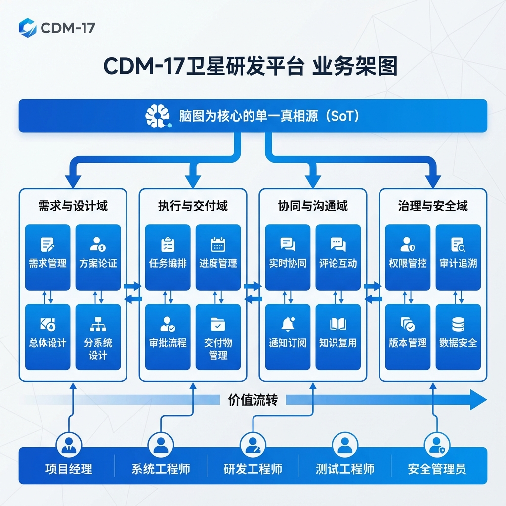

---

### 功能架构

五层分布式功能架构：展示层、业务逻辑层、协同引擎层、数据访问层、基础设施层。

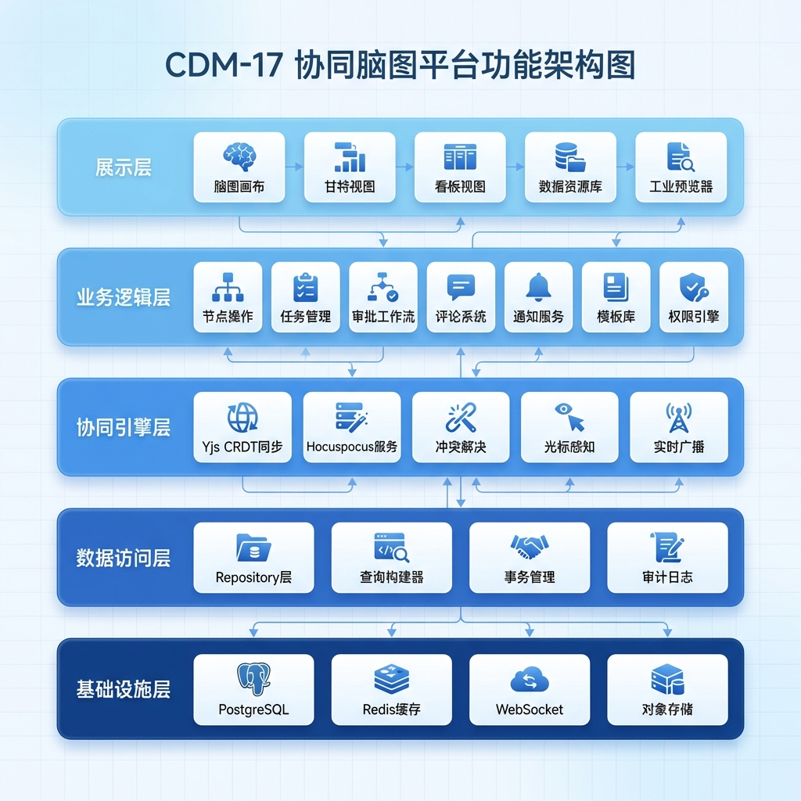

---

### 技术架构

前后端分离架构：Next.js 前端 + NestJS 后端 + Yjs/Hocuspocus 实时协同。

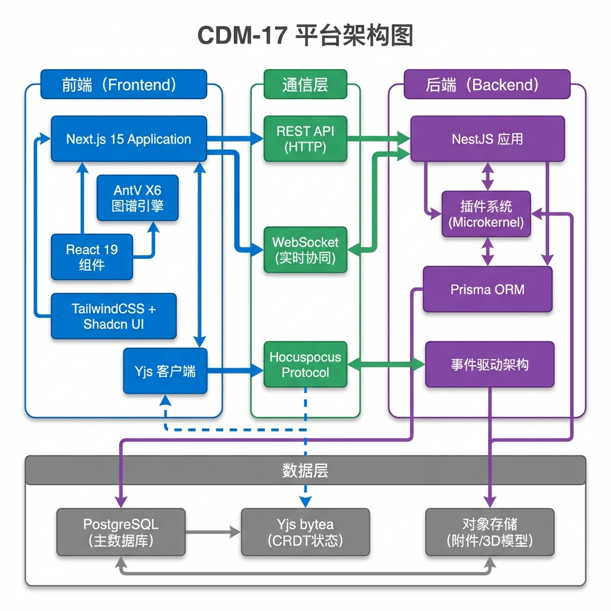

---

### 数据架构

核心实体模型：图谱、节点、边、用户、任务、审批、评论、数据资产等。

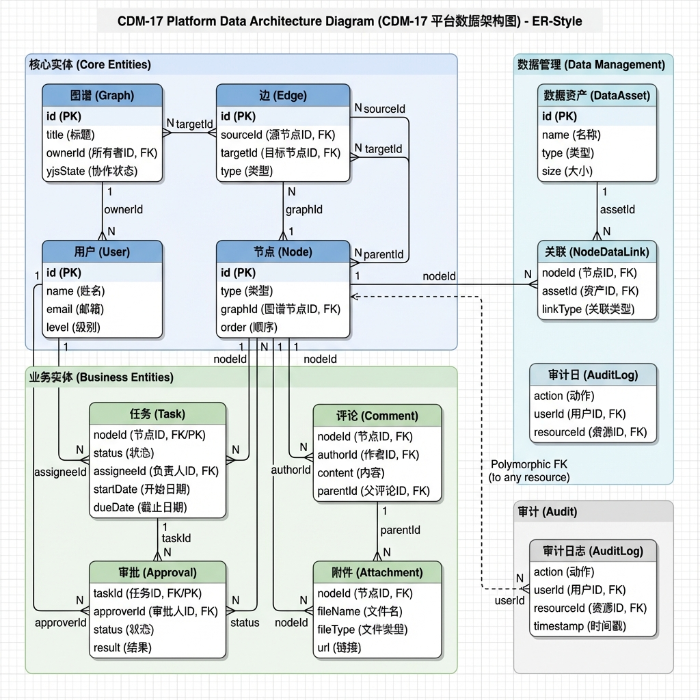

---

## 功能模块总览

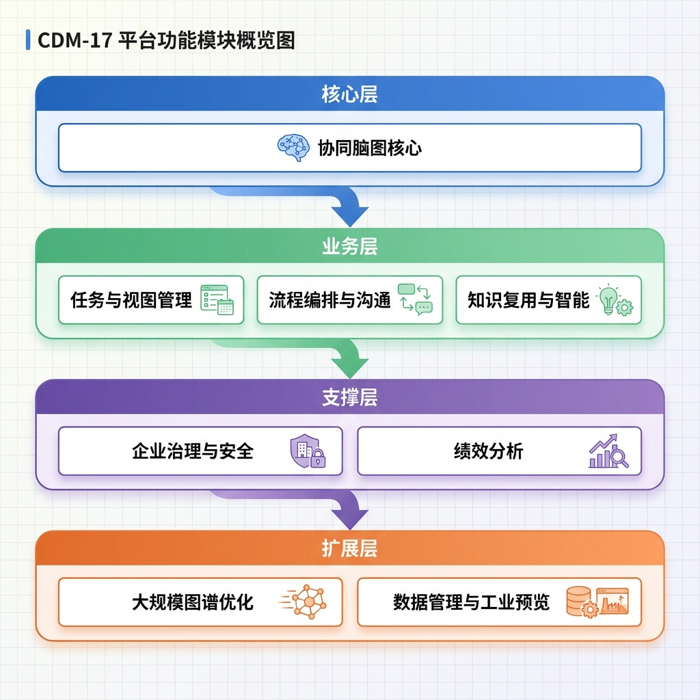

---

## 一、协同脑图核心 (Collaborative Graph Core)

> **模块定位**: 构建高性能、即时响应的"单一真相源"脑图画布，实现团队成员在同一空间内的实时思维同步。

### 代码分布

| 子模块   | 路径                          | 有效代码行数 | 实现状态 |
| :------- | :---------------------------- | :----------- | :------- |
| 图谱引擎 | `apps/web/components/graph`   | 4,424        | ✅ 已实现 |
| 节点操作 | `apps/web/components/nodes`   | 2,070        | ✅ 已实现 |
| 布局控制 | `apps/web/components/layout`  | 648          | ✅ 已实现 |
| 协同感知 | `apps/web/components/collab`  | 286          | ✅ 已实现 |
| 协同特性 | `apps/web/features/collab`    | 706          | ✅ 已实现 |
| 后端协同 | `apps/api/src/modules/collab` | 422          | ✅ 已实现 |

### 1.1 画布与基础交互

| 编号  | 功能点       | 描述                           | 实现状态 |
| :---- | :----------- | :----------------------------- | :------- |
| 1.1.1 | 画布初始化   | 创建空白画布并渲染默认根节点   | ✅ 已实现 |
| 1.1.2 | 画布平移     | 拖拽背景实现画布平移           | ✅ 已实现 |
| 1.1.3 | 画布缩放     | 滚轮/触控板实现缩放            | ✅ 已实现 |
| 1.1.4 | 缩放比例指示 | 显示当前缩放比例，支持快捷重置 | ✅ 已实现 |
| 1.1.5 | 画布适配     | 一键适配全部内容到视口         | ✅ 已实现 |
| 1.1.6 | 网格背景     | 可选显示网格辅助线             | ✅ 已实现 |

**相关文件**:
- `apps/web/components/graph/GraphComponent.tsx` - 画布主组件
- `apps/web/components/graph/hooks/useGraphCanvas.ts` - 画布交互Hook

### 1.2 节点操作

| 编号   | 功能点       | 描述                                 | 实现状态 |
| :----- | :----------- | :----------------------------------- | :------- |
| 1.2.1  | 创建兄弟节点 | `Enter`键在选中节点同级创建新节点    | ✅ 已实现 |
| 1.2.2  | 创建子节点   | `Tab`键在选中节点下创建子节点        | ✅ 已实现 |
| 1.2.3  | 删除节点     | `Delete`/`Backspace`删除节点及子节点 | ✅ 已实现 |
| 1.2.4  | 编辑节点文本 | 双击或`Space`进入编辑模式            | ✅ 已实现 |
| 1.2.5  | 节点选中     | 单击选中节点，显示选中状态           | ✅ 已实现 |
| 1.2.6  | 节点拖拽     | 拖拽节点改变位置或父级关系           | ✅ 已实现 |
| 1.2.7  | 节点复制     | `Cmd+C`复制选中节点                  | ✅ 已实现 |
| 1.2.8  | 节点粘贴     | `Cmd+V`粘贴节点到当前位置            | ✅ 已实现 |
| 1.2.9  | 节点剪切     | `Cmd+X`剪切选中节点                  | ✅ 已实现 |
| 1.2.10 | 撤销操作     | `Cmd+Z`撤销上一步操作                | ✅ 已实现 |
| 1.2.11 | 重做操作     | `Cmd+Shift+Z`重做操作                | ✅ 已实现 |

**相关文件**:
- `apps/web/components/nodes/MindNode.tsx` - 节点渲染组件
- `apps/web/hooks/useNodeOperations.ts` - 节点操作逻辑
- `apps/web/hooks/useClipboard.ts` - 剪贴板操作

### 1.3 命令与快捷键

| 编号  | 功能点       | 描述                                | 实现状态 |
| :---- | :----------- | :---------------------------------- | :------- |
| 1.3.1 | 命令面板     | `Cmd+K`唤起命令面板，可搜索执行命令 | ✅ 已实现 |
| 1.3.2 | 快捷键提示   | `?`键显示完整快捷键列表             | ✅ 已实现 |
| 1.3.3 | XMind兼容    | 兼容XMind主要快捷键布局             | ✅ 已实现 |
| 1.3.4 | 自定义快捷键 | 用户可自定义常用操作快捷键          | ⏳ 待实现 |

**相关文件**:
- `apps/web/components/CommandPalette/` - 命令面板组件（273行）
- `apps/web/components/KeyboardShortcutsGuide/` - 快捷键指南（241行）

### 1.4 布局控制

| 编号  | 功能点       | 描述                       | 实现状态 |
| :---- | :----------- | :------------------------- | :------- |
| 1.4.1 | 逻辑图布局   | 节点自动向右水平层级排列   | ✅ 已实现 |
| 1.4.2 | 思维导图布局 | 节点放射状或树状排列       | ✅ 已实现 |
| 1.4.3 | 自由布局模式 | 节点可任意拖拽定位         | ✅ 已实现 |
| 1.4.4 | 布局切换     | 一键切换布局模式           | ✅ 已实现 |
| 1.4.5 | 对齐辅助线   | 拖拽时显示与相邻节点对齐线 | ✅ 已实现 |
| 1.4.6 | 吸附功能     | 靠近时自动吸附对齐         | ✅ 已实现 |
| 1.4.7 | 网格吸附     | 可开启网格吸附             | ✅ 已实现 |
| 1.4.8 | 距离指示     | 拖拽时显示与相邻节点距离   | ⏳ 待实现 |

**相关文件**:
- `apps/web/components/layout/` - 布局引擎（648行）
- `packages/plugins/plugin-layout/` - 布局插件

### 1.5 实时协同

| 编号  | 功能点       | 描述                          | 实现状态 |
| :---- | :----------- | :---------------------------- | :------- |
| 1.5.1 | 多人光标     | 显示所有在线成员的光标位置    | ✅ 已实现 |
| 1.5.2 | 光标标签     | 光标旁显示用户名标签          | ✅ 已实现 |
| 1.5.3 | 实时同步     | 任何修改100ms内推送到其他成员 | ✅ 已实现 |
| 1.5.4 | 选中状态可见 | 显示其他成员当前选中的节点    | ✅ 已实现 |
| 1.5.5 | 节点锁定     | 编辑中的节点自动锁定          | ✅ 已实现 |
| 1.5.6 | 锁定提示     | 尝试编辑已锁定节点时提示      | ✅ 已实现 |
| 1.5.7 | 冲突自动解决 | 基于CRDT自动合并无冲突变更    | ✅ 已实现 |
| 1.5.8 | 在线成员列表 | 显示当前在线的团队成员        | ✅ 已实现 |

**相关文件**:
- `apps/web/features/collab/` - 协同特性（706行）
- `apps/api/src/modules/collab/` - 后端协同服务（422行）

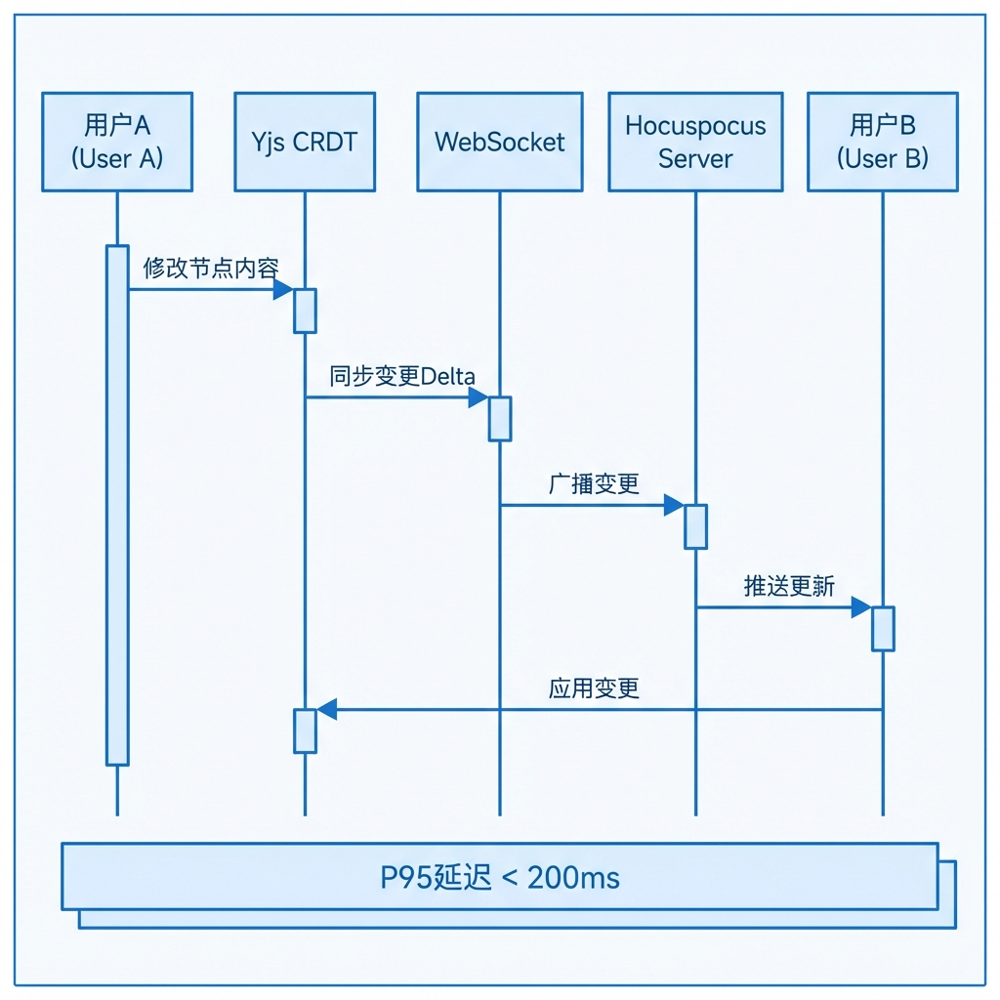

---

## 二、任务与视图管理 (Task & View Management)

> **模块定位**: 将静态思维转化为动态执行计划，提供多维度的项目视图以满足不同角色的管理需求。

### 代码分布

| 子模块       | 路径                                   | 有效代码行数 | 实现状态 |
| :----------- | :------------------------------------- | :----------- | :------- |
| 属性面板     | `apps/web/components/PropertyPanel`    | 3,308        | ✅ 已实现 |
| 视图组件     | `apps/web/features/views`              | 2,284        | ✅ 已实现 |
| 后端数据管理 | `apps/api/src/modules/data-management` | 2,828        | ✅ 已实现 |
| 图谱服务     | `apps/api/src/modules/graphs`          | 577          | ✅ 已实现 |

### 2.1 任务转换与属性管理

| 编号   | 功能点     | 描述                               | 实现状态 |
| :----- | :--------- | :--------------------------------- | :------- |
| 2.1.1  | 转为任务   | 普通节点一键转换为任务节点         | ✅ 已实现 |
| 2.1.2  | 任务状态   | 支持Draft/Todo/InProgress/Done状态 | ✅ 已实现 |
| 2.1.3  | 执行人指派 | 设置任务的执行负责人               | ✅ 已实现 |
| 2.1.4  | 开始时间   | 设置任务计划开始时间               | ✅ 已实现 |
| 2.1.5  | 截止时间   | 设置任务截止时间                   | ✅ 已实现 |
| 2.1.6  | 优先级     | 设置任务优先级(高/中/低)           | ✅ 已实现 |
| 2.1.7  | 进度百分比 | 设置任务完成进度                   | ✅ 已实现 |
| 2.1.8  | 任务描述   | 添加任务详细描述                   | ✅ 已实现 |
| 2.1.9  | 附件上传   | 任务可关联附件文件                 | ✅ 已实现 |
| 2.1.10 | 状态徽章   | 节点显示状态颜色徽章               | ✅ 已实现 |

**相关文件**:
- `apps/web/components/PropertyPanel/` - 属性面板（3,308行）
- `apps/web/components/UserSelector/` - 用户选择器（250行）

### 2.2 依赖关系

| 编号  | 功能点       | 描述                       | 实现状态 |
| :---- | :----------- | :------------------------- | :------- |
| 2.2.1 | FS依赖       | 完成-开始依赖关系          | ✅ 已实现 |
| 2.2.2 | SS依赖       | 开始-开始依赖关系          | ✅ 已实现 |
| 2.2.3 | FF依赖       | 完成-完成依赖关系          | ✅ 已实现 |
| 2.2.4 | SF依赖       | 开始-完成依赖关系          | ✅ 已实现 |
| 2.2.5 | 依赖连线创建 | 拖拽创建任务间依赖         | ✅ 已实现 |
| 2.2.6 | 依赖可视化   | 专属样式区分依赖线与层级线 | ✅ 已实现 |
| 2.2.7 | 循环依赖检测 | 自动检测并阻止循环依赖     | ✅ 已实现 |
| 2.2.8 | 依赖阻塞提示 | 前置未完成时显示阻塞状态   | ✅ 已实现 |

### 2.3 多视图联动

| 编号  | 功能点       | 描述                      | 实现状态 |
| :---- | :----------- | :------------------------ | :------- |
| 2.3.1 | 甘特视图     | 任务按时间轴排列显示      | ✅ 已实现 |
| 2.3.2 | 甘特依赖线   | 甘特图中显示依赖关系      | ✅ 已实现 |
| 2.3.3 | 甘特拖拽调整 | 拖拽任务条调整时间        | ✅ 已实现 |
| 2.3.4 | 看板视图     | 任务按状态分组显示        | ✅ 已实现 |
| 2.3.5 | 看板拖拽流转 | 拖拽任务卡片改变状态      | ✅ 已实现 |
| 2.3.6 | 时间轴视图   | 关键里程碑时间轴展示      | ⏳ 待实现 |
| 2.3.7 | 视图数据同步 | 任一视图修改实时同步      | ✅ 已实现 |
| 2.3.8 | 视图状态保留 | 切换视图保留折叠/选中状态 | ✅ 已实现 |

**相关文件**:
- `apps/web/features/views/components/` - 视图组件

### 2.4 任务下发与反馈

| 编号  | 功能点   | 描述                     | 实现状态   |
| :---- | :------- | :----------------------- | :--------- |
| 2.4.1 | 任务下发 | 向执行人下发任务         | ✅ 已实现   |
| 2.4.2 | 下发通知 | 执行人收到任务待确认通知 | ✅ 已实现   |
| 2.4.3 | 接收确认 | 执行人确认接收任务       | ✅ 已实现   |
| 2.4.4 | 驳回反馈 | 执行人可驳回并填写理由   | ✅ 已实现   |
| 2.4.5 | 状态回写 | 接收/驳回后状态自动更新  | ✅ 已实现   |
| 2.4.6 | 变更通知 | 任务变更通知相关人员     | 🔄 部分实现 |

### 2.5 数据组织与检索

| 编号  | 功能点     | 描述                     | 实现状态 |
| :---- | :--------- | :----------------------- | :------- |
| 2.5.1 | 标签添加   | 节点可添加自定义标签     | ✅ 已实现 |
| 2.5.2 | 标签可视化 | 标签以彩色标识显示在节点 | ✅ 已实现 |
| 2.5.3 | 全局搜索   | `Cmd+K`唤起全局搜索      | ✅ 已实现 |
| 2.5.4 | 标题搜索   | 搜索匹配节点标题         | ✅ 已实现 |
| 2.5.5 | 内容搜索   | 搜索匹配节点内容         | ✅ 已实现 |
| 2.5.6 | 标签筛选   | 按标签过滤节点           | ✅ 已实现 |
| 2.5.7 | 搜索定位   | 搜索结果高亮并定位       | ✅ 已实现 |
| 2.5.8 | 节点归档   | 归档不需要的节点         | ✅ 已实现 |
| 2.5.9 | 归档恢复   | 从归档箱恢复节点         | ✅ 已实现 |

**相关文件**:
- `apps/web/components/ArchiveBox/` - 归档管理（331行）

### 2.6 多选与剪贴板

| 编号  | 功能点     | 描述                    | 实现状态 |
| :---- | :--------- | :---------------------- | :------- |
| 2.6.1 | Shift多选  | Shift+点击多选节点      | ✅ 已实现 |
| 2.6.2 | 框选       | 拖拽框选多个节点        | ✅ 已实现 |
| 2.6.3 | 批量复制   | 多选后`Cmd+C`批量复制   | ✅ 已实现 |
| 2.6.4 | 批量粘贴   | 粘贴保持相对结构        | ✅ 已实现 |
| 2.6.5 | 跨窗口粘贴 | 支持跨标签页/浏览器粘贴 | ✅ 已实现 |
| 2.6.6 | 复制为图片 | 复制选中内容为图片      | ⏳ 待实现 |
| 2.6.7 | 复制为文本 | 复制选中内容为纯文本    | ✅ 已实现 |

---

## 三、流程编排与沟通 (Workflow & Communication)

> **模块定位**: 自动化流转项目状态，通过智能降噪的沟通机制保持团队专注与同步。

### 代码分布

| 子模块     | 路径                                        | 有效代码行数 | 实现状态 |
| :--------- | :------------------------------------------ | :----------- | :------- |
| 评论系统   | `apps/web/components/Comments`              | 864          | ✅ 已实现 |
| 评论插件   | `packages/plugins/plugin-comments`          | 1,716        | ✅ 已实现 |
| 审批工作流 | `packages/plugins/plugin-workflow-approval` | 1,449        | ✅ 已实现 |
| 通知系统   | `apps/web/components/notifications`         | 517          | ✅ 已实现 |
| 通知后端   | `apps/api/src/modules/notification`         | 562          | ✅ 已实现 |
| 订阅服务   | `apps/api/src/modules/subscriptions`        | 839          | ✅ 已实现 |

### 3.1 审批流程

| 编号  | 功能点       | 描述                   | 实现状态 |
| :---- | :----------- | :--------------------- | :------- |
| 3.1.1 | 审批节点配置 | 任务可配置审批人       | ✅ 已实现 |
| 3.1.2 | 交付物上传   | 执行人上传交付物       | ✅ 已实现 |
| 3.1.3 | 提交审批     | 提交任务进入审批       | ✅ 已实现 |
| 3.1.4 | 审批通知     | 审批人收到即时通知     | ✅ 已实现 |
| 3.1.5 | 审批通过     | 审批人点击通过         | ✅ 已实现 |
| 3.1.6 | 审批驳回     | 审批人驳回并填写理由   | ✅ 已实现 |
| 3.1.7 | 自动推演     | 通过后自动解锁后置任务 | ✅ 已实现 |
| 3.1.8 | 审批历史     | 查看审批流转历史       | ✅ 已实现 |

**相关文件**:
- `packages/plugins/plugin-workflow-approval/` - 审批工作流插件

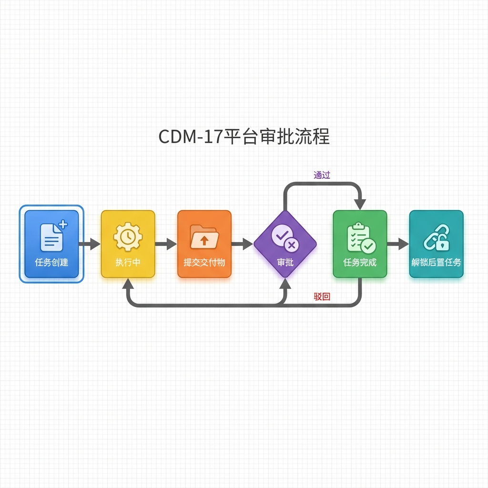

### 3.2 通知系统

| 编号  | 功能点        | 描述                   | 实现状态 |
| :---- | :------------ | :--------------------- | :------- |
| 3.2.1 | 站内通知中心  | 统一的通知收件箱       | ✅ 已实现 |
| 3.2.2 | 5分钟去重     | 同对象同类事件去重     | ⏳ 待实现 |
| 3.2.3 | 5分钟汇总     | 批量变更汇总显示       | ⏳ 待实现 |
| 3.2.4 | 高优即时送达  | @提及/审批请求即时推送 | ✅ 已实现 |
| 3.2.5 | 未读/已读状态 | 清晰的已读未读标识     | ✅ 已实现 |
| 3.2.6 | 一键全部已读  | 批量标记为已读         | ✅ 已实现 |
| 3.2.7 | 通知筛选      | 按类型筛选通知         | ✅ 已实现 |

### 3.3 评论互动

| 编号  | 功能点       | 描述                     | 实现状态 |
| :---- | :----------- | :----------------------- | :------- |
| 3.3.1 | 节点评论     | 在节点上发表评论         | ✅ 已实现 |
| 3.3.2 | 评论线程     | 支持多层级回复           | ✅ 已实现 |
| 3.3.3 | @提及        | 输入@选择团队成员        | ✅ 已实现 |
| 3.3.4 | @通知        | 被提及人收到通知         | ✅ 已实现 |
| 3.3.5 | 评论面板     | 侧栏或浮层显示评论       | ✅ 已实现 |
| 3.3.6 | 未读评论标记 | 有未读评论的节点显示红点 | ✅ 已实现 |

**相关文件**:
- `apps/web/components/Comments/` - 评论组件（864行）
- `packages/plugins/plugin-comments/` - 评论插件

### 3.4 关注订阅

| 编号  | 功能点   | 描述                   | 实现状态 |
| :---- | :------- | :--------------------- | :------- |
| 3.4.1 | 分支订阅 | 关注特定分支的变更     | ⏳ 待实现 |
| 3.4.2 | 节点订阅 | 关注单个节点的变更     | ✅ 已实现 |
| 3.4.3 | 订阅通知 | 变更时向订阅者发送通知 | ✅ 已实现 |
| 3.4.4 | 取消订阅 | 一键取消订阅           | ✅ 已实现 |
| 3.4.5 | 订阅节流 | 订阅通知遵循节流策略   | ⏳ 待实现 |

**相关文件**:
- `apps/api/src/modules/subscriptions/` - 订阅服务（839行）

---

## 四、知识复用与智能辅助 (Knowledge Intelligence)

> **模块定位**: 利用模板、组件化复用和AI能力，将隐性知识显性化，加速新项目的启动与标准化。

### 代码分布

| 子模块     | 路径                                     | 有效代码行数 | 实现状态 |
| :--------- | :--------------------------------------- | :----------- | :------- |
| 模板库     | `apps/web/components/TemplateLibrary`    | 1,439        | ✅ 已实现 |
| 模板插件   | `packages/plugins/plugin-template`       | ~1,000       | ✅ 已实现 |
| 知识库     | `apps/web/components/Knowledge`          | 359          | 🔄 Mock   |
| 产品库     | `apps/web/components/ProductLibrary`     | 675          | ✅ 已实现 |
| 知识库后端 | `apps/api/src/modules/knowledge-library` | 130          | 🔄 Mock   |
| 产品库后端 | `apps/api/src/modules/product-library`   | 61           | ✅ 已实现 |

### 4.1 模板库

| 编号  | 功能点       | 描述                 | 实现状态 |
| :---- | :----------- | :------------------- | :------- |
| 4.1.1 | 预置模板     | 提供行业标准模板     | ✅ 已实现 |
| 4.1.2 | 模板预览     | 选择前可预览模板结构 | ✅ 已实现 |
| 4.1.3 | 模板实例化   | 选择模板创建新图     | ✅ 已实现 |
| 4.1.4 | 密级预置     | 模板可预设默认密级   | ⏳ 待实现 |
| 4.1.5 | 必填字段预置 | 模板可预设必填字段   | ⏳ 待实现 |

### 4.2 子树片段

| 编号  | 功能点     | 描述                 | 实现状态 |
| :---- | :--------- | :------------------- | :------- |
| 4.2.1 | 保存为片段 | 选中子树保存到片段库 | ✅ 已实现 |
| 4.2.2 | 片段库管理 | 个人/团队片段库      | ✅ 已实现 |
| 4.2.3 | 片段预览   | 插入前预览片段结构   | ✅ 已实现 |
| 4.2.4 | 拖拽插入   | 从片段库拖拽到画布   | ✅ 已实现 |

### 4.3 跨图引用

| 编号  | 功能点       | 描述                   | 实现状态 |
| :---- | :----------- | :--------------------- | :------- |
| 4.3.1 | 节点链接复制 | 复制节点的引用链接     | ⏳ 待实现 |
| 4.3.2 | 创建引用节点 | 粘贴链接创建引用节点   | ⏳ 待实现 |
| 4.3.3 | 引用状态同步 | 引用节点显示源节点状态 | ⏳ 待实现 |
| 4.3.4 | 跳转导航     | 点击引用跳转到源节点   | ⏳ 待实现 |

### 4.4 AI智能

| 编号  | 功能点     | 描述                 | 实现状态 |
| :---- | :--------- | :------------------- | :------- |
| 4.4.1 | AI骨架生成 | 输入主题生成分支结构 | ⏳ 待实现 |
| 4.4.2 | AI分支扩展 | 选中节点AI扩展子节点 | ⏳ 待实现 |
| 4.4.3 | AI生成预览 | 生成前可预览结果     | ⏳ 待实现 |
| 4.4.4 | AI结果撤销 | 不满意可一键撤销     | ⏳ 待实现 |

### 4.5 业务节点类型

#### 4.5.1 PBS节点（产品分解结构）

| 编号    | 功能点      | 描述                        | 实现状态 |
| :------ | :---------- | :-------------------------- | :------- |
| 4.5.1.1 | PBS属性管理 | 编辑PBS编码、版本号、负责人 | ✅ 已实现 |
| 4.5.1.2 | 产品库关联  | 搜索并关联卫星产品          | ✅ 已实现 |
| 4.5.1.3 | 指标添加    | 从常用模板选择指标          | ✅ 已实现 |
| 4.5.1.4 | 指标编辑    | 设定目标值、实际值、单位    | ✅ 已实现 |
| 4.5.1.5 | 指标删除    | 移除不需要的指标            | ✅ 已实现 |

#### 4.5.2 APP节点（工业应用）

| 编号    | 功能点      | 描述                     | 实现状态 |
| :------ | :---------- | :----------------------- | :------- |
| 4.5.2.1 | 应用配置    | 选择来源（本地/远程/库） | ✅ 已实现 |
| 4.5.2.2 | I/O参数配置 | 配置输入/输出参数        | ✅ 已实现 |
| 4.5.2.3 | 执行控制    | 点击启动应用             | ✅ 已实现 |
| 4.5.2.4 | 状态反馈    | 查看执行状态及日志       | ✅ 已实现 |

**相关文件**:
- `apps/web/components/App/` - APP节点组件（1,557行）
- `apps/api/src/modules/app-library/` - 应用库后端（524行）

---

## 五、企业级治理与安全 (Enterprise Governance)

> **模块定位**: 为航天/军工级场景提供严密的数据保护、权限控制和全生命周期的审计追踪。

### 代码分布

| 子模块   | 路径                         | 有效代码行数 | 实现状态 |
| :------- | :--------------------------- | :----------- | :------- |
| 用户服务 | `apps/api/src/modules/users` | 148          | ✅ 已实现 |
| 文件服务 | `apps/api/src/modules/file`  | 284          | ✅ 已实现 |
| 类型定义 | `packages/types`             | 5,126        | ✅ 已实现 |

### 5.1 权限控制

| 编号  | 功能点        | 描述                    | 实现状态 |
| :---- | :------------ | :---------------------- | :------- |
| 5.1.1 | 四级密级      | 公开/内部/秘密/机密     | ⏳ 待实现 |
| 5.1.2 | 密级匹配      | 用户密级≥资源密级才可见 | ⏳ 待实现 |
| 5.1.3 | 节点级权限    | 单个节点可设置独立权限  | ⏳ 待实现 |
| 5.1.4 | 字段级权限    | 节点不同字段不同权限    | ⏳ 待实现 |
| 5.1.5 | 附件级权限    | 附件独立设置访问权限    | ⏳ 待实现 |
| 5.1.6 | 编辑/只读控制 | 区分查看和编辑权限      | ⏳ 待实现 |
| 5.1.7 | 临时提升申请  | 权限不足时发起提升申请  | ⏳ 待实现 |
| 5.1.8 | 提升审批流程  | 管理员审批临时提升      | ⏳ 待实现 |

### 5.2 动态水印

| 编号  | 功能点       | 描述                 | 实现状态 |
| :---- | :----------- | :------------------- | :------- |
| 5.2.1 | 实时水印覆盖 | 画布显示半透明水印   | ⏳ 待实现 |
| 5.2.2 | 水印内容     | 用户ID+时间+IP后四位 | ⏳ 待实现 |
| 5.2.3 | 水印不可关闭 | 用户无法关闭水印     | ⏳ 待实现 |
| 5.2.4 | 水印样式配置 | 管理员可配置水印样式 | ⏳ 待实现 |

### 5.3 版本管理

| 编号  | 功能点       | 描述                   | 实现状态 |
| :---- | :----------- | :--------------------- | :------- |
| 5.3.1 | 版本历史列表 | 查看节点历史版本       | ⏳ 待实现 |
| 5.3.2 | 版本预览     | 预览历史版本内容       | ⏳ 待实现 |
| 5.3.3 | 版本回退     | 回退到指定历史版本     | ⏳ 待实现 |
| 5.3.4 | 版本差异对比 | 版本间可视化对比       | ⏳ 待实现 |
| 5.3.5 | 草稿隔离     | 未发布修改仅本人可见   | ⏳ 待实现 |
| 5.3.6 | 发布版本     | 将当前修改发布为新版本 | ⏳ 待实现 |

### 5.4 审计追溯

| 编号  | 功能点       | 描述                 | 实现状态 |
| :---- | :----------- | :------------------- | :------- |
| 5.4.1 | 操作记录     | 记录所有增删改查操作 | ⏳ 待实现 |
| 5.4.2 | 导出操作记录 | 记录所有导出操作     | ⏳ 待实现 |
| 5.4.3 | 分享操作记录 | 记录所有分享操作     | ⏳ 待实现 |
| 5.4.4 | 权限变更记录 | 记录权限变更历史     | ⏳ 待实现 |
| 5.4.5 | 不可篡改存储 | append-only存储      | ⏳ 待实现 |
| 5.4.6 | 审计视图     | 前端可查看审计日志   | ⏳ 待实现 |
| 5.4.7 | 审计筛选     | 按时间/用户/对象筛选 | ⏳ 待实现 |
| 5.4.8 | 审计导出     | 导出审计报告CSV/JSON | ⏳ 待实现 |

### 5.5 安全导出分享

| 编号   | 功能点       | 描述                | 实现状态 |
| :----- | :----------- | :------------------ | :------- |
| 5.5.1  | PDF导出      | 导出为PDF格式       | ⏳ 待实现 |
| 5.5.2  | PNG导出      | 导出为PNG图片       | ⏳ 待实现 |
| 5.5.3  | Markdown导出 | 导出为Markdown      | ⏳ 待实现 |
| 5.5.4  | 强制导出水印 | 导出文件嵌入水印    | ⏳ 待实现 |
| 5.5.5  | 敏感字段遮罩 | 无权限字段显示为*** | ⏳ 待实现 |
| 5.5.6  | 导出范围选择 | 全图/选中子树       | ⏳ 待实现 |
| 5.5.7  | 分享链接生成 | 生成分享链接        | ⏳ 待实现 |
| 5.5.8  | 链接有效期   | 设置1-30天有效期    | ⏳ 待实现 |
| 5.5.9  | 链接密码     | 可选设置访问密码    | ⏳ 待实现 |
| 5.5.10 | 一键失效链接 | 使分享链接失效      | ⏳ 待实现 |

---

## 六、绩效分析 (Performance Analytics)

> **模块定位**: 提供基于执行数据的量化反馈，帮助团队持续优化效能。

### 实现状态

| 子模块   | 实现状态 |
| :------- | :------- |
| 数据统计 | ⏳ 待实现 |
| 报表导出 | ⏳ 待实现 |

### 6.1 数据统计

| 编号  | 功能点       | 描述                 | 实现状态 |
| :---- | :----------- | :------------------- | :------- |
| 6.1.1 | 任务完成率   | 完成数/总数百分比    | ⏳ 待实现 |
| 6.1.2 | 逾期率统计   | 逾期任务数/完成数    | ⏳ 待实现 |
| 6.1.3 | 平均周转时长 | 任务平均处理时间     | ⏳ 待实现 |
| 6.1.4 | 时间范围筛选 | 按周/月/季筛选       | ⏳ 待实现 |
| 6.1.5 | 人员筛选     | 按个人/小组/部门筛选 | ⏳ 待实现 |
| 6.1.6 | 绩效仪表盘   | 可视化数据展示       | ⏳ 待实现 |

### 6.2 报表导出

| 编号  | 功能点    | 描述              | 实现状态 |
| :---- | :-------- | :---------------- | :------- |
| 6.2.1 | Excel导出 | 导出详细数据Excel | ⏳ 待实现 |
| 6.2.2 | CSV导出   | 导出原始数据CSV   | ⏳ 待实现 |

---

## 七、大规模图谱优化 (Large Graph Optimization)

> **模块定位**: 针对500-5000+节点场景，提供高效的导航、组织和聚焦能力。

### 7.1 节点折叠/展开

| 编号  | 功能点         | 描述                   | 实现状态 |
| :---- | :------------- | :--------------------- | :------- |
| 7.1.1 | 折叠子树       | 点击图标折叠所有子节点 | ✅ 已实现 |
| 7.1.2 | 子节点数量徽章 | 显示隐藏的子节点数量   | ✅ 已实现 |
| 7.1.3 | 递归折叠       | 一键折叠所有后代       | ✅ 已实现 |
| 7.1.4 | 折叠状态保存   | 刷新后保留折叠状态     | ✅ 已实现 |
| 7.1.5 | 搜索自动展开   | 搜索定位时自动展开路径 | ✅ 已实现 |

### 7.2 小地图导航

| 编号  | 功能点     | 描述                       | 实现状态 |
| :---- | :--------- | :------------------------- | :------- |
| 7.2.1 | 小地图显示 | 右下角显示全图缩略图       | ⏳ 待实现 |
| 7.2.2 | 视口指示   | 显示当前视口在全图中的位置 | ⏳ 待实现 |
| 7.2.3 | 点击导航   | 点击小地图快速定位         | ⏳ 待实现 |
| 7.2.4 | 拖拽平移   | 拖拽视口框平移画布         | ⏳ 待实现 |

---

## 八、数据管理与工业预览 (Data Management)

> **模块定位**: 构建独立的数据资源库，自动汇聚图中过程数据，支持 PBS/任务/文件夹 三种组织形式，实现 STEP/网格/云图 工业格式的轻量化在线预览。

### 代码分布

| 子模块       | 路径                                   | 有效代码行数 | 实现状态 |
| :----------- | :------------------------------------- | :----------- | :------- |
| 数据库组件   | `apps/web/features/data-library`       | 10,560       | ✅ 已实现 |
| 工业预览器   | `apps/web/features/industrial-viewer`  | 2,349        | ✅ 已实现 |
| 数据管理后端 | `apps/api/src/modules/data-management` | 2,828        | ✅ 已实现 |

### 8.1 数据资源库 Drawer

| 编号  | 功能点        | 描述                      | 实现状态 |
| :---- | :------------ | :------------------------ | :------- |
| 8.1.1 | 资源库 Drawer | `Cmd+D`打开数据资源库     | ✅ 已实现 |
| 8.1.2 | Drawer 宽度   | 视口60%-70%，支持拖拽调整 | ✅ 已实现 |
| 8.1.3 | 视图切换      | 网格/列表视图切换         | ✅ 已实现 |
| 8.1.4 | 搜索过滤      | 按名称/类型/时间搜索过滤  | ✅ 已实现 |
| 8.1.5 | 关闭交互      | ESC/点击外部/关闭按钮收起 | ✅ 已实现 |

### 8.2 多维度组织视图

| 编号  | 功能点           | 描述                       | 实现状态 |
| :---- | :--------------- | :------------------------- | :------- |
| 8.2.1 | 节点视图（合并） | PBS+任务统一视图           | ✅ 已实现 |
| 8.2.2 | PBS 树展示       | 左侧显示 PBS 树结构        | ✅ 已实现 |
| 8.2.3 | 任务分组展示     | 按任务状态分组显示         | ✅ 已实现 |
| 8.2.4 | 文件夹视图       | 用户自建的虚拟文件夹结构   | ✅ 已实现 |
| 8.2.5 | 文件夹管理       | 创建/重命名/删除文件夹     | ✅ 已实现 |
| 8.2.6 | 拖拽归类         | 数据资产可拖拽到文件夹     | ✅ 已实现 |
| 8.2.7 | Breadcrumb 溯源  | 完整路径显示，可点击定位   | ✅ 已实现 |
| 8.2.8 | 节点多选         | 可跨片段选择多节点         | ✅ 已实现 |
| 8.2.9 | 资产并集展示     | 所选节点资产按类型分组去重 | ✅ 已实现 |

### 8.3 轻量化工业预览

| 编号   | 功能点         | 描述                      | 实现状态 |
| :----- | :------------- | :------------------------ | :------- |
| 8.3.1  | STEP 预览      | STEP 格式在线预览         | ✅ 已实现 |
| 8.3.2  | IGES 预览      | IGES 格式在线预览         | ✅ 已实现 |
| 8.3.3  | glTF/GLB 预览  | glTF 格式在线预览         | ✅ 已实现 |
| 8.3.4  | STL 预览       | 网格文件预览              | ✅ 已实现 |
| 8.3.5  | OBJ 预览       | OBJ 网格文件预览          | ✅ 已实现 |
| 8.3.6  | VTK 云图预览   | 仿真云图数据预览          | ✅ 已实现 |
| 8.3.7  | 旋转/缩放/平移 | 鼠标交互操作              | ✅ 已实现 |
| 8.3.8  | 渲染模式切换   | 线框/实体/带边线模式      | ✅ 已实现 |
| 8.3.9  | 模型结构树     | 显示模型结构树（如有）    | ✅ 已实现 |
| 8.3.10 | 色标切换       | Rainbow/Jet/Coolwarm 色标 | ✅ 已实现 |
| 8.3.11 | 色标范围调整   | 支持调整色标范围          | ✅ 已实现 |

**相关文件**:
- `apps/web/features/industrial-viewer/` - 工业预览器（2,349行）

### 8.4 数据上传与节点关联

| 编号  | 功能点         | 描述                       | 实现状态 |
| :---- | :------------- | :------------------------- | :------- |
| 8.4.1 | 文件上传       | 上传到服务器，自动识别格式 | ✅ 已实现 |
| 8.4.2 | 节点关联       | 关联到任务/PBS/数据节点    | ✅ 已实现 |
| 8.4.3 | 关联类型       | 输入/输出/参考三种类型     | ✅ 已实现 |
| 8.4.4 | 关联展示       | 节点详情面板显示关联资产   | ✅ 已实现 |
| 8.4.5 | 快速预览       | 从关联列表快速预览资产     | ✅ 已实现 |
| 8.4.6 | 上下文感知上传 | 根据视图类型智能处理上传   | ✅ 已实现 |
| 8.4.7 | 任务输出关联   | 任务视图上传默认为输出类型 | ✅ 已实现 |
| 8.4.8 | PBS 类型选择   | PBS 视图上传弹出类型选择   | ✅ 已实现 |

### 8.5 过程数据自动汇聚

| 编号  | 功能点         | 描述                               | 实现状态 |
| :---- | :------------- | :--------------------------------- | :------- |
| 8.5.1 | 交付物自动汇聚 | 任务节点附件自动进入资源库         | ✅ 已实现 |
| 8.5.2 | 自动关联       | 自动建立与任务节点的输出关联       | ✅ 已实现 |
| 8.5.3 | 数据节点汇聚   | 数据节点文件自动汇聚               | ✅ 已实现 |
| 8.5.4 | PBS 自动归类   | 按所属 PBS 节点自动归类            | ✅ 已实现 |
| 8.5.5 | 来源标签       | 显示数据来源（任务/数据节点/手动） | ✅ 已实现 |
| 8.5.6 | 来源跳转       | 点击来源标签跳转到源节点           | ✅ 已实现 |

### 8.6 资产管理

| 编号  | 功能点       | 描述                       | 实现状态 |
| :---- | :----------- | :------------------------- | :------- |
| 8.6.1 | 双搜索入口   | 节点搜索 + 资产搜索        | ✅ 已实现 |
| 8.6.2 | 资产溯源展示 | 显示资产在各节点的关联情况 | ✅ 已实现 |
| 8.6.3 | 解绑操作     | 节点视图仅解除关联，不删除 | ✅ 已实现 |
| 8.6.4 | 物理删除     | 文件夹视图允许物理删除资产 | ✅ 已实现 |

**相关文件**:
- `apps/web/features/data-library/` - 数据库组件（10,560行）
- `apps/api/src/modules/data-management/` - 数据管理后端（2,828行）

---

## 功能实现状态统计

| 状态       | 功能点数量 | 占比 |
| :--------- | :--------- | :--- |
| ✅ 已实现   | 143        | 89%  |
| 🔄 部分实现 | 1          | 1%   |
| ⏳ 待实现   | 17         | 10%  |
| **合计**   | **161**    | 100% |

---

## 卫星研发领域应用场景

### 应用场景概述

CDM-17智图协研平台深度契合卫星研发全生命周期管理需求，覆盖从论证、设计、生产、测试到在轨运维的完整流程。

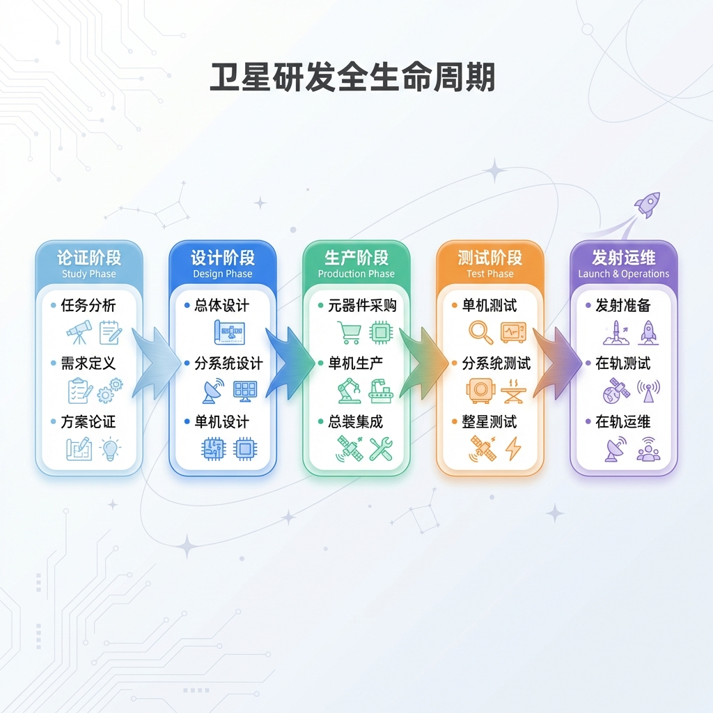

### 场景一：卫星总体设计协同

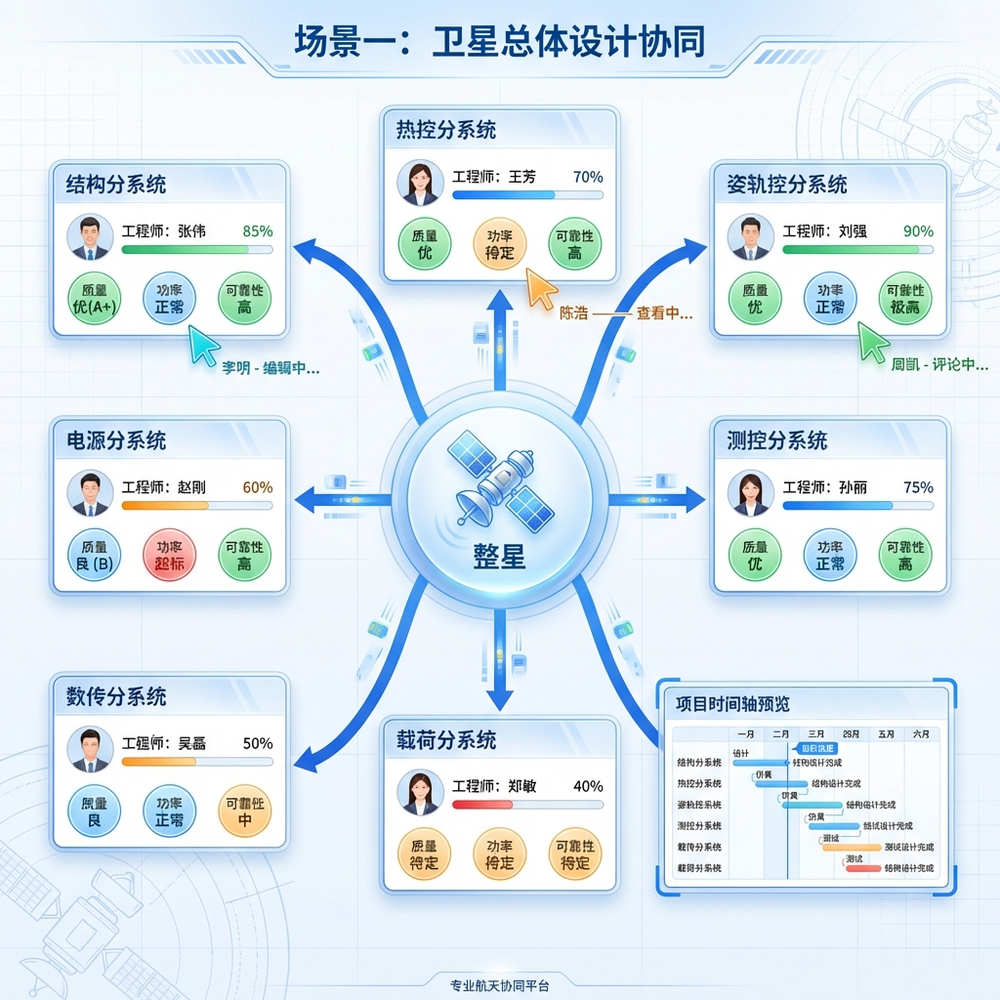

**应用模块**: 协同脑图核心 + 任务与视图管理

**场景描述**:
卫星总体设计涉及多个分系统（结构、热控、姿轨控、电源、测控、数传、载荷等）的协同设计。利用CDM-17平台，可实现：

- **PBS分解**: 使用PBS节点类型构建卫星产品分解结构，从整星→分系统→单机→元器件逐级分解
- **指标分配**: 在PBS节点上配置质量、功率、可靠性等关键指标，实现顶层指标向下分配
- **设计协同**: 各分系统设计师在同一脑图空间实时协作，避免接口冲突
- **依赖管理**: 通过FS/SS依赖关系管理分系统间的设计依赖

**典型操作流程**:
1. 总体设计师创建整星PBS根节点
2. 分配各分系统节点，设定负责人
3. 各分系统设计师并行开展子系统分解
4. 建立分系统间接口依赖关系
5. 通过甘特视图管理设计进度

### 场景二：型号测试管理

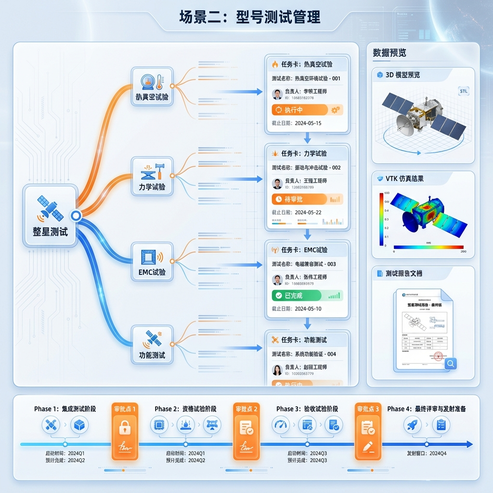

**应用模块**: 流程编排与沟通 + 数据管理与工业预览

**场景描述**:
卫星研制过程中的测试环节涉及大量测试用例、测试数据和评审流程。CDM-17平台支持：

- **测试矩阵管理**: 使用脑图构建测试项目→测试用例→测试步骤的层级结构
- **测试任务分配**: 将测试用例转为任务节点，指派测试人员
- **数据自动汇聚**: 测试报告、遥测数据自动关联到对应节点
- **工业数据预览**: 直接预览STL模型、VTK仿真结果等工业数据

**典型操作流程**:
1. 创建测试项目脑图，导入测试大纲
2. 分解测试用例，设定测试条件和通过准则
3. 分配测试任务，设定完成时限
4. 测试完成后上传数据，提交评审
5. 评审通过后自动解锁后续测试项目

### 场景三：故障归零与知识沉淀

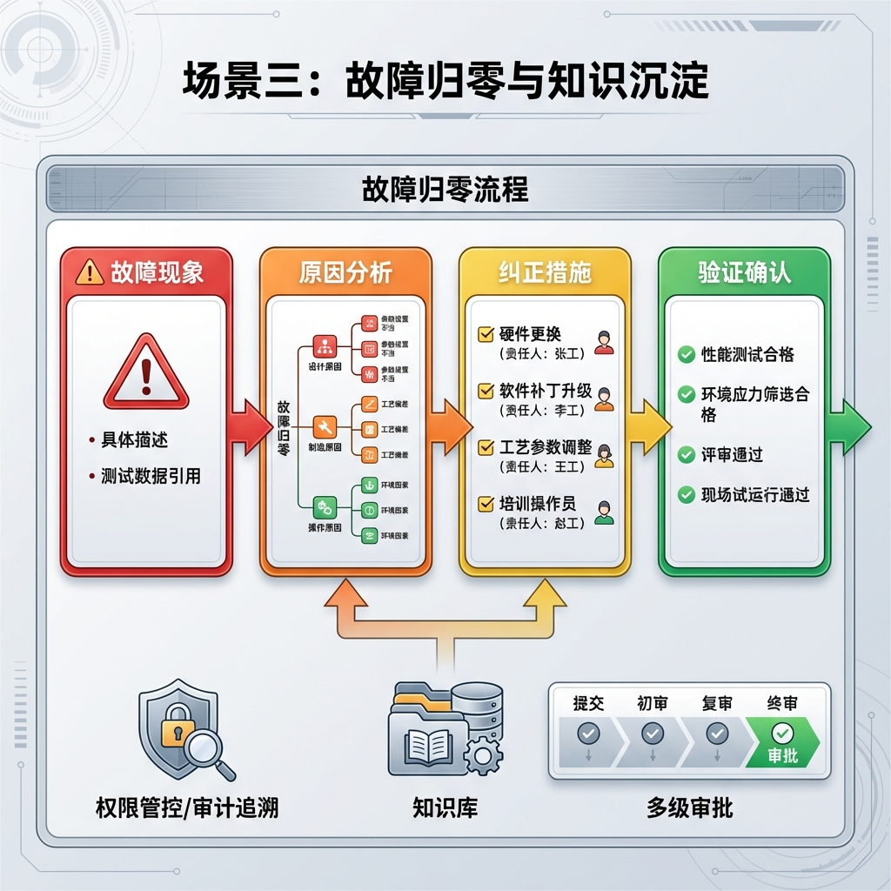

**应用模块**: 知识复用与智能 + 企业治理与安全

**场景描述**:
航天产品的故障归零要求严格的流程管控和知识沉淀。CDM-17平台支持：

- **归零流程可视化**: 使用脑图展示故障现象→原因分析→纠正措施→验证确认的完整链条
- **审批流程自动化**: 各环节通过审批工作流自动流转
- **知识库关联**: 将归零报告关联到知识库，形成可复用的经验案例
- **权限与审计**: 涉密信息严格管控，全过程可追溯

**典型操作流程**:
1. 创建故障归零专项脑图
2. 记录故障现象，关联相关测试数据
3. 组织故障分析，形成故障树
4. 制定纠正措施，分配责任人
5. 验证通过后归档，沉淀至知识库

### 场景四：多方协同与供应链管理

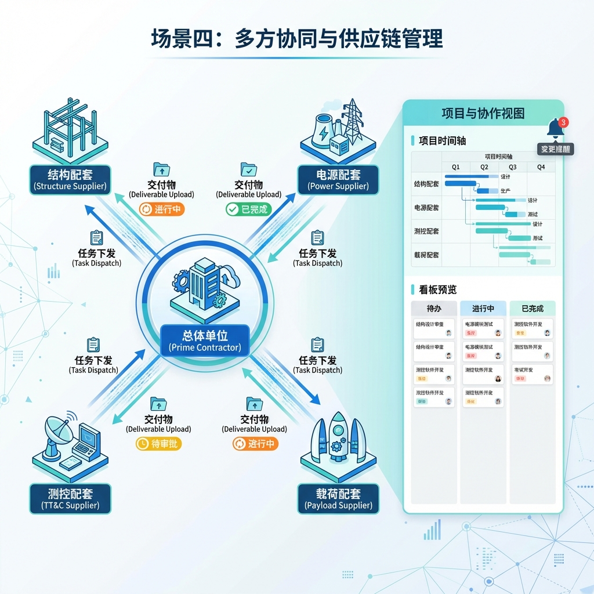

**应用模块**: 任务与视图管理 + 实时协同

**场景描述**:
卫星研制涉及多家配套单位协同。CDM-17平台支持：

- **任务下发与跟踪**: 向配套单位下发任务，实时跟踪完成状态
- **交付物管理**: 配套单位上传交付物，在线评审
- **进度可视化**: 通过甘特图/看板视图掌握全链条进度
- **变更通知**: 设计变更自动通知相关配套单位

### 场景五：软件研发与配置管理

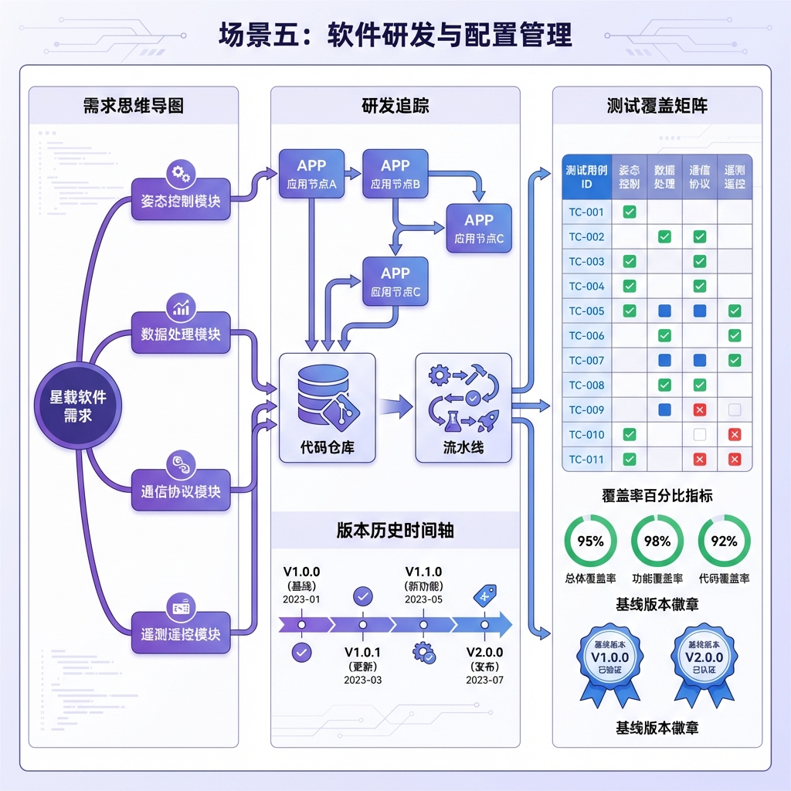

**应用模块**: 协同脑图核心 + APP节点

**场景描述**:
卫星星载软件和地面软件的研发过程可通过CDM-17平台实现：

- **需求分解**: 使用脑图分解软件需求规格
- **代码关联**: 将代码仓库、CI/CD流水线作为APP节点关联
- **测试覆盖**: 建立需求→测试用例的追溯矩阵
- **版本管理**: 利用版本历史功能管理软件基线

### 场景六：AIT（总装、集成、测试）流程管理

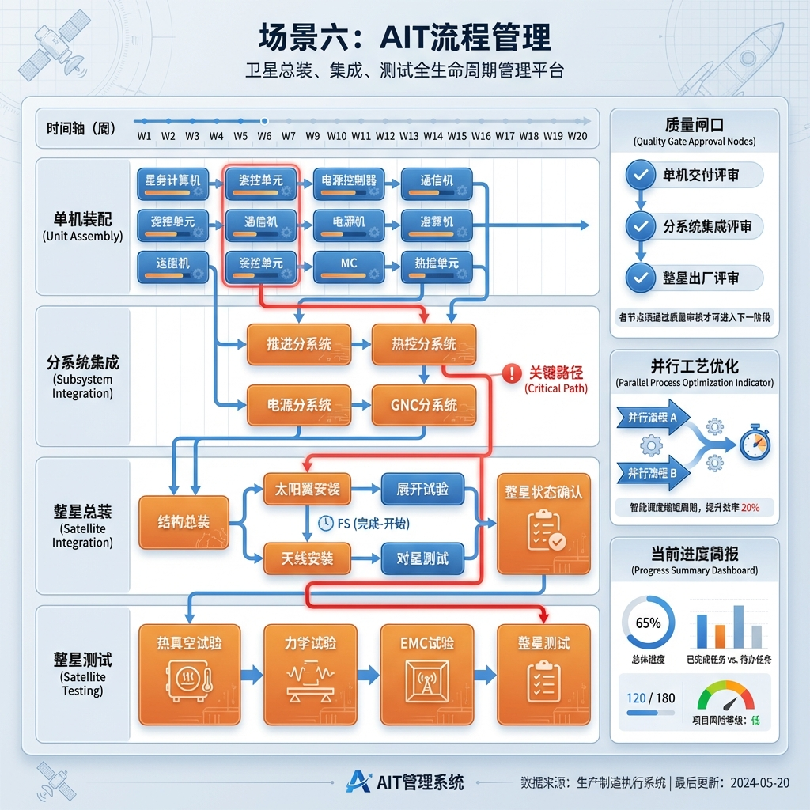

**应用模块**: 任务与视图管理 + 审批工作流

**场景描述**:
卫星AIT阶段工序复杂、依赖关系密集。CDM-17平台支持：

- **工序分解**: 构建AIT工序分解结构
- **依赖管理**: 定义工序间的技术依赖（如：太阳翼安装→展开试验）
- **并行优化**: 通过甘特视图识别关键路径，优化并行工序
- **质量闸口**: 关键工序设置审批节点，确保质量控制

---

## 文档更新记录

| 版本 | 日期       | 更新内容                                                                 | 作者   |
| :--- | :--------- | :----------------------------------------------------------------------- | :----- |
| V2.0 | 2026-01-14 | 整合PRD、feature-list、epics文档，重新统计代码行数，补充卫星研发应用场景 | Claude |
| V1.0 | 2025-12-25 | 初版功能清单                                                             | -      |

---

*文档版本：V2.0*  
*发布日期：2026年1月14日*
