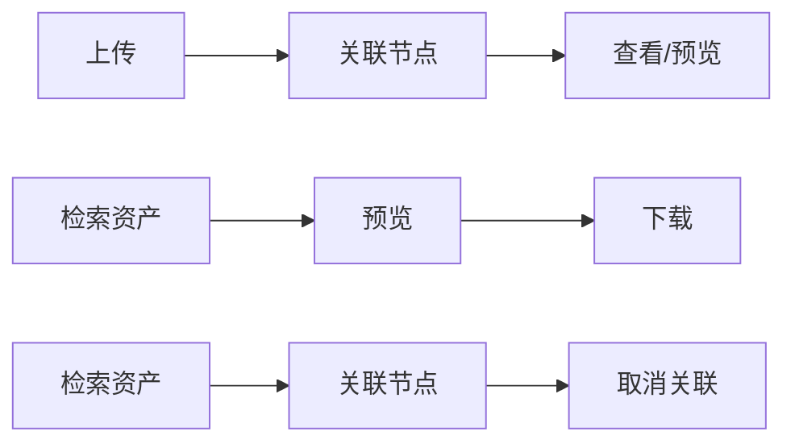

# Story 9.9: 数据资源库 Toolbar 重设计 PRD

## 文档信息

| 属性     | 值                            |
| -------- | ----------------------------- |
| 版本     | 1.0                           |
| 创建日期 | 2026-01-13                    |
| 状态     | Draft                         |
| 依赖     | Story 9.1, 9.2, 9.5, 9.7, 9.8 |
| 优先级   | High                          |

---

## 1. 背景与问题陈述

### 1.1 当前问题

在完成 Story 9.8（节点视图合并）后，数据资源库 Toolbar 存在以下交互问题：

#### 问题一：搜索功能重叠与歧义

| 位置             | 搜索对象 | 问题                                     |
| ---------------- | -------- | ---------------------------------------- |
| **左侧节点面板** | 节点名称 | 用户在此搜索节点                         |
| **顶部 Toolbar** | 资产名称 | 与左侧搜索容易混淆；切换视角后行为不一致 |

用户在操作时常见困惑：
- "我在搜节点还是搜资产？"
- "为什么在节点视图搜索，却没有筛选出资产？"

#### 问题二：高级筛选无法复用

当前顶部 Toolbar 的筛选器（类型、日期范围）在不同组织视角下行为不一致：
- **节点视图**：筛选器实际作用于"当前节点关联的资产"
- **文件夹视图**：筛选器作用于"当前文件夹的资产"
- 但 **UI 未明确表达筛选范围**，导致用户误解

#### 问题三：视觉层次混乱

当前 Toolbar 在单行中混合了多种功能类型：
- **操作类**：上传、回收站、批量删除
- **筛选类**：搜索、类型筛选、日期范围
- **视图控制类**：网格/列表切换、左侧面板 Toggle

功能密度过高，用户难以快速定位所需控件。

### 1.2 截图：当前 Toolbar 设计


> 注：上图展示了当前Toolbar的单行混合设计，所有控件并列在一行中。


---

## 2. 目标与期望成果

### 2.1 核心目标

1. **消除搜索歧义**：明确区分"节点搜索"与"资产搜索"
2. **统一筛选体验**：无论在哪个视角，资产筛选行为一致且可预测
3. **优化视觉层次**：操作与筛选分离，符合用户心智模型

### 2.2 期望成果

| 指标                           | 当前        | 目标           |
| ------------------------------ | ----------- | -------------- |
| 新用户首次正确执行搜索的成功率 | ~60% (预估) | >90%           |
| 切换视角后需要"重新搜索"的频率 | 高          | 消除           |
| Toolbar 控件数量               | 10+ 个      | 6 个（操作类） |

### 2.3 非目标（Out of Scope）

- ❌ 批量下载功能（将在 Story 9.10 中实现）
- ❌ 批量关联到多节点功能（将在 Story 9.11 中实现）
- ❌ 高级搜索语法（如 `type:STEP date:>2026-01`）

---

## 3. 用户角色与场景

### 3.1 主要用户角色

| 角色           | 典型工作流           | 搜索需求                         |
| -------------- | -------------------- | -------------------------------- |
| **系统工程师** | 上传 → 关联 → 查看   | 按节点快速定位，筛选特定类型文件 |
| **任务工程师** | 检索 → 预览 → 下载   | 按资产名称搜索，按日期筛选       |
| **数据管理员** | 检索 → 关联/取消关联 | 全局资产搜索，批量操作           |
| **项目经理**   | 浏览 → 审批          | 按节点结构浏览，快速预览         |

### 3.2 核心工作流



---

## 4. 解决方案设计

### 4.1 设计原则

| 原则           | 描述                                        |
| -------------- | ------------------------------------------- |
| **分离关注点** | 节点搜索（左侧）与 资产筛选（右侧）物理分离 |
| **上下文就近** | 筛选控件紧邻筛选结果，减少认知距离          |
| **保持一致性** | 切换视角时筛选行为一致，状态变化可预测      |
| **渐进披露**   | 高级筛选可折叠/隐藏，避免信息过载           |

### 4.2 整体布局设计

```
┌─────────────────────────────────────────────────────────────────────────────┐
│                            数据资源库                                    ✕   │
├───────────────────────┬─────────────────────────────────────────────────────┤
│                       │  📤 上传 ▾   📁 回收站  │              ⊞ ≡ 📊  ☰  │
│  节点(PBS+任务) │文件夹│  [仅保留操作类按钮]    │                           │
│ ─────────────────── ├─────────────────────────────────────────────────────┤
│  🔗节点    📄资产   │  🔍 搜索资产... │ 📍范围▾ │ 📋类型▾ │ 📅 日期范围  │
│ ─────────────────── │  [新增：独立资产筛选栏]                              │
│  🔍 [搜索节点...]  ✕├─────────────────────────────────────────────────────┤
│  在PBS和任务中搜索   │  中心主题 > XX卫星 > 卫星总体 > 任务轨道设计         │
│ ─────────────────── ├─────────────────────────────────────────────────────┤
│  □ 🟠 XX卫星         │                                                      │
│    □ 🟠 卫星总体     │              [资产网格/列表]                         │
│      ☑ ✓ 任务轨道设计│                                                      │
│         ...          │                                                      │
│ ─────────────────── │                                                      │
│  已选 3 个节点 [清除]│                                                      │
│  共 156 个数据资产   │                                                      │
└───────────────────────┴─────────────────────────────────────────────────────┘
```

### 4.3 高精度 UI 原型

本节提供详细的UI设计原型，展示重设计方案的各个方面。

---

## UI 设计原型

### 原型 1: 新旧设计对比 (Before vs After)

展示从单行混合Toolbar到双行分层设计的变化：


**设计变化要点：**

| 方面            | 当前设计 (Before)           | 新设计 (After)         |
| --------------- | --------------------------- | ---------------------- |
| **Toolbar内容** | 操作+筛选混合（10+控件）    | 仅操作类（6个控件）    |
| **搜索位置**    | Toolbar中（与节点搜索混淆） | 独立筛选栏（位置清晰） |
| **筛选控件**    | 与操作按钮并列              | 单独一行，紧邻资产列表 |
| **视觉层次**    | 单层，密度高                | 双层，层次分明         |

**新设计优势：**
- ✅ 搜索范围清晰
- ✅ 操作与筛选分离
- ✅ 视觉层次优化

---

### 原型 2: 完整布局视图 (Full Layout)

展示合并后的节点视图完整布局，包含所有新增组件：


**布局结构：**

```
┌─────────────────────────────────────────────────────────────────┐
│                       数据资源库                             ✕  │
├─────────────────┬───────────────────────────────────────────────┤
│ 左侧面板(220px) │ 右侧内容区                                    │
├─────────────────┼───────────────────────────────────────────────┤
│ Tab切换栏       │ ROW 1: Toolbar (操作类按钮)                   │
│ 节点|资产 Tab   │ ─────────────────────────────────────────── │
│ 节点搜索框      │ ROW 2: 资产筛选栏 [NEW] (橙色边框标注)        │
│ 帮助文字        │ ─────────────────────────────────────────── │
│ 节点树          │ ROW 3: Breadcrumb + 显示空分组                │
│ ...             │ ─────────────────────────────────────────── │
│ 选中统计        │ ROW 4: 资产内容区（网格/列表）                │
│ 资产计数        │                                               │
└─────────────────┴───────────────────────────────────────────────┘
```

**左侧面板规格：**
| 元素    | 规格                        |
| ------- | --------------------------- |
| 宽度    | 220px                       |
| Tab切换 | `节点(PBS+任务)` / `文件夹` |
| 二级Tab | `🔗节点` / `📄资产`           |
| 搜索框  | 带清除按钮，下方帮助文字    |
| 节点树  | checkbox多选 + 类型图标     |

**右侧内容区规格：**
| 行         | 内容                    | 高度   |
| ---------- | ----------------------- | ------ |
| Toolbar    | 上传、回收站、视图切换  | 56px   |
| 筛选栏     | 搜索、范围、类型、日期  | 48px   |
| Breadcrumb | 路径导航 + 空分组Toggle | 40px   |
| 内容区     | 资产网格/列表           | flex-1 |

---

### 原型 3: 搜索范围选择器 (Scope Selector)

展示搜索范围下拉菜单的展开状态：


**选项设计：**

| 选项             | 图标 | 描述                       | 使用场景       |
| ---------------- | ---- | -------------------------- | -------------- |
| **📍 当前节点**   | 📍    | 搜索当前选中节点的关联资产 | 查看节点交付物 |
| **🌐 全部资产**   | 🌐    | 搜索整个图谱的所有资产     | 跨节点查找     |
| **📎 未关联资产** | 📎    | 搜索未与任何节点关联的资产 | 数据整理       |

**交互规格：**
- 默认选中：`当前节点`
- 切换后立即刷新搜索结果
- 选中项显示蓝色背景+勾选标记
- 每个选项包含主标题+描述副文本

---

### 原型 4: 筛选状态行为规则 (Filter State Behavior)

展示四种场景下筛选状态的行为：


**行为规则详解：**

#### 场景 1: 切换节点 (✅ 保持)
```
节点 A → 节点 B
筛选条件：保持不变
结果：筛选应用到新节点
```

#### 场景 2: 切换视角 (❌ 清空)
```
节点视图 → 文件夹视图
筛选条件：清空
提示：Toast "筛选已重置"
```

#### 场景 3: 关闭/重新打开 (✅ 会话内保持)
```
Drawer 关闭 → 重新打开
筛选条件：保持（会话内）
```

#### 场景 4: 刷新页面 (⚠️ 清空)
```
浏览器刷新
筛选条件：清空（不持久化）
```

---

### 原型 5: 初版设计草图

早期头脑风暴阶段的概念设计：


---


## 5. 功能需求

### FR-1: Toolbar 精简（操作类聚焦）

**描述**：将顶部 Toolbar 精简为仅包含**操作类**控件

**包含控件：**
| 控件            | 功能                     | 位置           |
| --------------- | ------------------------ | -------------- |
| 上传按钮        | 上传资产 + 类型预选下拉  | 左侧           |
| 批量删除按钮    | 删除选中资产（条件显示） | 左侧（上传后） |
| 回收站按钮      | 打开回收站面板           | 左侧           |
| 视图切换        | 网格/列表/表格           | 右侧           |
| 左侧面板 Toggle | 显示/隐藏组织面板        | 最右侧         |

**移除控件：**
- ❌ 搜索输入框（移至资产筛选栏）
- ❌ 类型筛选下拉（移至资产筛选栏）
- ❌ 日期范围选择器（移至资产筛选栏）

**验收标准（AC）：**
- [ ] Toolbar 高度 ≤ 56px
- [ ] 控件数量 ≤ 6 个
- [ ] 所有操作控件可通过键盘 Tab 导航

---

### FR-2: 资产筛选栏（Asset Filter Bar）

**描述**：在内容区顶部新增独立的资产筛选栏

**包含控件：**
| 控件           | 功能                             | 默认值     |
| -------------- | -------------------------------- | ---------- |
| 搜索输入框     | 按资产名称搜索                   | 空         |
| 搜索范围选择器 | 当前节点 / 全部资产 / 未关联资产 | 当前节点   |
| 类型筛选下拉   | 按格式过滤（STEP/STL/JSON...）   | 全部类型   |
| 日期范围选择器 | 按创建时间筛选                   | 空（不限） |
| 清除筛选按钮   | 一键重置所有筛选条件             | -          |

**验收标准（AC）：**
- [ ] 筛选栏高度 ≤ 48px
- [ ] 搜索输入有 300ms debounce
- [ ] 筛选结果实时更新（无需手动刷新）
- [ ] 筛选条件变化时显示「已应用 N 个筛选」徽章

---

### FR-3: 搜索范围选择器（Scope Selector）

**描述**：允许用户选择资产搜索的作用范围

**选项：**
| 选项           | 作用范围                       | 适用场景       |
| -------------- | ------------------------------ | -------------- |
| **当前节点**   | 仅搜索当前选中节点关联的资产   | 查看节点交付物 |
| **全部资产**   | 搜索整个图谱的所有资产         | 跨节点查找资产 |
| **未关联资产** | 搜索未与任何节点关联的孤立资产 | 数据管理员整理 |

**验收标准（AC）：**
- [ ] 默认值：`当前节点`（节点视图）/ `当前文件夹`（文件夹视图）
- [ ] 切换范围后搜索结果立即刷新
- [ ] 选择「全部资产」时隐藏 linkType 分组（因为不再按节点过滤）

---

### FR-4: 筛选状态行为（Filter State Behavior）

**描述**：定义筛选状态在不同操作下的行为

**行为规则：**
| 用户操作                | 筛选状态行为                   |
| ----------------------- | ------------------------------ |
| 切换节点（同视角内）    | **保持**筛选条件，应用到新节点 |
| 切换视角（节点↔文件夹） | **清空**所有筛选条件           |
| 关闭/重新打开 Drawer    | **保持**筛选条件（会话内）     |
| 刷新页面                | **清空**筛选条件               |

**验收标准（AC）：**
- [ ] 切换节点后筛选条件保留（用户无需重新输入）
- [ ] 切换视角后搜索框清空、类型/日期重置
- [ ] 状态变化有视觉反馈（如 Toast 提示「筛选已重置」）

---

### FR-5: 左侧节点搜索增强

**描述**：在左侧组织面板保留并增强节点搜索

**功能点：**
- 保持现有：按节点名称搜索
- 保持现有：搜索结果高亮匹配文本
- 保持现有：自动展开命中节点路径
- 新增：搜索输入框下方显示「在 PBS 和任务节点中搜索」提示

**验收标准（AC）：**
- [ ] 节点搜索与资产搜索完全独立（无状态共享）
- [ ] 清空节点搜索后恢复完整节点树

---

### FR-6: 批量操作增强

**描述**：支持在新布局下的批量操作

**功能点：**
- 保持现有：资产多选（checkbox）
- 保持现有：批量删除（节点视图=解绑，文件夹视图=软删除）
- 新增：批量下载（将在 Story 9.10 实现）

**验收标准（AC）：**
- [ ] 选中资产后批量删除按钮出现在 Toolbar
- [ ] 批量操作按钮使用红色警示色

---

## 6. 非功能需求

### NFR-1: 性能

| 指标                | 目标值  |
| ------------------- | ------- |
| 筛选响应时间（P95） | < 200ms |
| 搜索建议响应时间    | < 100ms |
| 初始渲染（筛选栏）  | < 50ms  |

### NFR-2: 可访问性

- [ ] 所有控件支持键盘导航（Tab/Enter/Escape）
- [ ] 下拉菜单支持方向键选择
- [ ] 颜色对比度符合 WCAG AA 标准

### NFR-3: 虚拟滚动

- [ ] 节点树支持虚拟滚动（1000+ 节点场景）
- [ ] 资产列表支持虚拟滚动（100+ 资产场景）

---

## 7. UI 设计规格

### 7.1 筛选栏样式

| 属性   | 值                                   |
| ------ | ------------------------------------ |
| 背景色 | `#FFFFFF`（亮色）/ `#1F2937`（暗色） |
| 边框   | `1px solid #E5E7EB`                  |
| 圆角   | `8px`                                |
| 高度   | `48px`                               |
| 内边距 | `12px 16px`                          |

### 7.2 搜索输入框

| 属性        | 值                 |
| ----------- | ------------------ |
| 高度        | `36px`             |
| 宽度        | `flex-1`（自适应） |
| 圆角        | `8px`              |
| Placeholder | `搜索资产...`      |
| 图标        | 🔍 左侧内置         |

### 7.3 范围选择器

| 属性     | 值                 |
| -------- | ------------------ |
| 类型     | Dropdown Select    |
| 宽度     | `auto`（内容适应） |
| 默认选项 | `当前节点`         |
| 选项样式 | 带图标（📍/🌐/📎）    |

### 7.4 颜色规范

| 用途     | 亮色模式  | 暗色模式  |
| -------- | --------- | --------- |
| 主按钮   | `#3B82F6` | `#3B82F6` |
| 危险按钮 | `#EF4444` | `#EF4444` |
| 选中状态 | `#EFF6FF` | `#1E3A5F` |
| 边框     | `#E5E7EB` | `#374151` |
| 文字     | `#111827` | `#F9FAFB` |

---

## 8. 技术约束

### 8.1 与现有 Story 的兼容性

| Story | 影响程度 | 兼容策略                             |
| ----- | -------- | ------------------------------------ |
| 9.1   | 🔴 高     | 保留 Drawer 核心逻辑，仅重构 Toolbar |
| 9.2   | 🟡 中     | Tab 组件不变，筛选逻辑抽离           |
| 9.5   | 🟢 低     | 上传按钮保留在 Toolbar               |
| 9.7   | 🟢 低     | 上传类型下拉保留在 Toolbar           |
| 9.8   | 🟡 中     | 解决双搜索状态歧义                   |

### 8.2 状态管理

```typescript
// 新状态设计
interface DataLibraryDrawerState {
  // 节点搜索（左侧独立）
  nodeSearchQuery: string;
  
  // 资产筛选（右侧筛选栏）
  assetSearchQuery: string;
  searchScope: 'current-node' | 'all' | 'unlinked';
  formatFilter: DataAssetFormat | '';
  createdAfter: string;
  createdBefore: string;
  
  // 视图控制
  viewMode: ViewMode;
  showOrgPanel: boolean;
  
  // 节点选择（保持现有）
  activeNodeId: string | null;
  selectedNodeIds: Set<string>;
  // ...
}
```

### 8.3 组件结构

```
apps/web/features/data-library/components/
├── data-library-drawer/
│   ├── DataLibraryDrawer.tsx        # [KEEP] 主容器
│   ├── DataLibraryDrawerView.tsx    # [MODIFY] 布局调整
│   ├── DataLibraryDrawerToolbar.tsx # [MODIFY] 精简为操作类
│   ├── AssetFilterBar.tsx           # [NEW] 资产筛选栏
│   ├── ScopeSelector.tsx            # [NEW] 搜索范围选择器
│   └── ...
```

---

## 9. 依赖与风险

### 9.1 依赖项

| 依赖                  | 类型       | 状态     |
| --------------------- | ---------- | -------- |
| Story 9.8 完成        | Story 依赖 | ✅ Done   |
| `@cdm/ui` Select 组件 | 组件依赖   | ✅ 可用   |
| 后端全局资产搜索 API  | API 依赖   | ⚠️ 需确认 |

### 9.2 风险与缓解

| 风险                   | 概率 | 影响 | 缓解措施                       |
| ---------------------- | ---- | ---- | ------------------------------ |
| 后端不支持全局资产搜索 | 中   | 高   | 可通过前端 filter 模拟（降级） |
| 用户习惯改变阻力       | 低   | 中   | 提供过渡期提示                 |
| 筛选状态同步复杂       | 中   | 中   | 单一状态源 + React Context     |

---

## 10. 验收测试策略

### 10.1 测试矩阵

| 场景                     | 测试类型 | 优先级 |
| ------------------------ | -------- | ------ |
| Toolbar 操作按钮功能正常 | E2E      | P0     |
| 筛选栏搜索+筛选联动      | E2E      | P0     |
| 节点搜索独立性           | E2E      | P0     |
| 视角切换筛选重置         | E2E      | P1     |
| 范围选择器切换           | E2E      | P1     |
| 键盘可访问性             | 手动     | P2     |

### 10.2 关键 E2E 用例

```typescript
// apps/web/e2e/toolbar-redesign.spec.ts

test('FR-1: Toolbar 只包含操作按钮', async ({ page }) => {
  await page.goto('/graph/test-id');
  await page.keyboard.press('Meta+d');
  
  // 上传按钮存在
  await expect(page.getByRole('button', { name: /上传/ })).toBeVisible();
  // 回收站按钮存在
  await expect(page.getByRole('button', { name: /回收站/ })).toBeVisible();
  // 搜索框不在 Toolbar 中
  await expect(
    page.locator('[data-testid="toolbar"] >> input[placeholder="搜索"]')
  ).not.toBeVisible();
});

test('FR-2: 资产筛选栏功能', async ({ page }) => {
  await page.goto('/graph/test-id');
  await page.keyboard.press('Meta+d');
  
  // 筛选栏存在
  await expect(page.getByTestId('asset-filter-bar')).toBeVisible();
  // 搜索资产
  await page.getByPlaceholder('搜索资产...').fill('卫星');
  await expect(page.getByText('卫星总体结构')).toBeVisible();
});

test('FR-4: 视角切换筛选重置', async ({ page }) => {
  await page.goto('/graph/test-id');
  await page.keyboard.press('Meta+d');
  
  // 在节点视图输入搜索
  await page.getByPlaceholder('搜索资产...').fill('卫星');
  // 切换到文件夹视图
  await page.getByTestId('org-tab-folder').click();
  // 搜索应被清空
  await expect(page.getByPlaceholder('搜索资产...')).toHaveValue('');
});
```

---

## 11. 实施计划

### 11.1 任务分解

| 任务                                  | 预估工时 | 依赖      |
| ------------------------------------- | -------- | --------- |
| Task 1: 创建 AssetFilterBar 组件      | 4h       | -         |
| Task 2: 创建 ScopeSelector 组件       | 2h       | -         |
| Task 3: 重构 DataLibraryDrawerToolbar | 3h       | Task 1    |
| Task 4: 状态管理重构                  | 4h       | Task 1, 2 |
| Task 5: 筛选行为实现（FR-4）          | 3h       | Task 4    |
| Task 6: 单元测试                      | 3h       | All       |
| Task 7: E2E 测试                      | 2h       | All       |

**总计预估：21h（约 3 个工作日）**

### 11.2 里程碑

| 里程碑       | 内容                           | 预计完成 |
| ------------ | ------------------------------ | -------- |
| M1: 组件完成 | AssetFilterBar + ScopeSelector | Day 1    |
| M2: 集成完成 | Toolbar 重构 + 状态管理        | Day 2    |
| M3: 测试通过 | E2E + 单元测试                 | Day 3    |

---

## 12. 附录

### A. 相关文档

- [Epic 9: 数据管理与工业格式预览](../epics.md#epic-9)
- [Story 9.8: 节点视图合并](../sprint-artifacts/9-8-node-view-merge.md)
- [Architecture: Data Management](../architecture.md#data-management)

### B. 术语表

| 术语       | 定义                                           |
| ---------- | ---------------------------------------------- |
| 资产筛选栏 | 新增的独立筛选区域，位于内容区顶部             |
| 搜索范围   | 资产搜索的作用域（当前节点/全部/未关联）       |
| linkType   | 节点与资产的关联类型（Input/Output/Reference） |

### C. 变更历史

| 版本 | 日期       | 作者 | 变更内容 |
| ---- | ---------- | ---- | -------- |
| 1.0  | 2026-01-13 | AI   | 初版创建 |

---

> **注意**: 本 PRD 基于 Advanced Elicitation 和 Epic 9 兼容性分析生成。请在审阅后确认是否需要调整。
