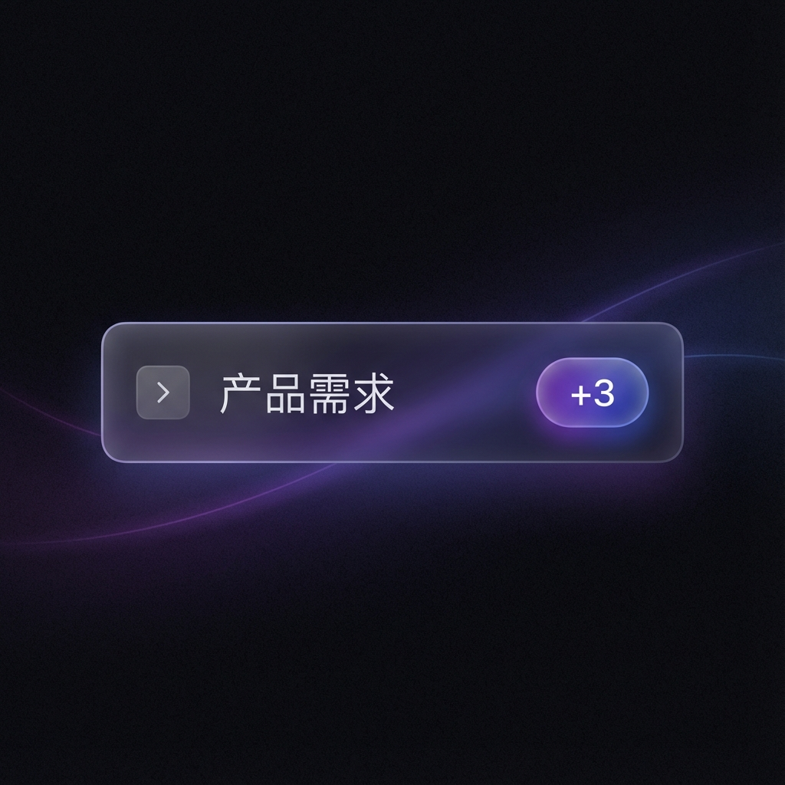

# 原型图/UI设计资源目录

本目录是项目所有原型图和UI设计资源的**唯一**存放位置。

## 目录结构

```
docs/prototypes/
├── common/        # 通用UI组件设计（非特定story）
├── story-X-Y/     # 特定story的原型图（如 story-8-1/）
├── story-2-5/     # Story 2.5 搜索/标签相关原型
└── archive/       # 早期概念图/产品参考图
```

## 命名规范

### 文件命名
```
[story-id]-[描述].png

示例：
- story-8-1-node-collapsed.png
- story-5-2-template-library-drag.png
- approval-panel-ui.png (通用组件)
```

### 目录使用
| 目录 | 用途 | 示例 |
|------|------|------|
| `story-X-Y/` | 特定story的设计稿 | 节点折叠、模板库等 |
| `common/` | 跨story复用的通用设计 | 节点样式、面板UI |
| `archive/` | 早期概念、竞品分析等 | 产品架构图、mockup |

## 在文档中引用

**相对路径（推荐）：**
```markdown

```

**绝对路径（从项目根目录）：**
```markdown

```

## 新增原型图流程

1. 确定所属 story 或分类（common/archive）
2. 按命名规范命名文件
3. 放入对应子目录
4. 在相关文档中添加引用

---
*创建时间: 2026-01-06*
