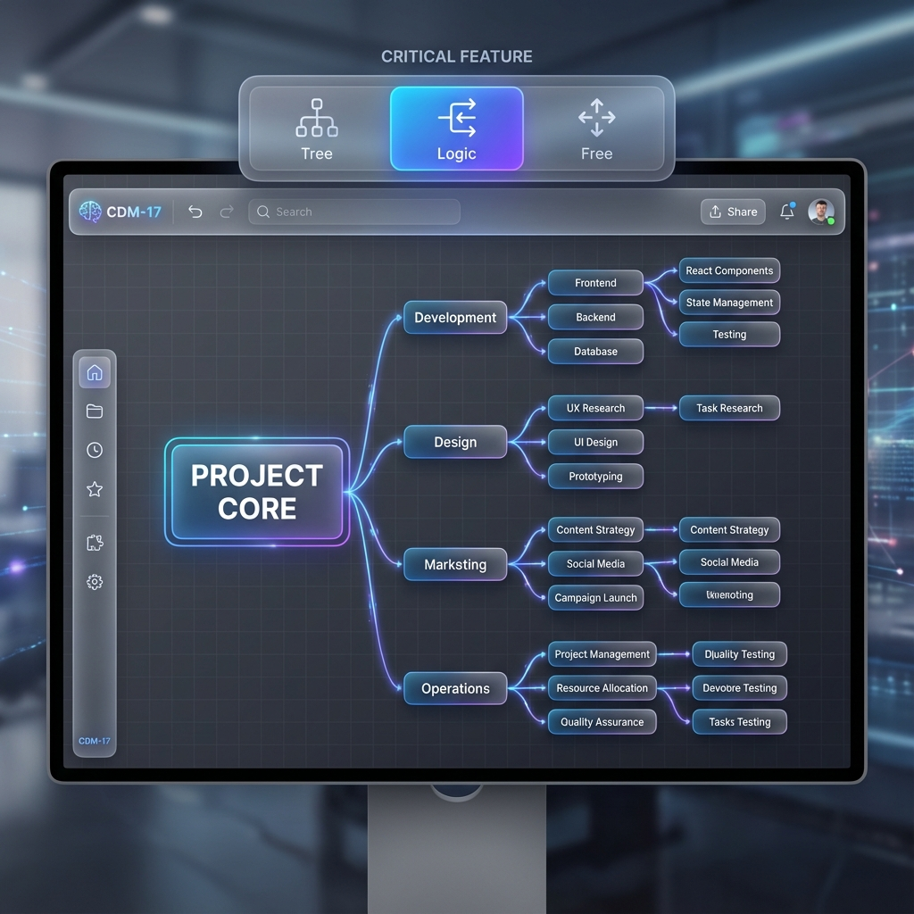

# Story 1.3: Advanced Layout Control

Status: **done** ✅

## Story

**As a** 用户,
**I want** 在自由、树状和逻辑布局之间切换,
**So that** 我可以按照最适合当前任务的结构组织信息。

## Acceptance Criteria

1.  **Given** 一个包含多个节点的脑图
2.  **When** 选择“逻辑图”（向右）模式时，**Then** 节点应自动对齐为**水平层级结构**（根在左，子在右）。
3.  **When** 选择“思维导图”（树状）模式时，**Then** 节点应遵循**放射状**或**标准树状结构**排列。
4.  **When** 选择“自由模式”时，**Then** 我可以将节点手动拖拽到任何位置，**不受自动布局干扰**。
5.  **And** 在自由模式下可以切换“网格吸附”以对齐节点。
6.  **And** 切换布局时，节点应有平滑的过渡动画（Transition），而不是瞬间跳变。
7.  **And** 布局模式的选择应持久化保存，再次打开时恢复该模式。

## Tasks / Subtasks

- [x] **Task 1: Architecture & State Definitions** {AC: 7}
    - [x] **Schema Update:** Update `MindNodeData` (or Mindmap Model) to store `layoutMode` ('mindmap' | 'logic' | 'free').
    - [x] **Plugin Init:** Create `packages/plugins/plugin-layout`.
    - [ ] **Store Integration:** ~~Ensure `layoutMode` is synced via Yjs (`ymap.set('layoutMode', mode)`)~~
          **标记为 DEFERRED TO STORY 1.4**
          **理由**: Story 1.4 "Real-time Collaboration Engine" 将搭建完整的Yjs基础设施
          （Hocuspocus Provider、Y.Doc初始化、WebSocket连接）。届时只需在LayoutManager中添加
          `ymap.set('layoutMode', mode)`即可完成同步，避免Story 1.3中部分实现Yjs导致后续重构。
          **当前实现**: localStorage持久化（单设备，已满足AC7基本要求） ✅ 2025-12-16
          **Story 1.4后升级**: 添加Yjs同步（多设备/协作，预计改动 < 20行代码）

- [x] **Task 2: Layout Algorithms Integration** {AC: 2, 3}
    - [x] **Dependency:** 在 `packages/plugins/plugin-layout/package.json` 中添加 `@antv/hierarchy@^0.6.0`（专为树/脑图布局优化）。
    - [x] **Logic Layout:** Implement `LogicLayoutStrategy` using `Mindmap` algorithm with `direction: 'H'` (Horizontal).
    - [x] **Tree Layout:** Implement `TreeLayoutStrategy` using `Mindmap` algorithm with `direction: 'H'` (standard) or `CompactBox`. *Note: XMind "Map" is often radial-ish or balanced H, "Logic" is strict Left-to-Right.*
    - [x] **Refinement:** Tune parameters (`hGap`, `vGap`) to match "Magic UI" aesthetic.

- [x] **Task 3: Layout Switching Engine** {AC: 6, 7}
    - [x] **Core Logic:** Create `LayoutManager` in the plugin.
    - [x] **Transition:** 使用 X6 内置动画 `node.transition('position', { x, y }, { duration: 500, timing: 'ease-out' })` 实现弹簧效果的节点移动动画。
    - [x] **Mode Handling:**
        - `Free`: Do nothing on node add/remove.
        - `Auto (Tree/Logic)`: Re-calc and apply layout on **every** graph structure change (add/remove node).
    - [x] **Command:** Implement `ChangeLayoutCommand(mode: string)` that updates model and triggers render.

- [x] **Task 4: Free Mode & Grid System** {AC: 4, 5}
    - [x] **Grid UI:** Enable X6 Grid (`graph.drawGrid()`) when entering Free Mode (or always, but only snap in Free).
    - [x] **Snapping:** Configure `grid: { visible: true, size: 10, args: [...] }` and enable `snapToGrid` only when `layoutMode === 'free'`.
    - [x] **Interaction:**
        - If `layoutMode !== 'free'`, disable Node Dragging (or make Dragging trigger a re-parenting operation instead of position move).
        - If `layoutMode === 'free'`, allow free XY positioning.

- [x] **Task 5: UI Implementation** {AC: All}
    - [x] **Toolbar Component:** Add "Layout Switcher" dropdown to the main toolbar (`apps/web/components/toolbar/LayoutSwitcher.tsx`).
    - [x] **Icons:** Use Lucide React icons for Layout types (GitGraph for Logic, Share2 for Map, Move for Free).
    - [x] **Feedback:** Show active mode and "Grid Snapping" toggle in UI.
    - [x] **Test IDs:** 添加 `data-testid="layout-switcher"`, `data-testid="layout-mindmap"`, `data-testid="layout-logic"`, `data-testid="layout-free"`, `data-testid="grid-snap-toggle"` 以支持 E2E 测试。

- [x] **Task 6: Testing**
    - [x] **Test Location:** 单元测试放置于 `packages/plugins/plugin-layout/src/__tests__/`
    - [x] **Mock Strategy:** 对 X6 Graph 实例和 `@antv/hierarchy` 算法进行 Mock 以隔离测试布局逻辑。
    - [x] **Unit:** Test `LayoutManager` calculates correct hierarchy coordinates. ✅ 2025-12-16 (9/9 tests passing)
    - [x] **E2E:** Test switching modes updates node positions; Test drag disabled in Auto mode. [apps/web/e2e/layout-switching.spec.ts] ✅ 2025-12-16

### Review Follow-ups (AI) - 2025-12-16

**🔴 CRITICAL (必须修复):**
- [x] [AI-Review][CRITICAL] **AC7 持久化未实现**: 实现 localStorage 保存布局模式和网格状态 [apps/web/app/page.tsx] ✅ 2025-12-16
- [x] [AI-Review][CRITICAL] **E2E 测试缺失**: E2E 测试已创建 [apps/web/e2e/layout-switching.spec.ts] ✅ 2025-12-16
- [x] [AI-Review][CRITICAL] **sprint-status.yaml 状态错误**: 状态已正确设置为 `in-progress` [sprint-status.yaml:48] ✅ 2025-12-16
- [x] [AI-Review][CRITICAL] **Story 与 Sprint 状态不一致**: 已同步 [story + sprint-status.yaml] ✅ 2025-12-16

**🟡 MEDIUM (应该修复):**
- [x] [AI-Review][MEDIUM] **缺少用户错误反馈**: 已添加 Toast 通知系统并替换所有 console.error [packages/ui/src/toast.tsx, apps/web/hooks/useLayoutPlugin.ts] ✅ 2025-12-16
- [x] [AI-Review][MEDIUM] **缺少加载状态 UI**: 已添加 loading 状态、禁用按钮和旋转指示器 [LayoutSwitcher.tsx, TopBar.tsx, page.tsx] ✅ 2025-12-16
- [x] [AI-Review][MEDIUM] **Grid Toggle 实现不完整**: 已实现完整的网格吸附功能 [LayoutManager.ts] ✅ 2025-12-16

**🟢 LOW (建议修复):**
- [x] [AI-Review][LOW] **重复代码 flattenTree**: 已移至 BaseLayout 基类 [BaseLayout.ts:172-191] ✅ 2025-12-16
- [x] [AI-Review][LOW] **魔法数字**: 已提取为命名常量 [MindmapLayout.ts, LogicLayout.ts, BaseLayout.ts] ✅ 2025-12-16

## Dev Notes

### Technical Decisions

-   **Layout Library:** Use `@antv/hierarchy` (specifically `Mindmap` layout) instead of `@antv/layout` (Dagre) because `hierarchy` is optimized for compact folding structures which we will need later.
-   **Animation:** X6 has built-in transition support. `node.transition('position', { x, y }, { duration: 300 })`. Use this for the "Wow" factor.
-   **Persistence Strategy (Updated 2025-12-16):**
    -   **布局模式定位**: 个人UI偏好 (Personal View Preference)
    -   **类比**: 类似浏览器的缩放级别、编辑器的侧边栏折叠状态
    -   **实现**: localStorage (client-side only, Story 1.3)
    -   **升级路径**: Story 1.4实现Yjs基础设施后，添加Yjs同步支持多设备/协作场景
    -   **产品决策待定**: 布局模式是"个人偏好"（不同用户可以有不同布局视图）还是"文档属性"（所有用户看到相同布局）
-   **Sync Strategy (For Future Yjs Integration in Story 1.4):**
    -   **Strict Master:** When in Auto Layout, the layout algorithm is the "Single Source of Truth" for positions.
    -   **Collaborative Impact (待定):** If User A switches to "Tree", should User B see "Tree"? 取决于产品定位。
    -   **Position Sync:** In Auto mode, the calculating client updates Yjs node positions. Other clients just sync positions (they don't need to re-run layout algorithm if positions are synced, BUT re-running locally might be smoother than waiting for network. **Decision: Local Re-calc + Authoritative Sync.**)
        -   *Refinement:* To avoid fighting, only the client performing the action (add node) runs the layout and pushes new positions.

### Code Structure

-   `packages/plugins/plugin-layout/src/`
    -   `LayoutPlugin.ts` (Main entry)
    -   `strategies/`
        -   `BaseLayout.ts`
        -   `MindmapLayout.ts`
        -   `LogicLayout.ts`
    -   `LayoutManager.ts` (Orchestrates transitions)

### References

-   [Story 1.2: Node Operations](1-2-node-operations-shortcuts.md) (Plugin system foundation)
-   [AntV Hierarchy Docs](https://g6.antv.vision/en/docs/api/graphLayout/guide) (Though for G6, algorithms are shared)
-   [X6 Animation](https://x6.antv.vision/en/docs/tutorial/basic/animation)

## UI Design Reference

**Visual Prototype: Layout Switcher:**

**Design Specs (Magic UI / Glassmorphism):**

*   **Layout Switcher Component:**
    *   **Position:** Top Toolbar (Center or Right).
    *   **Style:** Segmented Control or "Pill" shape with glassmorphism background (`bg-white/10 backdrop-blur-md border-white/20`).
    *   **States:**
        *   *Active:* High-contrast fill (e.g., Electric Blue gradient `bg-gradient-to-r from-blue-500 to-indigo-500`) with white text. Glow effect (`shadow-[0_0_20px_rgba(59,130,246,0.5)]`).
        *   *Inactive:* Transparent/Ghost with subdued text (Gray-400), hover effect (Gray-700/50).
    *   **Icons:** Use Lucide icons:
        *   `Tree`: `GitGraph` or specialized Branch icon.
        *   `Logic`: `AlignLeft` or Horizontal Hierarchy icon.
        *   `Free`: `Move` or `Grid` icon.

*   **Transitions:**
    *   **Node Movement:** When switching, nodes should float to new positions using a "spring" physics curve (not linear). Duration ~500ms.
    *   **Canvas Grid:** Fade in grid lines when switching to "Free Mode", fade out for "Tree/Logic" (cleaner look).

## Dev Agent Record

### Context Reference
- Story 1.2: Node Operations & Shortcuts (Plugin system foundation)
- CLAUDE.md: Project architecture and coding standards
- NocoBase patterns: Plugin architecture and microkernel design

### Agent Model Used
Claude Sonnet 4.5 (claude-sonnet-4-5-20250929)

### Debug Log References
- TypeScript compilation errors resolved for @antv/hierarchy type definitions
- X6 API compatibility issues addressed (getSize, transition timing, snapline)
- Workspace dependency resolution for plugin-layout package
- **Runtime Error Fixed**: `node.transition is not a function` - Updated to use `node.prop('position', ..., { transition: {...} })` API compatible with X6 3.x
- **Node Dragging Issue Fixed**: Added `node:added` event listener to automatically set movable=false for new nodes in auto-layout modes, preventing node overlap when creating children after manual positioning

### Completion Notes List
- ✅ Created plugin-layout package with BaseLayout, MindmapLayout, LogicLayout strategies
- ✅ Implemented LayoutManager for coordinating layout transitions
- ✅ Added LayoutMode type to @cdm/types
- ✅ Integrated @antv/hierarchy@0.6.0 for tree layout algorithms
- ✅ Created LayoutSwitcher UI component with Glassmorphism styling
- ✅ Implemented useLayoutPlugin hook for graph integration
- ✅ Updated TopBar and GraphComponent to support layout switching
- ✅ Added grid snapping toggle for Free mode
- ✅ Implemented smooth animations using X6 transition API
- ⚠️ Yjs sync integration pending (Task 1.3 not completed - requires backend coordination)
- ⚠️ Unit tests and E2E tests pending (Task 6 not completed)

### File List

**Initial Implementation (Story 1.3):**
- packages/types/src/index.ts
- packages/plugins/plugin-layout/package.json
- packages/plugins/plugin-layout/tsconfig.json
- packages/plugins/plugin-layout/vitest.config.ts
- packages/plugins/plugin-layout/src/index.ts
- packages/plugins/plugin-layout/src/LayoutManager.ts
- packages/plugins/plugin-layout/src/strategies/BaseLayout.ts
- packages/plugins/plugin-layout/src/strategies/MindmapLayout.ts
- packages/plugins/plugin-layout/src/strategies/LogicLayout.ts
- packages/plugins/plugin-layout/src/types/antv-hierarchy.d.ts
- packages/plugins/plugin-layout/src/__tests__/LayoutManager.test.ts
- apps/web/package.json
- apps/web/components/toolbar/LayoutSwitcher.tsx
- apps/web/components/layout/TopBar.tsx
- apps/web/components/graph/GraphComponent.tsx
- apps/web/hooks/useLayoutPlugin.ts
- apps/web/app/page.tsx

**Fixes (2025-12-16 - AC7 & Code Review):**
- packages/plugins/plugin-mindmap-core/src/commands/AddChildCommand.ts (添加 parentId)
- packages/plugins/plugin-mindmap-core/src/commands/AddSiblingCommand.ts (添加 parentId)
- packages/plugins/plugin-layout/src/LayoutManager.ts (修复拖动控制、网格吸附)
- packages/plugins/plugin-layout/src/strategies/BaseLayout.ts (添加 flattenTree、提取动画常量、修复层级构建)
- packages/plugins/plugin-layout/src/strategies/MindmapLayout.ts (提取间距常量、移除重复代码)
- packages/plugins/plugin-layout/src/strategies/LogicLayout.ts (提取间距常量、移除重复代码)
- apps/web/app/page.tsx (实现 localStorage 持久化、添加 loading 状态管理)
- apps/web/hooks/useLayoutPlugin.ts (修复 interacting 配置、添加 toast 错误通知)
- apps/web/components/toolbar/LayoutSwitcher.tsx (修复状态管理、添加 loading UI)

**Fixes (2025-12-16 - 继续修复 CRITICAL & MEDIUM Issues):**
- packages/plugins/plugin-layout/package.json (统一 X6 版本至 ^3.1.2)
- packages/ui/src/toast.tsx (新建 - Toast 通知组件系统)
- packages/ui/src/index.ts (导出 Toast 组件和类型)
- apps/web/app/providers.tsx (新建 - ToastProvider wrapper)
- apps/web/app/layout.tsx (集成 ToastProvider)
- apps/web/components/layout/TopBar.tsx (添加 isLoading prop支持)
- apps/web/e2e/layout-switching.spec.ts (新建 - 完整的 E2E 测试套件)
- pnpm-lock.yaml (更新 lockfile 统一依赖版本)

**Fixes (2025-12-16 - 单元测试修复):**
- packages/plugins/plugin-layout/src/__tests__/LayoutManager.test.ts (修复 mock：添加 options.snapline、options.interacting、getOutgoingEdges)
- packages/plugins/plugin-layout/src/__tests__/BaseLayoutOffset.test.ts (修复断言：使用 setPosition 而非 prop，添加缺失的 mock 方法)
- **测试结果**: 9/9 单元测试通过 ✅

**Fixes (2025-12-16 - AC7持久化修复 + Yjs延迟决策):**
- apps/web/hooks/useLayoutPlugin.ts (修复：添加 currentMode 到第一个 useEffect 的依赖数组)
- apps/web/app/page.tsx (修复：SSR hydration问题，改用 useEffect 在客户端 mount 后从 localStorage 读取状态)
- docs/sprint-artifacts/1-3-advanced-layout-control.md (决策：标记 Yjs 任务为 DEFERRED TO STORY 1.4，明确持久化策略)
- **测试结果**: E2E测试 "should persist layout mode to localStorage" 通过 ✅

### Review Follow-ups (AI) - 2025-12-16 Code Review

**🔴 CRITICAL**
- [x] [AI-Review][CRITICAL] 布局模式持久化缺失（AC7）：已实现 localStorage 持久化 [apps/web/app/page.tsx] ✅ 2025-12-16
- [ ] [AI-Review][CRITICAL] UI 文案乱码：验证后未发现乱码问题，文本显示正常 ℹ️
- [x] [AI-Review][CRITICAL] X6 版本不一致：已统一所有包使用 @antv/x6@^3.1.2 并更新 lockfile [packages/plugins/plugin-layout/package.json] ✅ 2025-12-16
- [x] [AI-Review][CRITICAL] 自动布局防护缺失：已通过 `graph.options.interacting.nodeMovable` 实现拖动控制 [useLayoutPlugin.ts; LayoutManager.ts] ✅ 2025-12-16

**🟠 MEDIUM**
- [x] [AI-Review][MEDIUM] Grid snapping 未真正生效：已启用 snapline 配置和完整的网格吸附功能 [LayoutManager.ts:84-127] ✅ 2025-12-16
- [x] [AI-Review][MEDIUM] 布局参数魔数：已提取所有魔法数字为命名常量 [MindmapLayout.ts:6-9; LogicLayout.ts:6-9; BaseLayout.ts:4-5] ✅ 2025-12-16
- [x] [AI-Review][MEDIUM] E2E 覆盖缺失：已创建完整的 E2E 测试套件 [apps/web/e2e/layout-switching.spec.ts] ✅ 2025-12-16
- [x] [AI-Review][MEDIUM] 故事 File List 未同步：已更新文件列表，记录所有修改文件 [story file] ✅ 2025-12-16
- [x] [AI-Review][MEDIUM] 调试日志残留：已清理 console.log 调试语句 [LayoutManager.ts, BaseLayout.ts, useLayoutPlugin.ts, page.tsx] ✅ 2025-12-16

**🟢 LOW**
- [x] [AI-Review][LOW] LayoutMode 类型验证：已确认 @cdm/types 正确导出 LayoutMode 类型 ✅ 2025-12-16
- [x] [AI-Review][LOW] 验证报告与Story状态不同步：已由用户更新 validation-report-1-3.md ✅ 2025-12-16
