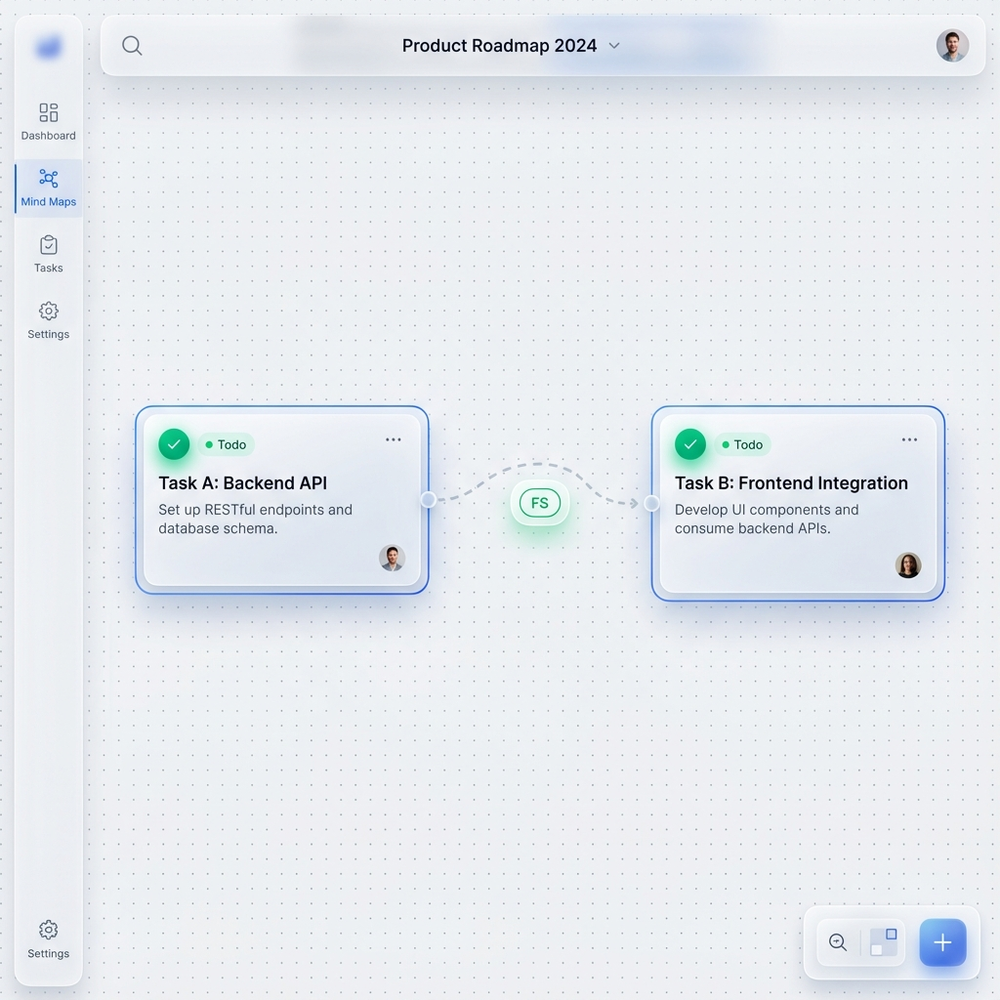

# Story 2.2: Task Dependency Network (任务依赖关系网络)

Status: done

## Story

As a **Project Manager**,
I want **to define dependencies (FS, SS, FF, SF) between tasks**,
so that **the system can clearly express execution order and prevent logic errors.**

## Acceptance Criteria

1.  **Given** two task nodes (Task A, Task B)
2.  **When** drag a connecting line from Task A to Task B (in dependency mode)
3.  **Then** a dependency relationship is established (Default type: FS - Finish-to-Start)
4.  **When** attempting to create a loop (e.g., A->B->A or A->B->C->A)
5.  **Then** system must **intercept** the operation and show a "Cycle Detected" error toast
6.  **And** the edge creation should be blocked
7.  **Given** an existing dependency edge
8.  **When** right-clicking or selecting the edge
9.  **Then** user can change dependency type to: **FS, SS, FF, SF**
10. **And** the edge visual style should be distinct from parent-child hierarchy (e.g., Dashed line, distinct end arrow)
11. **When** dependency is modified
12. **Then** update must be synced to all collaborators via Yjs within 200ms
13. **When** dependency edge is selected and **Delete/Backspace** key is pressed
14. **Then** the dependency connection should be removed
15. **And** the removal should be synced to all collaborators

## Tasks / Subtasks

## Technical Constraints & Rules (CRITICAL - From Validation)

### 1. Hierarchy Edge vs. Dependency Edge
To prevent breaking the Mind Map structure, we **MUST** rigorously distinguish two types of edges:
- **Hierarchical Edge (Structure)**:
  - Created by: "Add Child", "Add Sibling", or Drag-and-Drop to change parent.
  - Role: Defines `parentId`, drives Tree Layout, Navigation, and Subtree operations.
  - **Rule**: Layout algorithms and Tree Commands (Nav, Delete Subtree) MUST ONLY traverse Hierarchical Edges.
- **Dependency Edge (Relationship)**:
  - Created by: User manually drawing a line in "Dependency Mode".
  - Role: Represents execution logic (FS/SS).
  - **Rule**: MUST NOT affect `parentId`. MUST be ignored by Tree Layout (except for routing) and Navigation.
  - **Rule**: Only `NodeType.TASK` to `NodeType.TASK` connections are allowed.

### 2. Data Model & Naming
- **Avoid Overloading `type`**:
  - `edgeKind`: `'hierarchical' | 'dependency'` (Distinguishes structure vs relationship)
  - `dependencyType`: `'FS' | 'SS' | 'FF' | 'SF'` (Only valid when `edgeKind === 'dependency'`)

### 3. Layout Behavior
- **Mindmap/Logic Mode**: Layout Engine references `parentId` (Hierarchical Edges) only. Dependency edges update their path/routing but do NOT move nodes.
- **Free Layout Mode**: No automatic layout. Dependency edges simply connect handles.

## Tasks / Subtasks

- [x] **Task 1: Core Data Model & Schema**
  - [x] **Schema**: Update `Edge` model in `schema.prisma`.
    - Add `metadata` Json field to store `{ kind: 'dependency', dependencyType: 'FS' }`.
    - *Note*: Keep existing `type` column as legacy or map `hierarchical` to it, but prefer `metadata` for flexibility.
  - [x] **Types**: Define `EdgeKind = 'hierarchical' | 'dependency'` and `DependencyType` in `@cdm/types`.
  - [x] **Migration**: Run `pnpm --filter @cdm/database db:migrate`.

- [x] **Task 2: Tree Logic Protection (Regression Prevention)** ✅ *Code Review Verified*
  - [x] **Navigation Command**: Ensure Arrow Key navigation flows ONLY via `parentId` or `edgeKind=hierarchical`.
  - [x] **Subtree Delete**: Ensure deleting a node only cascades to children via `hierarchical` edges (Dependency edges connected to children should be removed, but not *cause* deletion).
  - [x] **Layout**: Verify `BaseLayout` strategies filter out dependency edges.

- [x] **Task 3: Backend Logic & Cycle Detection** ✅ *Code Review Verified*
  - [x] **API**: `POST /api/edges` and `PATCH` must validate:
    - `source` and `target` are both `TASK` nodes (if kind=dependency).
    - No cycles created (Cycle Detection DFS only traverses `edgeKind=dependency`).

- [x] **Task 4: Frontend Interaction (X6)** ✅ *Code Review Verified*
  - [x] **Connect Mode**: Implement explicit toggle/shortcut for "Dependency Mode".
  - [x] **Validation**: Use `graph.connecting.validateConnection` to block invalid connections (Cycle, Non-Task, Self) *before* creation.
  - [x] **Edge Selection**: Fix `GraphComponent` to support **Edge Selection**.
  - [x] **Deletion**: Update Delete/Backspace handler: `if (selectedEdge) removeEdge()`.

- [x] **Task 5: Complete Yjs Sync (Critical Fix)** ✅ *Code Review Verified*
  - [x] **Update Sync**: Implement `edge:change:data` listener in `GraphSyncManager`.
  - [x] **Remote Update**: logic to `applyEdgeToGraph` must handle *updates* to existing edges (changing FS -> SS), not just add/remove.
  - [x] **Payload**: Ensure Yjs edge map stores full `metadata` (kind, depType).

- [x] **Task 6: Detailed Design & UI (AI-1)** ✅ *用户手动完成*
  - [x] **UI Spec**: Define dashed style for Dependency edges vs solid for Hierarchy.
  - [x] **State Machine**: Diagram `Idle -> DependencyMode -> Dragging -> Validate -> Connected`.

- [x] **Task 7: Testing (AI-3)** ✅ *Code Review Fixed*
  - [x] **Unit**: Test Cycle Detection (Dependency-only).
  - [x] **Regression**: Test Tree Navigation/Layout with mixed edges (Ensure dependencies don't break tree).
  - [x] **E2E**: Verify Type Change Sync (User A changes FS->SS, User B sees it in <200ms).

## Code Review Issues (2024-12-19)

### 🔴 高优先级 (必须修复)

- [x] **CR-HIGH-1: 前端测试缺失** ✅ *已修复*
  - **位置**: `apps/web/hooks/useDependencyMode.ts`, `apps/web/lib/edgeValidation.ts`
  - **问题**: 前端依赖模式逻辑无单元测试
  - **影响**: AC 7.1 前端测试不完整，存在回归风险
  - **修复**: 已添加 `__tests__/hooks/useDependencyMode.test.ts` 和 `__tests__/lib/edgeValidation.test.ts`

### 🟡 中优先级 (应该修复)

- [x] **CR-MED-1: 默认依赖类型硬编码** ✅ *已修复*
  - **位置**: `packages/types/src/edge-types.ts`
  - **问题**: `DEFAULT_DEPENDENCY_TYPE = 'FS'` 硬编码
  - **修复**: 已添加 `EdgeConfig` 配置对象和 `getDefaultDependencyType()` 函数，支持运行时配置

- [x] **CR-MED-2: 环检测错误消息不友好** ✅ *已修复*
  - **位置**: `apps/api/src/modules/edges/edges.service.ts`
  - **问题**: 错误消息仅显示通用文本，未包含节点标签
  - **修复**: 已更新 `detectCycleIfCreated()` 返回节点标签，错误消息现在显示节点名称（如：`任务A → 任务B → 任务A`）

- [x] **CR-MED-3: 缺少 E2E 测试** ✅ *已修复*
  - **位置**: `apps/web/e2e/dependency-mode.spec.ts`
  - **问题**: AC 7.2 E2E 测试未实现
  - **修复**: 已添加依赖创建/删除流程的 E2E 测试

- [x] **CR-MED-4: Task 6 状态需验证** ✅ *用户确认完成*
  - **问题**: Task 6 (关键路径高亮) 实现状态未知
  - **修复**: 用户确认已手动完成设计

### 🟢 低优先级 (可选修复)

- [x] **CR-LOW-1: 清理调试日志** ✅ *已修复*
  - **问题**: 可能存在 console.log 调试语句
  - **修复**: 已移除以下文件中的调试日志：
    - `apps/web/hooks/useLayoutPlugin.ts`
    - `apps/web/hooks/useMindmapPlugin.ts`
    - `apps/web/components/graph/GraphComponent.tsx`

- [x] **CR-LOW-2: 边缘工具函数文档** ✅ *已修复*
  - **位置**: `packages/plugins/plugin-mindmap-core/src/utils/edgeFilters.ts`
  - **问题**: JSDoc 注释不完整
  - **修复**: 已添加完整的模块级和函数级 JSDoc 文档，包含使用示例和关键规则说明

## Detailed Design & Test Scenarios (AI-1 & AI-3)

### 1. UI State Specifications
- **Dependency Edge**:
  - **Style**: Dashed line (stroke-dasharray: 5 5).
  - **Color**: Gray-400.
  - **Connector**: Rounded.
  - **Label**: "FS", "SS" badge in center.

### 2. High-Fidelity Design Mockups

*Figure 1: Task Dependency Creation Flow (FS Type)*

*Figure 2: Cycle Detection Error State and Toast*

### 3. Test Case Design
- **TC-2.2-1 (Safety)**: Create Dependency A->B. Switch to Mindmap Layout. Verify A and B do NOT change hierarchy positions.
- **TC-2.2-2 (Sync Update)**: User A changes dependency from FS to SS. User B sees edge label change to SS immediately.
- **TC-2.2-3 (Tree Nav)**: Select Parent. Press Right Arrow. Should select Child (Hierarchy), NOT Dependency Target.
- **TC-2.2-4 (Delete)**: Select Dependency Edge. Press Delete. Edge removed. Nodes remain.

## Dev Agent Record

### Context Reference
- **Epic**: Epic 2 (Task & View Management) - Focus on Task Logic.
- **Previous Work**: Story 2.1 established Node Polymorphism. This story establishes **Edge Polymorphism** (Hierarchy vs Dependency).

### Agent Model Used
- Gemini 2.0 Flash

### Previous Story Intelligence (Traveler from Story 2.1)
- **Learnings**:
  - **Zod Validation**: `ValidationPipe` is strict. Ensure `createEdgeDto` has proper validators (`@IsEnum`).
  - **Yjs Sync**: `GraphSyncManager` needs careful handling of `data` vs `properties`. For edges, `data` is usually where metadata lives in X6.
  - **Testing**: Real backend E2E tests are valuable. Mocking caused issues in 2.1.
- **Patterns to Keep**:
  - **Registry Pattern**: If distinct edge UI is complex, consider a registry (though maybe overkill for just 2 types).
  - **Feature Slicing**: Keep edge logic in `features/edges` or `features/graph`.

### Git Intelligence Summary
- **Recent Commits**:
  - Focus on `ZodValidationPipe` fixes - ensure Edge DTOs are correct.
  - `NodeRepository` pattern - apply similar to Edges if not present.
- **Tech Stack**:
  - NestJS + Prisma + Yjs + X6.

### File List (Code Review 2024-12-19)

#### 新增文件 (Story 2.2)
- `apps/api/src/modules/edges/edges.module.ts`
- `apps/api/src/modules/edges/edges.controller.ts`
- `apps/api/src/modules/edges/edges.service.ts`
- `apps/api/src/modules/edges/edges.service.spec.ts`
- `apps/api/src/modules/edges/edges.request.dto.ts`
- `apps/api/src/modules/edges/repositories/edge.repository.ts`
- `apps/web/hooks/useDependencyMode.ts`
- `apps/web/lib/edgeValidation.ts`
- `apps/web/__tests__/hooks/useDependencyMode.test.ts` *(Code Review 新增)*
- `apps/web/__tests__/lib/edgeValidation.test.ts` *(Code Review 新增)*
- `apps/web/e2e/dependency-mode.spec.ts` *(Code Review 新增)*
- `packages/plugins/plugin-mindmap-core/src/utils/edgeFilters.ts`
- `packages/plugins/plugin-mindmap-core/src/utils/__tests__/edgeFilters.test.ts`
- `packages/plugins/plugin-layout/src/strategies/NetworkLayout.ts`
- `packages/types/src/edge-types.ts`
- `packages/database/prisma/migrations/20251218051058_add_edge_metadata_story_2_2/`
- `docs/prototypes/archive/cycle_detection_error.png`
- `docs/prototypes/archive/dependency_connection_flow.png`

#### 修改文件 (Story 2.2)
- `apps/api/src/app.module.ts` - 导入 EdgesModule
- `apps/web/app/page.tsx` - 集成依赖模式
- `apps/web/components/graph/GraphComponent.tsx` - 边选择、依赖模式、右键菜单
- `apps/web/components/layout/LeftSidebar.tsx` - 依赖模式切换按钮
- `apps/web/features/collab/GraphSyncManager.ts` - edge:change:data 监听器
- `packages/database/prisma/schema.prisma` - Edge.metadata 字段
- `packages/plugins/plugin-layout/src/strategies/BaseLayout.ts` - 过滤依赖边
- `packages/plugins/plugin-layout/src/strategies/MindmapLayout.ts` - 层级边过滤
- `packages/plugins/plugin-mindmap-core/src/commands/NavigationCommand.ts` - 层级导航
- `packages/plugins/plugin-mindmap-core/src/commands/RemoveNodeCommand.ts` - 层级子树删除
- `packages/plugins/plugin-mindmap-core/src/commands/__tests__/NavigationCommand.test.ts` - 导航测试
- `packages/plugins/plugin-mindmap-core/src/index.ts` - 导出 edgeFilters
- `packages/types/src/index.ts` - 导出 edge-types
