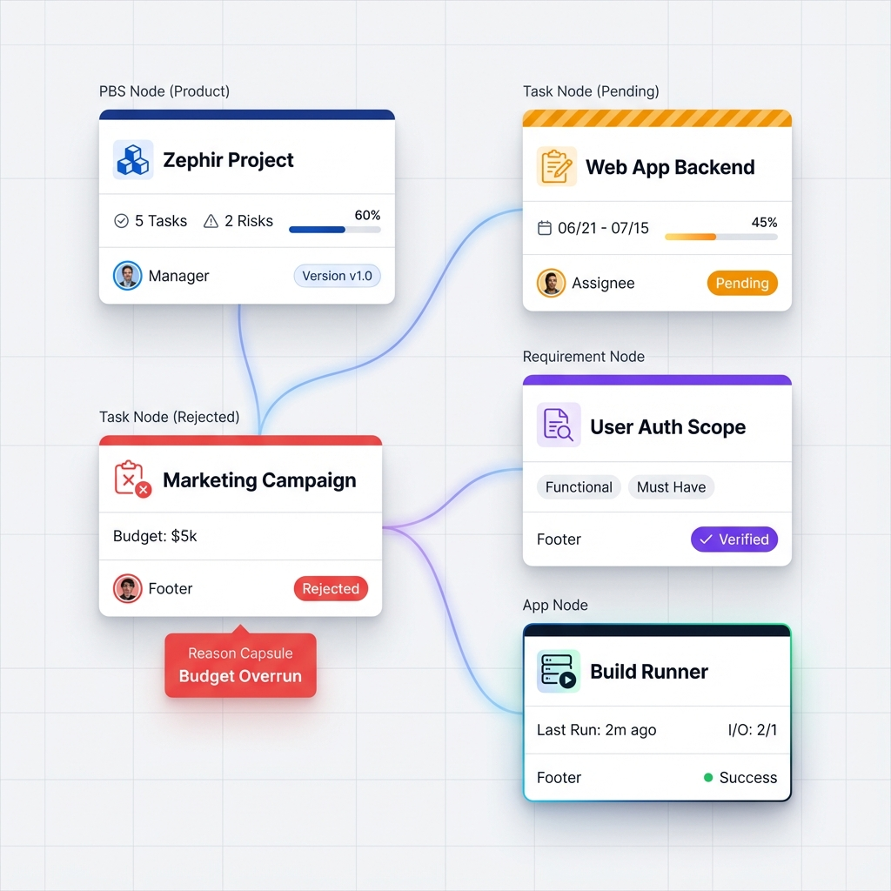

# Story 4.2: Rich Node UI & Visual Hierarchy
Status: planned

## Story

As a **User**,
I want **task and PBS nodes to display rich, context-aware information directly on the canvas**,
so that **I can understand project status, budget, and responsibilities at a glance without diving into side panels.**

## Context
Derived from "Zephir Project" design analysis. This story focuses on upgrading the node visual presentation to a "Premium" level, separating the visual overhaul from the functional logic of Story 4.1.

## Visual Reference

### High-Fidelity Mockup (CDM-17 Design System)

## Acceptance Criteria - Rich Node Variants

### 1. The Unified 4-Layer Chassis
All "Rich Nodes" (Zoom > 60%) MUST strictly follow this vertical stack layout to ensure visual rhythm:

| Layer | Height | Description | Visual Style |
| :--- | :--- | :--- | :--- |
| **1. Status Header** | **6px** | Indicates Status or Node Type Theme | Solid Color / Striped if Pending |
| **2. Title Row** | **32px** | Icon + Truncated Title | Bold Text, Flex Row, 24px Icon |
| **3. Metrics Row** | **Auto** | Context-specific key data (The "Dashboard") | Small Text (11px), Grids or Progress Bars |
| **4. Footer** | **32px** | Ownership & Global Status | Border-top separator, Avatars, Badges |
| *(Extension)* | *Auto* | Hanging Capsule (if Rejected/Error) | Floating element below footer |

### 2. Node Type Content Mapping

| Node Type | **1. Header Color** | **2. Title Icon** | **3. Metrics Row Content** | **4. Footer Content** |
| :--- | :--- | :--- | :--- | :--- |
| **PBS** | **Deep Blue** `#1E3A8A` | `Layers` | **Aggr Stats**: `5 Tasks` • `2 Risks` • `60% Done` | **Owner**: Manager Avatar **Ver**: `v1.0` |
| **Task** | **Status/Approval** (Gray/Blue/Green/Orange) | `CheckSquare` | **Execution**: `06/21 - 07/15` • `Progress Bar` | **Assignee**: Avatar **Badge**: `Pending` |
| **Requirement**| **Purple** `#7C3AED` | `Target` | **Scope**: `Functional` • `Must Have` • `3 Criteria` | **Source**: Stakeholder **Status**: `Verified` |
| **App** | **Neon/Dark** `#111827` | `Cpu` | **Runtime**: `Local` • `Last: 2m ago` • `2 In / 1 Out` | **Status**: 🟢 `Success` / 🔴 `Error` |
| **Data** | **Teal** `#0D9488` | `Database` | **Asset**: `PDF` • `2.4 MB` • `Secret` | **Loc**: Cloud Icon **Ver**: `v2.1` |

### 3. Visual Rules
1.  **Approval Overlay**:
    *   If a node (any type) is under approval, the **Header** adopts the "Striped Warning" texture.
    *   **Rejected**: The Header turns Red, and a "Reason Pill" hangs below the node.
2.  **Connections**:
    *   Use **Bezier Curves** with rounded anchor points.
    *   Line color matches the Source Node's base theme transparency (e.g., PBS edge is faint blue).
3.  **Responsiveness**:
    *   **Zoom < 40%**: Minimal View (Icon + Title + Status Color Dot).
    *   **Zoom > 40%**: Rich View (Full Card).

## Tasks

- [ ] **1. Design System Update**
    - [ ] Define `RichNode` component tokens (colors for headers, typography for metrics)
    - [ ] Create `NodeHeader`, `NodeBody`, `NodeFooter` sub-components
    - [ ] Implement color palettes:
        - `Pending`: Orange/Yellow stripes
        - `Approved`: Emerald/Green
        - `Rejected`: Rose/Red
        - `PBS`: Indigo/Blue

- [ ] **2. Frontend: Rich Task Node Component**
    - [ ] Create `apps/web/features/graph/nodes/RichTaskNode.tsx`
    - [ ] Implement conditional rendering based on Zoom Level (use `useGraphZoom` hook?)
    - [ ] **Header**: Title + Type Icon + Status Color
    - [ ] **Metrics**: Date Range pill (Red if overdue), Circular or Linear Progress bar
    - [ ] **Footer**: AvatarGroup (Assignees) + Status Pill

- [ ] **3. Frontend: PBS Node Component**
    - [ ] Create `apps/web/features/graph/nodes/PBSNode.tsx`
    - [ ] Implement backend or frontend logic to aggregate child stats (Task count, etc.)
    - [ ] Render "Big Number" dashboard style

- [ ] **4. Frontend: Approval Decorations**
    - [ ] Implement "Hanging Capsule" for Rejection Reason (positioned absolute bottom)
    - [ ] Ensure "Halo" effects from Story 4.1 are harmonized with the new Card style

- [ ] **5. Graph Config & Layout**
    - [ ] Update X6 Node Registry to use new components
    - [ ] Tune edge router/connector for Bezier style aesthetics

## Dev Notes
- **Performance**: Rich nodes are heavy. Ensure we use `React.memo` and only render details when visible/zoomed in.
- **Story 4.1 Pre-req**: This story assumes the *data* (approval status, dates) exists. Story 4.1 provides the backend logic.
