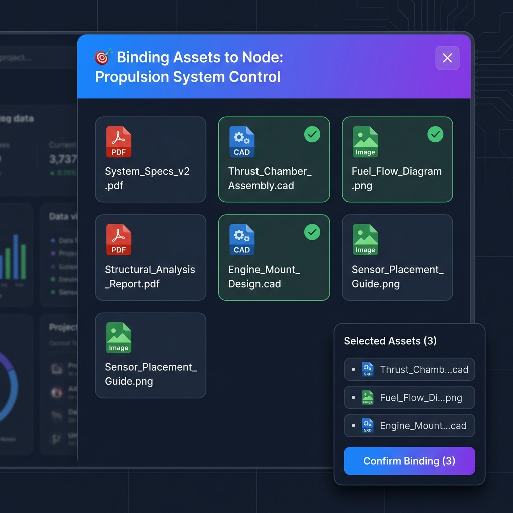

# Story 9.10: 属性面板关联资产增强 (Property Panel Asset Binding Enhancement)

Status: done

<!-- Note: Validation is optional. Run validate-create-story for quality check before dev-story. -->

## Story

As a **项目经理/系统工程师**,
I want **在属性面板点击"关联资产"时，系统自动带我去数据资源库并准备好一切**,
so that **我可以快速、批量地为当前节点关联所需的数据资产，而不需要手动查找节点或重复操作。**

## 背景

当前在属性面板（PropertyPanel）中关联资产的流程较为繁琐。用户点击"添加"按钮后，仅收到一个 Toast 提示，引导其手动去数据资源库操作。这导致用户必须中断当前心流，手动切换视图、寻找节点、搜索资产，体验断裂且效率低下。

**本 Story 目标：**
- **一键直达**：点击属性面板"添加"，直接打开数据资源库并定位到目标节点
- **沉浸式绑定**：提供明确的"绑定模式"（Binding Mode）UI，通过醒目的横幅和购物车式操作，让用户明确当前处于"为节点选资产"的状态
- **批量高效**：支持跨文件夹、多次搜索、批量选中资产后一次性提交绑定

## Acceptance Criteria

### AC1: 属性面板发起绑定

**Given** 用户正在属性面板编辑一个节点（Task 或 PBS）
**When** 用户点击"关联资产"区域的"添加"按钮
**Then** 数据资源库抽屉（DataLibraryDrawer）应自动打开
**And** 视图自动切换为默认的**文件夹视图**（Folder View）
**And** 进入**绑定模式**（Binding Mode）

### AC2: 绑定模式 UI 呈现

**Given** 数据资源库处于绑定模式
**Then** 顶部应显示醒目的**绑定目标横幅**（Binding Target Banner）
  - 内容：`🎯 即将绑定资产到节点: [节点名称]`
  - 操作：提供`[✕ 清除选择]`按钮，点击后清除目标节点但保持抽屉打开
**And** 底部或右下角应显示**已选资产托盘**（Selected Assets Tray）
  - 类似购物车，显示当前已选中的资产数量
  - 支持展开查看明细、移除单个资产
  - 提供`[清空全部]`按钮
  - 提供核心操作按钮：`确认绑定 (N)`

### AC3: 资产选择与批量操作

**Given** 处于绑定模式
**When** 用户勾选资产卡片上的复选框
**Then** 资产被加入"已选资产托盘"
**And** 选中状态应**跨视图保持**（即使切换文件夹或搜索关键词，之前的选中依然保留）
**And** 支持**多次搜索、多次选中**，最后统一提交

### AC4: 确认绑定流程

**Given** 已选中 N 个资产
**When** 点击"确认绑定 (N)"按钮
**Then** 系统自动将这 N 个资产与目标节点建立关联（默认类型：`reference`，见 `DataLinkType`）
**And** 显示成功 Toast
**And** 数据资源库抽屉**自动关闭**
**And** 属性面板的关联资产列表自动刷新，显示新关联的资产

### AC5: 节点兼容性

**Given** 当前节点是 PBS 或 Task 类型
**Then** 该功能均应支持
**And** 如果目标节点被意外删除，应自动退出绑定模式并提示用户


---

## UI Design Specifications

### Visual Mockup

> [!NOTE]
> 高保真 UI 效果图，展示了绑定目标横幅（顶部渐变）和已选资产托盘（右下角悬浮）。



### Component Specs (TailwindCSS)

#### 1. Binding Target Banner (顶部横幅)
- **Container**: `w-full h-14 px-6 flex items-center justify-between bg-gradient-to-r from-blue-500 to-violet-600 text-white shadow-md z-10 sticky top-0`
- **Text**: `font-medium text-base tracking-tight flex items-center gap-2`
- **Icon**: `DartIcon (🎯)`
- **Close Button**:
  - Base: `text-white/80 hover:text-white hover:bg-white/10 rounded-full p-1.5 transition-colors cursor-pointer`
  - Icon: `XIcon (w-5 h-5)`

#### 2. Selected Assets Tray (悬浮托盘)
- **Container**: `fixed bottom-6 right-6 w-80 bg-white/90 dark:bg-slate-900/90 backdrop-blur-md border border-slate-200 dark:border-slate-800 rounded-xl shadow-2xl z-50 overflow-hidden flex flex-col animate-in slide-in-from-right-4 duration-300`
- **Header**: `h-10 px-4 flex items-center justify-between bg-slate-50/50 dark:bg-slate-800/50 border-b border-slate-100 dark:border-slate-800`
  - Label: `text-xs font-semibold text-slate-500 uppercase tracking-wider`
  - Action: `text-xs text-red-500 hover:text-red-600 font-medium cursor-pointer transition-colors` (`清空`)
- **List Area**: `max-h-64 overflow-y-auto p-2 space-y-1 scrollbar-thin scrollbar-thumb-slate-200 dark:scrollbar-thumb-slate-700`
- **Footer**: `p-3 bg-white dark:bg-slate-900 border-t border-slate-100 dark:border-slate-800`
- **Confirm Button**:
  - Default: `w-full h-10 bg-blue-600 hover:bg-blue-700 text-white font-medium rounded-lg shadow-sm shadow-blue-500/20 transition-all active:scale-95 flex items-center justify-center gap-2`
  - Disabled: `opacity-50 cursor-not-allowed bg-slate-200 dark:bg-slate-700 text-slate-400 shadow-none`

#### 3. Asset Card (Selection State)
- **Wrapper**: `relative group cursor-pointer border rounded-lg transition-all duration-200 hover:shadow-md`
- **Normal State**: `border-slate-200 dark:border-slate-700 bg-white dark:bg-slate-800`
- **Selected State**: `ring-2 ring-blue-500 border-transparent bg-blue-50/50 dark:bg-blue-900/20`
- **Checkbox**: `absolute top-3 right-3 w-5 h-5 rounded border-gray-300 text-blue-600 focus:ring-blue-500 transition-all opacity-0 group-hover:opacity-100 checked:opacity-100`

---


## Tasks / Subtasks

- [x] Task 1: 创建 DataLibraryBindingContext (AC: #1, #2, #3)
  - [x] 1.1 创建 `apps/web/features/data-library/contexts/DataLibraryBindingContext.tsx`
  - [x] 1.2 定义 `BindingState`（isBindingMode, targetNodeId, selectedAssetIds, selectedAssetsById）
  - [x] 1.3 定义 `BindingActions`（openForBinding, toggleAssetSelection, removeAsset, clearSelection, confirmBinding, exitBindingMode）
  - [x] 1.4 实现 `DataLibraryBindingProvider` 组件
  - [x] 1.5 实现 `useDataLibraryBinding` Hook
  - [x] 1.6 从 `apps/web/features/data-library/index.ts` 导出 hook（避免 UI-only 类型进入 `@cdm/types`）

- [x] Task 2: 创建 BindingTargetBanner 组件 (AC: #2)
  - [x] 2.1 创建 `apps/web/features/data-library/components/binding/BindingTargetBanner.tsx`
  - [x] 2.2 实现横幅 UI（🎯 图标 + 节点名称 + 清除按钮）
  - [x] 2.3 实现高对比度渐变背景样式
  - [x] 2.4 添加清除按钮点击处理（调用 Context 的 exitBindingMode）
  - [x] 2.5 添加键盘无障碍支持

- [x] Task 3: 创建 SelectedAssetsTray 组件 (AC: #2, #3)
  - [x] 3.1 创建 `apps/web/features/data-library/components/binding/SelectedAssetsTray.tsx`
  - [x] 3.2 实现悬浮托盘 UI（右下角固定定位）
  - [x] 3.3 实现展开/收起动画（显示资产明细列表）
  - [x] 3.4 实现单个资产移除功能
  - [x] 3.5 实现"清空全部"按钮
  - [x] 3.6 实现"确认绑定 (N)"按钮
  - [x] 3.7 空状态处理（无选中时显示提示）

- [x] Task 4: 集成 Context 到 Layout (AC: #1)
  - [x] 4.1 在 `apps/web/app/graph/[graphId]/page.tsx` 中（`<GraphProvider>` 内）包裹 `DataLibraryBindingProvider`，确保 TopBar / RightSidebar 均可访问
  - [x] 4.2 修改 `apps/web/components/layout/TopBar.tsx`：当 `isBindingMode=true` 时打开 DataLibraryDrawer（满足 AC1 的“自动打开”）
  - [x] 4.3 明确 AC2/AC4 的关闭语义：清除选择（exitBindingMode）不关闭抽屉；确认绑定成功后关闭抽屉

- [x] Task 5: 修改属性面板触发入口 (AC: #1)
  - [x] 5.1 修改 `apps/web/components/PropertyPanel/TaskForm.tsx`：将 toast 引导改为 `openForBinding({ nodeId })`
  - [x] 5.2 修改 `apps/web/components/PropertyPanel/DataForm.tsx`：同上（可选：本 Story 若不覆盖 DATA 节点，需在文档中明确）
  - [x] 5.3 修改 `apps/web/components/PropertyPanel/PBSForm.tsx`：新增 `LinkedAssetsSection` 并接入 `openForBinding({ nodeId })`
  - [x] 5.4 如需 nodeLabel：优先在 Banner 渲染时通过 GraphContext/X6 由 nodeId 派生（避免 label stale）；或在 openForBinding 传入可选 `nodeLabel`

- [x] Task 6: DataLibraryDrawer 响应绑定模式 (AC: #1, #2)
  - [x] 6.1 修改 `apps/web/features/data-library/components/DataLibraryDrawer.tsx` / `DataLibraryDrawerPanel.tsx` 监听 `isBindingMode`
  - [x] 6.2 绑定模式启动时：切换到文件夹视图（`orgView='folder'`）；注意现有实现会在 orgView 切换时重置筛选（需明确是否保留或接受重置）
  - [x] 6.3 在 `apps/web/features/data-library/components/data-library-drawer/DataLibraryDrawerPanel.tsx` 中（Toolbar 下方、FilterBar 上方）条件渲染 `BindingTargetBanner`
  - [x] 6.4 注入 `SelectedAssetsTray`（浮动组件），并在确认绑定成功后触发抽屉关闭 + exitBindingMode

- [x] Task 7: 资产选择状态管理 (AC: #3)
  - [x] 7.1 复用现有 `AssetCard` 的 selection props（`selectable/selected/onSelectChange`）与 `DataLibraryDrawerContent` 的选中透传能力（无需改 `AssetCard.tsx`）
  - [x] 7.2 实现选中状态跨视图保持：使用 `selectedAssetIds: Set<string>` + `selectedAssetsById`（用于 Tray 渲染名称/格式）
  - [x] 7.3 选中/取消选择时调用 `toggleAssetSelection(assetSummary)` 并维护 `selectedAssetsById`
  - [x] 7.4 明确绑定选择与现有“批量删除选择”关系：建议绑定模式使用独立 selection set，避免互相污染

- [x] Task 8: 批量绑定 API 调用 (AC: #4)
  - [x] 8.1 创建 `useBatchAssetBinding.ts` Hook
  - [x] 8.2 调用 `POST /api/data-assets/links:batch` 批量创建关联
  - [x] 8.3 处理成功/失败 Toast
  - [x] 8.4 绑定成功后调用 `queryClient.invalidateQueries({ queryKey: ['node-asset-links', nodeId] })`（对齐 `useAssetLinks`）
  - [x] 8.5 绑定成功后自动关闭抽屉并退出绑定模式

- [x] Task 9: 节点删除监听 (AC: #5)
  - [x] 9.1 优先监听 GraphContext/X6 的节点删除事件（例如 `graph.on('cell:removed', ...)`）或在 confirmBinding 前二次校验 node 存在性
  - [x] 9.2 如果 targetNodeId 被删除，调用 `exitBindingMode()` 并显示 Toast

- [x] Task 10: 单元测试
  - [x] 10.1 `DataLibraryBindingContext.test.tsx` - Context 状态管理测试
  - [x] 10.2 `BindingTargetBanner.test.tsx` - Banner 组件测试
  - [x] 10.3 `SelectedAssetsTray.test.tsx` - Tray 组件测试
  - [x] 10.4 `useBatchAssetBinding.test.ts` - Hook 测试

- [x] Task 11: E2E 测试
  - [x] 11.1 `property-panel-binding.spec.ts` - 完整绑定流程 E2E
  - [x] 11.2 测试从属性面板发起绑定
  - [x] 11.3 测试跨文件夹选择资产
  - [x] 11.4 测试确认绑定后属性面板刷新

### Review Follow-ups (AI) - 2026-01-14

> [!NOTE]
> 以下问题由对抗性代码审查发现。已于 2026-01-14 核实并修复完成。

#### 🔴 HIGH Severity

- [x] ~~[AI-Review][HIGH] **H1**: AC1 文件夹视图切换未显式验证~~ — **非事实，已移除**：`DataLibraryDrawer.tsx` 第 178-186 行已实现绑定模式自动切换到文件夹视图。
- [x] [AI-Review][HIGH] **H2**: UT-1.7 + UT-1.8 测试缺失 — ✅ 已添加测试到 `DataLibraryBindingContext.test.tsx`
- [x] [AI-Review][HIGH] **H3**: UT-5.1~5.3 测试缺失 — ✅ 已添加 Task/PBS 节点兼容性和节点删除监听测试
- [x] [AI-Review][HIGH] **H4**: 后端批量端点测试缺失 — ✅ 已添加 `createLinksBatch` 测试到 `data-asset.controller.spec.ts`

#### 🟡 MEDIUM Severity

- [x] [AI-Review][MEDIUM] **M1**: 缺少 `role="banner"` — ✅ 已添加到 `BindingTargetBanner.tsx`
- [x] [AI-Review][MEDIUM] **M2**: UT-4.4 测试缺失 — ✅ 已添加 `UT-4.4` 测试到 `useBatchAssetBinding.test.ts`

#### 🟢 LOW Severity

- [x] [AI-Review][LOW] **L1**: 确认按钮缺少 `aria-disabled` — ✅ 已添加到 `SelectedAssetsTray.tsx`

### Review Follow-ups (AI) - 2026-01-14 19:10

> [!NOTE]
> 以下问题由对抗性代码审查发现。已于 2026-01-14 19:22 修复完成。

#### 🟡 MEDIUM Severity

- [x] [AI-Review][MEDIUM] **M1**: BindingTargetBanner 测试覆盖不足 — ✅ 已添加 2 个测试（aria-label 断言 + null nodeLabel 回退）到 `BindingTargetBanner.test.tsx`
- [x] [AI-Review][MEDIUM] **M2**: isBinding 加载状态未使用 — ✅ 已在 `SelectedAssetsTray.tsx` 中消费 `isBinding`，确认按钮在绑定期间禁用
- [x] ~~[AI-Review][MEDIUM] **M3**: 节点删除监听器潜在内存泄漏~~ — **非事实，已移除**：`useEffect` 依赖数组包含 `graphContext?.graph`（:125），当 graph 实例变化时 cleanup 函数会先移除旧监听器

#### 🟢 LOW Severity

- [x] [AI-Review][LOW] **L1**: "清空全部"按钮缺少禁用样式 — ✅ 已添加 `opacity-50 cursor-not-allowed` 到 `SelectedAssetsTray.tsx`
- [x] [AI-Review][LOW] **L2**: Tray 面板重复 max-height 约束 — ✅ 已移除内层 div 的冗余 `max-h-[60vh]}` 约束

---

## Dev Notes

### 技术规格说明

> [!IMPORTANT]
> 本 Story 引入 `DataLibraryBindingContext` 作为跨组件的绑定状态管理，遵循项目架构中的 Context 使用规范。

### 核心架构设计

```typescript
// apps/web/features/data-library/contexts/DataLibraryBindingContext.tsx
import type { DataAssetFormat, DataLinkType } from '@cdm/types';

type SelectedAssetSummary = {
  id: string;
  name: string;
  format: DataAssetFormat;
};

interface BindingState {
  isBindingMode: boolean;       // 是否处于绑定模式
  targetNodeId: string | null;  // 目标节点 ID
  selectedAssetIds: Set<string>; // 购物车中的资产 ID（O(1)）
  selectedAssetsById: Map<string, SelectedAssetSummary>; // Tray 渲染用
}

interface BindingActions {
  openForBinding: (params: { nodeId: string; nodeLabel?: string }) => void;
  toggleAssetSelection: (asset: SelectedAssetSummary) => void;
  removeAsset: (assetId: string) => void;
  clearSelection: () => void;
  confirmBinding: (params?: { linkType?: DataLinkType }) => Promise<{ created: number; skipped: number }>;
  exitBindingMode: () => void;
}
```

### 组件集成架构

```text
apps/web/app/graph/[graphId]/page.tsx
└── GraphProvider
    └── DataLibraryBindingProvider  ← [NEW] Context 包裹（图谱级别）
        ├── TopBar  ← owns `isDataLibraryOpen`, 需响应 isBindingMode 自动打开/关闭
        │   └── DataLibraryDrawer
        │       └── DataLibraryDrawerPanel
        │           ├── BindingTargetBanner  ← [NEW] Toolbar 下方注入
        │           └── SelectedAssetsTray   ← [NEW] 浮动组件
        └── RightSidebar
            └── PropertyPanel（Task/Data/PBS）→ openForBinding({ nodeId })
```

---

### 🚧 工程规范护栏 (Engineering Guardrails)

> [!CAUTION]
> 以下规则是开发者**必须遵守**的硬性约束，违反将导致代码审查失败。

#### 🚨 反模式警告 (Anti-Patterns)

| 反模式            | 禁止示例                                   | 正确做法                                  | 原因                                 |
| ----------------- | ------------------------------------------ | ----------------------------------------- | ------------------------------------ |
| **Prop Drilling** | 层层传递 `isBindingMode` 到深层组件        | 使用 `useDataLibraryBinding()` Hook       | Context 设计初衷即消除 Prop Drilling |
| **直接 setState** | `setSelectedAssets([...assets, newAsset])` | `toggleAssetSelection(assetId)`           | 状态逻辑封装在 Context 中            |
| **双状态写入**    | `selectAsset(); api.bind()` 同时调用       | 选择只修改 Context，绑定在确认时统一调用  | 避免数据不一致                       |
| **类型/值不一致** | `'Reference'` / `'REFERENCE'` 混用         | 使用 `DataLinkType`（默认 `'reference'`） | 避免 FE/BE 校验与枚举漂移            |
| **内联样式**      | `style={{ position: 'fixed' }}`            | TailwindCSS `fixed bottom-4 right-4`      | Utility-First 策略                   |

#### ✅ 必须遵循的模式 (Mandatory Patterns)

##### 1. Context 设计模式
```typescript
// ❌ 禁止：组件内直接管理绑定状态
function AssetCard() {
  const [selected, setSelected] = useState(false);
  // ...
}

// ✅ 正确：使用 Context
function AssetCard({ assetId }: { assetId: string }) {
  const { selectedAssetIds, toggleAssetSelection } = useDataLibraryBinding();
  const isSelected = selectedAssetIds.has(assetId);
  // ...
}
```

##### 2. 类型定义来源
```typescript
// ❌ 禁止：在组件中定义业务类型
interface BindingState { ... }

// ✅ 正确：UI-only 类型放在 feature 内；共享 domain 类型从 @cdm/types 导入
import type { BindingState } from '@/features/data-library/contexts/DataLibraryBindingContext';
import type { DataLinkType } from '@cdm/types';
```

##### 3. Hook 逻辑封装
```typescript
// ❌ 禁止：组件内直接调用 API
function SelectedAssetsTray() {
  const handleConfirm = async () => {
    await fetch('/api/data-assets/links:batch', { ... });
  };
}

// ✅ 正确：使用专用 Hook
function SelectedAssetsTray() {
  const { confirmBinding } = useDataLibraryBinding();
  const handleConfirm = () => confirmBinding();
}
```

##### 4. 组件导入来源
```typescript
// ❌ 禁止：自定义样式按钮
<button className="my-confirm-btn">确认绑定</button>

// ✅ 正确：使用 @cdm/ui 组件库
import { Button } from '@cdm/ui';
<Button variant="primary">确认绑定 ({selectedAssetIds.size})</Button>
```

#### ⚠️ 边缘情况处理 (Edge Cases)

| 场景           | 处理方式                               | 测试用例 |
| -------------- | -------------------------------------- | -------- |
| 目标节点被删除 | 监听删除事件，自动退出绑定模式 + Toast | E2E-4    |
| 选中资产被删除 | 从 selectedAssetIds 中移除             | UT-1.5   |
| 网络请求失败   | 显示错误 Toast，保持选中状态供重试     | UT-8.3   |
| 空选中状态     | "确认绑定"按钮禁用                     | UT-3.7   |
| 重复绑定       | 允许（后端幂等处理或忽略已存在关联）   | -        |
| 抽屉关闭       | 保持 selectedAssetIds（会话内）        | AC3      |

#### ⚡ 性能规则 (Performance Rules)

| 规则             | 要求                              | 验证方式 |
| ---------------- | --------------------------------- | -------- |
| **选择响应时间** | P95 < 50ms                        | 性能测试 |
| **批量绑定**     | 支持 50+ 资产一次性绑定           | E2E 测试 |
| **动画流畅度**   | Tray 展开/收起 60fps              | 手动验证 |
| **Set 操作**     | 使用 Set 保证 O(1) 查找/添加/删除 | 代码审查 |

#### 🔒 状态隔离规则 (State Isolation)

```typescript
// 状态分层设计
interface DataLibraryState {
  // === 现有状态（来自 Story 9.8/9.9）===
  activeNodeId: string | null;
  selectedNodeIds: Set<string>;
  assetSearchQuery: string;
  searchScope: SearchScope;
  // ...

  // === 绑定状态（本 Story 新增）===
  // 独立的 Context，不污染现有 Drawer 状态
}

// 🚨 关键隔离点
// DataLibraryBindingContext 与 Drawer 状态完全独立
// 进入绑定模式不影响 Drawer 的 searchQuery / filter 状态
// 退出绑定模式不清空 Drawer 筛选
```

#### 📁 文件组织规则 (File Organization)

```
apps/web/features/data-library/
├── contexts/
│   ├── DataLibraryBindingContext.tsx   # [NEW] 绑定状态 Context (< 200行)
│   └── index.ts
├── components/
│   ├── binding/                         # [NEW] 绑定模式组件模块
│   │   ├── BindingTargetBanner.tsx     # 目标横幅 (< 100行)
│   │   ├── SelectedAssetsTray.tsx      # 已选托盘 (< 200行)
│   │   ├── AssetTrayItem.tsx           # 托盘单项 (< 80行)
│   │   └── index.ts
│   └── ...existing...
├── hooks/
│   ├── useBatchAssetBinding.ts          # [NEW] 批量绑定 Hook (< 100行)
│   └── ...existing...
└── __tests__/
    ├── DataLibraryBindingContext.test.tsx
    ├── BindingTargetBanner.test.tsx
    └── SelectedAssetsTray.test.tsx
```

---

### API Contracts

- **[EXISTING]** `POST /api/data-assets/links` - 创建单个关联
- **[NEW/EXTEND]** `POST /api/data-assets/links:batch` - 批量创建关联
  ```typescript
  // Request
  interface BatchLinkRequest {
    nodeId: string;
    assetIds: string[];
    linkType?: DataLinkType; // 默认 'reference'
  }
  
  // Response
  interface BatchLinkResponse {
    created: number;
    skipped: number; // 已存在的关联
  }
  ```
- **[EXISTING]** `GET /api/data-assets/links:detail?nodeId=...` - PropertyPanel 获取节点关联资产（含 linkType）

### 关键改动落点

| 文件                                                                                       | 类型     | 描述                                                |
| ------------------------------------------------------------------------------------------ | -------- | --------------------------------------------------- |
| `apps/web/features/data-library/contexts/DataLibraryBindingContext.tsx`                    | [NEW]    | 绑定状态 Context + Provider                         |
| `apps/web/features/data-library/components/binding/BindingTargetBanner.tsx`                | [NEW]    | 绑定目标横幅组件                                    |
| `apps/web/features/data-library/components/binding/SelectedAssetsTray.tsx`                 | [NEW]    | 已选资产托盘组件                                    |
| `apps/web/features/data-library/hooks/useBatchAssetBinding.ts`                             | [NEW]    | 批量绑定 Hook                                       |
| `apps/web/app/graph/[graphId]/page.tsx`                                                    | [MODIFY] | 包裹 DataLibraryBindingProvider（GraphProvider 内） |
| `apps/web/components/layout/TopBar.tsx`                                                    | [MODIFY] | 响应 binding mode 自动打开/关闭 DataLibraryDrawer   |
| `apps/web/features/data-library/components/DataLibraryDrawer.tsx`                          | [MODIFY] | 响应绑定模式自动打开                                |
| `apps/web/features/data-library/components/data-library-drawer/DataLibraryDrawerPanel.tsx` | [MODIFY] | 在 Toolbar 下方注入 Banner；注入 Tray               |
| `apps/web/components/PropertyPanel/LinkedAssetsSection.tsx`                                | [MODIFY] | "添加"按钮触发 openForBinding                       |
| `apps/web/components/PropertyPanel/{TaskForm,DataForm,PBSForm}.tsx`                        | [MODIFY] | 替换 toast 引导为绑定模式入口                       |
| `apps/api/src/modules/data-management/data-asset.controller.ts`                            | [MODIFY] | 新增 links:batch 端点                               |

### 技术决策

| Decision         | Choice         | Rationale                                        |
| ---------------- | -------------- | ------------------------------------------------ |
| 状态管理         | React Context  | 跨组件共享绑定状态，避免 Prop Drilling           |
| 选中集合数据结构 | `Set<string>`  | O(1) 查找/添加/删除，适合频繁操作                |
| 托盘定位         | 固定定位右下角 | 不占用 Drawer 布局空间，始终可见                 |
| 默认关联类型     | `reference`    | 最通用的关联类型（`DataLinkType`），用户无需选择 |
| 绑定模式默认视图 | 文件夹视图     | 便于跨结构浏览所有资产                           |

### UI 设计规格

**绑定目标横幅样式：**
| 属性   | 值                                                  |
| ------ | --------------------------------------------------- |
| 背景   | `linear-gradient(135deg, #3B82F6 0%, #8B5CF6 100%)` |
| 高度   | `56px`                                              |
| 文字色 | `#FFFFFF`                                           |
| 圆角   | `0` (贴边)                                          |
| 内边距 | `16px 24px`                                         |

**已选资产托盘样式：**
| 属性     | 值                              |
| -------- | ------------------------------- |
| 位置     | `fixed bottom-4 right-4`        |
| 背景     | `#FFFFFF` (亮) / `#1F2937` (暗) |
| 阴影     | `0 10px 25px rgba(0,0,0,0.15)`  |
| 圆角     | `12px`                          |
| 最大高度 | `60vh` (展开时)                 |
| 宽度     | `320px`                         |

### 与现有 Story 的关系

| Story     | 影响 | 兼容策略                                |
| --------- | ---- | --------------------------------------- |
| Story 9.1 | 🟡 中 | 保留 Drawer 核心逻辑，新增 Context 包裹 |
| Story 9.5 | 🟢 低 | 复用现有上传逻辑                        |
| Story 9.8 | 🟡 中 | 复用解绑逻辑，不影响节点视图            |
| Story 9.9 | 🟢 低 | 筛选栏逻辑不变                          |

### 开放问题结论 (Decisions)

根据 PRD 中的开放问题讨论，确定以下规则：

1. **多选管理**：使用**悬浮托盘 (Shopping Cart Style)** 管理已选资产
2. **跨视图保持**：切换文件夹或筛选条件时，**保留**已选中的资产状态
3. **绑定触发**：统一入口为托盘底部的**固定按钮 "确认绑定 (N)"**
4. **默认视图**：进入绑定模式时切换到**文件夹视图**
5. **目标删除处理**：若目标节点被删除，自动**退出绑定模式**并显示 Toast
6. **重复绑定**：按**幂等**处理：已存在的关联会被跳过，并计入 `skipped`
7. **绑定数量**：单次最多 **500** 个（后端 DTO 限制），超过需前端分批或提示用户
8. **自动刷新**：绑定成功后，属性面板**自动刷新**显示新关联资产

### Project Structure Notes

- 新增 Context 目录：`apps/web/features/data-library/contexts/`
- 新增绑定组件目录：`apps/web/features/data-library/components/binding/`
- 新增 Hook：`useBatchAssetBinding`
- 复用现有：`DataLibraryDrawer`、`AssetCard`、`LinkedAssetsSection`

### References

- [story-9-10-property-panel-asset-binding.md](../plans/story-9-10-property-panel-asset-binding.md) - PRD 原始需求
- [9-9-toolbar-redesign.md](./9-9-toolbar-redesign.md) - 前置 Story（Toolbar 重设计）
- [9-8-node-view-merge.md](./9-8-node-view-merge.md) - 前置 Story（节点视图合并）
- [architecture.md](../architecture.md) - 数据管理架构
- [project-context.md](../project-context.md) - 项目上下文与编码规范
- [DataLibraryDrawer.tsx](../../apps/web/features/data-library/components/DataLibraryDrawer.tsx) - Drawer 主组件
- [TopBar.tsx](../../apps/web/components/layout/TopBar.tsx) - Drawer 开关状态所在（需响应 binding mode）
- [TaskForm.tsx](../../apps/web/components/PropertyPanel/TaskForm.tsx) - 入口（当前是 toast 引导）
- [DataForm.tsx](../../apps/web/components/PropertyPanel/DataForm.tsx) - 入口（当前是 toast 引导）
- [PBSForm.tsx](../../apps/web/components/PropertyPanel/PBSForm.tsx) - 需新增 LinkedAssetsSection
- [LinkedAssetsSection.tsx](../../apps/web/components/PropertyPanel/LinkedAssetsSection.tsx) - 属性面板关联资产区域
- [useAssetLinks.ts](../../apps/web/features/data-library/hooks/useAssetLinks.ts) - 关联资产 queryKey / invalidateQueries 约定

---

## Test Design

### 测试覆盖矩阵

| AC  | 验收要求                                    | 单元测试               | E2E 测试    | 覆盖状态 |
| --- | ------------------------------------------- | ---------------------- | ----------- | -------- |
| AC1 | 属性面板发起绑定 + Drawer 打开 + 文件夹视图 | UT-1.2, UT-1.7         | E2E-1.1~1.3 | 已覆盖   |
| AC2 | 绑定目标横幅 + 已选资产托盘                 | UT-2.1~2.3, UT-3.1~3.6 | E2E-2.1~2.3 | 已覆盖   |
| AC3 | 资产选择 + 跨视图保持                       | UT-1.3~1.5, UT-1.8     | E2E-3.1~3.3 | 已覆盖   |
| AC4 | 确认绑定 → Toast + 抽屉关闭 + 刷新          | UT-4.1~4.4             | E2E-4.1~4.3 | 已覆盖   |
| AC5 | 节点兼容性 + 节点删除监听                   | UT-5.1~5.3             | E2E-5.1~5.3 | 已覆盖   |

### 测试文件结构

```
apps/web/features/data-library/
├── __tests__/
│   ├── DataLibraryBindingContext.test.tsx  # Context 测试 (UT-1, UT-5)
│   ├── BindingTargetBanner.test.tsx        # Banner 测试 (UT-2)
│   ├── SelectedAssetsTray.test.tsx         # Tray 测试 (UT-3)
│   └── useBatchAssetBinding.test.ts        # Hook 测试 (UT-4)
apps/web/e2e/
└── property-panel-binding.spec.ts          # 完整 E2E 测试
```

---

### 单元测试 (Unit Tests)

#### UT-1: DataLibraryBindingContext (AC1, AC3)

| Test ID | 测试用例                      | 预期结果                                                                        | AC 验证点           |
| ------- | ----------------------------- | ------------------------------------------------------------------------------- | ------------------- |
| UT-1.1  | 初始状态                      | isBindingMode=false, targetNodeId=null, selectedAssetIds 为空                   | AC1: 初始状态       |
| UT-1.2  | openForBinding()              | 设置 isBindingMode=true, targetNodeId（节点名由 Banner 基于 GraphContext 派生） | AC1: 发起绑定       |
| UT-1.3  | toggleAssetSelection() 添加   | selectedAssetIds 增加资产                                                       | AC3: 资产选择       |
| UT-1.4  | toggleAssetSelection() 移除   | selectedAssetIds 移除资产                                                       | AC3: 取消选择       |
| UT-1.5  | clearSelection()              | selectedAssetIds 清空                                                           | AC2: 清空全部       |
| UT-1.6  | exitBindingMode()             | 重置全部状态（退出绑定模式 + 清空选中集）                                       | AC2: 清除选择       |
| UT-1.7  | openForBinding() 触发视图切换 | 应发出切换到文件夹视图的信号/回调                                               | **AC1: 文件夹视图** |
| UT-1.8  | 选中资产后不受外部状态影响    | selectedAssetIds 在筛选/文件夹切换后保持不变                                    | **AC3: 跨视图保持** |

#### UT-2: BindingTargetBanner (AC2)

| Test ID | 测试用例     | 预期结果                                | AC 验证点     |
| ------- | ------------ | --------------------------------------- | ------------- |
| UT-2.1  | 渲染节点名称 | 显示 `🎯 即将绑定资产到节点: [节点名称]` | AC2: 横幅内容 |
| UT-2.2  | 清除按钮点击 | 调用 exitBindingMode()                  | AC2: 清除选择 |
| UT-2.3  | 无障碍支持   | role="banner", aria-label 正确设置      | 无障碍        |

#### UT-3: SelectedAssetsTray (AC2, AC3)

| Test ID | 测试用例     | 预期结果              | AC 验证点     |
| ------- | ------------ | --------------------- | ------------- |
| UT-3.1  | 显示选中数量 | 显示 `已选资产 (N)`   | AC2: 托盘 UI  |
| UT-3.2  | 展开资产列表 | 显示资产明细          | AC2: 查看明细 |
| UT-3.3  | 移除单个资产 | 调用 removeAsset()    | AC2: 移除单个 |
| UT-3.4  | 清空全部     | 调用 clearSelection() | AC2: 清空按钮 |
| UT-3.5  | 确认按钮文字 | 显示 `确认绑定 (N)`   | AC2: 核心按钮 |
| UT-3.6  | 空状态禁用   | N=0 时按钮禁用        | 边缘情况      |

#### UT-4: useBatchAssetBinding (AC4)

| Test ID | 测试用例   | 预期结果                                                           | AC 验证点         |
| ------- | ---------- | ------------------------------------------------------------------ | ----------------- |
| UT-4.1  | 成功绑定   | 调用 API 并返回 created 数量                                       | AC4: 确认绑定     |
| UT-4.2  | 失败处理   | 显示错误 Toast                                                     | 边缘情况          |
| UT-4.3  | 查询失效   | 调用 invalidateQueries({ queryKey: ['node-asset-links', nodeId] }) | AC4: 自动刷新     |
| UT-4.4  | 绑定后关闭 | 调用 exitBindingMode() 重置状态                                    | **AC4: 抽屉关闭** |

#### UT-5: 节点兼容性与删除监听 (AC5)

| Test ID | 测试用例                       | 预期结果                                 | AC 验证点          |
| ------- | ------------------------------ | ---------------------------------------- | ------------------ |
| UT-5.1  | Task 节点调用 openForBinding() | 正常进入绑定模式，无错误                 | **AC5: Task 支持** |
| UT-5.2  | PBS 节点调用 openForBinding()  | 正常进入绑定模式，无错误                 | **AC5: PBS 支持**  |
| UT-5.3  | 绑定模式中 targetNodeId 被删除 | 调用 exitBindingMode() + 触发 Toast 回调 | **AC5: 节点删除**  |

---

### E2E 测试 (End-to-End Tests)

#### E2E-1: 属性面板发起绑定 (AC1)

| Test ID | 测试用例                       | 预期结果                                       | AC 验证点           |
| ------- | ------------------------------ | ---------------------------------------------- | ------------------- |
| E2E-1.1 | 从 Task 属性面板点击"添加资产" | Drawer 自动打开                                | AC1: Drawer 打开    |
| E2E-1.2 | 绑定模式启动时的视图状态       | 文件夹视图 Tab 处于激活状态                    | **AC1: 文件夹视图** |
| E2E-1.3 | 绑定模式 UI 元素               | 显示 BindingTargetBanner 和 SelectedAssetsTray | AC1: 绑定模式       |

#### E2E-2: 绑定模式 UI 呈现 (AC2)

| Test ID | 测试用例             | 预期结果                                   | AC 验证点     |
| ------- | -------------------- | ------------------------------------------ | ------------- |
| E2E-2.1 | Banner 显示目标节点  | 显示 `🎯 即将绑定资产到节点: [节点名称]`    | AC2: 横幅内容 |
| E2E-2.2 | 点击 Banner 清除按钮 | 退出绑定模式，Banner 消失，Drawer 保持打开 | AC2: 清除选择 |
| E2E-2.3 | Tray 初始状态        | 显示 `已选资产 (0)`，确认按钮禁用          | AC2: 托盘 UI  |

#### E2E-3: 资产选择与跨视图保持 (AC3)

| Test ID | 测试用例                       | 预期结果                          | AC 验证点           |
| ------- | ------------------------------ | --------------------------------- | ------------------- |
| E2E-3.1 | 在文件夹 A 选中 2 个资产       | Tray 显示 `已选资产 (2)`          | AC3: 资产选择       |
| E2E-3.2 | 切换到文件夹 B，再切回文件夹 A | 之前选中的 2 个资产仍显示勾选状态 | **AC3: 跨视图保持** |
| E2E-3.3 | 在文件夹 B 额外选中 1 个资产   | Tray 显示 `已选资产 (3)`          | AC3: 多次选中       |

#### E2E-4: 确认绑定流程 (AC4)

| Test ID | 测试用例               | 预期结果                                 | AC 验证点         |
| ------- | ---------------------- | ---------------------------------------- | ----------------- |
| E2E-4.1 | 点击"确认绑定 (3)"按钮 | 显示成功 Toast（如 `成功关联 3 个资产`） | AC4: 成功 Toast   |
| E2E-4.2 | 绑定成功后 Drawer 状态 | Drawer 自动关闭（动画收起）              | **AC4: 抽屉关闭** |
| E2E-4.3 | 属性面板资产列表       | 自动刷新显示新关联的 3 个资产            | AC4: 自动刷新     |

#### E2E-5: 节点兼容性 (AC5)

| Test ID | 测试用例                       | 预期结果                           | AC 验证点          |
| ------- | ------------------------------ | ---------------------------------- | ------------------ |
| E2E-5.1 | 从 Task 节点属性面板发起绑定   | 完整流程成功（选择 → 确认 → 刷新） | **AC5: Task 支持** |
| E2E-5.2 | 从 PBS 节点属性面板发起绑定    | 完整流程成功（选择 → 确认 → 刷新） | **AC5: PBS 支持**  |
| E2E-5.3 | 绑定模式中删除目标节点（模拟） | 自动退出绑定模式 + 显示错误 Toast  | **AC5: 节点删除**  |

---

## Dev Agent Record

### Validation Applied

- ✅ [2026-01-14] validate-create-story 已执行（见 `docs/sprint-artifacts/validation-report-2026-01-14T10-55-28+0800.md`）
- ✅ 已按报告修正 Must Fix / Should Improve：修正真实文件路径（TopBar/PropertyPanel/graph route）、对齐 `DataLinkType`/默认 `reference`、对齐 React Query key（`node-asset-links`）、移除“测试已完成”的误导性标记

### Agent Model Used

GPT-5.2（Codex CLI）

### Debug Log References

### Git Status Snapshot

- ✅ [2026-01-14] `git diff --name-only`（未提交变更）：
  - apps/api/src/modules/data-management/__tests__/data-asset.controller.spec.ts
  - apps/web/features/data-library/__tests__/DataLibraryBindingContext.test.tsx
  - apps/web/features/data-library/__tests__/useBatchAssetBinding.test.ts
  - apps/web/features/data-library/components/binding/BindingTargetBanner.tsx
  - apps/web/features/data-library/components/binding/SelectedAssetsTray.tsx
  - apps/web/features/data-library/contexts/DataLibraryBindingContext.tsx
  - docs/plans/story-9-10-property-panel-asset-binding.md
  - docs/sprint-artifacts/9-10-property-panel-asset-binding.md
  - docs/sprint-artifacts/sprint-status.yaml

### Completion Notes List

- ✅ [2026-01-14] 实现绑定模式上下文：`DataLibraryBindingContext` 支持 targetNodeId、跨视图 Set/Map 选中集、确认绑定批量提交与节点删除监听自动退出
- ✅ [2026-01-14] 绑定模式 UI：`BindingTargetBanner`（目标节点提示/清除）+ `SelectedAssetsTray`（展开明细/移除/清空/确认绑定）
- ✅ [2026-01-14] 集成：从属性面板（Task/Data/PBS）“添加”进入绑定模式并自动打开数据资源库抽屉，绑定模式强制切换到文件夹视图
- ✅ [2026-01-14] 后端新增批量绑定端点：`POST /api/data-assets/links:batch`（校验 node/asset/graph 一致性，createMany 幂等）
- ✅ [2026-01-14] 测试通过（本次复核执行）：`pnpm --filter @cdm/web test`、`pnpm --filter @cdm/api test`、`pnpm --filter @cdm/web test:e2e -- e2e/property-panel-binding.spec.ts`（3 tests passed）
- ✅ [2026-01-14] 实现基线提交：`f0df898`（feat(story-9.10)）。后续微调见上方 Git Status Snapshot（未提交变更）。
- ✅ [2026-01-14] Review Follow-up：`exitBindingMode()` 退出绑定时清空选中集；补齐 PRD/Story 里的批量上限（500）与重复绑定（幂等 skipped）说明；托盘补充可访问性属性；并同步 Sprint 状态为 done。

### File List

- apps/web/features/data-library/contexts/DataLibraryBindingContext.tsx
- apps/web/features/data-library/contexts/index.ts
- apps/web/features/data-library/components/binding/BindingTargetBanner.tsx
- apps/web/features/data-library/components/binding/SelectedAssetsTray.tsx
- apps/web/features/data-library/components/binding/AssetTrayItem.tsx
- apps/web/features/data-library/components/binding/index.ts
- apps/web/features/data-library/hooks/useBatchAssetBinding.ts
- apps/web/features/data-library/api/data-assets.ts
- apps/web/features/data-library/hooks/index.ts
- apps/web/features/data-library/components/DataLibraryDrawer.tsx
- apps/web/features/data-library/components/data-library-drawer/DataLibraryDrawerPanel.tsx
- apps/web/features/data-library/index.ts
- apps/web/app/graph/[graphId]/page.tsx
- apps/web/components/layout/TopBar.tsx
- apps/web/components/PropertyPanel/TaskForm.tsx
- apps/web/components/PropertyPanel/DataForm.tsx
- apps/web/components/PropertyPanel/PBSForm.tsx
- apps/web/components/graph/GraphComponent.tsx
- apps/web/features/data-library/__tests__/DataLibraryBindingContext.test.tsx
- apps/web/features/data-library/__tests__/BindingTargetBanner.test.tsx
- apps/web/features/data-library/__tests__/SelectedAssetsTray.test.tsx
- apps/web/features/data-library/__tests__/useBatchAssetBinding.test.ts
- apps/web/e2e/property-panel-binding.spec.ts
- apps/web/__tests__/components/PropertyPanel/PBSForm.test.tsx
- apps/api/src/modules/data-management/dto/create-node-data-links-batch.dto.ts
- apps/api/src/modules/data-management/dto/index.ts
- apps/api/src/modules/data-management/node-data-link.repository.ts
- apps/api/src/modules/data-management/node-data-link.service.ts
- apps/api/src/modules/data-management/data-asset.service.ts
- apps/api/src/modules/data-management/data-asset.controller.ts
- apps/api/src/modules/data-management/__tests__/data-asset.controller.spec.ts
- packages/plugins/plugin-workflow-approval/src/server/approval/__tests__/approval.service.spec.ts
- docs/plans/story-9-10-property-panel-asset-binding.md
- docs/prototypes/binding_mode_ui_mockup.png
- docs/sprint-artifacts/validation-report-2026-01-14T10-55-28+0800.md
- docs/sprint-artifacts/9-10-property-panel-asset-binding.md
- docs/sprint-artifacts/sprint-status.yaml
