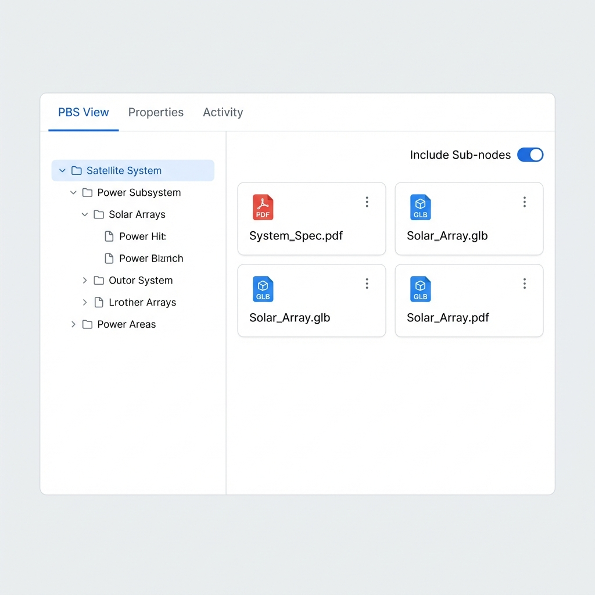
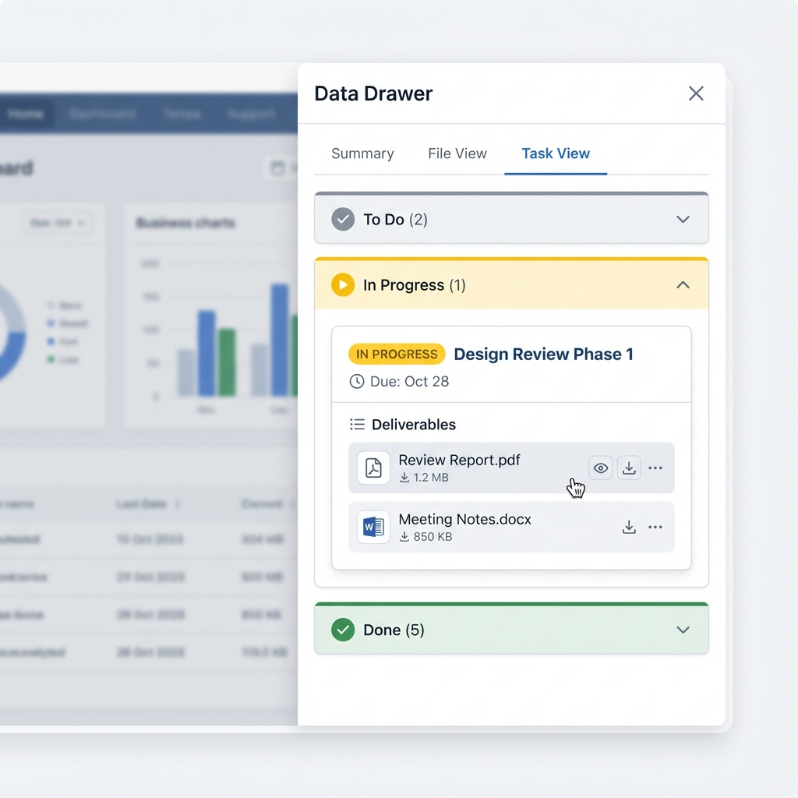
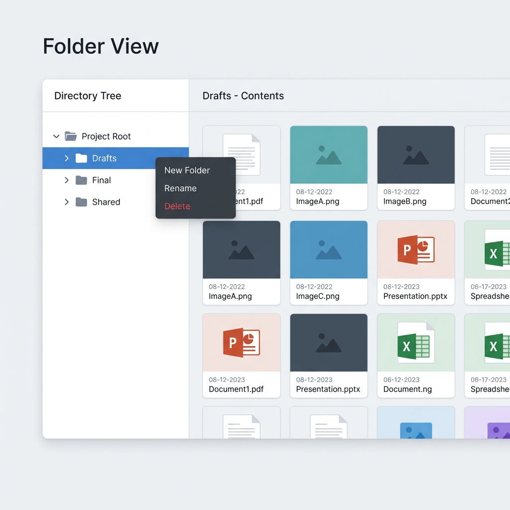
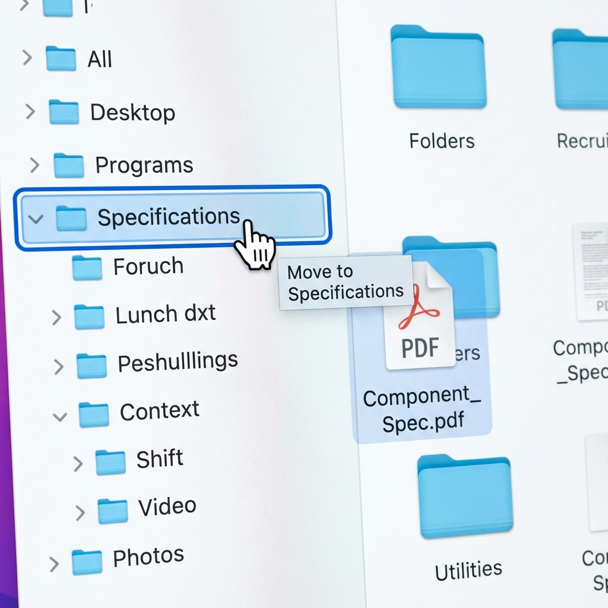
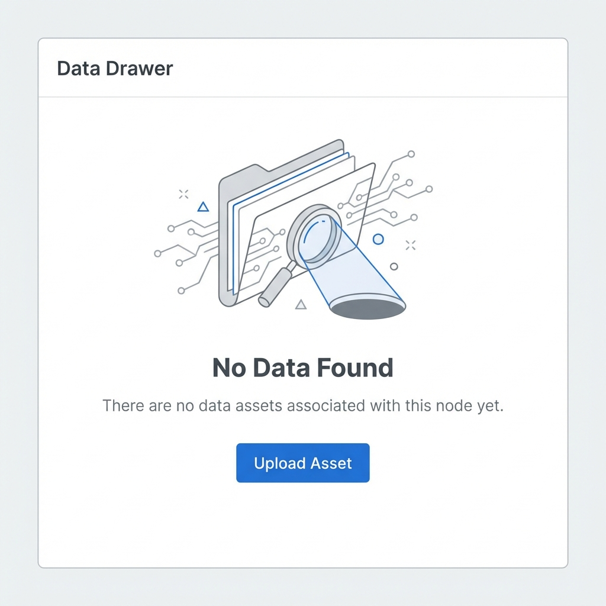

# Story 9.2: 多维度组织视图 (Multi-Dimensional Organization)

Status: in-progress
Tech-Spec: [tech-spec-9-2-multi-dimensional-organization.md](./tech-spec-9-2-multi-dimensional-organization.md)

## Story

As a **用户**,
I want **在 PBS / 任务 / 文件夹 三种视图中组织数据资产**,
so that **我能按照最适合当前工作的方式查找数据。**

## Problem Statement

Story 9.1 实现了数据资源库的基础 Drawer 组件，支持网格/列表视图切换和搜索过滤。但用户需要更灵活的方式来组织和查找数据资产：

1. **按 PBS 结构查看** - 工程师需要按照产品分解结构浏览关联的数据
2. **按任务查看** - 项目经理需要按任务状态分组查看交付物和过程数据
3. **按文件夹管理** - 用户需要自定义文件夹结构来组织资产

当前的扁平列表/网格视图无法满足这些多维度的组织需求。

## Scope

**In Scope:**
- ✅ 三种组织视图的 Tab 切换 UI (PBS/任务/文件夹)
- ✅ PBS 视图：从 Yjs Doc 同步 PBS 节点，显示关联资产
- ✅ 任务视图：按状态分组，显示任务交付物
- ✅ 文件夹视图：CRUD 操作，拖拽移动资产
- ✅ Tab 切换时保持各视图的展开/选中状态

**Out of Scope:**
- ❌ 文件夹的权限控制（后续 Story）
- ❌ 跨图资产共享
- ❌ 资产版本管理
- ❌ 文件夹嵌套层级限制（MVP 暂不限制）

---

## Acceptance Criteria

1. **AC1: PBS 视图**
   - **Given** 数据资源库 Drawer 已打开
   - **When** 点击 "PBS 视图" Tab
   - **Then** 左侧显示 PBS 树结构（从 GraphContext 的 `yDoc` 实时同步；以 `nodeType === NodeType.PBS` 判定 PBS 节点）
   - **And** 右侧显示选中 PBS 节点关联的数据资产
   - **And** PBS 树支持展开/折叠
   - **And** 选中 PBS 节点时右侧数据列表自动刷新
   - **And** 提供"包含子节点"开关，可切换显示仅当前节点或当前节点+所有子节点的资产

2. **AC2: 任务视图**
   - **Given** 数据资源库 Drawer 已打开
   - **When** 点击 "任务视图" Tab
   - **Then** 按任务状态分组显示（待办/进行中/已完成）
   - **And** 每个任务下列出其交付物（`TaskProps.deliverables`）/关联数据资产（NodeDataLink → DataAsset）
   - **And** 点击任务可展开查看关联数据资产

3. **AC3: 文件夹视图**
   - **Given** 数据资源库 Drawer 已打开
   - **When** 点击 "文件夹视图" Tab
   - **Then** 显示用户自建的虚拟文件夹结构
   - **And** 支持创建新文件夹（右键菜单或按钮）
   - **And** 支持重命名文件夹（双击或右键菜单）
   - **And** 支持删除空文件夹（右键菜单）

4. **AC4: 数据资产拖拽**
   - **Given** 文件夹视图已打开
   - **When** 将数据资产拖拽到文件夹上
   - **Then** 资产应移动到该文件夹
   - **And** 文件夹视图自动刷新显示新位置
   - **And** 拖拽过程中显示视觉反馈（高亮目标文件夹，UI 设计待补充）

5. **AC5: Tab 切换状态保持**
   - **Given** 在某个视图中选中了特定项目
   - **When** 切换到其他视图再切回
   - **Then** 之前的展开/选中状态应保持

6. **AC6: 空状态显示**
   - **Given** 数据资源库 Drawer 已打开
   - **When** PBS 视图无 PBS 节点
   - **Then** 显示空状态插画和提示文案（UI 设计待补充）
   - **When** 任务视图无任务节点
   - **Then** 显示空状态插画和提示文案
   - **When** 文件夹视图无文件夹
   - **Then** 显示空状态插画和提示文案

---

## 🎨 UI Design Specification

### 1. 视图设计 (View Designs)

#### PBS View


**Design Specs:**
- **Layout**: Split pane (Left: 30% Tree, Right: 70% Grid).
- **Tree Component**:
  - Node Height: `32px`
  - Hover State: `bg-slate-100` (`#F1F5F9`)
  - Selected State: `bg-blue-50 text-blue-700` (`#EFF6FF`, `#1D4ED8`)
  - Icons: Lucide `Box` (16px), `ChevronRight/Down` (14px)
- **Toolbar**:
  - "Include Sub-nodes" Switch: Right-aligned, primary blue (`bg-blue-600`) when active.
- **Asset Grid**:
  - Card Width: `minmax(200px, 1fr)`
  - Card Gap: `16px`

#### Task View


**Design Specs:**
- **Group Headers**:
  - Height: `40px`
  - Background: `bg-slate-50/50`
  - Font: Inter Medium, `14px`
- **Status Badges**:
  - To Do: `bg-slate-100 text-slate-600`
  - In Progress: `bg-amber-50 text-amber-700 border-amber-200`
  - Done: `bg-emerald-50 text-emerald-700 border-emerald-200`
- **Task Card**:
  - Border: `1px solid border-slate-200`
  - Shadow: `shadow-sm` hover `shadow-md`
  - Deliverables Area: `bg-slate-50` rounded-b-md, padding `12px`

#### Folder View


**Design Specs:**
- **Tree Style**: Consistent with PBS Tree but using Folder icons.
- **Icons**: Lucide `Folder` (Default), `FolderOpen` (Expanded). Color: `text-blue-500` (`#3B82F6`).
- **Context Menu**:
  - Component: Shadcn `ContextMenu`
  - Item Height: `32px`
  - Delete Action: `text-red-600 focus:text-red-600 focus:bg-red-50`

### 2. 交互状态 (Interactions)

#### Drag & Drop Feedback (AC4)


**Design Specs:**
- **Drop Target (Folder)**:
  - Border: `2px solid border-blue-500` (inset)
  - Background: `bg-blue-50`
- **Drag Source (Ghost)**:
  - Opacity: `0.6`
  - Scale: `1.02`
  - Cursor: `grabbing`
- **Validation**:
  - Invalid Drop: Cursor `not-allowed`, Target `border-red-500`

#### Empty States (AC6)


**Design Specs:**
- **Layout**: Centered vertically and horizontally in the view panel.
- **Illustration**:
  - Feature-specific SVG (Gray/Blue palette)
  - Max Width: `200px`
- **Typography**:
  - Title: `text-lg font-medium text-slate-900`
  - Description: `text-sm text-slate-500` (max-width `300px`, center aligned)
- **Primary Action**:
  - Component: Shadcn `Button`
  - Variant: `default` (Blue)

---

## Tasks / Subtasks

### Phase 0: 前置检查 (Prerequisites)

- [ ] **确认 Story 9.1 状态为 `done`**（本 Story 依赖 9.1 的 API 端点和组件）
- [ ] **确认 `packages/types/src/data-library-types.ts` 包含所需类型**

### Phase 1: 后端 API 扩展 (AC: #1, #2, #3)

- [ ] Task 1.0: 类型定义（必须先完成）
  - [ ] 1.0.1 在 `packages/types/src/data-library-types.ts` 中添加：
    ```typescript
    export interface DataAssetWithFolder extends DataAsset {
      folder: DataFolder | null;
    }
    ```

- [ ] Task 1.1: 扩展 NodeDataLink 查询能力
  - [ ] 1.1.1 更新 `NodeDataLinkRepository.findByNode(nodeId)`：`include asset + asset.folder`
  - [ ] 1.1.2 新增 `NodeDataLinkRepository.findByNodeIds(nodeIds[])`：批量查询

- [ ] Task 1.2: 扩展现有 `DataAssetController` / `DataAssetService`（不新建 `DataFolderController/Service`）
  - [ ] 1.2.1 新增 `POST /api/data-assets/links:byNodes`：Body `{ nodeIds: string[] }`（用于 PBS “包含子节点” 与 Task 批量关联资产）
  - [ ] 1.2.2 新增 `PUT /api/data-assets/folders:update?filterByTk=:id`：重命名文件夹（AC3）
  - [ ] 1.2.3 强化删除：非空文件夹返回 `{ code: 'FOLDER_NOT_EMPTY', message: '...', traceId }`
  - [ ] 1.2.4 资产移动到文件夹：复用 `PUT /api/data-assets:update?filterByTk=:assetId`，传 `folderId`（无需新增 `/move` 端点，AC4）
  - [ ] 1.2.5 **对新端点应用 `@UseGuards(DataManagementAuthGuard)`**

### Phase 2: PBS 视图组件 (AC: #1)

- [ ] Task 2.1: 创建 PBS 数据 Hooks
  - [ ] 2.1.1 创建 `usePbsNodes.ts`：使用 `graph.getNodes().filter(n => n.data.nodeType === NodeType.PBS)` 构建树
  - [ ] 2.1.2 创建 `usePbsAssets.ts` 按 PBS 节点查询关联资产 (TanStack Query)
  - [ ] 2.1.3 **添加 100ms debounce** 避免 graph 事件高频刷新（参考 Story 8.4 经验）

- [ ] Task 2.2: 创建 PBS 视图组件
  - [ ] 2.2.1 创建 `PbsTreeView.tsx` 复用通用 `TreeNode` 组件
  - [ ] 2.2.2 实现树节点选中状态与右侧数据联动
  - [ ] 2.2.3 添加 `data-testid="pbs-tree"` 和 `data-testid="empty-state-pbs"` 便于测试

### Phase 3: 任务视图组件 (AC: #2)

- [ ] Task 3.1: 创建任务数据 Hooks
  - [ ] 3.1.1 创建 `useTaskNodes.ts`：使用 `graph.getNodes().filter(n => n.data.nodeType === NodeType.TASK)` 构建列表
  - [ ] 3.1.2 创建 `useTaskAssets.ts` 批量查询任务关联资产
  - [ ] 3.1.3 **添加 100ms debounce** 避免 graph 事件高频刷新

- [ ] Task 3.2: 创建任务视图组件
  - [ ] 3.2.1 创建 `TaskGroupView.tsx` 任务分组视图
  - [ ] 3.2.2 实现任务卡片展开/折叠显示关联数据
  - [ ] 3.2.3 使用 Collapsible 组件包装状态分组
  - [ ] 3.2.4 添加 `data-testid="task-card-*"` 和 `data-testid="empty-state-task"` 便于测试

### Phase 4: 文件夹视图组件 (AC: #3, #4)

- [ ] Task 4.1: 创建文件夹 Hooks
  - [ ] 4.1.1 创建 `useDataFolders.ts` 文件夹 CRUD Hook (TanStack Query)

- [ ] Task 4.2: 创建文件夹视图组件
  - [ ] 4.2.1 创建 `FolderTreeView.tsx` 复用通用 `TreeNode` 组件
  - [ ] 4.2.2 实现文件夹创建/重命名/删除功能
  - [ ] 4.2.3 实现拖拽移动资产 (@dnd-kit/sortable)
  - [ ] 4.2.4 实现右键上下文菜单 (ContextMenu)
  - [ ] 4.2.5 添加 `data-testid="folder-tree"` 和 `data-testid="empty-state-folder"` 便于测试

### Phase 5: 通用组件与状态管理 (AC: #5)

- [ ] Task 5.1: 提取通用树组件（从 Story 8.4 OutlineItem 提取）
  - [ ] 5.1.1 **从 `OutlineItem.tsx` 提取 `TreeNode.tsx`**：
    - 复制 Props 接口结构（depth, isSelected, onSelect, onToggle, isCollapsed）
    - 将图标/标签渲染改为 render props（`renderIcon`, `renderLabel`）
    - 保留 collapse/expand、click、drag 交互语义
    - 参考：[apps/web/components/graph/parts/OutlineItem.tsx](file:///apps/web/components/graph/parts/OutlineItem.tsx)
  - [ ] 5.1.2 支持泛型 `TreeNode<T>` 适配多数据源（PBS/文件夹）

- [ ] Task 5.2: Tab 组件与状态管理
  - [ ] 5.2.1 创建 `OrganizationTabs.tsx` Tab 切换组件
  - [ ] 5.2.2 创建 `useOrganizationView.ts` Zustand slice 管理视图状态
  - [ ] 5.2.3 各视图展开/选中状态独立管理

- [ ] Task 5.3: 集成到 DataLibraryDrawer
  - [ ] 5.3.1 修改 `DataLibraryDrawer.tsx` 集成 `OrganizationTabs`

### Phase 6: 测试与验证 (All ACs)

- [ ] Task 6.1: 后端测试
  - [ ] 6.1.1 创建 `data-folder.service.spec.ts` (7 用例)

- [ ] Task 6.2: 前端组件测试
  - [ ] 6.2.1 创建 `OrganizationViews.test.tsx` (17 用例)

- [ ] Task 6.3: E2E 测试
  - [ ] 6.3.1 创建 `data-library-views.spec.ts` (16 用例)

### Review Follow-ups (AI) - 2026-01-10 Review
**HIGH Severity:**
- [x] [AI-Review][HIGH] 将 `data-asset.service.ts` 拆分至 ≤300 行（✅ 已拆分至 220 行 + `data-folder.service.ts` + `node-data-link.service.ts`）
- [x] [AI-Review][HIGH] 将 `data-asset.repository.ts` 拆分至 ≤300 行（✅ 已拆分至 155 行 + `data-folder.repository.ts` + `node-data-link.repository.ts`）
- [ ] [AI-Review][HIGH] E2E 测试覆盖不足（Story 声称 16 用例，实际仅 2 个）[apps/web/e2e/data-library-views.spec.ts:1]

**MEDIUM Severity:**
- [ ] [AI-Review][MEDIUM] 单元测试覆盖不足（Story 声称 17 用例，实际仅 3 个）[apps/web/features/data-library/__tests__/OrganizationViews.test.tsx:1]
- [ ] [AI-Review][MEDIUM] Task 5.1 (TreeNode.tsx 通用组件提取) 未完成，各视图使用内联树组件
- [ ] [AI-Review][MEDIUM] 工作区存在与 Story 9.2 无关的改动（docs/*.md, Story 9.3 文件），建议拆分 PR

**LOW Severity:**
- [ ] [AI-Review][LOW] 缺少硬编码空状态消息的 i18n 支持 [PbsTreeView.tsx:49, TaskGroupView.tsx:82]
- [ ] [AI-Review][LOW] expand/collapse 状态切换无防抖，大量节点时可能造成 UI 卡顿 [DataLibraryDrawer.tsx:74]

**Previously Fixed:**
- [x] [AI-Review][MEDIUM] 将 `DataLibraryDrawer.tsx` 拆分至 ≤300 行（已拆分至 `data-library-drawer/` 子目录）
- [x] [AI-Review][MEDIUM] 将 `FolderTreeView.tsx` 拆分至 ≤300 行（已拆分至 `folder-tree/` 子目录）
- [x] [AI-Review][LOW] `folders:update` 空 body 返回 400 BadRequestException

---

## 🛡️ 工程规范护栏 (Engineering Guardrails)

> 以下规则摘自 `docs/analysis/refactoring-proposal-2025-12-28.md`，必须严格遵守。

### GR-1: Hook-First 模式 (Frontend)

**规则**: 所有 UI 逻辑和数据获取必须封装在 hooks 中，组件保持纯展示。

```typescript
// ✅ 正确：hook 封装逻辑
const { pbsNodes } = usePbsNodes({ graphId });
const { assets } = usePbsAssets({ nodeId: selectedPbsId });

// ❌ 禁止：组件内直接 fetch
const data = await fetch('/api/data-assets').then(r => r.json());
```

**来源**: `project-context.md:84-86`, `refactoring-proposal:51-66`

---

### GR-2: 文件大小限制

**规则**: 单个文件不得超过 **300 行**（如现有文件已超标，必须在本 Story 修改时先/同时拆分，确保最终落回 300 行以内）。

| 文件                              | 预估行数  | 状态                                                       |
| --------------------------------- | --------- | ---------------------------------------------------------- |
| `DataLibraryDrawer.tsx`           | ≤ 300 LOC | ⚠️ 当前约 303 行，集成 Tabs 前需先拆分/抽组件，避免继续增长 |
| `usePbsNodes.ts`                  | ~80 LOC   | ✅                                                          |
| `useTaskNodes.ts`                 | ~80 LOC   | ✅                                                          |
| `useDataFolders.ts`               | ~120 LOC  | ✅                                                          |
| `PbsTreeView.tsx`                 | ~100 LOC  | ✅                                                          |
| `TaskGroupView.tsx`               | ~150 LOC  | ✅                                                          |
| `FolderTreeView.tsx`              | ~180 LOC  | ✅                                                          |
| `OrganizationTabs.tsx`            | ~120 LOC  | ✅                                                          |
| `TreeNode.tsx` (复用 OutlineItem) | ~90 LOC   | ✅                                                          |

**来源**: `project-context.md:93`, `refactoring-proposal:34-40`

---

### GR-3: UI 组件来源

**规则**: 基础 UI 元素必须来自 `packages/ui`（本仓库目前无 Shadcn UI 组件目录；Tabs/菜单交互用 `@cdm/ui` 的 `Button/Input/Card` + `cn()` 组合实现，禁止引入新的 UI 依赖）。

```typescript
// ✅ 正确：使用共享 UI 库
import { Button, cn } from '@cdm/ui';

// ❌ 禁止：手写基础组件
<button className="px-4 py-2 bg-blue-500 text-white rounded...">
```

**来源**: `architecture.md:655-656`, `refactoring-proposal:70-73`

---

### GR-4: Graph-First 数据流

**规则**: PBS/Task 节点数据通过 `GraphContext` + `graph.getNodes()` 读取（与 Story 8.4 OutlineItem 模式一致），资产关联通过 API 查询。

```typescript
// ✅ 正确：通过 GraphContext 读取节点（与 Story 8.4 OutlineItem 模式一致）
// ⚠️ 重要：语义类型字段是 `nodeType`；`type` 是 mindmapType 的遗留字段（root/topic/subtopic）
const pbsNodes = graph.getNodes().filter((n) => n.data.nodeType === NodeType.PBS);

// ❌ 禁止：直接访问 yDoc（除非有特殊需求）
// const nodesMap = yDoc.getMap<YjsNodeData>('nodes');

// ✅ 正确：资产关联通过 API
const { data } = useQuery(['node-assets', nodeId], () => fetchNodeAssets(nodeId));
```

**来源**: `architecture.md:546-549`, `story-8-4-outline-view.md` (useOutlineData 模式)

---

### GR-5: 代码审查清单

PR 提交前必须自检：

- [ ] 新文件是否超过 300 行？
- [ ] 是否在组件中直接使用 `fetch()`？
- [ ] UI 元素是否使用 `packages/ui` 中的组件？
- [ ] PBS/Task 数据是否从 Yjs 读取？
- [ ] 是否添加了 `data-testid` 便于测试？

**来源**: `refactoring-proposal:257-266`

---

## Dev Notes

### 技术决策 (Technical Decisions)

| 决策点      | 选择                                                                                  | 理由                                 |
| ----------- | ------------------------------------------------------------------------------------- | ------------------------------------ |
| Tab 组件    | 轻量 Tabs（`@cdm/ui` Button + aria roles）                                            | 不引入新 UI 依赖，保持与现有代码一致 |
| 树组件      | **复用 Story 8.4 `OutlineItem` 模式**                                                 | 避免重复造轮子，保持一致性           |
| 拖拽库      | **@dnd-kit/core + @dnd-kit/sortable**                                                 | 项目已安装 (v6.3.1 + v10.0.0)        |
| PBS 数据源  | **从 GraphContext.yDoc 的 nodesMap 读取（nodeType=PBS）**                             | 与脑图实时同步，无需额外 API         |
| Task 数据源 | **GraphContext.yDoc 读取 Task（nodeType=TASK） + API 批量查询 NodeDataLink 关联资产** | 节点实时；资产通过 API 统一          |
| 状态保持    | Zustand slice                                                                         | 独立于 URL，Drawer 内部状态          |

### 组件复用策略

| 现有组件              | 位置                      | 复用方式                      |
| --------------------- | ------------------------- | ----------------------------- |
| `OutlineItem`         | `components/graph/parts/` | 提取核心模式到通用 `TreeNode` |
| `OutlinePanel`        | 同上                      | 参考其树渲染和折叠逻辑        |
| `AssetGrid/AssetList` | `features/data-library/`  | 直接复用展示资产              |
| `AssetCard`           | 同上                      | 直接复用                      |

### 📁 项目结构落点

```text
apps/web/features/data-library/
├── components/
│   ├── DataLibraryDrawer.tsx      # [MODIFY] 集成 OrganizationTabs
│   ├── OrganizationTabs.tsx       # [NEW] Tab 切换
│   ├── PbsTreeView.tsx            # [NEW] PBS 视图
│   ├── TaskGroupView.tsx          # [NEW] 任务视图
│   ├── FolderTreeView.tsx         # [NEW] 文件夹视图
│   └── TreeNode.tsx               # [NEW] 通用树节点 (复用 OutlineItem 模式)
├── hooks/
│   ├── useDataAssets.ts           # [EXISTS] Story 9.1
│   ├── usePbsNodes.ts             # [NEW] 从 Yjs 读取 PBS
│   ├── useTaskNodes.ts            # [NEW] 从 Yjs 读取 Task
│   ├── usePbsAssets.ts            # [NEW] PBS 节点关联资产
│   ├── useTaskAssets.ts           # [NEW] 任务关联资产
│   ├── useDataFolders.ts          # [NEW] 文件夹 CRUD
│   └── useOrganizationView.ts     # [NEW] Zustand 视图状态
├── __tests__/
│   └── OrganizationViews.test.tsx # [NEW]
└── index.ts

apps/api/src/modules/data-management/
├── data-asset.repository.ts       # [MODIFY] NodeDataLink 批量查询 + include folder
├── data-asset.service.ts          # [MODIFY] folders:update / delete 校验 / links:byNodes 聚合
├── data-asset.controller.ts       # [MODIFY] 新增 links:byNodes 与 folders:update 端点
└── __tests__/                     # [NEW] data-management tests（可选）
```

### API Endpoints

```bash
# 资产列表（Story 9.1 已有）
GET    /api/data-assets?graphId=:id

# 节点关联资产（Story 9.1 已有）
GET    /api/data-assets/links?nodeId=:id
POST   /api/data-assets/links
DELETE /api/data-assets/links:destroy?nodeId=:id&assetId=:id

# 文件夹树（Story 9.1 已有）
GET    /api/data-assets/folders?graphId=:id
POST   /api/data-assets/folders
DELETE /api/data-assets/folders:destroy?filterByTk=:id

# Story 9.2 新增/补齐
POST   /api/data-assets/links:byNodes                  # Body: { nodeIds: string[] }
PUT    /api/data-assets/folders:update?filterByTk=:id  # Body: { name: string }

# 资产移动到文件夹（复用已有 update）
PUT    /api/data-assets:update?filterByTk=:assetId      # Body: { folderId: string | null }
```

### Data Model Reference (与 Schema 对齐)

> ⚠️ **注意**: 以下模型来自 `packages/database/prisma/schema.prisma` (Lines 442-513)

```prisma
model DataFolder {
  id          String   @id @default(cuid())
  name        String
  description String?
  parentId    String?  // Null = root folder
  graphId     String

  parent      DataFolder?  @relation("FolderHierarchy", fields: [parentId], references: [id])
  children    DataFolder[] @relation("FolderHierarchy")
  assets      DataAsset[]

  @@index([graphId])
  @@index([parentId])
}

model NodeDataLink {
  id        String   @id @default(cuid())
  nodeId    String
  assetId   String
  linkType  String   @default("reference") // reference, attachment, source
  note      String?

  @@unique([nodeId, assetId])
  @@index([nodeId])
  @@index([assetId])
}
```

### 前序 Story 完成情况

| Story                     | 状态        | 关联                          |
| ------------------------- | ----------- | ----------------------------- |
| **9.1 数据资源库 Drawer** | in-progress | 基础组件，必须先完成          |
| **8.4 大纲视图**          | done        | 复用 `OutlineItem` 树节点模式 |
| **2.1 任务转换**          | done        | 复用 Task 节点数据模型        |

### 依赖

| 依赖                    | 版本   | 用途                                   |
| ----------------------- | ------ | -------------------------------------- |
| `@dnd-kit/core`         | 6.3.1  | DndContext, useDraggable, useDroppable |
| `@dnd-kit/sortable`     | 10.0.0 | SortableContext, useSortable           |
| `@tanstack/react-query` | ^5.x   | 数据获取与缓存                         |
| `zustand`               | ^5.x   | 视图状态管理                           |
| `lucide-react`          | -      | FolderTree, ListTodo, FolderOpen 图标  |
| `@cdm/ui`               | -      | cn() utility                           |

### 🔗 References

- [Source: docs/epics.md#Story-9.2] 原始需求
- [Source: docs/architecture.md#L712-858] 数据管理架构
- [Source: docs/sprint-artifacts/9-1-data-library-drawer.md] Story 9.1
- [Source: docs/sprint-artifacts/story-8-4-outline-view.md] OutlineItem 复用参考
- [Source: docs/analysis/refactoring-proposal-2025-12-28.md] 工程规范

---

## Testing Requirements

### E2E 测试 (`apps/web/e2e/data-library-views.spec.ts`)

**数据准备原则（必须）**：E2E 不依赖全局 seed（seed 只会在“首次无数据资产 + 第一个 graph”时运行）。每条用例需要在自己的 `graphId` 下显式创建资产/文件夹/关联。

- 使用 `apps/web/e2e/testUtils.ts`：`createTestGraph`, `makeTestGraphUrl`, `DEFAULT_E2E_USER_ID`
- 创建资产：`POST /api/data-assets`（传 `graphId`）
- 创建文件夹：`POST /api/data-assets/folders`（传 `graphId`）
- 关联节点→资产：`POST /api/data-assets/links`（传 `nodeId`, `assetId`）
- PBS/TASK 节点创建：通过 UI 创建节点后在属性面板切换 `nodeType`（参考 `apps/web/e2e/node-type-conversion.spec.ts` / `apps/web/e2e/multi-view-synchronization.spec.ts`）

**关键断言：**
- AC1: PBS Tab 显示 `[data-testid="pbs-tree"]`；选中 PBS 节点后右侧出现通过 NodeDataLink 关联的资产；“包含子节点”开启后包含后代 PBS 节点的关联资产（建议走 `links:byNodes`）。
- AC2: 任务 Tab 按 `TaskProps.status` 分组（待办/进行中/已完成）；展开任务显示 `TaskProps.deliverables` 与其关联资产。
- AC3/AC4: 文件夹 CRUD + 拖拽移动资产；拖拽落点后通过 `PUT /api/data-assets:update?filterByTk=` 更新 `folderId` 并刷新列表。
- AC5: Tab 切换后展开/选中状态保持。
- AC6: 空状态统一使用 `[data-testid="empty-state"]`。

### 后端测试 (`apps/api/src/modules/data-management/__tests__/data-asset.service.spec.ts`)

- `folders:update`：重命名成功
- 删除空文件夹成功；删除非空文件夹返回 4xx（校验生效）
- `links:byNodes`：批量查询返回去重资产，且资产包含 folder 信息（`DataAssetWithFolder`）

### 组件单元测试 (`apps/web/features/data-library/__tests__/OrganizationViews.test.tsx`)

- **复用 Story 9.1 测试模式**：参考 [DataLibraryDrawer.test.tsx](file:///apps/web/features/data-library/__tests__/DataLibraryDrawer.test.tsx)
  - `QueryClientProvider` wrapper
  - `GraphProvider` + mock graph 设置
- 提供 mock `graph.getNodes()` 返回 PBS/TASK 节点
- 断言使用 `data-testid`：`pbs-tree`, `folder-tree`, `task-card-*`, `empty-state-{view}`
---

## Dev Agent Record

### Agent Model Used

GPT-5.2 (Codex CLI)

### Completion Notes List

#### Review Fixes (AI)
- 修复 PBS/Task 右侧资产显示逻辑：直接使用 NodeDataLink 查询结果并在前端应用搜索/格式/日期筛选，避免分页导致遗漏。
- 修复 PBS/Task 选中节点但无关联资产时错误显示“全部资产”的问题。
- 补齐 Task 视图：选中任务后展示交付物与关联资产（左侧详情 + 右侧资产列表）。
- 实现 Tab 切换状态保持（展开/选中）：将 expanded state 提升到 `DataLibraryDrawer`（AC5）。
- 后端补齐 `links:byNodes` / `folders:update` 的 DTO 校验与响应类型；`folders:update` 空 body 直接 400。
- 修复 `usePbsNodes` / `useTaskNodes` 的伪 debounce（定时器风暴）为 ref-based debounce。
- 前端 data-assets API client 增加 Nest `HttpException` 错误解析，避免出现 `[object Object]`。
- 修复日期筛选边界：`createdBefore` 作为“包含当日”处理（前后端统一按 UTC 日末）。
- 修复 FolderTreeView 取消重命名仍触发 update 请求的问题（Escape/Cancel 不再触发 rename）。
- 拖拽移动资产失败时添加 toast 错误提示，避免未处理 Promise rejection。
- 补齐 Story 9.2 E2E：`apps/web/e2e/data-library-views.spec.ts`。
- 补齐组织视图单测：`apps/web/features/data-library/__tests__/OrganizationViews.test.tsx`。
- 修复 `DataLibraryDrawer.test.tsx` 新增 Hook 依赖导致的网络请求：mock `useDataFolders` / `sonner`。

### File List

#### Story 9.2 相关（含本次 Review 修复）
- `apps/web/features/data-library/api/data-assets.ts`
- `apps/web/features/data-library/components/DataLibraryDrawer.tsx`
- `apps/web/features/data-library/components/AssetCard.tsx`
- `apps/web/features/data-library/components/AssetGrid.tsx`
- `apps/web/features/data-library/components/AssetList.tsx`
- `apps/web/features/data-library/components/OrganizationTabs.tsx`
- `apps/web/features/data-library/components/PbsTreeView.tsx`
- `apps/web/features/data-library/components/TaskGroupView.tsx`
- `apps/web/features/data-library/components/TaskItemDetails.tsx`
- `apps/web/features/data-library/components/FolderTreeView.tsx`
- `apps/web/features/data-library/components/index.ts`
- `apps/web/features/data-library/hooks/usePbsNodes.ts`
- `apps/web/features/data-library/hooks/usePbsAssets.ts`
- `apps/web/features/data-library/hooks/useTaskNodes.ts`
- `apps/web/features/data-library/hooks/useTaskAssets.ts`
- `apps/web/features/data-library/hooks/useDataFolders.ts`
- `apps/web/features/data-library/hooks/index.ts`
- `apps/web/features/data-library/hooks/__tests__/usePbsNodes.test.ts`
- `apps/web/features/data-library/hooks/__tests__/useTaskNodes.test.ts`
- `apps/web/features/data-library/components/__tests__/OrganizationTabs.test.tsx`
- `apps/web/features/data-library/__tests__/DataLibraryDrawer.test.tsx`
- `apps/web/features/data-library/__tests__/OrganizationViews.test.tsx`
- `apps/web/e2e/data-library-views.spec.ts`

- `apps/api/src/modules/data-management/data-asset.controller.ts`
- `apps/api/src/modules/data-management/data-asset.service.ts` (重构: 220 LOC)
- `apps/api/src/modules/data-management/data-asset.repository.ts` (重构: 155 LOC)
- `apps/api/src/modules/data-management/data-folder.service.ts` [NEW] (GR-2 提取)
- `apps/api/src/modules/data-management/data-folder.repository.ts` [NEW] (GR-2 提取)
- `apps/api/src/modules/data-management/node-data-link.service.ts` [NEW] (GR-2 提取)
- `apps/api/src/modules/data-management/node-data-link.repository.ts` [NEW] (GR-2 提取)
- `apps/api/src/modules/data-management/data-management.module.ts` (更新 providers)
- `apps/api/src/modules/data-management/dto/links-by-nodes.dto.ts`
- `apps/api/src/modules/data-management/dto/update-data-folder.dto.ts`
- `apps/api/src/modules/data-management/dto/index.ts`
- `apps/api/src/modules/data-management/__tests__/data-asset.service.spec.ts`

#### 注意：当前工作区存在与 Story 9.2 无关的改动
- 例如：`docs/architecture.md`, `docs/epics.md`, `docs/prd.md`, 以及 `docs/sprint-artifacts/9-3-*` 等（建议拆分到独立 PR/分支）。

### Senior Developer Review (AI)

#### Summary
- AC1–AC6 的核心交互已覆盖：PBS/Task/Folder 三视图、空状态、Tab 切换状态保持、文件夹拖拽移动资产。
- 本次工作区存在与 Story 9.2 无关的改动（建议拆分 PR/分支），避免 review 噪声与回归风险。
- 结论：仍保持 `Status: in-progress`，原因：工程护栏尚未完全对齐（例如关键文件超 300 行上限），建议后续做一次结构性收敛再合并。

#### Findings (精选)
- [MEDIUM] 日期筛选 `createdBefore` 边界会误伤当日数据（已修复：按 UTC 日末包含）。
- [MEDIUM] FolderTreeView Escape/Cancel 会触发 rename 请求，造成无意义写入与潜在竞态（已修复）。
- [MEDIUM] 拖拽移动资产失败无用户反馈且可能触发未处理 Promise rejection（已修复：toast error）。
- [MEDIUM] 单测 `DataLibraryDrawer.test.tsx` 因新增 Hook 依赖存在真实网络请求风险（已修复：mock `useDataFolders` / `sonner`）。
- [MEDIUM] `DataLibraryDrawer.tsx` / `FolderTreeView.tsx` 已超过 300 行上限（工程护栏 GR-2），建议后续按子组件拆分（例如 TreeItem / ContextMenu / Inputs）。

### Change Log
- 2026-01-10: Code Review（YOLO）+ Review Fixes applied
- 2026-01-10: 二次 Code Review + GR-2 后端拆分完成（service/repository 均 ≤300 行）
