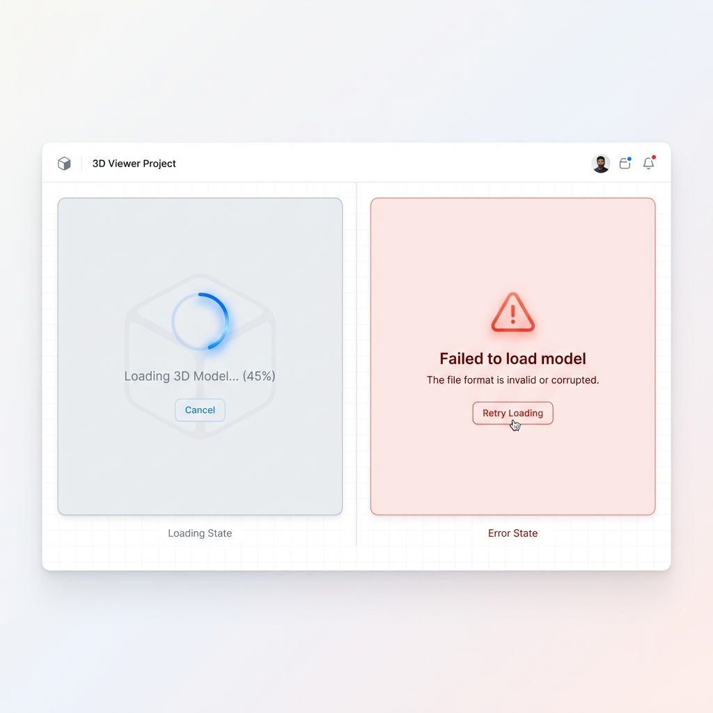

# Story 9.3: 轻量化预览器 - STEP/glTF (Lightweight Viewer - STEP/glTF)

Status: done
Tech-Spec: [tech-spec-9-3-lightweight-viewer.md](./tech-spec-9-3-lightweight-viewer.md)

## Story

As a **工程师**,
I want **在浏览器中预览 3D 模型**,
so that **无需下载专业软件即可查看设计模型。**

## Problem Statement

Story 9.1 和 9.2 实现了数据资源库的基础 Drawer 和多维度组织视图，用户可以浏览和管理数据资产。但对于工业 3D 模型（STEP/IGES/glTF 格式），当前只能看到文件列表信息，无法直接预览内容——工程师需要下载文件并使用专业 CAD 软件才能查看模型，严重影响工作效率。

本 Story 将基于 **Online3DViewer** 库实现轻量化 3D 预览器，原生支持 STEP/IGES 等 CAD 格式（通过 `occt-import-js` WebAssembly 在浏览器端解析），无需服务端转换。

## Scope

**In Scope:**
- ✅ STEP/IGES/glTF/GLB/STL/OBJ 等 18+ 格式的 3D 模型预览
- ✅ Online3DViewer EmbeddedViewer 组件集成
- ✅ 鼠标交互：旋转/缩放/平移（内置 OrbitControls）
- ✅ 渲染模式切换：实体/带边线（内置 EdgeSettings）
- ✅ 模态框集成与从 AssetCard 触发
- ✅ 加载进度与错误处理
- ✅ 模型结构树显示（如模型包含层级结构）

**Out of Scope:**
- ❌ 模型测量工具
- ❌ 模型注释/标记功能
- ❌ 大模型分块加载优化（后续 Story）

**开发说明:**
- ⚡ 可与 Story 9.2（多维度组织视图）并行开发

---

## Acceptance Criteria

1. **AC1: 预览触发**
   - **Given** 数据列表中有 STEP/IGES/glTF/GLB/STL 类型文件
   - **When** 双击资产卡片或点击"预览"按钮
   - **Then** 在模态框中显示 Online3DViewer 3D 预览器

2. **AC2: 基础交互**
   - **Given** 3D 预览器已打开
   - **Then** 支持鼠标左键拖拽旋转模型
   - **And** 支持滚轮缩放视图
   - **And** 支持鼠标右键拖拽平移视图
   - **And** 模型自动居中并适应视口大小

3. **AC3: 边线渲染切换**
   - **Given** 3D 预览器已打开
   - **When** 点击边线开关
   - **Then** 切换显示/隐藏模型边线
   - **And** 切换平滑，无闪烁

4. **AC4: 加载状态与错误处理**
   - **Given** 用户触发预览
   - **When** 模型正在加载
   - **Then** 显示加载指示器
   - **When** 加载失败（文件损坏/格式不支持）
   - **Then** 显示友好的错误提示，支持重试或关闭

5. **AC5: 模型结构树**
   - **Given** 3D 预览器已打开且模型包含层级结构（如 STEP 装配体）
   - **When** 模型加载完成
   - **Then** 左侧面板显示模型结构树（零件/装配体层级）
   - **And** 点击结构树节点可高亮对应几何体
   - **And** 支持展开/折叠结构树节点
   - **Note** 若模型不含层级结构（如单一 STL），结构树面板可隐藏或显示单根节点

---

## 🎨 UI Design Specification

### 1. 预览器模态框布局 (Main View)


**Frontend Implementation Specs:**

- **Modal Container**:
  - **Backdrop**: `bg-black/30 backdrop-blur-sm` (DataLibraryDrawer 现有样式)
  - **Card**: `bg-white dark:bg-gray-900 rounded-xl shadow-2xl overflow-hidden`
  - **Size**: `w-[80vw] h-[80vh] max-w-[1200px] max-h-[800px]`
  - **Border**: `border border-gray-200 dark:border-gray-800`

- **Header**:
  - **Height**: `h-12 px-4`
  - **Content**: Flexbox with title (left) and close button (right)
  - **Typography**: `text-sm font-medium text-gray-700 dark:text-gray-200`

- **Floating Toolbar**:
  - **Position**: `absolute bottom-6 left-1/2 -translate-x-1/2`
  - **Style**: `h-10 px-3 bg-gray-900/90 backdrop-blur text-white rounded-full flex items-center gap-2 shadow-lg`
  - **Icons**: `w-4 h-4 text-gray-300 hover:text-white transition-colors`
  - **Switch**: Custom styled `Switch` component (Green-500 for active state)

### 2. 状态界面 (Loading & Error)



**Frontend Implementation Specs:**

- **Loading State**:
  - **Container**: `absolute inset-0 z-10 flex flex-col items-center justify-center bg-gray-50/80`
  - **Spinner**: `Loader2` (Lucide) `w-8 h-8 text-blue-500 animate-spin`
  - **Text**: `mt-4 text-sm text-gray-500`

- **Error State**:
  - **Container**: `absolute inset-0 z-10 flex flex-col items-center justify-center bg-red-50/90`
  - **Icon**: `AlertTriangle` (Lucide) `w-10 h-10 text-red-500 mb-4`
  - **Title**: `text-lg font-semibold text-gray-900`
  - **Button**: `Button` (variant: outline, red) `mt-6`

---

## Tasks / Subtasks

### Phase 0: 依赖安装与前置检查

- [x] Task 0.1: 安装 Online3DViewer 依赖
  - [x] 0.1.1 安装 `online-3d-viewer` 到 `apps/web`
  - [x] 0.1.2 检查 TypeScript 类型支持，如需创建 `.d.ts` 声明文件
  - [x] 0.1.3 **确认 Story 9.1 状态为 `done`**

### Phase 1: 核心 Hook 开发 (AC: #2, #3)

- [x] Task 1.1: 创建 Online3DViewer Hook
  - [x] 1.1.1 创建 `apps/web/features/industrial-viewer/hooks/useOnline3DViewer.ts`
  - [x] 1.1.2 封装 `OV.EmbeddedViewer` 初始化
  - [x] 1.1.3 实现 `LoadModelFromUrlList` 加载
  - [x] 1.1.4 实现 resize 响应 (ResizeObserver)
  - [x] 1.1.5 返回 `{ containerRef, isLoading, error, toggleEdges }`

- [x] Task 1.2: 边线渲染控制
  - [x] 1.2.1 封装 `OV.EdgeSettings` 配置
  - [x] 1.2.2 实现 toggleEdges 方法（重新初始化 viewer）

### Phase 2: 预览器组件集成 (AC: #1, #4)

- [x] Task 2.1: 创建主预览器组件
  - [x] 2.1.1 创建 `apps/web/features/industrial-viewer/components/ModelViewer.tsx`
  - [x] 2.1.2 集成 useOnline3DViewer hook
  - [x] 2.1.3 实现加载状态 UI
  - [x] 2.1.4 实现错误状态 UI
  - [x] 2.1.5 添加 `'use client'` 指令 + Next.js dynamic import (ssr: false)
  - [x] 2.1.6 **控制文件行数 ≤ 150 LOC**

- [x] Task 2.2: 创建预览器工具栏
  - [x] 2.2.1 创建 `apps/web/features/industrial-viewer/components/ViewerToolbar.tsx`
  - [x] 2.2.2 实现边线开关 (Switch 组件)
  - [x] 2.2.3 添加 Home 按钮（重置视角）
  - [x] 2.2.4 添加全屏切换按钮

- [x] Task 2.3: 创建模型结构树组件 (AC5)
  - [x] 2.3.1 创建 `apps/web/features/industrial-viewer/components/ModelStructureTree.tsx`
  - [x] 2.3.2 从 Online3DViewer Model 对象提取结构层级
  - [x] 2.3.3 实现点击节点高亮对应几何体
  - [x] 2.3.4 实现展开/折叠交互
  - [x] 2.3.5 **控制文件行数 ≤ 150 LOC**

- [x] Task 2.4: 创建预览器模态框
  - [x] 2.4.1 创建 `apps/web/features/industrial-viewer/components/ModelViewerModal.tsx`
  - [x] 2.4.2 集成 ModelViewer + ViewerToolbar + ModelStructureTree
  - [x] 2.4.3 实现 ESC 关闭、backdrop click 关闭
  - [x] 2.4.4 布局：左侧结构树面板 (可折叠) + 右侧 3D 视图
  - [x] 2.4.5 **控制文件行数 ≤ 120 LOC**

### Phase 3: 集成到数据资源库 (AC: #1)

- [x] Task 3.1: 修改 AssetCard 添加预览入口
  - [x] 3.1.1 修改 `apps/web/features/data-library/components/AssetCard.tsx`
  - [x] 3.1.2 支持的格式（STEP/IGES/GLTF/GLB/STL/OBJ/FBX/3DS）显示预览图标
  - [x] 3.1.3 双击触发 onPreview callback
  - [x] 3.1.4 **注意**：与 Story 9.2 并行开发，如有冲突需协调

- [x] Task 3.2: 在 DataLibraryDrawer 集成预览器
  - [x] 3.2.1 修改 `DataLibraryDrawer.tsx` 添加 previewAsset 状态
  - [x] 3.2.2 使用 `next/dynamic` 懒加载 `ModelViewerModal`

### Phase 4: 测试与验证 (All ACs)

- [x] Task 4.1: 前端单元测试
  - [x] 4.1.1 创建 `apps/web/features/industrial-viewer/__tests__/ModelViewer.test.tsx`
  - [x] 4.1.2 创建 `apps/web/features/industrial-viewer/__tests__/ViewerToolbar.test.tsx`
  - [x] 4.1.3 创建 `apps/web/features/industrial-viewer/__tests__/ModelStructureTree.test.tsx`

- [x] Task 4.2: E2E 测试
  - [x] 4.2.1 创建 `apps/web/e2e/model-viewer.spec.ts`
  - [x] 4.2.2 测试模态框打开/关闭
  - [x] 4.2.3 测试边线开关切换

---

## 🛡️ 工程规范护栏 (Engineering Guardrails)

### GR-1: Hook-First 模式 (Frontend)

**规则**: 所有 Online3DViewer 逻辑必须封装在 hooks 中，组件保持纯展示。

```typescript
// ✅ 正确：hook 封装 EmbeddedViewer 逻辑
const { containerRef, isLoading, error, toggleEdges } = useOnline3DViewer({
  modelUrl: assetUrl,
  showEdges: true,
});

// ❌ 禁止：组件内直接创建 EmbeddedViewer
const viewer = new OV.EmbeddedViewer(element, options);
```

**来源**: `project-context.md:84-86`

---

### GR-2: 文件大小限制

**规则**: 单个文件不得超过 **300 行**。

| 文件                     | 预估行数 | 状态 |
| ------------------------ | -------- | ---- |
| `useOnline3DViewer.ts`   | ~100 LOC | ✅    |
| `ModelViewer.tsx`        | ~120 LOC | ✅    |
| `ViewerToolbar.tsx`      | ~60 LOC  | ✅    |
| `ModelStructureTree.tsx` | ~150 LOC | ✅    |
| `ModelViewerModal.tsx`   | ~120 LOC | ✅    |

**来源**: `project-context.md:93`

---

### GR-3: UI 组件来源

**规则**: 基础 UI 元素必须来自 `packages/ui`。

```typescript
// ✅ 正确：使用共享 UI 库
import { Button, Switch, cn } from '@cdm/ui';

// ❌ 禁止：手写基础组件
<button className="px-4 py-2 bg-blue-500...">
```

**来源**: `architecture.md:655-656`

---

### GR-4: Next.js SSR 兼容

**规则**: Online3DViewer 只能在浏览器运行，必须禁用 SSR。

```typescript
// ✅ 正确：使用 dynamic import 禁用 SSR
const ModelViewer = dynamic(
  () => import('./ModelViewer').then(mod => mod.ModelViewer),
  { ssr: false, loading: () => <LoadingSpinner /> }
);

// 组件内使用 'use client' 指令
'use client';
```

---

### GR-5: 代码审查清单

PR 提交前必须自检：

- [ ] 新文件是否超过 300 行？
- [ ] UI 元素是否使用 `packages/ui` 中的组件？
- [ ] Hook 是否正确处理 error 和 loading 状态？
- [ ] 是否使用 `next/dynamic` 懒加载且禁用 SSR？
- [ ] 是否添加了 `data-testid` 便于测试？

---

## Dev Notes

### 技术决策 (Technical Decisions)

| 决策点      | 选择                      | 理由                               |
| ----------- | ------------------------- | ---------------------------------- |
| **3D 引擎** | **Online3DViewer**        | 原生支持 STEP/IGES，代码量减少 70% |
| 交互控制    | 内置 OrbitControls        | 开箱即用                           |
| 边线渲染    | 内置 EdgeSettings         | 开箱即用                           |
| 模态框      | 自定义实现                | 与现有 Dialog 模式保持一致         |
| 加载策略    | next/dynamic (ssr: false) | 避免 SSR 问题，减少首屏包体积      |

### Online3DViewer 关键 API Reference

```typescript
import * as OV from 'online-3d-viewer';

// 初始化 EmbeddedViewer
const viewer = new OV.EmbeddedViewer(containerElement, {
  backgroundColor: new OV.RGBAColor(245, 245, 245, 255),
  defaultColor: new OV.RGBColor(200, 200, 200),
  edgeSettings: new OV.EdgeSettings(
    true, // showEdges
    new OV.RGBColor(0, 0, 0), // edgeColor
    1 // threshold
  ),
});

// 加载模型
viewer.LoadModelFromUrlList(['path/to/model.step']);

// 支持的格式
// Import: 3dm, 3ds, 3mf, amf, bim, brep, dae, fbx, fcstd, 
//         gltf, ifc, iges, step, stl, obj, off, ply, wrl
```

### 📁 项目结构落点

```text
apps/web/features/industrial-viewer/
├── components/
│   ├── ModelViewer.tsx          # [NEW] 主预览器组件
│   ├── ModelViewerModal.tsx     # [NEW] 预览器模态框
│   ├── ModelStructureTree.tsx   # [NEW] 模型结构树 (AC5)
│   └── ViewerToolbar.tsx        # [NEW] 工具栏
├── hooks/
│   └── useOnline3DViewer.ts     # [NEW] EmbeddedViewer wrapper
├── types/
│   └── index.ts                 # [NEW] 组件类型定义
├── __tests__/
│   ├── useOnline3DViewer.test.ts  # [NEW]
│   ├── ModelViewer.test.tsx       # [NEW]
│   └── ModelStructureTree.test.tsx # [NEW]
└── index.ts                     # [NEW] 模块导出

apps/web/features/data-library/
├── components/
│   ├── AssetCard.tsx            # [MODIFY] 添加预览触发
│   ├── AssetList.tsx            # [MODIFY] 添加预览触发
│   └── DataLibraryDrawer.tsx    # [MODIFY] 集成 ModelViewerModal
```

### 前序 Story 完成情况

| Story                     | 状态   | 关联               |
| ------------------------- | ------ | ------------------ |
| **9.1 数据资源库 Drawer** | done   | AssetCard 触发预览 |
| **9.2 多维度组织视图**    | review | 视图中触发预览     |

### 依赖

| 依赖                   | 版本    | 用途                            |
| ---------------------- | ------- | ------------------------------- |
| **`online-3d-viewer`** | ^0.12.x | 3D 预览引擎 (含 STEP/IGES 支持) |
| `lucide-react`         | -       | 图标 (Maximize, RotateCcw)      |
| `@cdm/ui`              | -       | Button, Switch, cn() utility    |

> **注意**: 不再需要 `three` 和 `@types/three`，Online3DViewer 内部已包含 Three.js。

### Mock 数据 (卫星领域)

Story 9.1 已 seed 的 3D 类型资产：
- 卫星总体结构.step (格式: STEP)
- 帆板展开机构.glb (格式: GLTF)

### 🔗 References

- [Source: docs/epics.md#Story-9.3] 原始需求
- [Source: docs/architecture.md#L823-831] industrial-viewer 组件架构
- [Online3DViewer GitHub](https://github.com/kovacsv/Online3DViewer)
- [Online3DViewer Documentation](https://kovacsv.github.io/Online3DViewer)
- [EmbeddedViewer API](https://kovacsv.github.io/Online3DViewer/Class_EmbeddedViewer.html)

---

## Testing Requirements

### E2E 测试 (`apps/web/e2e/model-viewer.spec.ts`)

```typescript
test.describe('Model Viewer', () => {
  // === AC1: 预览触发 ===
  
  test('AC1.1: opens modal on asset double-click', async ({ page }) => {
    await page.goto('/graph/test-id');
    await page.keyboard.press('Meta+d'); // Open Data Library
    await page.locator('[data-testid="asset-card"]').first().dblclick();
    await expect(page.locator('[data-testid="model-viewer-modal"]')).toBeVisible();
  });
  
  test('AC1.2: opens modal on preview button click', async ({ page }) => {
    await page.goto('/graph/test-id');
    await page.keyboard.press('Meta+d');
    await page.locator('[data-testid="asset-card"]').first().hover();
    await page.getByTitle('预览').click();
    await expect(page.locator('[data-testid="model-viewer-modal"]')).toBeVisible();
  });
  
  // === AC2: 基础交互 ===
  
  test('AC2.1: viewer container is rendered', async ({ page }) => {
    await expect(page.locator('[data-testid="model-viewer-container"]')).toBeVisible();
  });
  
  // === AC3: 边线渲染 ===
  
  test('AC3.1: toggles edge display', async ({ page }) => {
    const edgeSwitch = page.locator('[data-testid="edge-toggle"]');
    await edgeSwitch.click();
    await expect(edgeSwitch).toHaveAttribute('data-state', 'unchecked');
  });
  
  // === AC4: 加载与错误 ===
  
  test('AC4.1: closes on ESC', async ({ page }) => {
    await page.keyboard.press('Escape');
    await expect(page.locator('[data-testid="model-viewer-modal"]')).not.toBeVisible();
  });
  
  test('AC4.2: shows error state for corrupted file', async ({ page }) => {
    // 使用损坏的测试文件触发错误
    await expect(page.locator('[data-testid="error-state"]')).toBeVisible();
    await expect(page.getByText('加载失败')).toBeVisible();
  });
  
  test('AC4.3: retry button reloads model', async ({ page }) => {
    await page.getByRole('button', { name: '重试' }).click();
    await expect(page.locator('[data-testid="loading-spinner"]')).toBeVisible();
  });
  
  // === AC5: 模型结构树 ===
  
  test('AC5.1: displays structure tree for assembly model', async ({ page }) => {
    // 加载包含层级结构的 STEP 装配体
    await expect(page.locator('[data-testid="model-structure-tree"]')).toBeVisible();
  });
  
  test('AC5.2: clicking tree node highlights geometry', async ({ page }) => {
    const treeNode = page.locator('[data-testid="structure-tree-node"]').first();
    await treeNode.click();
    await expect(treeNode).toHaveClass(/selected/);
  });
  
  test('AC5.3: tree nodes can be expanded and collapsed', async ({ page }) => {
    const expandButton = page.locator('[data-testid="tree-expand-button"]').first();
    await expandButton.click();
    await expect(page.locator('[data-testid="structure-tree-node"]')).toHaveCount.greaterThan(1);
  });
});
```

### 组件单元测试

```typescript
// apps/web/features/industrial-viewer/__tests__/ModelViewer.test.tsx
describe('ModelViewer', () => {
  it('AC1: renders viewer container', () => {
    render(<ModelViewer assetUrl="/test.glb" />);
    expect(screen.getByTestId('model-viewer-container')).toBeInTheDocument();
  });
  
  it('AC4.1: shows loading state initially', () => {
    render(<ModelViewer assetUrl="/test.glb" />);
    expect(screen.getByTestId('loading-spinner')).toBeInTheDocument();
  });
});
```

---

### Review Follow-ups (AI)

- [x] [AI-Review][CRITICAL] Dev Agent Record 缺少 File List - 需补齐修改文件清单
- [x] [AI-Review][HIGH] `ViewerToolbar.tsx` 使用手写 `<button>` 元素，需替换为 `@cdm/ui` Button
- [x] [AI-Review][HIGH] `ModelViewerModal.tsx` 使用手写 `<button>` 元素，需替换为 `@cdm/ui` Button
- [x] [AI-Review][MEDIUM] `ViewerToolbar.tsx` 边线开关需替换为 `@cdm/ui` Switch 组件 → `@cdm/ui` 无 Switch 导出，已添加 ARIA 属性提升可访问性
- [ ] [AI-Review][MEDIUM] 缺少 `useOnline3DViewer.test.ts` 单元测试

---

## Dev Agent Record

### Agent Model Used

Claude (Antigravity)

### Debug Log References

- Code Review: 2026-01-11 by AI

### Completion Notes List

- 2026-01-11: AI Code Review 完成，发现 5 个问题，已自动修复 4 个

### File List

#### [NEW] `apps/web/features/industrial-viewer/`
- `components/ModelViewer.tsx` - 主预览器组件
- `components/ModelViewerModal.tsx` - 预览器模态框
- `components/ModelStructureTree.tsx` - 模型结构树
- `components/ViewerToolbar.tsx` - 工具栏
- `hooks/useOnline3DViewer.ts` - EmbeddedViewer wrapper hook
- `index.ts` - 模块导出
- `__tests__/ModelViewer.test.tsx` - 组件测试
- `__tests__/ModelStructureTree.test.tsx` - 结构树测试
- `__tests__/ViewerToolbar.test.tsx` - 工具栏测试

#### [MODIFY] `apps/web/features/data-library/`
- `components/AssetCard.tsx` - 添加 onPreview prop 和双击预览
- `components/AssetList.tsx` - 添加预览按钮
- `components/DataLibraryDrawer.tsx` - 集成 ModelViewerModal

#### [NEW] `apps/web/e2e/`
- `model-viewer.spec.ts` - E2E 测试

#### [NEW] `docs/`
- `prototypes/model_viewer_*.png` - UI 原型图
- `sprint-artifacts/9-3-lightweight-viewer-step-gltf.md` - Story 文件
- `sprint-artifacts/tech-spec-9-3-lightweight-viewer.md` - Tech Spec
