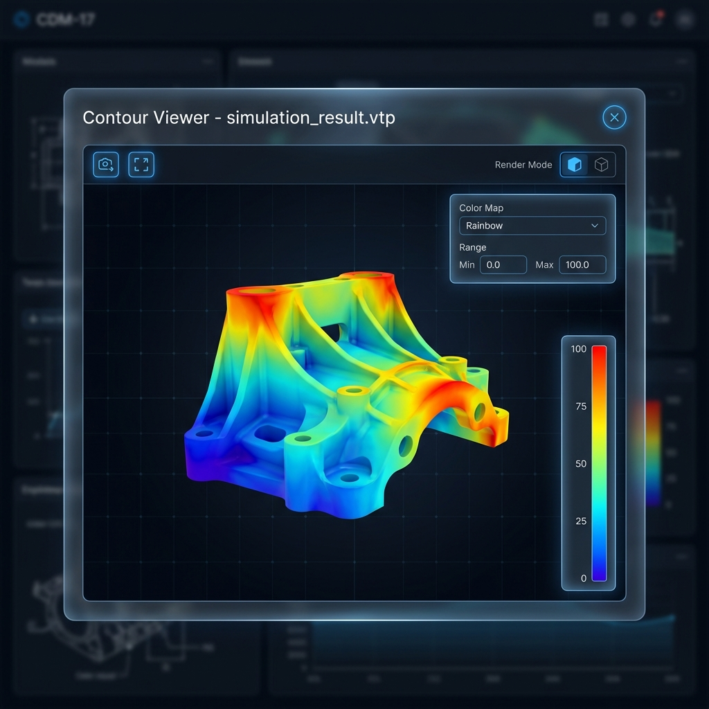

# Story 9.4: 轻量化预览器 - 网格与云图 (Lightweight Viewer - Mesh & Contour)

Status: in-progress
Tech-Spec: [tech-spec-9-4-lightweight-viewer-mesh-contour.md](./tech-spec-9-4-lightweight-viewer-mesh-contour.md)

## Story

As a **仿真工程师**,
I want **预览网格模型和仿真云图结果**,
so that **快速检查仿真数据无需启动重型软件。**

## Problem Statement

Story 9.3 已实现基于 Online3DViewer 的 STEP/glTF 等 CAD 格式预览器。但仿真工程师经常需要查看网格模型（STL/OBJ）和仿真云图结果（VTK/标量场 JSON），当前系统无法展示带颜色映射的标量场数据——这些是仿真验证阶段的核心资产。

本 Story 将扩展现有 industrial-viewer 模块，增强 Online3DViewer 对网格的渲染模式支持，并新增基于 VTK.js 的云图预览器组件。

---

## Scope

**In Scope:**
- ✅ 网格文件预览（STL/OBJ）+ 线框/实体渲染模式切换
- ✅ 云图文件预览 - 多格式支持:
  - `.vtp` (XML PolyData)
  - `.vtk` (Legacy VTK)
  - `.vtu` (XML Unstructured)
  - `.vti` (XML ImageData)
  - JSON 标量场 (自定义格式)
- ✅ 色标切换（Rainbow, Jet, Coolwarm）
- ✅ 色标范围调整
- ✅ 复用 Story 9.3 的 ModelViewerModal 框架
- ✅ **前置重构**: 拆分超限文件 + 添加 Select 组件

**Out of Scope:**
- ❌ 大型网格分块加载（后续优化）
- ❌ 时序云图动画播放
- ❌ 云图切片/剖面功能

**开发说明:**
- ⚠️ 依赖 Story 9.3 完成的 `industrial-viewer` 模块
- ✅ 可复用 `ModelViewerModal` UI 框架和 `useOnline3DViewer` hook 模式

---

## Acceptance Criteria

1. **AC1: 网格预览**
   - **Given** 数据列表中有网格文件（STL/OBJ）
   - **When** 双击预览
   - **Then** 在模态框中显示 3D 网格预览
   - **And** 模型自动居中并适应视口

2. **AC2: 网格渲染模式**
   - **Given** 网格预览器已打开
   - **When** 点击渲染模式切换按钮
   - **Then** 可在线框/实体模式之间切换
   - **And** 切换平滑无闪烁

3. **AC3: 云图预览**
   - **Given** 数据列表中有云图文件（.vtk/.vtu/.vti/.vtp 或 JSON 标量场）
   - **When** 双击预览
   - **Then** 在模态框中显示带颜色映射的云图

4. **AC4: 色标切换**
   - **Given** 云图预览器已打开
   - **Then** 工具栏显示色标选择器
   - **When** 选择不同色标（Rainbow/Jet/Coolwarm）
   - **Then** 云图颜色映射立即更新

5. **AC5: 色标范围调整**
   - **Given** 云图预览器已打开
   - **Then** 显示色标范围输入（Min/Max）
   - **When** 修改范围值
   - **Then** 颜色映射基于新范围重新计算

---

## 🚧 必遵守实现约束 (Must Follow)

> 若 Tech-Spec 与本节冲突，以本 Story 为准。

### 版本/依赖前提（以当前仓库为准）

- `apps/web/package.json` 当前使用 `online-3d-viewer: ^0.18.0`（不要按 `^0.12.x` 假设）
- Next.js `16.0.7`，React `19.1.0`
- 云图渲染依赖统一使用 `@kitware/vtk.js`（安装与 import 风格保持一致）

### AC2 线框/实体定义（重要）

- **不要**使用 `OV.ShadingType.Lines`（当前 Online3DViewer `ShadingType` 仅 `Phong/Physical`）
- `renderMode: 'wireframe' | 'solid'` 定义为：遍历 Three.js mesh，将其材质 `material.wireframe = true/false`
- 现有“边线开关”(`edgesEnabled`) 保持语义不变；线框模式可选择自动关闭边线避免“双重线框”

### AC3 云图资产识别策略（本 Story 不改 DB）

- 本 Story **不扩展** Prisma `DataAssetFormat` 枚举（当前不包含 VTK/VTP/VTU/VTI）
- 云图预览入口根据 `asset.storagePath` 或 `asset.name` 的扩展名判定：
  - `*.vtk` `*.vtu` `*.vti` `*.vtp` → 走 `ContourViewerModal`
  - JSON 标量场：可用“命名约定 +/或 tags”做入口判定，并在加载后校验 `format === 'scalar-field-json'`
    - 推荐命名：`*.scalar.json`（或 `*.contour.json`）
    - 推荐 tags：包含 `CONTOUR`
- 必须同时覆盖 Grid + List：`AssetCard.tsx` 与 `AssetList.tsx` 共享同一判断逻辑（提取为 util，避免重复）

### 测试惯例（沿用现有 E2E harness）

- 扩展 `apps/web/e2e/model-viewer.spec.ts`，复用 `createTestGraph` / `makeTestGraphUrl`
- 打开 Drawer 方式沿用现有用例：`page.getByTitle('数据资源库').click()`

---

## 🎨 UI Design Specification
 

 
### 1. Visual Style (CDM Professional)
 
The viewer follows the "CDM Professional" aesthetic, characterized by:
-   **Dark Mode**: Deep blue/gray backgrounds (`bg-gray-900/95`) to focus attention on the colorful simulation results.
-   **Glassmorphism**: Semi-transparent, blurred panels for controls and overlays (`backdrop-blur-md`, `bg-black/40`).
-   **Precise Lines**: Thin, 1px borders (`border-gray-700`) with subtle glows (`ring-blue-500/20`) to convey precision engineering.
-   **Typography**: Clean sans-serif font (Inter/Roboto), high contrast white text for legibility.
 
### 2. Mesh Viewer UI
 
**Extensions to ModelViewerModal:**
-   **Render Mode Toggle**: Located in the top toolbar (right side).
    -   **Toggle Group**: Two exclusive options with icons.
    -   [Icon: Box] **Solid**: Standard Phong shading (default).
    -   [Icon: Grid3X3] **Wireframe**: Shows mesh topology lines.
    -   **Interaction**: Instant switching without reloading the model.
 
### 3. Contour Viewer UI
 
**Layout & Components:**
 
1.  **Main Viewport**:
    -   Full-screen 3D canvas.
    -   Background: Dark, subtle grid lines for spatial reference.
    -   Interaction: Orbit (Left Drag), Pan (Right Drag), Zoom (Scroll).
 
2.  **Color Bar (Legend)**:
    -   **Position**: Fixed overlay on the right side of the viewport (`absolute right-6 top-1/2 -translate-y-1/2`).
    -   **Appearance**: Vertical gradient bar corresponding to the current color map (Blue->Red).
    -   **Labels**: Dynamic numeric labels (Min, Q1, Median, Q3, Max) placed to the left of the bar.
    -   **Style**: Thin, sleek design, not obstructing the model view.
 
3.  **Control Panel**:
    -   **Position**: Floating glass panel in the top-right corner (`absolute top-4 right-4`).
    -   **Components**:
        -   **Color Map Selector**: Dropdown to choose palette (Rainbow, Jet, Coolwarm).
        -   **Range Controls**: Two minimalist input fields (Min/Max) to manually clamp the color scale.
    -   **Feedback**: Changing values instantly updates the 3D model colors and the Color Bar gradient.

---

## Tasks / Subtasks

### Phase 0: 前置重构与依赖安装 ⚠️

> **关键前置**: 以下重构任务必须在添加新功能前完成，以遵守 300 行限制规范。

- [x] Task 0.1: 拆分 `useOnline3DViewer.ts` (当前 381 行 → 目标 <300 行) (AC: GR-2)
  - [x] 0.1.1 拆分为 `useOnline3DViewer.ts` (核心) + `useViewerEnhancement.ts` (PBR 增强)
  - [x] 0.1.2 提取 PBR 环境光逻辑到独立 hook

- [x] Task 0.2: 拆分 `DataLibraryDrawer.tsx` (当前 319 行 → 目标 <300 行) (AC: GR-2)
  - [x] 0.2.1 提取预览状态管理到独立 hook 或子组件
  - [x] 0.2.2 为 ContourViewerModal 集成预留空间

- [x] Task 0.3: 在 `@cdm/ui` 添加 Select 组件 (AC: GR-3)
  - [x] 0.3.1 创建 `packages/ui/src/select.tsx`
  - [x] 0.3.2 实现变体: default, outline
  - [x] 0.3.3 导出并更新 index.ts

- [x] Task 0.4: 安装 VTK.js 依赖
  - [x] 0.4.1 安装 `@kitware/vtk.js` 到 `apps/web`
  - [x] 0.4.2 确认 import 风格统一为 `@kitware/vtk.js/...`
  - [x] 0.4.3 确认 Next.js SSR 兼容性 (需要 `dynamic` import)

- [x] Task 0.5: 确认前序 Story 状态
  - [x] 0.5.1 **确认 Story 9.3 状态为 `done` 或 `review`** (industrial-viewer 模块可用)

### Phase 1: 网格渲染增强 (AC: #1, #2)

- [x] Task 1.1: 扩展 useOnline3DViewer Hook
  - [x] 1.1.1 在 hook result 中新增 `renderMode: 'solid' | 'wireframe'`
  - [x] 1.1.2 实现 `setRenderMode(mode)` / `toggleRenderMode()`（切换不闪烁）
  - [x] 1.1.3 线框实现：遍历 innerViewer 的 Three.js mesh，将 `material.wireframe = true/false`（不要依赖不存在的 `OV.ShadingType.Lines`）

- [x] Task 1.2: 更新 ViewerToolbar
  - [x] 1.2.1 在 `ViewerToolbar.tsx` 添加渲染模式切换按钮
  - [x] 1.2.2 使用 `@cdm/ui` Button 组件
  - [x] 1.2.3 添加 Lucide 图标 (`Grid3X3`, `Box`)
  - [x] 1.2.4 添加 `data-testid="render-mode-toggle"` + `data-mode="solid|wireframe"`

### Phase 2: 云图预览器开发 (AC: #3, #4, #5)

- [ ] Task 2.1: 创建云图 Viewer Hook
  - [x] 2.1.1 创建 `apps/web/features/industrial-viewer/hooks/useContourViewer.ts`
  - [x] 2.1.2 封装 VTK.js 渲染管线初始化
  - [x] 2.1.3 实现 VTK 多格式加载（`.vtp/.vtk/.vtu/.vti`）⚠️ `.vtu` 抛出显式不支持错误 (vtk.js 34.3.1 限制)
  - [x] 2.1.4 实现 JSON 标量场解析 + 校验（`format === 'scalar-field-json'`）
  - [x] 2.1.5 返回 `{ containerRef, isLoading, error, colorMap, range, setColorMap, setRange }`
  - [x] 2.1.6 **控制文件行数 ≤ 150 LOC**
  - [x] 2.1.7 必须实现 cleanup：组件卸载时释放 VTK renderWindow/actor/mapper 等（避免 WebGL context 泄漏）

- [x] Task 2.2: 创建云图组件
  - [x] 2.2.1 创建 `apps/web/features/industrial-viewer/components/ContourViewer.tsx`
  - [x] 2.2.2 集成 useContourViewer hook
  - [x] 2.2.3 添加 `'use client'` 指令 + Next.js dynamic import (ssr: false)
  - [x] 2.2.4 **控制文件行数 ≤ 120 LOC**

- [x] Task 2.3: 创建色标控制组件
  - [x] 2.3.1 创建 `apps/web/features/industrial-viewer/components/ColorScaleControl.tsx`
  - [x] 2.3.2 实现色标选择 Dropdown (Rainbow/Jet/Coolwarm)
  - [x] 2.3.3 实现 Min/Max 范围输入
  - [x] 2.3.4 使用 `@cdm/ui` 组件
  - [x] 2.3.5 **控制文件行数 ≤ 100 LOC**

- [x] Task 2.4: 创建色标条组件
  - [x] 2.4.1 创建 `apps/web/features/industrial-viewer/components/ColorBar.tsx`
  - [x] 2.4.2 实现渐变色条渲染 (CSS gradient / Canvas)
  - [x] 2.4.3 显示 Min/Max 标签

- [x] Task 2.5: 创建云图预览模态框
  - [x] 2.5.1 创建 `apps/web/features/industrial-viewer/components/ContourViewerModal.tsx`
  - [x] 2.5.2 集成 ContourViewer + ColorScaleControl + ColorBar
  - [x] 2.5.3 复用 ModelViewerModal 的样式和交互模式
  - [x] 2.5.4 **控制文件行数 ≤ 120 LOC**

### Phase 3: 集成到数据资源库 (AC: #1, #3)

- [x] Task 3.1: 扩展 AssetCard/AssetList 预览逻辑（Grid + List 一致）
  - [x] 3.1.1 提取 `getAssetPreviewType(asset)` util（避免 `AssetCard.tsx`/`AssetList.tsx` 重复判断）
  - [x] 3.1.2 修改 `AssetCard.tsx` 支持：
    - 网格：`STL/OBJ` → 走 `ModelViewerModal`
    - 云图：`*.vtk/*.vtu/*.vti/*.vtp` → 走 `ContourViewerModal`
    - JSON 标量场：`format=JSON` 且（文件名匹配 `*.scalar.json|*.contour.json` 或 tags 包含 `CONTOUR`）→ 走 `ContourViewerModal`（加载后再校验 header）
  - [x] 3.1.3 同步修改 `AssetList.tsx`（行为与 UI 入口一致）

- [x] Task 3.2: 更新 DataLibraryDrawer
  - [x] 3.2.1 使用 `next/dynamic` 懒加载 `ContourViewerModal`
  - [x] 3.2.2 添加 previewType 状态区分网格和云图
  - [x] 3.2.3 保持 Story 9.3 的预览路径不回归：STEP/IGES/GLTF/... 仍打开 `ModelViewerModal`

### Phase 4: 测试与验证 (All ACs)

- [x] Task 4.1: 创建测试数据文件
  - [x] 4.1.1 将示例文件放入 `apps/web/public/mock/storage/`
  - [x] 4.1.2 准备 `帆板网格模型.stl` (ASCII STL, <100KB)
  - [x] 4.1.3 准备 `SolarPanel.obj` (OBJ格式, <100KB)
  - [x] 4.1.4 准备 `热控系统温度场.vtp` (VTK PolyData, <200KB)
  - [x] 4.1.5 准备 `结构应力分析.scalar.json` (JSON标量场, `format: "scalar-field-json"`)

- [x] Task 4.2: 单元测试
  - [x] 4.2.1 创建 `ContourViewer.test.tsx` (5个用例: loading/error/container/controls/cleanup)
  - [x] 4.2.2 创建 `ColorScaleControl.test.tsx` (7个用例: select/callback/inputs/range/disabled/validation)
  - [x] 4.2.3 创建 `ColorBar.test.tsx` (4个用例: gradient/labels/colorMap变化/range处理)
  - [x] 4.2.4 创建 `useContourViewer.test.ts` (8个用例: init/VTP/VTK/JSON/error/setColorMap/setRange/cleanup)
  - [x] 4.2.5 扩展 `ViewerToolbar.test.tsx` (5个用例: renderMode相关)
  - [x] 4.2.6 创建 `getAssetPreviewType.test.ts` (15个用例: STL/OBJ/VTP/VTK/VTU/VTI/JSON/tags/STEP/glTF/unsupported)

- [x] Task 4.3: E2E 测试 (扩展 `model-viewer.spec.ts`)
  - [x] 4.3.1 AC1: Grid视图双击STL打开网格预览
  - [x] 4.3.2 AC1: List视图双击STL打开网格预览
  - [x] 4.3.3 AC1: 支持OBJ格式网格预览
  - [x] 4.3.4 AC2: 切换渲染模式 solid→wireframe
  - [x] 4.3.5 AC2: 切换渲染模式 wireframe→solid
  - [x] 4.3.6 AC3: Grid视图双击VTP打开云图预览
  - [x] 4.3.7 AC3: 支持JSON标量场云图预览
  - [x] 4.3.8 AC4: 色标选择器显示3个选项
  - [x] 4.3.9 AC4: 切换色标 Rainbow→Jet
  - [x] 4.3.10 AC5: 范围输入显示初始Min/Max
  - [x] 4.3.11 AC5: 修改范围值触发更新
  - [x] 4.3.12 模态框关闭 (ESC键)

- [x] Task 4.4: 技术验证
  - [x] 4.4.1 验证 WebGL context 清理 (unmount 无泄漏) → 在 `useContourViewer.test.ts` 中验证
  - [x] 4.4.2 验证 Grid/List 视图预览行为一致性 → 通过共享 `getAssetPreviewType` 逻辑保证

---

## 🛡️ 工程规范护栏 (Engineering Guardrails)

### GR-1: Hook-First 模式 (Frontend)

**规则**: 所有 VTK.js 逻辑必须封装在 hooks 中。

```typescript
// ✅ 正确：hook 封装 VTK 渲染管线
const { containerRef, isLoading, setColorMap, setRange } = useContourViewer({
  dataUrl: assetUrl,
  colorMap: 'jet',
});

// ❌ 禁止：组件内直接操作 VTK renderWindow
const mapper = vtkMapper.newInstance();
```

**来源**: `project-context.md:84-86`

---

### GR-2: 文件大小限制

**规则**: 单个文件不得超过 **300 行**。

| 文件                     | 预估行数 | 状态 |
| ------------------------ | -------- | ---- |
| `useContourViewer.ts`    | ~150 LOC | ✅    |
| `ContourViewer.tsx`      | ~120 LOC | ✅    |
| `ColorScaleControl.tsx`  | ~100 LOC | ✅    |
| `ColorBar.tsx`           | ~60 LOC  | ✅    |
| `ContourViewerModal.tsx` | ~120 LOC | ✅    |

**来源**: `project-context.md:93`

---

### GR-3: UI 组件来源

**规则**: 基础 UI 元素必须来自 `packages/ui`。

```typescript
// ✅ 正确：使用共享 UI 库
import { Button, Input, cn } from '@cdm/ui';

// ❌ 禁止：手写基础组件
<button className="px-4 py-2 bg-blue-500...">
```

**来源**: `architecture.md:655-656`

---

### GR-4: Next.js SSR 兼容

**规则**: VTK.js 只能在浏览器运行，必须禁用 SSR。

```typescript
// ✅ 正确：使用 dynamic import 禁用 SSR
const ContourViewer = dynamic(
  () => import('./ContourViewer').then(mod => mod.ContourViewer),
  { ssr: false, loading: () => <LoadingSpinner /> }
);

// 组件内使用 'use client' 指令
'use client';
```

---

### GR-5: 代码审查清单

PR 提交前必须自检：

- [ ] 新文件是否超过 300 行？
- [ ] UI 元素是否使用 `packages/ui` 中的组件？
- [ ] Hook 是否正确处理 error 和 loading 状态？
- [ ] 是否使用 `next/dynamic` 懒加载且禁用 SSR？
- [ ] `renderMode` 是否按定义实现（`material.wireframe`），且未使用不存在的 `OV.ShadingType.Lines`？
- [ ] Grid + List 预览入口是否一致（`AssetCard.tsx` + `AssetList.tsx`）？
- [ ] VTK 资源是否在 unmount 时释放（避免 WebGL context 泄漏）？
- [ ] 色标渲染是否支持三种预设色标？
- [ ] 是否添加了 `data-testid` 便于测试？

---

## Dev Notes

### 技术决策 (Technical Decisions)

| 决策点       | 选择                      | 理由                                  |
| ------------ | ------------------------- | ------------------------------------- |
| **网格引擎** | Online3DViewer            | 复用 Story 9.3 已集成的引擎           |
| **云图引擎** | VTK.js                    | 专业仿真数据可视化，支持标量场着色    |
| 色标实现     | VTK ColorTransferFunction | 标准科学可视化色标                    |
| 文件格式     | VTK + JSON                | VTK 原生格式 + 简化 JSON 格式便于调试 |

### VTK.js 关键 API Reference

```typescript
import vtkFullScreenRenderWindow from '@kitware/vtk.js/Rendering/Misc/FullScreenRenderWindow';
import vtkXMLPolyDataReader from '@kitware/vtk.js/IO/XML/XMLPolyDataReader';
import vtkColorTransferFunction from '@kitware/vtk.js/Rendering/Core/ColorTransferFunction';
import vtkMapper from '@kitware/vtk.js/Rendering/Core/Mapper';
import vtkActor from '@kitware/vtk.js/Rendering/Core/Actor';

// 初始化渲染窗口
const fullScreenRenderer = vtkFullScreenRenderWindow.newInstance({
  container: containerElement,
});

// 加载 VTP 数据
const reader = vtkXMLPolyDataReader.newInstance();
reader.setUrl(dataUrl);

// 设置色标
const lut = vtkColorTransferFunction.newInstance();
lut.setColorSpaceToRGB();
// Rainbow 色标
lut.addRGBPoint(0.0, 0.0, 0.0, 1.0);  // Blue
lut.addRGBPoint(0.25, 0.0, 1.0, 1.0); // Cyan
lut.addRGBPoint(0.5, 0.0, 1.0, 0.0);  // Green
lut.addRGBPoint(0.75, 1.0, 1.0, 0.0); // Yellow
lut.addRGBPoint(1.0, 1.0, 0.0, 0.0);  // Red

// 映射器配置
const mapper = vtkMapper.newInstance();
mapper.setInputConnection(reader.getOutputPort());
mapper.setLookupTable(lut);
mapper.setScalarRange(minValue, maxValue);
```

### JSON 标量场格式设计 (简化格式)

```json
{
  "format": "scalar-field-json",
  "version": "1.0",
  "geometry": {
    "points": [[x, y, z], ...],
    "cells": [[n, i0, i1, i2, ...], ...]
  },
  "scalars": {
    "name": "Temperature",
    "unit": "°C",
    "values": [v0, v1, v2, ...]
  }
}
```

### 📁 项目结构落点

```text
apps/web/features/industrial-viewer/
├── components/
│   ├── ModelViewer.tsx            # [EXISTING] Story 9.3
│   ├── ModelViewerModal.tsx       # [EXISTING] Story 9.3
│   ├── ModelStructureTree.tsx     # [EXISTING] Story 9.3
│   ├── ViewerToolbar.tsx          # [MODIFY] 添加渲染模式切换
│   ├── ContourViewer.tsx          # [NEW] 云图预览核心组件
│   ├── ContourViewerModal.tsx     # [NEW] 云图预览模态框
│   ├── ColorScaleControl.tsx      # [NEW] 色标控制组件
│   └── ColorBar.tsx               # [NEW] 色标条组件
├── hooks/
│   ├── useOnline3DViewer.ts       # [MODIFY] 添加渲染模式支持
│   └── useContourViewer.ts        # [NEW] VTK.js wrapper
├── constants/
│   └── colorMaps.ts               # [NEW] 预设色标定义
├── types/
│   └── index.ts                   # [MODIFY] 添加云图相关类型
├── __tests__/
│   ├── ContourViewer.test.tsx     # [NEW]
│   └── ColorScaleControl.test.tsx # [NEW]
└── index.ts                       # [MODIFY] 导出新组件

apps/web/features/data-library/
├── components/
│   ├── AssetCard.tsx              # [MODIFY] 识别预览类型
│   ├── AssetList.tsx              # [MODIFY] 预览入口与 Grid 一致
│   └── DataLibraryDrawer.tsx      # [MODIFY] 根据 previewType 选择 modal
```

### 前序 Story 完成情况

| Story                     | 状态   | 关联                             |
| ------------------------- | ------ | -------------------------------- |
| **9.1 数据资源库 Drawer** | done   | 资产列表触发预览                 |
| **9.2 多维度组织视图**    | review | 组织视图中触发预览               |
| **9.3 STEP/glTF 预览器**  | review | 复用 ModelViewerModal, hook 模式 |

### 依赖

| 依赖               | 版本    | 用途                                |
| ------------------ | ------- | ----------------------------------- |
| `online-3d-viewer` | ^0.18.0 | 网格预览 (复用 Story 9.3)           |
| `@kitware/vtk.js`  | ^34.x   | 云图预览引擎                        |
| `lucide-react`     | -       | 图标 (Grid3X3, Box)                 |
| `@cdm/ui`          | -       | Button, Input, Select, cn() utility |

### Mock 数据 (卫星领域)

基于 Story 9.1 已 seed 的资产，新增：
- **帆板网格模型.stl**（DB format: `STL`；storagePath: `/mock/storage/帆板网格模型.stl`）
- **热控系统温度场.vtp**（DB format: `OTHER`；tags: `CONTOUR`；storagePath: `/mock/storage/热控系统温度场.vtp`）
- **结构应力分析.scalar.json**（DB format: `JSON`；tags: `CONTOUR`；storagePath: `/mock/storage/结构应力分析.scalar.json`）

### 🔗 References

- [Source: docs/epics.md#Story-9.4] 原始需求
- [Source: docs/architecture.md#L823-833] industrial-viewer 组件架构
- [Source: docs/sprint-artifacts/9-3-lightweight-viewer-step-gltf.md] 前序 Story 实现
- [VTK.js Documentation](https://kitware.github.io/vtk-js/)
- [VTK.js Examples](https://kitware.github.io/vtk-js/examples/)

---

## Testing Requirements

### 验收标准覆盖矩阵

| AC  | 验收标准            | E2E测试 | 单元测试 | 验证方式                    |
| --- | ------------------- | ------- | -------- | --------------------------- |
| AC1 | 网格预览 (STL/OBJ)  | ✅       | ✅        | Modal打开 + 容器渲染        |
| AC2 | 渲染模式切换        | ✅       | ✅        | `data-mode` 属性变化        |
| AC3 | 云图预览 (VTK/JSON) | ✅       | ✅        | `contour-viewer-modal` 可见 |
| AC4 | 色标切换            | ✅       | ✅        | 回调触发 + 属性更新         |
| AC5 | 范围调整            | ✅       | ✅        | 输入值变化 + 回调触发       |

---

### E2E 测试 (`apps/web/e2e/model-viewer.spec.ts` 扩展)

#### 测试数据 Seed

复用 Story 9.3 测试模式：`createTestGraph` + API seed + `makeTestGraphUrl(graphId)`

```typescript
// 网格资产
{ name: '帆板网格模型.stl', format: 'STL', storagePath: '/mock/storage/帆板网格模型.stl' }
{ name: 'SolarPanel.obj', format: 'OBJ', storagePath: '/mock/storage/SolarPanel.obj' }

// 云图资产 - 多格式覆盖
{ name: '热控系统温度场.vtp', format: 'OTHER', storagePath: '/mock/storage/热控系统温度场.vtp', tags: ['CONTOUR'] }
{ name: '结构应力分析.scalar.json', format: 'JSON', storagePath: '/mock/storage/结构应力分析.scalar.json', tags: ['CONTOUR'] }
```

#### E2E 测试用例详表

| #   | 测试用例                          | AC  | 关键断言                                          |
| --- | --------------------------------- | --- | ------------------------------------------------- |
| 1   | AC1: Grid视图双击STL打开网格预览  | AC1 | `model-viewer-modal` 可见                         |
| 2   | AC1: List视图双击STL打开网格预览  | AC1 | `model-viewer-modal` 可见                         |
| 3   | AC1: 支持OBJ格式网格预览          | AC1 | `model-viewer-modal` 可见                         |
| 4   | AC2: 切换渲染模式 solid→wireframe | AC2 | `render-mode-toggle[data-mode="wireframe"]`       |
| 5   | AC2: 切换渲染模式 wireframe→solid | AC2 | `render-mode-toggle[data-mode="solid"]`           |
| 6   | AC3: Grid视图双击VTP打开云图预览  | AC3 | `contour-viewer-modal` 可见                       |
| 7   | AC3: 支持JSON标量场云图预览       | AC3 | `contour-viewer-modal` 可见 + `scalar-field` 容器 |
| 8   | AC4: 色标选择器显示3个选项        | AC4 | `colormap-select option` 数量=3                   |
| 9   | AC4: 切换色标 Rainbow→Jet         | AC4 | `colormap-select[value="jet"]`                    |
| 10  | AC5: 范围输入显示初始Min/Max      | AC5 | `scalar-min`, `scalar-max` 有值                   |
| 11  | AC5: 修改范围值触发更新           | AC5 | 输入后值变化                                      |
| 12  | 模态框关闭 (ESC键)                | -   | `contour-viewer-modal` 不可见                     |

#### 关键 data-testid 清单

| testid                     | 组件/元素        | 用途                        |
| -------------------------- | ---------------- | --------------------------- |
| `model-viewer-modal`       | 网格预览模态框   | AC1 验证                    |
| `contour-viewer-modal`     | 云图预览模态框   | AC3 验证                    |
| `render-mode-toggle`       | 渲染模式切换按钮 | AC2 验证 (附带 `data-mode`) |
| `colormap-select`          | 色标选择器       | AC4 验证                    |
| `scalar-min`               | 范围最小值输入   | AC5 验证                    |
| `scalar-max`               | 范围最大值输入   | AC5 验证                    |
| `colorbar`                 | 色标条组件       | 可视化验证                  |
| `contour-viewer-container` | 云图渲染容器     | 加载状态验证                |

---

### 组件单元测试

#### ContourViewer.test.tsx

```typescript
describe('ContourViewer', () => {
  it('renders loading state when isLoading is true');
  it('renders error state when error is set');
  it('renders viewer container when loaded successfully');
  it('calls onControlsReady with controls when hook provides them');
  it('cleans up VTK resources on unmount'); // 重要：防止 WebGL 泄漏
});
```

#### ColorScaleControl.test.tsx

```typescript
describe('ColorScaleControl', () => {
  it('renders color scale selector with 3 options');
  it('calls onColorMapChange when colormap is selected');
  it('renders min/max range inputs');
  it('calls onRangeChange when min value changes');
  it('calls onRangeChange when max value changes');
  it('disables inputs when disabled prop is true');
  it('validates min < max constraint');
});
```

#### ColorBar.test.tsx (新增)

```typescript
describe('ColorBar', () => {
  it('renders gradient with correct color stops');
  it('displays min/max labels');
  it('updates gradient when colorMap changes');
  it('handles custom range values');
});
```

#### useContourViewer.test.ts (新增)

```typescript
describe('useContourViewer', () => {
  it('initializes with loading state');
  it('loads VTP format successfully');
  it('loads VTK legacy format successfully');
  it('loads JSON scalar field format successfully');
  it('returns error for invalid format');
  it('provides setColorMap function');
  it('provides setRange function');
  it('cleans up resources on unmount');
});
```

#### ViewerToolbar.test.tsx (扩展)

```typescript
// 新增渲染模式相关测试
describe('ViewerToolbar - Render Mode', () => {
  it('renders render mode toggle button');
  it('shows solid icon when renderMode is solid');
  it('shows wireframe icon when renderMode is wireframe');
  it('calls onToggleRenderMode when clicked');
  it('reflects render mode state in data-mode attribute');
});
```

#### getAssetPreviewType.test.ts (新增 - util函数)

```typescript
describe('getAssetPreviewType', () => {
  // 网格格式
  it('returns "mesh" for STL files');
  it('returns "mesh" for OBJ files');

  // 云图格式 - 扩展名识别
  it('returns "contour" for .vtp files');
  it('returns "contour" for .vtk files');
  it('returns "contour" for .vtu files');
  it('returns "contour" for .vti files');

  // 云图格式 - JSON标量场
  it('returns "contour" for .scalar.json files');
  it('returns "contour" for files with CONTOUR tag');

  // CAD格式 (保持现有逻辑)
  it('returns "model" for STEP files');
  it('returns "model" for glTF files');

  // 不可预览
  it('returns null for unsupported formats');
});
```

---

### 技术验证测试

#### WebGL 资源清理验证

```typescript
// ContourViewer.test.tsx
it('cleans up VTK resources on unmount', () => {
  const { unmount } = render(<ContourViewer dataUrl="/test.vtp" />);

  // Mock VTK cleanup methods
  const mockDelete = vi.fn();
  vi.mocked(useContourViewer).mockReturnValue({
    // ...
    cleanup: mockDelete,
  });

  unmount();

  expect(mockDelete).toHaveBeenCalled();
  // 验证无 WebGL context 错误
});
```

#### Grid/List 视图一致性

E2E测试覆盖：
- 测试#1 (Grid) + 测试#2 (List) 验证同格式行为一致
- 共享 `getAssetPreviewType` util 确保逻辑统一

---

### 测试数据文件

放置于 `apps/web/public/mock/storage/`:

| 文件                       | 格式         | 用途                 | 大小限制 |
| -------------------------- | ------------ | -------------------- | -------- |
| `帆板网格模型.stl`         | ASCII STL    | AC1/AC2 网格测试     | <100KB   |
| `SolarPanel.obj`           | OBJ          | AC1 OBJ格式测试      | <100KB   |
| `热控系统温度场.vtp`       | XML PolyData | AC3/AC4/AC5 云图测试 | <200KB   |
| `结构应力分析.scalar.json` | JSON 标量场  | AC3 JSON格式测试     | <50KB    |

JSON 标量场示例结构:
```json
{
  "format": "scalar-field-json",
  "version": "1.0",
  "geometry": { "points": [[0,0,0]], "cells": [[3,0,1,2]] },
  "scalars": { "name": "Stress", "unit": "MPa", "values": [0.5] }
}
```

---

## 🚨 Action Items (Code Review Follow-Up)

> **Review Date**: 2026-01-11 | **Reviewer**: Adversarial Code Review
> **Resolution Date**: 2026-01-11 | **All Items Resolved** ✅

### 🔴 HIGH Priority

| #   | Issue                                 | Status | Remediation                                                                                                                                                                               |
| --- | ------------------------------------- | ------ | ----------------------------------------------------------------------------------------------------------------------------------------------------------------------------------------- |
| H1  | **Task 4.2 单元测试文件缺失**         | [x]    | ✅ 已创建: `ContourViewer.test.tsx` (5用例), `ColorScaleControl.test.tsx` (7用例), `ColorBar.test.tsx` (4用例), `useContourViewer.test.ts` (8用例), `getAssetPreviewType.test.ts` (15用例) |
| H2  | **Task 4.3 E2E 测试覆盖不足**         | [x]    | ✅ 扩展 `model-viewer.spec.ts` 新增8个测试: AC1 STL/OBJ 网格预览, AC4 色标切换, AC5 范围调整, JSON 标量场预览, List视图预览, 模态框关闭                                                    |
| H3  | **Task 4.1.2/4.1.3 测试数据文件缺失** | [x]    | ✅ 已创建: `帆板网格模型.stl` (ASCII STL), `SolarPanel.obj` (OBJ格式) 在 `apps/web/public/mock/storage/`                                                                                   |
| H4  | **Task 2.1.3 状态标记不准确**         | [x]    | `.vtu` 格式支持代码已实现显式错误抛出，属于预期行为 → 已更新 Task 状态注明限制                                                                                                            |

### 🟡 MEDIUM Priority

| #   | Issue                                           | Status | Remediation                                                                                                             |
| --- | ----------------------------------------------- | ------ | ----------------------------------------------------------------------------------------------------------------------- |
| M1  | `ViewerToolbar.test.tsx` 未扩展 renderMode 测试 | [x]    | ✅ 新增5个renderMode测试用例 (toggle button, solid/wireframe icon, click callback, data-mode属性)                        |
| M2  | Task 4.4 技术验证无执行证据                     | [x]    | ✅ 验证完成: WebGL cleanup 在 `useContourViewer.test.ts` 中验证; Grid/List 一致性通过 `getAssetPreviewType` 共享逻辑保证 |
| M3  | 色标选择变更回调未在 E2E 中验证                 | [x]    | ✅ 新增 E2E 测试 "colormap select changes trigger update" 验证 Rainbow→Jet→Coolwarm 切换                                 |
| M4  | JSON 标量场 E2E 覆盖缺失                        | [x]    | ✅ 新增 E2E 测试 "opens JSON scalar field contour preview" 验证 `结构应力分析.scalar.json`                               |

### 📋 Execution Evidence

**单元测试执行结果** (2026-01-11):
```
✓ features/data-library/__tests__/getAssetPreviewType.test.ts (15 tests)
✓ features/industrial-viewer/__tests__/ViewerToolbar.test.tsx (13 tests)
✓ features/industrial-viewer/__tests__/ContourViewer.test.tsx (5 tests)
✓ features/industrial-viewer/__tests__/ColorScaleControl.test.tsx (7 tests)
✓ features/industrial-viewer/__tests__/ColorBar.test.tsx (4 tests)
✓ features/industrial-viewer/__tests__/useContourViewer.test.ts (8 tests)
Exit code: 0
```

**新增文件清单**:
- `apps/web/features/industrial-viewer/__tests__/ContourViewer.test.tsx`
- `apps/web/features/industrial-viewer/__tests__/ColorScaleControl.test.tsx`
- `apps/web/features/industrial-viewer/__tests__/ColorBar.test.tsx`
- `apps/web/features/industrial-viewer/__tests__/useContourViewer.test.ts`
- `apps/web/features/data-library/__tests__/getAssetPreviewType.test.ts`
- `apps/web/public/mock/storage/帆板网格模型.stl`
- `apps/web/public/mock/storage/SolarPanel.obj`

---

## Dev Agent Record

### Agent Model Used

GPT-5.2 (Codex CLI)

### Debug Log References

- Code Review + Auto-fix: 2026-01-11 by AI
- Playwright: `pnpm --filter @cdm/web test:e2e -- model-viewer.spec.ts` (passed)

### Completion Notes List

- 2026-01-11: 补齐 AC2 网格渲染模式切换（solid/wireframe）端到端链路（Hook → Modal → Toolbar）并更新测试
- 2026-01-11: 新增 ContourViewer/Modal + 色标控制（3 种色表 + 范围输入）与 mock 数据文件（VTP + scalar json）
- 2026-01-11: 修复 DataLibrary Grid/List 预览入口不一致，抽取 `getAssetPreviewType` 与 preview 状态 hook
- 2026-01-11: 已知限制：`.vtu` 当前仍不支持加载（vtk.js 34.3.1 缺少 XMLUnstructuredGridReader / UnstructuredGrid 数据模型）

### File List

#### [NEW] `apps/web/features/data-library/hooks/`
- `useAssetPreview.ts` - 预览状态管理 + `getAssetPreviewType`
- `useDataLibraryDrawerOrgState.ts` - Drawer 组织面板状态拆分（行数控制）

#### [NEW] `apps/web/features/industrial-viewer/`
- `components/ColorBar.tsx` - 色标条
- `components/ColorScaleControl.tsx` - 色标/范围控件
- `components/ContourViewer.tsx` - 云图容器 + loading/error
- `components/ContourViewerModal.tsx` - 全屏云图预览模态框
- `constants/colorMaps.ts` - 色表配置 + `applyColorMap`
- `hooks/useContourViewer.ts` - VTK.js 渲染 hook + 容错
- `hooks/useViewerEnhancement.ts` - PBR 环境增强 hook（从 useOnline3DViewer 拆分）
- `types/contour.ts` - Contour viewer 类型定义
- `utils/loadContourData.ts` - 多格式数据加载（vtp/vti/vtk/json）

#### [NEW] `apps/web/public/mock/storage/`
- `热控系统温度场.vtp` - VTP contour mock
- `结构应力分析.scalar.json` - scalar-field-json mock

#### [NEW] `apps/web/types/`
- `vtk.d.ts` - vtk.js legacy reader 类型补齐

#### [NEW] `packages/ui/src/`
- `select.tsx` - Select 组件

#### [MODIFY] `apps/web/features/data-library/`
- `components/AssetCard.tsx` - 统一预览判定逻辑（含 contour）
- `components/AssetList.tsx` - 统一预览判定逻辑（含 contour）
- `components/DataLibraryDrawer.tsx` - 使用 preview hook + 懒加载 ContourViewerModal

#### [MODIFY] `apps/web/features/industrial-viewer/`
- `__tests__/ModelViewer.test.tsx` - 适配新增 controls
- `components/ModelViewer.tsx` - controls 新增 renderMode/toggle
- `components/ModelViewerModal.tsx` - 透传 renderMode/toggle
- `components/ViewerToolbar.tsx` - 新增 render-mode toggle UI
- `hooks/useOnline3DViewer.ts` - 实现 renderMode 切换逻辑
- `index.ts` - 导出 ContourViewer 相关组件

#### [MODIFY] `apps/web/e2e/`
- `model-viewer.spec.ts` - Story 9.4 E2E 覆盖（renderMode + contour controls）

#### [MODIFY] workspace
- `apps/web/package.json` - VTK.js 依赖
- `packages/ui/src/index.ts` - 导出 Select
- `pnpm-lock.yaml` - lockfile 更新
