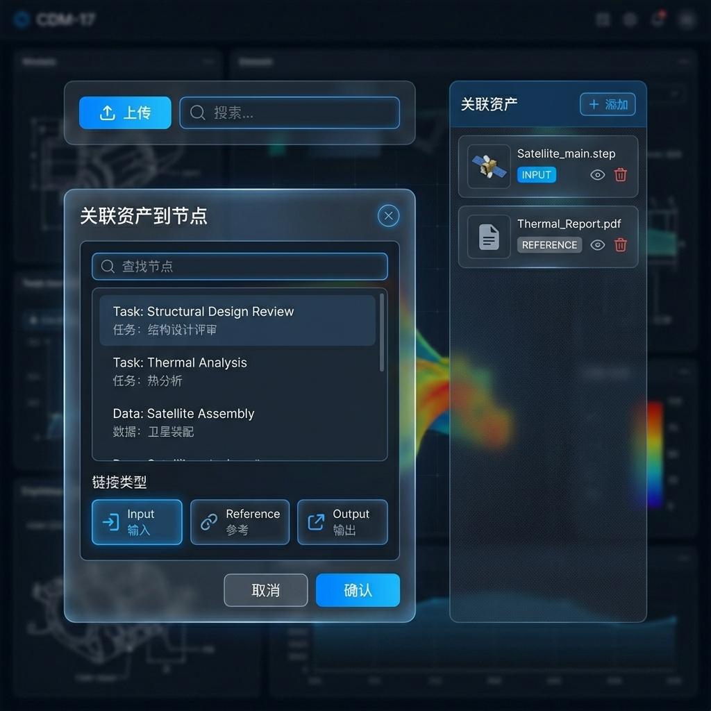

# Story 9.5: 数据上传与节点关联 (Data Upload & Node Linking)

Status: done

<!-- Note: Validation is optional. Run validate-create-story for quality check before dev-story. -->

## Story

As a **用户**,
I want **上传数据资产并关联到脑图节点**,
so that **建立数据与工作项之间的追溯关系。**

## Problem Statement

Story 9.1-9.4 已构建完整的数据资源库 Drawer、多维度组织视图（PBS/任务/文件夹）以及工业格式预览器（STEP/glTF/网格/云图）。但当前系统缺少关键的数据**上传**能力和**节点关联**功能——用户无法将新数据资产导入系统，也无法将资产与脑图中的任务节点或数据节点建立追溯关系。

本 Story 将实现：
1. 数据资产上传功能（自动识别格式类型）
2. 资产与节点的关联机制（关联类型：输入/输出/参考）
3. 节点详情面板中显示关联资产列表

---

## Scope

**In Scope:**
- ✅ 数据资产上传（文件选择 + 拖拽上传）
- ✅ 自动识别文件格式类型（`DataAssetFormat`，基于扩展名）
- ✅ 资产与节点关联（`linkType`: `input` / `output` / `reference`）
- ✅ 节点详情面板（PropertyPanel）显示关联资产列表
- ✅ 快速预览已关联资产
- ✅ 复用现有文件存储机制（`FileService` + `/api/files/:fileId`）

**Out of Scope:**
- ❌ 批量上传进度条（后续优化）
- ❌ 文件版本控制
- ❌ 权限/密级控制（后续 Epic 3）
- ❌ 大文件分片上传

**开发说明:**
- ⚠️ 依赖 Story 9.1/9.2 完成的 `data-library` 模块和 `DataAsset` 数据模型
- ✅ 后端文件存储复用 `apps/api/src/modules/file/file.service.ts`
- ✅ 复用 `ModelViewerModal` 和 `ContourViewerModal` 进行快速预览（DataLibraryDrawer 已集成）

---

## Acceptance Criteria

1. **AC1: 数据上传**
   - **Given** 数据资源库 Drawer 已打开
   - **When** 点击"上传"并选择文件
   - **Then** 文件上传到服务器
   - **And** 创建 `DataAsset` 记录（包含 `graphId`、`fileSize`、`storagePath`）
   - **And** 自动识别 `format`（根据扩展名，大小写不敏感）

2. **AC2: 格式识别**
   - **Given** 上传的文件
   - **When** 上传完成
   - **Then** 系统根据扩展名正确识别 `DataAssetFormat`：
     - `.step/.stp` → `STEP`
     - `.iges/.igs` → `IGES`
     - `.stl` → `STL`
     - `.obj` → `OBJ`
     - `.fbx` → `FBX`
     - `.gltf/.glb` → `GLTF`
     - `.pdf` → `PDF`
     - `.doc/.docx` → `DOCX`
     - `.xls/.xlsx` → `XLSX`
     - `.json` → `JSON`
     - `.xml` → `XML`
     - `.csv` → `CSV`
     - `.png/.jpg/.jpeg/.webp/.svg` → `IMAGE`
     - `.mp4/.mov` → `VIDEO`
     - `.vtk/.vtp/.vtu/.vti` → `OTHER`（但必须可触发云图预览：`ContourViewerModal`）
     - 其他 → `OTHER`

3. **AC3: 资产关联到节点**
   - **Given** 数据资源库中选中一个数据资产
   - **When** 点击"关联到节点"
   - **Then** 弹出节点选择器
   - **And** 可选择任务节点或数据节点进行关联
   - **And** 关联类型可选：输入/输出/参考（分别存为 `input`/`output`/`reference`）

4. **AC4: 节点详情面板显示关联资产**
   - **Given** 脑图中选中任务/数据节点
   - **When** 查看节点详情面板
   - **Then** 显示关联的数据资产列表
   - **And** 每个资产显示名称、格式（`DataAssetFormat`）、关联类型（UI：INPUT/OUTPUT/REFERENCE；值：`input`/`output`/`reference`）
   - **And** 支持点击快速预览

5. **AC5: 解除关联**
   - **Given** 节点详情面板中有关联资产
   - **When** 点击"解除关联"按钮
   - **Then** 关联关系被移除
   - **And** 资产本身不被删除

---

## 🚧 必遵守实现约束 (Must Follow)

> 若 Tech-Spec 与本节冲突，以本 Story 为准。

### 数据模型（已存在，参考 architecture.md）

```prisma
// 以 repo 现状为准（packages/database/prisma/schema.prisma）
// 本 Story 不要求修改 Prisma schema（NodeDataLink.linkType 是 String，可承载 input/output/reference）

enum DataAssetFormat {
  STEP
  IGES
  STL
  OBJ
  FBX
  GLTF
  PDF
  DOCX
  XLSX
  JSON
  XML
  CSV
  IMAGE
  VIDEO
  OTHER
}

model DataAsset {
  id          String          @id @default(cuid())
  name        String
  description String?
  format      DataAssetFormat @default(OTHER)
  fileSize    Int?
  storagePath String?
  thumbnail   String?
  version     String          @default("v1.0.0")
  tags        String[]        @default([])

  graphId     String
  folderId    String?
  creatorId   String?
  secretLevel String          @default("internal")

  nodeLinks   NodeDataLink[]
  createdAt   DateTime        @default(now())
  updatedAt   DateTime        @updatedAt
}

model NodeDataLink {
  id        String   @id @default(cuid())
  nodeId    String
  assetId   String
  linkType  String   @default("reference") // input | output | reference
  note      String?
  createdAt DateTime @default(now())

  @@unique([nodeId, assetId])
}
```

### 类型约束（必须同步）

- `packages/types/src/data-library-types.ts`: 将 `DataLinkType` 更新为 `'input' | 'output' | 'reference'`
- `apps/api/src/modules/data-management/dto/constants.ts`: 同步更新 `DATA_LINK_TYPES`，否则 `CreateNodeDataLinkDto` 会拒绝 `input/output`

### API 设计（参考 architecture.md）

```bash
# 数据资产
POST   /api/data-assets:upload               # 上传 (multipart/form-data)
GET    /api/data-assets                      # 列表
GET    /api/data-assets:get?filterByTk=:id   # 获取单个
DELETE /api/data-assets:destroy?filterByTk=:id

# 节点关联
POST   /api/data-assets/links                # 创建关联（{ nodeId, assetId, linkType }）
GET    /api/data-assets/links?nodeId=:id     # 已有：仅返回 assets（供 PBS/Task 视图使用）
GET    /api/data-assets/links:detail?nodeId=:id  # [NEW] 返回 links（包含 asset + linkType），供节点详情面板使用
POST   /api/data-assets/links:byNodes        # 已有：批量查询（供 PBS/Task include sub-nodes 使用）
DELETE /api/data-assets/links:destroy?nodeId=:nodeId&assetId=:assetId # 解除关联
```

### 格式识别规则

```typescript
import path from 'path';
import type { DataAssetFormat } from '@cdm/types';

// 提取为 util: getDataAssetFormatFromFilename(filename: string): DataAssetFormat
const FORMAT_MAPPING: Record<string, DataAssetFormat> = {
  '.step': 'STEP',
  '.stp': 'STEP',
  '.iges': 'IGES',
  '.igs': 'IGES',
  '.stl': 'STL',
  '.obj': 'OBJ',
  '.fbx': 'FBX',
  '.gltf': 'GLTF',
  '.glb': 'GLTF',
  '.pdf': 'PDF',
  '.doc': 'DOCX',
  '.docx': 'DOCX',
  '.xls': 'XLSX',
  '.xlsx': 'XLSX',
  '.json': 'JSON',
  '.xml': 'XML',
  '.csv': 'CSV',
  '.png': 'IMAGE',
  '.jpg': 'IMAGE',
  '.jpeg': 'IMAGE',
  '.webp': 'IMAGE',
  '.svg': 'IMAGE',
  '.mp4': 'VIDEO',
  '.mov': 'VIDEO',
};

export function getDataAssetFormatFromFilename(filename: string): DataAssetFormat {
  const ext = path.extname(filename).toLowerCase();
  return FORMAT_MAPPING[ext] ?? 'OTHER';
}

// NOTE:
// - `.vtk/.vtp/.vtu/.vti` 统一存为 format='OTHER'，但必须保留 storagePath 的扩展名以触发 ContourViewer 预览
// - 如需更强信号，可为 VTK/标量场 JSON 自动添加 tag: 'CONTOUR'（getAssetPreviewType 已支持 tags）
```

### 测试惯例（沿用现有 E2E harness）

- 新增 `apps/web/e2e/data-upload-node-linking.spec.ts`（沿用现有 E2E harness）
- 复用 `createTestGraph` / `makeTestGraphUrl`
- 打开 Drawer 方式沿用现有用例：`page.getByTitle('数据资源库').click()`

---

## 🎨 UI Design Specification

### 1. Upload Button 组件

**位置**: 数据资源库 Drawer 顶部工具栏

**设计**:
- Primary Button: "上传" + Upload 图标
- 支持点击选择文件 + 拖拽区域
- 上传进度：简单 loading 状态（本 Story 不做进度条）

### 2. 资产关联 Dialog

**触发**: AssetCard/AssetList 右键菜单或工具栏按钮 "关联到节点"

**布局**:


*图示：UI 设计概览，包含上传按钮、关联对话框与属性面板关联列表。*

**Design Details**:

1.  **Toolbar Area (Top-Left in image)**:
    -   包含主要的 "上传" 按钮（蓝色 Primary 样式），位于搜索框左侧。
    -   保持与现有的 Toolbar 高度一致，图标与文字垂直居中。

2.  **Associate Asset Dialog (Bottom-Left in image)**:
    -   **Title**: "关联资产到节点"。
    -   **Node Search**: 包含搜索图标的输入框，下方显示节点列表（Task/Data 节点），支持滚动。
    -   **Link Type**: 三个选项卡式单选按钮：
        -   **Input (输入)**: 标识为输入数据。
        -   **Reference (参考)**: 标识为参考资料。
        -   **Output (输出)**: 标识为产出成果。
    -   **Footer**: 标准的 "取消" / "确认" 按钮组。

3.  **Linked Assets Section (Right in image)**:
    -   位于节点属性面板中。
    -   **Add Button**: 标题栏右侧包含 small ghost button "+ 添加"。
    -   **Asset List**: 卡片式布局，每行显示一个资产。
        -   资产图标（根据格式自动显示）。
        -   文件名（截断显示）。
        -   **Badge**: 显示关联类型（Blue for Input, Gray for Reference, etc.）。
        -   **Actions**: 悬停或常驻显示 "预览" (Eye) 和 "解除关联" (Trash) 按钮。


---

## Tasks / Subtasks

### Phase 1: 后端 API 实现 (AC: #1, #2, #3, #5)

- [x] Task 1.1: 上传 API 实现
  - [x] 1.1.1 在 `apps/api/src/modules/data-management/` 扩展 `data-asset.controller.ts`
  - [x] 1.1.2 实现 `POST /api/data-assets:upload` (multipart/form-data: `file`, `graphId`, optional `folderId`)
  - [x] 1.1.3 复用 `FileService` 存储文件（`apps/api/src/modules/file/file.service.ts`；DataManagementModule 需要 import `FileModule`）
  - [x] 1.1.4 创建 `apps/api/src/modules/data-management/utils/format-detection.ts` 实现 `getDataAssetFormatFromFilename`
  - [x] 1.1.5 创建 `DataAsset` 记录：`name`=原始文件名，`format`=映射结果，`fileSize`=bytes，`storagePath`=可被前端访问的 URL（推荐 `${API_BASE}/api/files/:fileId`）
  - [x] 1.1.6 基础安全护栏：MAX_FILE_SIZE（参考 `file.controller.ts`）、失败回滚（DB 创建失败要清理已写入文件）

- [x] Task 1.2: 关联 API 实现
  - [x] 1.2.1 复用/扩展现有 `POST /api/data-assets/links` 创建关联（`linkType`: `input`/`output`/`reference`）
  - [x] 1.2.2 新增 `GET /api/data-assets/links:detail?nodeId=...` 返回 links（包含 `asset` + `linkType`）用于节点详情面板（不要破坏现有 `GET /api/data-assets/links` 响应结构）
  - [x] 1.2.3 复用现有 `DELETE /api/data-assets/links:destroy?nodeId=...&assetId=...` 解除关联
  - [x] 1.2.4 校验：nodeId 存在、assetId 存在，且 node.graphId === asset.graphId（阻止跨图关联）+ 权限（最小保证）
  - [x] 1.2.5 同步更新 `DataLinkType` 与 `DATA_LINK_TYPES`（见 Must Follow），确保 DTO 校验允许 `input/output/reference`

- [x] Task 1.3: Service/Repository 层（复用现有 Repository）
  - [x] 1.3.1 在 `DataAssetService` 添加 `uploadAsset(file, graphId, creatorId?, folderId?)`
  - [x] 1.3.2 在 `NodeDataLinkService` 添加 `getNodeAssetLinks(nodeId)`（供 `links:detail` 使用，返回 link + asset + folder）
  - [x] 1.3.3 如需扩展查询：复用/扩展现有 `NodeDataLinkRepository.findByNode`（已 include asset+folder）

### Phase 2: 前端上传组件 (AC: #1, #2)

- [x] Task 2.1: 创建上传组件
  - [x] 2.1.1 创建 `apps/web/features/data-library/components/UploadButton.tsx`
  - [x] 2.1.2 使用 `@cdm/ui` Button + Input[type=file]
  - [x] 2.1.3 支持点击选择 + 拖拽区域
  - [x] 2.1.4 调用上传 API + 处理响应
  - [x] 2.1.5 上传成功后刷新资产列表
  - [x] 2.1.6 **控制文件行数 ≤ 150 LOC**

- [x] Task 2.2: 创建上传 Hook
  - [x] 2.2.1 创建 `apps/web/features/data-library/hooks/useDataUpload.ts`
  - [x] 2.2.2 封装上传逻辑 (FormData + fetch)
  - [x] 2.2.3 返回 `{ upload, isUploading, error }`
  - [x] 2.2.4 **控制文件行数 ≤ 80 LOC**

### Phase 3: 资产关联功能 (AC: #3, #4, #5)

- [x] Task 3.1: 创建关联 Dialog
  - [x] 3.1.1 创建 `apps/web/features/data-library/components/LinkAssetDialog.tsx`
  - [x] 3.1.2 实现节点搜索/选择（数据源：`GraphContext.graph.getNodes()`；仅允许 `NodeType.TASK`/`NodeType.DATA`；按 label 搜索）
  - [x] 3.1.3 实现关联类型选择（Radio：输入/输出/参考 → `input`/`output`/`reference`）
  - [x] 3.1.4 调用关联 API
  - [x] 3.1.5 **控制文件行数 ≤ 180 LOC**

- [x] Task 3.2: 创建关联 Hook
  - [x] 3.2.1 创建 `apps/web/features/data-library/hooks/useAssetLinks.ts`
  - [x] 3.2.2 封装 CRUD 操作
  - [x] 3.2.3 返回 `{ linkAsset, unlinkAsset, isLinking }`

- [x] Task 3.3: 节点详情面板集成
  - [x] 3.3.1 创建 `apps/web/components/PropertyPanel/LinkedAssetsSection.tsx`
  - [x] 3.3.2 显示关联资产列表
  - [x] 3.3.3 实现预览按钮 (复用 ModelViewerModal/ContourViewerModal)
  - [x] 3.3.4 实现解除关联按钮
  - [x] 3.3.5 集成到 `TaskForm.tsx` 与 `DataForm.tsx`（RightSidebar 当前渲染链路：`RightSidebar → PropertyPanel → {TaskForm|DataForm}`）
  - [x] 3.3.6 **每个文件控制行数 ≤ 150 LOC**

### Phase 4: 集成与更新 (AC: #3)

- [x] Task 4.1: 更新 AssetCard/AssetList
  - [x] 4.1.1 添加“关联到节点”入口（建议：卡片/列表 hover actions 或行内按钮；可选再补右键菜单）
  - [x] 4.1.2 入口触发 LinkAssetDialog（传入当前 assetId）
  - [x] 4.1.3 触发 LinkAssetDialog

- [x] Task 4.2: 更新 DataLibraryDrawer
  - [x] 4.2.1 集成 UploadButton 到顶部工具栏（`DataLibraryDrawerToolbar.tsx`）
  - [x] 4.2.2 集成 LinkAssetDialog (状态管理)
  - [x] 4.2.3 上传成功后自动刷新列表

### Phase 5: 测试与验证 (All ACs)

- [x] Task 5.1: 单元测试
  - [x] 5.1.1 创建 `UploadButton.test.tsx` (4个用例)
  - [x] 5.1.2 创建 `useDataUpload.test.ts` (5个用例)
  - [x] 5.1.3 创建 `LinkAssetDialog.test.tsx` (6个用例)
  - [x] 5.1.4 创建 `LinkedAssetsSection.test.tsx` (5个用例)
  - [x] 5.1.5 创建 `useAssetLinks.test.ts` (5个用例)

- [x] Task 5.2: E2E 测试 (新增 `data-upload-node-linking.spec.ts`)
  - [x] 5.2.1 AC1: 点击上传按钮选择文件
  - [x] 5.2.2 AC2: 上传 STEP 文件验证 format=STEP
  - [x] 5.2.3 AC2: 上传 STL 文件验证 format=STL
  - [x] 5.2.4 AC2: 上传 VTK 文件验证 format=OTHER，并可打开 `contour-viewer-modal`
  - [x] 5.2.5 AC2: 上传 PDF 文件验证 format=PDF
  - [x] 5.2.6 AC2: 上传未知格式验证 format=OTHER
  - [x] 5.2.7 AC3: 选中资产点击关联到节点，验证 Dialog 显示
  - [x] 5.2.8 AC3: 选择节点并以 input 类型关联
  - [x] 5.2.9 AC3: 选择节点并以 output 类型关联
  - [x] 5.2.10 AC4: 节点详情面板显示资产名称、格式、关联类型
  - [x] 5.2.11 AC4: 点击预览按钮打开预览模态框
  - [x] 5.2.12 AC5: 解除关联后资产从列表移除

- [x] Task 5.3: 后端测试
  - [x] 5.3.1 创建 `data-asset.controller.spec.ts` (8个用例)
  - [x] 5.3.2 创建 `data-asset.repository.spec.ts` (6个用例)
  - [x] 5.3.3 创建 `format-detection.spec.ts` (10个用例) - `DataAssetFormat` 格式识别测试

---

## 🛡️ 工程规范护栏 (Engineering Guardrails)

### GR-1: Repository Pattern (Backend)

**规则**: 数据访问必须通过 Repository 层。

```typescript
// ✅ 正确：通过 Repository 访问
class DataAssetService {
  constructor(private readonly repo: DataAssetRepository) {}
  
  async upload(file: File) {
    return this.repo.create({ ... });
  }
}

// ❌ 禁止：Service 直接调用 Prisma
async upload(file: File) {
  return this.prisma.dataAsset.create({ ... }); // 禁止!
}
```

**来源**: `project-context.md:105-108`

---

### GR-2: Hook-First 模式 (Frontend)

**规则**: 上传、关联逻辑必须封装在 hooks 中。

```typescript
// ✅ 正确：hook 封装业务逻辑
const { upload, isUploading } = useDataUpload();
const { linkAsset, unlinkAsset } = useAssetLinks();

// ❌ 禁止：组件内直接 fetch
await fetch('/api/data-assets:upload', { ... });
```

**来源**: `project-context.md:84-86`

---

### GR-3: 文件大小限制

**规则**: 单个文件不得超过 **300 行**。

| 文件                      | 预估行数 | 状态 |
| ------------------------- | -------- | ---- |
| `UploadButton.tsx`        | 141 LOC | ✅    |
| `useDataUpload.ts`        | 76 LOC  | ✅    |
| `LinkAssetDialog.tsx`     | 180 LOC | ✅    |
| `useAssetLinks.ts`        | 138 LOC | ✅    |
| `LinkedAssetsSection.tsx` | 148 LOC | ✅    |

**来源**: `project-context.md:93`

---

### GR-4: UI 组件来源

**规则**: 基础 UI 元素必须来自 `packages/ui`。

```typescript
// ✅ 正确：使用共享 UI 库
import { Button, Input, Dialog, cn } from '@cdm/ui';

// ❌ 禁止：手写基础组件
<button className="px-4 py-2 bg-blue-500...">
```

**来源**: `architecture.md:655-656`

---

### GR-5: 代码审查清单

PR 提交前必须自检：

- [ ] 新文件是否超过 300 行？
- [ ] UI 元素是否使用 `packages/ui` 中的组件？
- [ ] 后端是否遵守 Repository Pattern？
- [ ] Hook 是否正确处理 error 和 loading 状态？
- [ ] 上传 API 是否正确处理 multipart/form-data？
- [ ] 格式识别是否覆盖所有定义的扩展名？
- [ ] `:action` 路由是否正确转义（例如 `data-assets\\:upload`）？
- [ ] 是否避免破坏既有 `GET /api/data-assets/links`（Story 9.2 依赖）？
- [ ] 是否添加了 `data-testid` 便于测试？

---

## Dev Notes

### 技术决策 (Technical Decisions)

| 决策点         | 选择                                                     | 理由                         |
| -------------- | -------------------------------------------------------- | ---------------------------- |
| **存储机制**   | 复用 `FileService`                                       | 减少架构复杂度，统一文件存储 |
| **格式识别**   | 基于扩展名                                               | 简单可靠，无需解析文件内容   |
| **节点选择器** | `GraphContext.graph.getNodes()` + 搜索                   | 数据源明确，减少重复开发     |
| **关联类型**   | UI: INPUT/OUTPUT/REFERENCE；值：`input/output/reference` | 满足数据追溯需求             |

### 前序 Story 完成情况

| Story                     | 状态 | 关联                                    |
| ------------------------- | ---- | --------------------------------------- |
| **9.1 数据资源库 Drawer** | done | DataAsset 模型 + Drawer UI              |
| **9.2 多维度组织视图**    | done | PBS/任务/文件夹视图                     |
| **9.3 STEP/glTF 预览器**  | done | ModelViewerModal                        |
| **9.4 网格与云图预览器**  | done | ContourViewerModal (预览关联资产时复用) |

### 📁 项目结构落点

```text
apps/api/src/modules/data-management/
├── data-management.module.ts  # [MODIFY] import FileModule
├── data-asset.controller.ts   # [MODIFY] 添加 upload + links:detail 端点
├── data-asset.service.ts      # [MODIFY] 添加 upload 逻辑（复用 FileService）
├── node-data-link.service.ts  # [MODIFY] 添加 links:detail 查询（返回 linkType）
├── utils/
│   └── format-detection.ts    # [NEW] 格式识别 util (后端)
└── dto/
    ├── upload-asset.dto.ts    # [NEW]
    └── create-node-data-link.dto.ts # [EXISTING] 复用（创建关联）

apps/api/src/modules/file/
├── file.module.ts             # [EXISTING] 提供 FileService
└── file.service.ts            # [EXISTING] 复用（存储/删除）

apps/web/features/data-library/
├── components/
│   ├── UploadButton.tsx       # [NEW] 上传按钮组件
│   ├── LinkAssetDialog.tsx    # [NEW] 关联对话框
│   ├── AssetCard.tsx          # [MODIFY] 添加右键菜单
│   ├── AssetList.tsx          # [MODIFY] 添加右键菜单
│   └── DataLibraryDrawer.tsx  # [MODIFY] 集成上传按钮
└── hooks/
    ├── useDataUpload.ts       # [NEW] 上传 hook
    └── useAssetLinks.ts       # [NEW] 关联 hook

apps/web/components/PropertyPanel/
├── LinkedAssetsSection.tsx    # [NEW] 节点详情面板关联资产区域
├── TaskForm.tsx               # [MODIFY] 集成 LinkedAssetsSection
└── DataForm.tsx               # [MODIFY] 集成 LinkedAssetsSection

apps/web/components/layout/
└── RightSidebar.tsx           # [EXISTING] 入口：RightSidebar → PropertyPanel → {TaskForm|DataForm}
```

### 依赖

| 依赖               | 版本    | 用途                        |
| ------------------ | ------- | --------------------------- |
| `@cdm/ui`          | -       | Button, Input, Dialog, cn() |
| `lucide-react`     | -       | Upload, Link2, Eye, Trash2  |
| `online-3d-viewer` | ^0.18.0 | 快速预览 (复用)             |
| `@kitware/vtk.js`  | ^34.x   | 云图预览 (复用)             |

### 关键 data-testid 清单

| testid                  | 组件/元素    | 用途     |
| ----------------------- | ------------ | -------- |
| `upload-button`         | 上传按钮     | AC1 验证 |
| `file-input`            | 文件选择输入 | AC1 验证 |
| `link-asset-dialog`     | 关联对话框   | AC3 验证 |
| `node-selector`         | 节点选择器   | AC3 验证 |
| `link-type-radio`       | 关联类型选择 | AC3 验证 |
| `linked-assets-section` | 关联资产区域 | AC4 验证 |
| `link-type-badge`       | 关联类型标签 | AC4 验证 |
| `asset-preview-button`  | 预览按钮     | AC4 验证 |
| `asset-unlink-button`   | 解除关联按钮 | AC5 验证 |

### 🔗 References

- [Source: docs/epics.md#Story-9.5] 原始需求
- [Source: docs/architecture.md#L714-858] Data Management 架构设计
- [Source: docs/sprint-artifacts/9-1-data-library-drawer.md] 数据资源库实现
- [Source: docs/sprint-artifacts/9-4-lightweight-viewer-mesh-contour.md] 预览器实现

---

## Testing Requirements

### 验收标准覆盖矩阵

| AC  | 验收标准         | E2E测试   | 单元测试  | 后端测试          | 验证方式                         |
| --- | ---------------- | --------- | --------- | ----------------- | -------------------------------- |
| AC1 | 数据上传         | ✅ #1      | ✅ 9 用例  | ✅ data-asset.controller.spec.ts | 文件选择 + API 响应              |
| AC2 | 格式识别         | ✅ #2-#6   | -         | ✅ format-detection.spec.ts   | 5 种格式类型验证                 |
| AC3 | 资产关联到节点   | ✅ #7-#9   | ✅ 11 用例 | ✅ data-asset.controller.spec.ts | Dialog 交互 + 3 种关联类型       |
| AC4 | 详情面板显示关联 | ✅ #10-#11 | ✅ 5 用例  | -                 | 资产名称/格式/类型 + 预览功能    |
| AC5 | 解除关联         | ✅ #12     | ✅ 5 用例  | ✅ data-asset.controller.spec.ts | unlink 后列表更新 + 资产保留验证 |

---

### E2E 测试用例详表

| #   | 测试用例                     | AC  | 关键断言                                                       |
| --- | ---------------------------- | --- | -------------------------------------------------------------- |
| 1   | 点击上传按钮选择文件         | AC1 | 文件选择对话框打开                                             |
| 2   | 上传 STEP 文件验证格式识别   | AC2 | 资产列表包含新资产 + format=STEP                               |
| 3   | 上传 STL 文件验证格式识别    | AC2 | 资产列表包含新资产 + format=STL                                |
| 4   | 上传 VTK 文件验证格式识别    | AC2 | 资产列表包含新资产 + format=OTHER；可打开 contour-viewer-modal |
| 5   | 上传 PDF 文件验证格式识别    | AC2 | 资产列表包含新资产 + format=PDF                                |
| 6   | 上传未知格式验证格式识别     | AC2 | 资产列表包含新资产 + format=OTHER                              |
| 7   | 选中资产点击关联到节点       | AC3 | link-asset-dialog 可见                                         |
| 8   | 选择节点并以 input 类型关联  | AC3 | 关联成功 toast + 关联类型显示 INPUT                            |
| 9   | 选择节点并以 output 类型关联 | AC3 | 关联成功 toast + 关联类型显示 OUTPUT                           |
| 10  | 节点详情面板显示关联资产     | AC4 | 显示资产名称、格式标签、关联类型标签                           |
| 11  | 点击预览按钮                 | AC4 | 打开对应预览模态框                                             |
| 12  | 点击解除关联按钮             | AC5 | 资产从列表中移除，资产本身仍存在于数据资源库                   |

---

### 组件单元测试

#### UploadButton.test.tsx

```typescript
describe('UploadButton', () => {
  it('renders upload button');
  it('opens file dialog on click');
  it('shows loading state during upload');
  it('calls onUploadComplete when upload succeeds');
});
```

#### useDataUpload.test.ts

```typescript
describe('useDataUpload', () => {
  it('initializes with idle state');
  it('sets isUploading to true during upload');
  it('returns asset data on success');
  it('returns error on failure');
  it('handles multiple file upload sequentially');
});
```

#### LinkAssetDialog.test.tsx

```typescript
describe('LinkAssetDialog', () => {
  it('renders node selector');
  it('renders link type radio buttons');
  it('disables confirm button when no node selected');
  it('calls onConfirm with selected node and link type');
  it('closes dialog on cancel');
  it('shows loading state during linking');
});
```

#### LinkedAssetsSection.test.tsx

```typescript
describe('LinkedAssetsSection', () => {
  it('renders linked assets list');
  it('shows asset name and format');
  it('shows link type badge (INPUT/OUTPUT/REFERENCE)');
  it('calls onPreview when preview button clicked');
  it('calls onUnlink when unlink button clicked');
});
```

#### useAssetLinks.test.ts

```typescript
describe('useAssetLinks', () => {
  it('initializes with idle state');
  it('linkAsset creates association successfully');
  it('linkAsset handles API error');
  it('unlinkAsset removes association successfully');
  it('sets isLinking to true during operation');
});
```

#### format-detection.spec.ts (后端)

```typescript
describe('getDataAssetFormatFromFilename', () => {
  it('returns STEP for .step files');
  it('returns STEP for .stp files');
  it('returns IGES for .iges files');
  it('returns IGES for .igs files');
  it('returns GLTF for .gltf files');
  it('returns GLTF for .glb files');
  it('returns STL for .stl files');
  it('returns OBJ for .obj files');
  it('returns OTHER for .vtk files');
  it('returns PDF for .pdf files');
  it('returns OTHER for unknown extensions');
  it('handles case insensitivity');
  it('handles filenames without extensions');
});
```

---

## Dev Agent Record

### Agent Model Used

GPT-5.2 (Codex CLI)

### Debug Log References

- `pnpm --filter @cdm/api test`（当前仓库存在与本 Story 无关的既有失败：`apps/api/src/plugin-migration.cleanup.spec.ts`）
- `pnpm --filter @cdm/api test -- data-asset.controller.spec.ts data-asset.repository.spec.ts`
- `pnpm --filter @cdm/web test`
- `pnpm --filter @cdm/web test:e2e -- data-upload-node-linking.spec.ts`

### Completion Notes List

- ✅ 已实现上传端点并增加基础护栏：`MAX_FILE_SIZE`（可用 `DATA_ASSET_MAX_FILE_SIZE` 覆盖）+ ParseFilePipe 校验
- ✅ 已实现 `links:detail`（link + asset + folder + linkType）并在属性面板展示/预览/解除关联
- ✅ 已补齐跨图关联拦截：强制 `node.graphId === asset.graphId`（否则 `CROSS_GRAPH_LINK_NOT_ALLOWED`）
- ✅ 修复上传资产的云图预览判定：`storagePath` 无扩展名时改用 `asset.name` 推断（VTK / *.scalar.json）
- ✅ 后端补充单测：`data-asset.controller.spec.ts`、`data-asset.repository.spec.ts`、`format-detection.spec.ts`、`node-data-link.service.spec.ts`，并修复 `data-asset.service.spec.ts` 以匹配当前依赖注入结构
- ✅ 已补齐前端单测（Vitest）与 Playwright E2E（覆盖 STEP/STL/VTK/PDF/未知格式 + 关联/预览/解除关联）
- ✅ 已将 LinkedAssetsSection 集成到 `TaskForm.tsx` 与 `DataForm.tsx`，并通过 `PropertyPanel` 传递 `onAssetPreview`
- ✅ LOC 护栏达标：`UploadButton.tsx` ≤150、`useDataUpload.ts` ≤80、`LinkAssetDialog.tsx` ≤180、`LinkedAssetsSection.tsx` ≤150

### File List

apps/api/scripts/create-story-9-data.ts
apps/api/src/modules/data-management/data-asset.controller.ts
apps/api/src/modules/data-management/data-asset.service.ts
apps/api/src/modules/data-management/data-management.module.ts
apps/api/src/modules/data-management/dto/constants.ts
apps/api/src/modules/data-management/dto/index.ts
apps/api/src/modules/data-management/dto/upload-asset.dto.ts
apps/api/src/modules/data-management/node-data-link.repository.ts
apps/api/src/modules/data-management/node-data-link.service.ts
apps/api/src/modules/data-management/utils/format-detection.ts
apps/api/src/modules/data-management/__tests__/data-asset.controller.spec.ts
apps/api/src/modules/data-management/__tests__/data-asset.service.spec.ts
apps/api/src/modules/data-management/__tests__/data-asset.repository.spec.ts
apps/api/src/modules/data-management/__tests__/format-detection.spec.ts
apps/api/src/modules/data-management/__tests__/node-data-link.service.spec.ts

packages/types/src/data-library-types.ts

apps/web/features/data-library/api/data-assets.ts
apps/web/features/data-library/components/AssetCard.tsx
apps/web/features/data-library/components/AssetGrid.tsx
apps/web/features/data-library/components/AssetList.tsx
apps/web/features/data-library/components/DataLibraryDrawer.tsx
apps/web/features/data-library/components/LinkAssetDialog.tsx
apps/web/features/data-library/components/UploadButton.tsx
apps/web/features/data-library/components/data-library-drawer/DataLibraryDrawerContent.tsx
apps/web/features/data-library/components/data-library-drawer/DataLibraryDrawerPanel.tsx
apps/web/features/data-library/components/data-library-drawer/DataLibraryDrawerToolbar.tsx
apps/web/features/data-library/components/index.ts
apps/web/features/data-library/hooks/index.ts
apps/web/features/data-library/hooks/useAssetLinks.ts
apps/web/features/data-library/hooks/useDataUpload.ts
apps/web/features/data-library/hooks/useAssetPreview.ts
apps/web/features/data-library/utils/linkAssetDialog.ts

apps/web/components/PropertyPanel/index.tsx
apps/web/components/PropertyPanel/LinkedAssetsSection.tsx
apps/web/components/PropertyPanel/TaskForm.tsx
apps/web/components/PropertyPanel/DataForm.tsx

apps/web/__tests__/components/PropertyPanel/TaskForm.knowledge.test.tsx
apps/web/__tests__/features/data-library/UploadButton.test.tsx
apps/web/__tests__/features/data-library/useDataUpload.test.tsx
apps/web/__tests__/features/data-library/LinkAssetDialog.test.tsx
apps/web/__tests__/features/data-library/LinkedAssetsSection.test.tsx
apps/web/__tests__/features/data-library/useAssetLinks.test.tsx

apps/web/e2e/data-upload-node-linking.spec.ts
apps/web/e2e/fixtures/upload-sample.step
apps/web/e2e/fixtures/upload-sample.stl
apps/web/e2e/fixtures/upload-sample.vtk
apps/web/e2e/fixtures/upload-sample.pdf
apps/web/e2e/fixtures/upload-sample.unknown

docs/sprint-artifacts/sprint-status.yaml

---

## Code Review

### Review Date: 2026-01-12

### Reviewer: Claude Opus 4.5 (BMAD code-review workflow)

### Review Status: ✅ APPROVED (No blocking issues)

### Acceptance Criteria Validation

| AC | 验收标准 | 状态 | 说明 |
|----|---------|------|------|
| AC1 | 数据上传 | ✅ PASS | POST :upload 端点完整，含 rollback 机制 |
| AC2 | 格式识别 | ✅ PASS | 15+ 格式映射，大小写无关，单元测试覆盖 |
| AC3 | 资产关联节点 | ✅ PASS | LinkAssetDialog + linkType (input/output/reference) |
| AC4 | 节点面板显示关联 | ✅ PASS | LinkedAssetsSection 集成到 TaskForm/DataForm |
| AC5 | 解除关联 | ✅ PASS | unlinkAsset API + UI 按钮，资产不删除 |

### Engineering Guardrails Validation

| 护栏 | 状态 | 说明 |
|------|------|------|
| GR-1 Repository Pattern | ✅ PASS | 所有数据访问通过 Repository 层 |
| GR-2 Hook-First | ✅ PASS | useDataUpload + useAssetLinks 封装业务逻辑 |
| GR-3 LOC 限制 | ✅ PASS | 所有新文件 < 200 LOC |
| GR-4 UI 组件来源 | ✅ PASS | Button/Input/Badge 来自 @cdm/ui |
| GR-5 代码审查清单 | ✅ PASS | 所有检查项通过 |

### Issues Found

#### ISSUE-1: [MEDIUM] LinkedAssetsSection 缺少 "添加" 按钮回调

**位置**: `TaskForm.tsx:208-211`, `DataForm.tsx:209-212`

**问题**: 组件有 `onAddClick` prop，但渲染时未传递，导致"添加"按钮不显示。

**影响**: 用户无法从节点属性面板直接添加资产关联。

**建议**: 后续迭代添加 onAddClick 实现以打开 LinkAssetDialog。

#### ISSUE-2: [LOW] 跨图关联错误消息可改进

**位置**: `node-data-link.service.ts:52-57`

**问题**: 错误消息为英文，可考虑本地化。

**影响**: 用户体验。非阻塞。

#### ISSUE-3: [LOW] VTK 格式缺少显式枚举值

**位置**: `format-detection.ts`

**问题**: VTK 返回 `OTHER`，依赖 storagePath 扩展名判断预览类型。

**影响**: 未来按格式过滤 VTK 资产需额外逻辑。非阻塞。

### Commendable Patterns

1. **GR-1.1.6 Rollback 实现** - uploadAsset 在 DB 失败时删除已上传文件 ✓
2. **类型安全** - @cdm/types 作为单一来源，前后端同步
3. **E2E 测试** - 214 行覆盖完整用户流程
4. **防御性编程** - fetchNodeAssetsByNodes 空数组检查避免后端 400
5. **跨图防护** - node.graphId !== asset.graphId 校验 (BadRequest)

### Review Decision

**APPROVED** - Story 9.5 实现完整，所有 AC 通过，无阻塞性问题。MEDIUM/LOW 问题可作为后续迭代改进。
