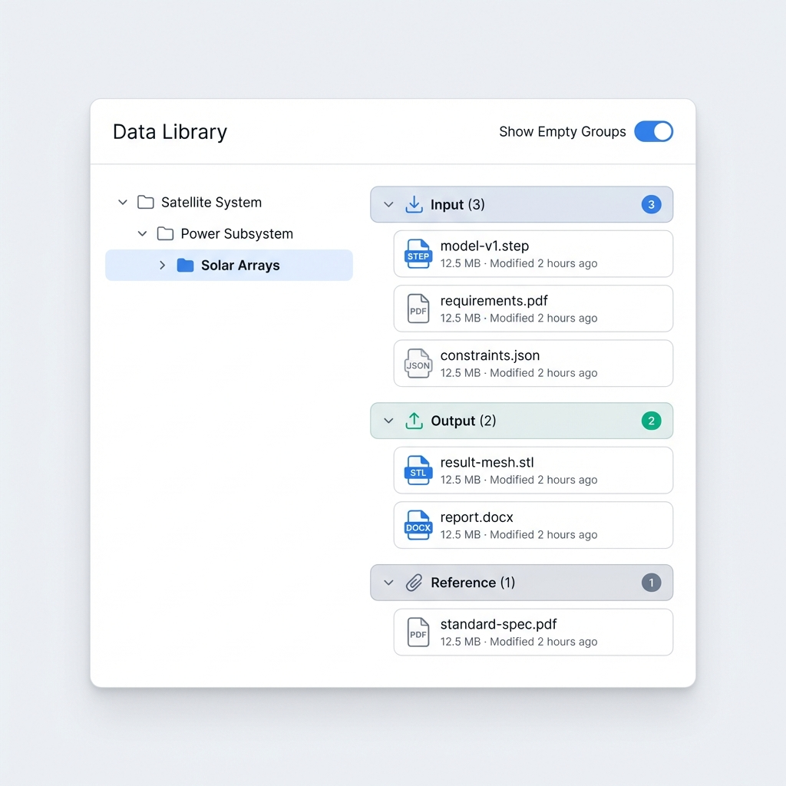
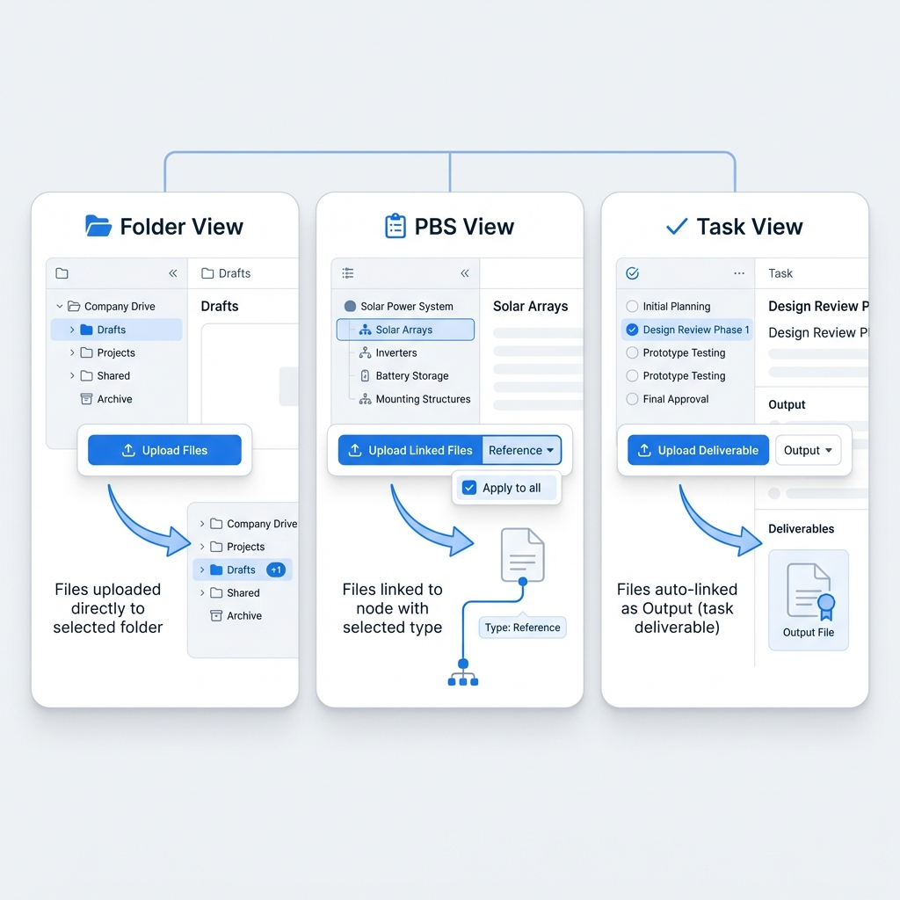
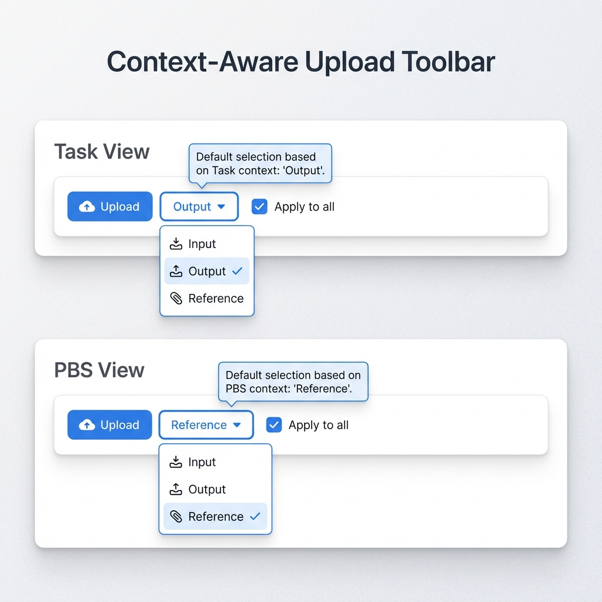
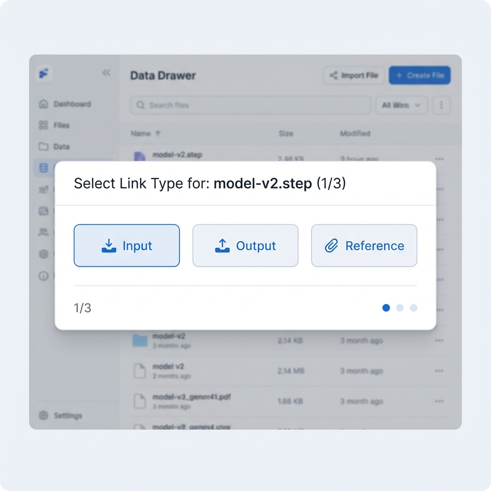

# Story 9.7: 数据资产上下文感知交互 (Context-Aware Data Asset Interaction)

Status: in-progress
Tech-Spec: [tech-spec-9-7-context-aware-data-asset-interaction.md](./tech-spec-9-7-context-aware-data-asset-interaction.md)

<!-- Note: Validation is optional. Run validate-create-story for quality check before dev-story. -->

## Story

As a **用户**,
I want **在不同视图（PBS/任务/文件夹）中的点击和上传行为能根据上下文智能响应**,
so that **操作符合直觉，减少切换成本，提高数据组织效率。**

## Problem Statement

Story 9.2 实现了 PBS/任务/文件夹三种组织视图，Story 9.5 实现了上传与关联功能。但当前存在交互逻辑不一致的问题：

1. **点击行为缺失** - 在 PBS/任务视图点击节点时，右侧仅显示关联资产列表，但未按关联类型（输入/输出/参考）分组
2. **上传行为不智能** - 无论在哪个 Tab 上传，行为都一样（无上下文感知）
3. **任务产出物语义缺失** - 在任务视图上传的文件应默认作为"输出"关联，但当前需要手动选择

**用户期望的智能行为：**
- **PBS 视图上传** → 默认参考（Reference），允许在上传前选择关联类型（输入/输出/参考）；支持批量“应用到所有”
- **任务视图上传** → 默认输出（Output），允许在上传前快速切换为输入/参考（符合任务交付语义）
- **文件夹视图上传** → 直接上传到当前文件夹（未选中文件夹则上传到根目录）

---

## Acceptance Criteria

### AC1: PBS/任务视图 - 点击节点查看关联数据

**Given** 数据资源库 Drawer 已打开并处于 "PBS视图" 或 "任务视图" Tab
**When** 点击左侧树中的某个 PBS 节点或任务节点
**Then** 右侧应显示该节点关联的所有数据资产
**And** 数据资产应按关联类型分组显示：输入(Input) / 输出(Output) / 参考(Reference)
**And** 每个分组应显示资产数量徽章
**And** 空分组默认隐藏，工具栏提供"显示空分组"切换开关
**And**（PBS 视图）当开启“包含子节点”时：允许保持 Story 9.2 的扁平资产列表展示（不强制 linkType 分组），并在面板顶部提示“包含子节点：分组已关闭”

### AC2: 文件夹视图 - 直接上传

**Given** 数据资源库 Drawer 处于 "文件夹视图" Tab，已选中某个文件夹
**When** 点击"上传"按钮并选择文件
**Then** 文件直接上传到当前选中的文件夹
**And** 文件夹的资产数量徽章应实时更新（+N）
**And** 若未选中文件夹，则上传到根目录

### AC3: 任务视图 - 输出关联上传

**Given** 数据资源库 Drawer 处于 "任务视图" Tab，已选中某个任务节点
**When** 点击"上传"按钮并选择文件
**Then** 文件上传完成后自动与选中任务节点建立 **输出(Output)** 类型的关联
**And** 右侧面板 "输出" 分组应刷新显示新增的关联资产
**And** 上传按钮旁提供快速类型切换下拉（默认：输出），用户可在上传前切换为"输入"或"参考"
**And** 该选择状态在切换 Tab 或关闭 Drawer 后重置为默认值（输出）

### AC4: PBS视图 - 选择关联类型上传

**Given** 数据资源库 Drawer 处于 "PBS视图" Tab，已选中某个 PBS 节点
**When** 点击"上传"按钮并选择文件
**Then** 使用与任务视图统一的类型预选模式，上传按钮旁提供类型切换下拉（默认：参考）
**And** 文件上传完成后与选中 PBS 节点建立下拉选中类型的关联
**And** 右侧面板对应分组应刷新显示新增资产
**And** 该选择状态在切换 Tab 或关闭 Drawer 后重置为默认值（参考）

**Given** 批量上传多个文件时
**When** 上传按钮旁显示"应用到所有"复选框（默认勾选）
**Then** 勾选时：所有文件使用当前类型下拉选中类型
**And** 取消勾选时：每个文件逐个快速弹出类型选择器

### AC5: 未选中节点的上传处理

**Given** 数据资源库 Drawer 处于 "PBS视图" 或 "任务视图"，但未选中任何节点
**When** 点击"上传"按钮
**Then** 应提示用户先选择一个节点进行关联，或允许上传到"未关联"区域
**And** 未关联资产可在后续手动关联到节点

---

## 🎨 UI Design Specification

### 1. 关联类型分组显示 (AC1)

**Prototype:**


**Design Specs:**
- **Layout**: 右侧面板采用“可折叠分组列表”（可用 `CollapseToggle` 或本地 state 实现折叠）
- **Header Styles**: 
  - Input: `bg-blue-50 text-blue-700` (Light Blue theme)
  - Output: `bg-green-50 text-green-700` (Light Green theme)
  - Reference: `bg-slate-100 text-slate-700` (Light Gray theme)
- **Icons**: 
  - Input: `Download` (Lucide) - 代表输入数据
  - Output: `Upload` (Lucide) - 代表产出数据
  - Reference: `Paperclip` (Lucide) - 代表参考资料
- **Badges**: 圆形徽章显示数量，位于 Header 右侧
- **Empty State**: 空分组默认自动折叠隐藏，通过右上角 "Show Empty Groups" 开关控制可见性

### 2. 上传交互状态概览

**Prototype:**


| 视图上下文 | 默认关联类型 | 上传行为 |
|------------|--------------|----------|
| **📂 文件夹视图** | N/A | 直接上传至当前选中文件夹，徽章 +1 |
| **📋 PBS 视图** | Reference (参考) | 弹出类型选择，默认关联为 Reference |
| **✓ 任务视图** | Output (输出) | 自动关联为 Output (交付物语义) |

### 3. Context-Aware Upload Toolbar

**Prototype:**


**Design Specs:**
- **Component**: 组合式按钮组 (Button Group)
- **Main Button**: 蓝色实心主要按钮，响应点击直接上传
- **Type Selector**: 
  - 附带类型下拉的辅助按钮
  - 显示当前选中的默认类型 (Task=Output, PBS=Reference)
  - 切换选项：Input / Output / Reference
- **Apply to all**: 
  - 复选框，仅在批量上传时有效
  - 默认状态：**Checked (勾选)**
  - 勾选时：所有文件应用当前类型下拉
  - 未勾选时：触发 Quick Type Picker 逐个确认

### 4. Quick Type Picker (批量逐个确认)

**Prototype:**


**Interaction Logic:**
1. 仅在 "Apply to all" **未勾选** 时触发
2. 轻量模态弹窗 (Modal) 居中显示（实现模式可参考 `LinkAssetDialog.tsx`：`createPortal` + overlay）
3. 显示当前文件名称与进度 (e.g. "1/3")
4. 提供三个大尺寸类型按钮 (Input/Output/Reference)
5. 用户点击任意类型后，自动保存关联并跳转至下一个文件
6. 全部完成后自动关闭

### 5. 未选中节点提示

**Prototype:**


**Behavior:**
- 当在 PBS/任务视图点击上传但未选中任何节点时触发
- **Warning Alert**: 告知用户必须选择节点或者上传到未关联区域
- **Actions**:
  - `Cancel`: 取消上传
  - `Upload to Unlinked`: 上传到 "Unlinked Assets" 区域 (兜底策略)

---

## Tasks / Subtasks

### Phase 1: 右侧面板关联类型分组 (AC1)

- [ ] **Task 1.1**: 创建 `GroupedAssetList.tsx` 组件
  - [ ] 1.1.1 按 `linkType` 对资产分组：`input` / `output` / `reference`
  - [ ] 1.1.2 每个分组支持折叠/展开（可用 `CollapseToggle` 或本地 state）
  - [ ] 1.1.3 分组 Header 显示图标、名称、数量徽章
  - [ ] 1.1.4 空分组默认隐藏，提供"显示空分组"开关

- [ ] **Task 1.2**: 在右侧资产面板集成分组视图（落点：`DataLibraryDrawerContent.tsx`）
  - [ ] 1.2.1 当 `orgView` 为 `pbs/task` 且已选中节点且 **未开启包含子节点** 时：右侧使用 `GroupedAssetList`
  - [ ] 1.2.2 继续保留 Story 9.2 既有行为：当未选中节点或开启“包含子节点”时，右侧仍显示扁平资产列表（`AssetGrid/AssetList`）

- [ ] **Task 1.3**: 右侧面板数据获取改为“带 linkType 的 links”
  - [ ] 1.3.1 使用 `GET /api/data-assets/links:detail?nodeId=...`（前端已有 `fetchNodeAssetLinks`）
  - [ ] 1.3.2 建议复用/扩展现有 query key（例如 `['node-asset-links', nodeId]`，可复用 `useAssetLinks` 的 query）

- [ ] **Task 1.4**: 右侧分组面板工具栏
  - [ ] 1.4.1 增加“显示空分组”切换（`data-testid="toggle-empty-groups"`）
  - [ ] 1.4.2（PBS include-sub-nodes）展示提示文案：`包含子节点：分组已关闭`

### Phase 2: 上下文感知上传 Hook (AC2-5)

- [ ] **Task 2.1**: 创建 `useContextAwareUpload.ts`（避免 `selectedNodeId` 歧义）
  - [ ] 2.1.1 接收参数：`orgView`, `selectedPbsId`, `selectedTaskId`, `selectedFolderId`
  - [ ] 2.1.2 返回：`{ mode, nodeId?, folderId?, defaultLinkType? }`
  - [ ] 2.1.3 模式判断逻辑：
    ```typescript
    if (orgView === 'folder') return { mode: 'folder', folderId: selectedFolderId ?? undefined };
    if (orgView === 'task' && selectedTaskId) return { mode: 'node-link', nodeId: selectedTaskId, defaultLinkType: 'output' };
    if (orgView === 'pbs' && selectedPbsId) return { mode: 'node-link', nodeId: selectedPbsId, defaultLinkType: 'reference' };
    return { mode: 'unlinked' };
    ```

- [ ] **Task 2.2**: 创建 `UploadTypeDropdown.tsx`（统一任务/PBS视图）
  - [ ] 2.2.1 使用 `@cdm/ui` 的 `Select`（不是 DropdownMenu）提供三选项：`input` / `output` / `reference`
  - [ ] 2.2.2 支持 `defaultValue` prop（任务=output, PBS=reference）
  - [ ] 2.2.3 选中后更新 `selectedLinkType` 状态
  - [ ] 2.2.4 添加 `data-testid="upload-type-dropdown"`
  - [ ] 2.2.5 支持多文件时显示"应用到所有"复选框（默认勾选）
  - [ ] 2.2.6 `data-testid="batch-apply-checkbox"`

- [ ] **Task 2.3**: 创建 `QuickTypePicker.tsx` 组件（批量逐个选择）
  - [ ] 2.3.1 轻量 Modal（参考 `LinkAssetDialog.tsx` 实现模式），提供三个大按钮快速类型选择
  - [ ] 2.3.2 显示"文件名 (1/N)"进度
  - [ ] 2.3.3 点击类型按钮后自动进入下一个文件
  - [ ] 2.3.4 `data-testid="quick-type-picker"`

### Phase 3: 上传按钮集成 (AC2-5)

- [ ] **Task 3.1**: 创建 `ContextAwareUploadButton.tsx`（组合 UploadButton + 类型选择 + link）
  - [ ] 3.1.1 复用现有上传：`POST /api/data-assets:upload`（支持 `folderId`）
  - [ ] 3.1.2 `mode === 'node-link'` 时：上传成功后调用 `POST /api/data-assets/links`（`linkType`=当前选择）
  - [ ] 3.1.3 `mode === 'unlinked'` 时：弹出确认提示（取消 / 上传到未关联）
  - [ ] 3.1.4 启用 `multiple` 支持批量上传；当“应用到所有”未勾选时走 `QuickTypePicker`

- [ ] **Task 3.2**: 修改 `DataLibraryDrawerToolbar.tsx`
  - [ ] 3.2.1 用 `ContextAwareUploadButton` 替换当前 `UploadButton`
  - [ ] 3.2.2 仅在 `pbs/task` 且节点已选中时显示 `UploadTypeDropdown`

- [ ] **Task 3.3**: 修改 `DataLibraryDrawer.tsx`
  - [ ] 3.3.1 计算上下文并下发给 toolbar（`orgView + selectedPbsId + selectedTaskId + selectedFolderId`）
  - [ ] 3.3.2 上传成功后根据视图刷新：节点分组视图刷新 `links:detail`；文件夹视图刷新 folder tree + 当前列表
  - [ ] 3.3.3 Tab 切换或 Drawer 关闭时重置 `selectedLinkType` 为默认值（Task=output / PBS=reference）

- [ ] **Task 3.4**: 修改 `useDataUpload.ts`
  - [ ] 3.4.1 上传成功后同时 invalidation：`['data-assets', graphId]` + `['data-folders', graphId]`（确保文件夹徽章更新）

### Phase 4: 测试

- [ ] **Task 4.1**: 单元 / 组件测试（Vitest）
  - [ ] 4.1.1 `GroupedAssetList.test.tsx` - 分组显示、空分组切换、徽章数量
  - [ ] 4.1.2 `useContextAwareUpload.test.ts` - 模式判断逻辑（使用明确的 selectedPbsId/selectedTaskId）
  - [ ] 4.1.3 `UploadTypeDropdown.test.tsx` / `QuickTypePicker.test.tsx` - 类型选择交互

- [ ] **Task 4.2**: E2E 测试（Playwright）
  - [ ] 4.2.1 扩展 `apps/web/e2e/data-library-views.spec.ts`：
    - AC1: PBS/任务视图选中节点后右侧按 linkType 分组显示
    - AC1-extra: 空分组切换开关 `[data-testid="toggle-empty-groups"]` 正常工作
    - AC2: 文件夹视图上传成功后徽章数量更新
    - AC3: 任务视图默认 Output；切换后按选中类型关联
    - AC4: PBS 视图默认 Reference；批量上传逐个选择类型
    - AC5: 未选中节点上传显示提示并可选择“上传到未关联”

---

## Dev Notes

### 🏗️ 架构决策记录 (Architecture Decision Records)

| ADR | 决策点 | 选择 | 理由 |
|-----|--------|------|------|
| ADR-1 | 上传配置状态管理 | Custom Hook | 简单、可测试、符合项目模式，无需跨组件共享 |
| ADR-2 | 关联类型触发机制 | **统一类型预选模式（下拉）** | PBS/任务视图都使用类型预选，UX 一致性高 |
| ADR-3 | 批量上传关联 | "应用到所有"复选框（**默认勾选**）+ QuickTypePicker | 減少操作步骤，灵活控制 |
| ADR-4 | linkType 数据流 | Hook → uploadConfig → 类型下拉 → API | 单向数据流，状态可预测 |
| ADR-5 | 类型下拉状态重置 | Tab/Drawer 切换时重置为默认值 | 避免状态残留，符合用户预期 |
| ADR-6 | 空分组显示 | 提供切换开关 | 用户可控，默认隐藏减少视觉干扰 |

### ⚠️ Pre-mortem 预防措施

| 失败场景 | 预防措施 |
|----------|----------|
| Tab 切换后类型残留 | Tab 切换时重置 `selectedLinkType`（不依赖清空 `selectedPbsId/selectedTaskId/selectedFolderId`） |
| 类型下拉状态不清除 | Drawer 关闭时触发 `onClose` 回调重置状态 |
| 批量上传卡死 | 结合并行上传 + 单次批量关联 API（后备方案） |
| 用户找不到关联文件 | Toast 显示"已关联到 [XX] 节点"，并提供跳转链接 |
| 关联类型选错 | 在 GroupedAssetList 内提供"更改关联类型"快捷操作（未来迭代） |

### 🔍 失败模式检测点

| 组件 | 失败模式 | 检测方式 |
|------|----------|----------|
| `useContextAwareUpload` | `orgView` 与 `selectedPbsId/selectedTaskId` 映射错误 | 状态组合矩阵单元测试 |
| `UploadTypeDropdown` | Tab切换后未重置 | E2E测试 Tab 切换场景 |
| `QuickTypePicker` | 进度计数错误 | 单元测试批量场景 |
| `GroupedAssetList` | linkType字段命名不一致 | API契约 Zod 验证 |
| POST /links API | 重复关联 | 后端去重 + optimistic UI 回滚 |

### 技术决策

| 决策点 | 选择 | 理由 |
|--------|------|------|
| 分组组件 | 自定义 `GroupedAssetList` | 复用现有 `AssetCard`，添加分组逻辑 |
| 上传模式判断 | Hook 封装 | 隔离复杂条件逻辑，便于测试 |
| 关联类型选择 | 统一 Select（类型预选）+ 批量复选框 | PBS/任务视图 UX 一致 |
| 徽章更新 | React Query invalidation | 与现有数据层一致 |

### 🛡️ 工程规范护栏 (Engineering Guardrails)

#### GR-1: Hook-First 模式

```typescript
// ✅ 正确：hook 封装上传逻辑
const ctx = useContextAwareUpload({ orgView, selectedPbsId, selectedTaskId, selectedFolderId });
const { upload } = useDataUpload({ graphId, folderId: ctx.folderId });
// 若 ctx.mode === 'node-link'：upload 后再 createNodeAssetLink({ nodeId: ctx.nodeId, linkType: selectedLinkType })

// ❌ 禁止：组件内直接判断 + fetch
if (currentTab === 'task') {
  await fetch('/api/data-assets:upload', ...);
  await fetch('/api/data-assets/links', ...);
}
```

#### GR-2: 文件大小限制 (≤300 行)

| 文件 | 预估行数 | 状态 |
|------|----------|------|
| `GroupedAssetList.tsx` | ~120 LOC | ✅ |
| `UploadTypeDropdown.tsx` | ~80 LOC | ✅ |
| `QuickTypePicker.tsx` | ~60 LOC | ✅ |
| `useContextAwareUpload.ts` | ~60 LOC | ✅ |
| `UploadButton.tsx` (修改) | ~100 LOC | ✅ |

#### GR-3: UI 组件来源

```typescript
// ✅ 正确
import { Select, Button, Badge, CollapseToggle } from '@cdm/ui';
// Checkbox 可使用原生 <input type="checkbox" />（repo 内已有先例）

// ❌ 禁止
import { DropdownMenu } from '@radix-ui/react-dropdown-menu'; // 直接依赖底层
```

### 项目结构落点

```text
apps/web/features/data-library/
├── components/
│   ├── GroupedAssetList.tsx          # [NEW] 分组资产列表 + 空分组切换开关
│   ├── UploadTypeDropdown.tsx        # [NEW] 统一类型切换下拉 + 批量复选框
│   ├── QuickTypePicker.tsx           # [NEW] 批量上传逐个类型选择器
│   ├── ContextAwareUploadButton.tsx  # [NEW] 组合上传 + 关联 + 批量类型选择
│   ├── UploadButton.tsx              # [KEEP] 作为底层上传控件（可复用其 DnD 能力）
│   └── data-library-drawer/
│       ├── DataLibraryDrawerToolbar.tsx # [MODIFY] 接入 ContextAwareUploadButton
│       └── DataLibraryDrawerContent.tsx # [MODIFY] PBS/任务选中节点时渲染 GroupedAssetList
├── hooks/
│   ├── useContextAwareUpload.ts      # [NEW] 上下文感知上传配置
│   └── useDataUpload.ts              # [MODIFY] 上传后 invalidation folders/assets
└── __tests__/
    ├── GroupedAssetList.test.tsx     # [NEW]
    ├── UploadTypeDropdown.test.tsx   # [NEW]
    ├── QuickTypePicker.test.tsx      # [NEW]
    └── useContextAwareUpload.test.ts # [NEW]
```

### API Endpoints (复用 Story 9.5)

```bash
# 上传（Story 9.5 已实现）
POST   /api/data-assets:upload                    # multipart {file, graphId}

# 关联（Story 9.5 已实现）
POST   /api/data-assets/links                     # {nodeId, assetId, linkType}
GET    /api/data-assets/links:detail?nodeId=:id   # 返回带 linkType 的关联列表

# PBS include-sub-nodes（Story 9.2 已实现，assets-only）
POST   /api/data-assets/links:byNodes             # { nodeIds[] } → { assets[] }（无 linkType）
```

### 依赖

| 依赖 | 版本 | 用途 |
|------|------|------|
| `@cdm/ui` | - | Select, Button, Badge, CollapseToggle, ConfirmDialog |
| `lucide-react` | - | Download, Upload, Paperclip, Eye, EyeOff 图标 |
| `@tanstack/react-query` | ^5.x | 数据获取与缓存 invalidation |

### 🔗 References

- [Source: docs/epics.md#Story-9.7] 原始需求
- [Source: docs/sprint-artifacts/9-2-multi-dimensional-organization.md] Story 9.2 多维度视图
- [Source: docs/sprint-artifacts/tech-spec-9-5-data-upload-node-linking.md] Story 9.5 上传关联
- [Source: docs/architecture.md#L714-858] 数据管理架构
- [Source: docs/project-context.md] 工程规范
- [Source: apps/web/features/data-library/components/data-library-drawer/DataLibraryDrawerContent.tsx] 右侧资产面板渲染落点
- [Source: apps/web/features/data-library/components/data-library-drawer/DataLibraryDrawerToolbar.tsx] 上传入口落点
- [Source: packages/ui/src/index.ts] `@cdm/ui` 可用组件清单

---

## Testing Requirements

### 单元测试

| 文件 | 用例数 | 关键场景 |
|------|--------|----------|
| `GroupedAssetList.test.tsx` | 8 | 分组显示、空分组切换开关、徽章数量 |
| `UploadTypeDropdown.test.tsx` | 8 | 默认值(PBS=reference/Task=output)、切换类型、状态更新、Tab切换重置 |
| `QuickTypePicker.test.tsx` | 5 | 进度显示、类型选择、自动进入下一个 |
| `useContextAwareUpload.test.ts` | 12 | **状态组合矩阵** (3 Tab × 选中/未选中 × 有/无 folderId) |

### 状态组合测试矩阵 (useContextAwareUpload)

| orgView | selectedPbsId | selectedTaskId | selectedFolderId | 期望 mode |
|--------|---------------|----------------|------------------|-----------|
| folder | - | - | 有 | `folder` |
| folder | - | - | 无 | `folder` (root) |
| task | - | 有 | - | `node-link`（defaultLinkType=output） |
| task | - | 无 | - | `unlinked` |
| pbs | 有 | - | - | `node-link`（defaultLinkType=reference） |
| pbs | 无 | - | - | `unlinked` |

### E2E 测试

**扩展 `apps/web/e2e/data-library-views.spec.ts`：**

- AC1: PBS 视图选中节点后右侧按 linkType 分组显示
- AC1-extra: 空分组切换开关 `[data-testid="toggle-empty-groups"]` 正常工作
- AC2: 文件夹视图上传成功后徽章数量 +1
- AC3: 任务视图类型下拉默认为"输出"，上传后出现在"输出"分组
- AC3-extra: 任务视图切换类型下拉后上传关联为选中类型
- AC4: PBS 视图类型下拉默认为"参考"，上传后正确关联
- AC4-extra: PBS 批量上传取消勾选"应用到所有"后触发 `[data-testid="quick-type-picker"]`
- AC5: 未选中节点上传显示提示
- **Tab切换**: 从 PBS 切到 Task 后类型下拉重置为"输出"
- **Drawer关闭**: 关闭重开后类型下拉重置为默认值

---

## Dev Agent Record

### Validation Applied

- ✅ [2026-01-12] validate-create-story 已执行（见 `docs/sprint-artifacts/validation-report-2026-01-12T13-06-46+0800.md`）
- ✅ 已修正：右侧面板落点（`DataLibraryDrawerContent/Toolbar`）、`@cdm/ui` 组件来源（使用 `Select/CollapseToggle`）、folder badge 更新机制（`useDataUpload` invalidation）、`selectedNodeId` 歧义与 hook 参数

### Agent Model Used
GPT-5.2 (Codex CLI)

### Code Review (AI)

- ✅ [2026-01-12] 已执行 `code-review`（YOLO 模式）
- ✅ 已修复：Task/PBS 选择变化导致的 `selectedLinkType` 残留问题（避免错误关联类型）
- ✅ 已补齐：`UploadTypeDropdown` / `QuickTypePicker` 单测；修正 `GroupedAssetList` 单测质量
- ✅ 已更新：Playwright E2E（修复 Story 9.7 替换上传入口后导致的旧用例失效，并补充 9.7 的关键回归）
- ✅ [2026-01-12 15:57] 第二轮代码审查 (Antigravity)
  - **已修复 H1**: `GroupedAssetList.test.tsx` 测试选择器改用 `getByTestId` 避免潜在空指针
  - **已修复 H2**: `useContextAwareUpload.test.ts` 补充 5 个状态交叉测试（12/12 完整矩阵）
  - **已修复 H3**: `ContextAwareUploadButton.tsx` 添加 exhaustive mode 检查防止静默失败
  - **已修复 H4**: `GroupedAssetList.tsx` 添加 `aria-pressed`/`role="switch"` 满足 A11Y
  - **已修复 M1**: `QuickTypePicker.tsx` 键盘导航支持（tabIndex + onKeyDown）
  - **已修复 M2**: `DataLibraryDrawerContent.tsx` 添加 nodeId 空值注释说明
  - **测试通过**: 52/52 单元测试全部通过

### Debug Log References

### Completion Notes List

### File List

- apps/web/features/data-library/components/DataLibraryDrawer.tsx
- apps/web/features/data-library/components/data-library-drawer/DataLibraryDrawerContent.tsx
- apps/web/features/data-library/components/data-library-drawer/DataLibraryDrawerToolbar.tsx
- apps/web/features/data-library/components/ContextAwareUploadButton.tsx
- apps/web/features/data-library/components/GroupedAssetList.tsx
- apps/web/features/data-library/components/UploadTypeDropdown.tsx
- apps/web/features/data-library/components/QuickTypePicker.tsx
- apps/web/features/data-library/hooks/useContextAwareUpload.ts
- apps/web/features/data-library/hooks/useDataUpload.ts
- apps/web/features/data-library/components/index.ts
- apps/web/features/data-library/hooks/index.ts
- apps/web/__tests__/features/data-library/useContextAwareUpload.test.ts
- apps/web/__tests__/features/data-library/GroupedAssetList.test.tsx
- apps/web/__tests__/features/data-library/UploadTypeDropdown.test.tsx
- apps/web/__tests__/features/data-library/QuickTypePicker.test.tsx
- apps/web/e2e/data-library-views.spec.ts
- apps/web/e2e/data-upload-node-linking.spec.ts
- docs/sprint-artifacts/tech-spec-9-7-context-aware-data-asset-interaction.md
- docs/sprint-artifacts/validation-report-2026-01-12T13-06-46+0800.md
- docs/prototypes/story-9-7/grouped-asset-panel.png
- docs/prototypes/story-9-7/context-upload-states.png
- docs/prototypes/story-9-7/upload-type-dropdown.png
- docs/prototypes/story-9-7/quick-type-picker.png
- docs/prototypes/story-9-7/unselected-node-prompt.png
