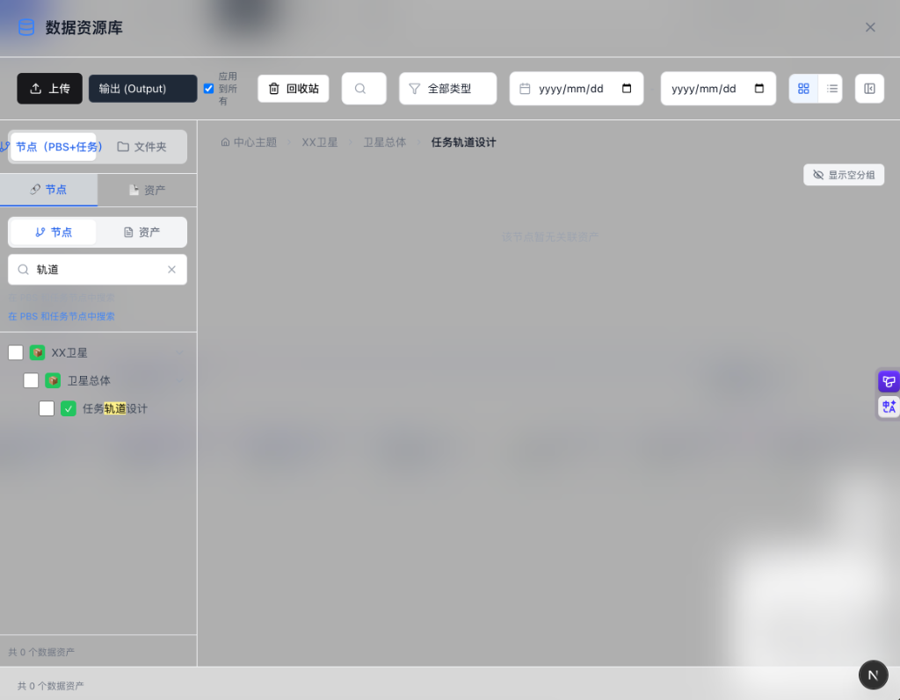
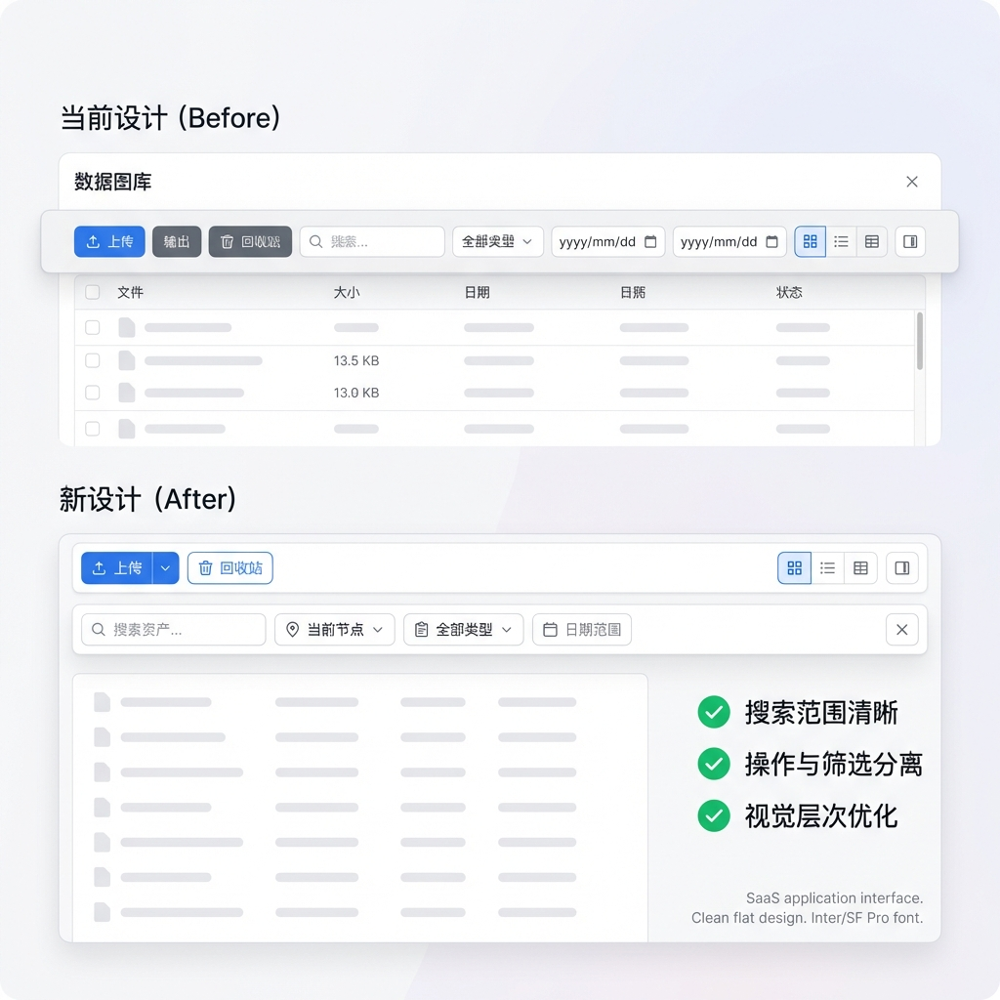
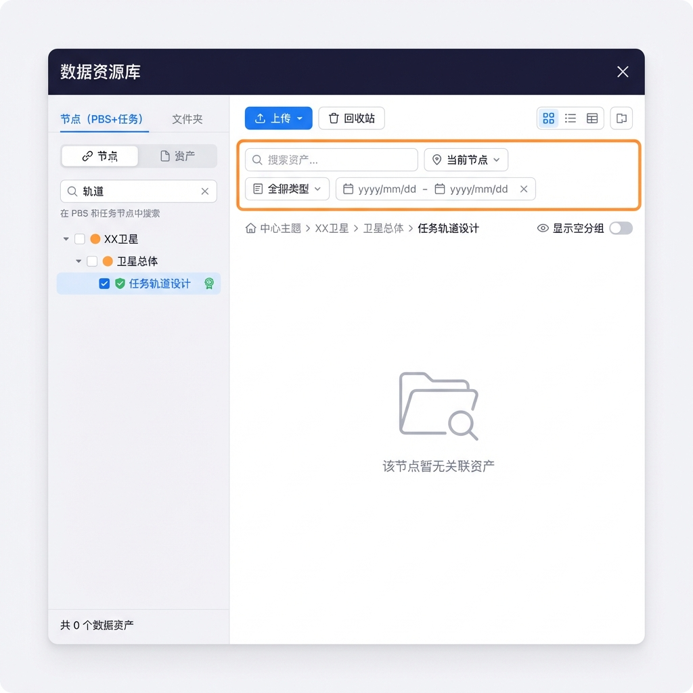
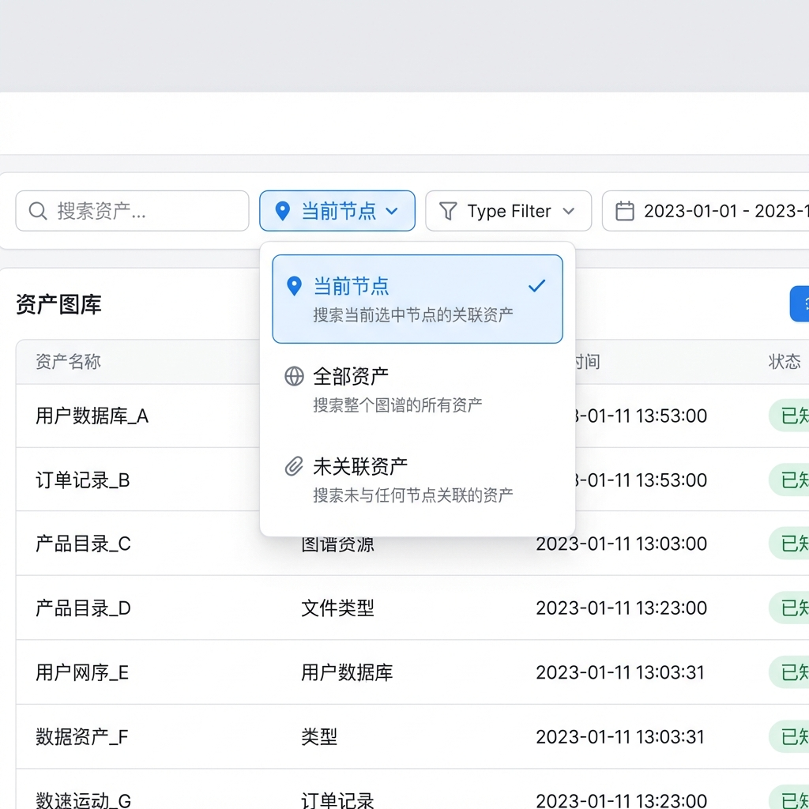
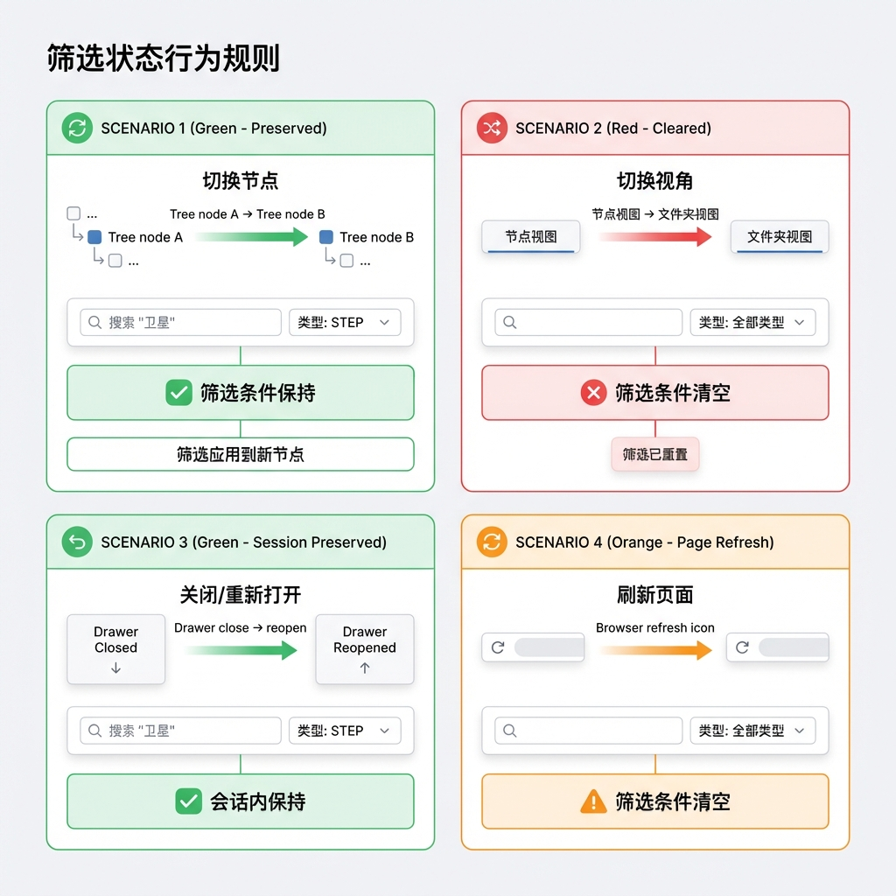
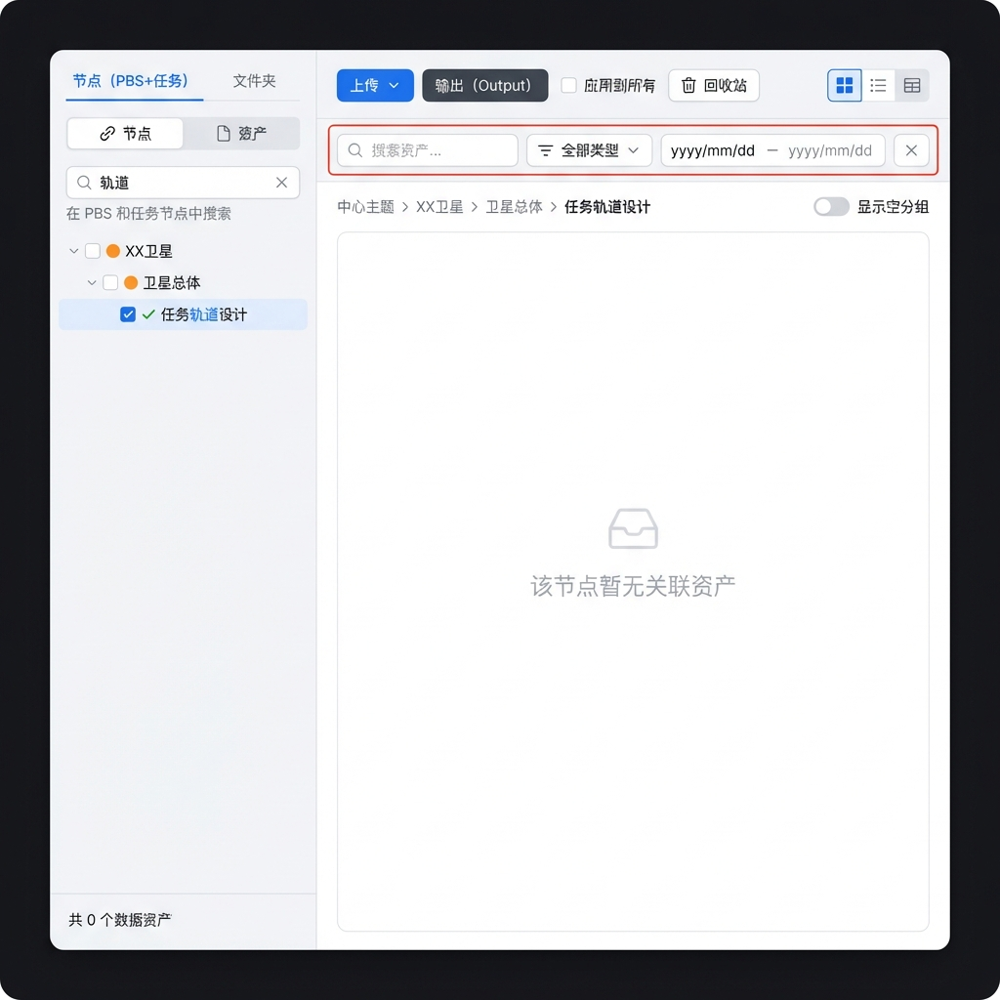

# Story 9.9: 数据资源库 Toolbar 重设计 (Data Library Toolbar Redesign)

Status: done

## Story

As a **用户**,
I want **在数据资源库中使用精简的操作类 Toolbar 和独立的资产筛选栏**,
so that **我能清晰区分"节点搜索"与"资产搜索"，并在不同视角下获得一致的筛选体验。**

## 背景

在完成 Story 9.8（节点视图合并）后，数据资源库 Toolbar 存在以下交互问题：

1. **搜索功能重叠与歧义**：左侧节点面板搜索节点，顶部 Toolbar 搜索资产，用户容易混淆
2. **高级筛选无法复用**：切换视角后筛选行为不一致，UI 未明确表达筛选范围
3. **视觉层次混乱**：操作类、筛选类、视图控制类按钮混合在单行 Toolbar 中，功能密度过高

## Acceptance Criteria

### AC1: Toolbar 精简（操作类聚焦）

**Given** 数据资源库 Drawer 已打开
**When** 查看顶部 Toolbar
**Then** 应只包含操作类控件：上传按钮、批量删除按钮（条件显示）、回收站按钮、视图切换、左侧面板 Toggle
**And** 搜索输入框、类型筛选下拉、日期范围选择器应从 Toolbar 移除
**And** Toolbar 高度 ≤ 56px，控件数量 ≤ 6 个

### AC2: 资产筛选栏（Asset Filter Bar）

**Given** 数据资源库 Drawer 已打开
**When** 查看内容区顶部
**Then** 应显示独立的资产筛选栏，包含：搜索输入框、搜索范围选择器、类型筛选下拉、日期范围选择器、清除筛选按钮
**And** 筛选栏高度 ≤ 48px
**And** 搜索输入有 300ms debounce
**And** 筛选结果实时更新（无需手动刷新）
**And** 筛选条件变化时显示「已应用 N 个筛选」徽章

### AC3: 搜索范围选择器（Scope Selector）

**Given** 资产筛选栏处于激活状态
**When** 查看搜索范围选择器
**Then** 应显示三个选项：`当前节点`（默认）、`全部资产`、`未关联资产`
**And** 切换范围后搜索结果立即刷新
**And** 选择「全部资产」时隐藏 linkType 分组（因为不再按节点过滤）

### AC4: 筛选状态行为（Filter State Behavior）

**Given** 用户在节点视图中设置了筛选条件（搜索关键词、类型、日期）
**When** 切换节点（同视角内）
**Then** 筛选条件保持不变，应用到新节点

**When** 切换视角（节点↔文件夹）
**Then** 所有筛选条件清空
**And** 显示 Toast 提示「筛选已重置」

**When** 关闭/重新打开 Drawer
**Then** 筛选条件保持（会话内）

**When** 刷新页面
**Then** 筛选条件清空（不持久化）

### AC5: 左侧节点搜索增强

**Given** 节点视图处于激活状态
**When** 查看左侧组织面板的搜索框
**Then** 搜索输入框下方显示「在 PBS 和任务节点中搜索」帮助提示
**And** 节点搜索保持现有功能：按节点名称搜索、高亮匹配文本、自动展开命中节点路径
**And** 清空节点搜索后恢复完整节点树
**And** 节点搜索与资产搜索完全独立（无状态共享）

### AC6: 批量操作增强

**Given** 节点视图中选中了多个资产
**When** 查看资产面板
**Then** 应显示批量删除按钮（使用红色警示色）
**And** 批量删除操作应调用"解绑"而非物理删除（与 Story 9.8 AC7 保持一致）
**And** 操作后显示 Undo Toast

---

## UI 设计原型

> [!NOTE]
> 以下 UI 原型与项目现有设计风格保持一致（浅色主题、蓝色强调色、卡片式布局、圆角 UI 元素），详细展示各 AC 的视觉规格。

### 当前问题：Toolbar 设计截图

展示当前 Toolbar 的单行混合设计问题：



**当前问题分析：**
| 问题         | 描述                                   |
| ------------ | -------------------------------------- |
| 搜索功能重叠 | 左侧节点搜索 vs 顶部资产搜索，用户困惑 |
| 筛选控件混乱 | 类型筛选、日期范围与操作按钮并列       |
| 视觉层次不清 | 操作类、筛选类、视图控制类混合在单行   |

---

### 原型 1: 新旧设计对比 (Before vs After)

展示从单行混合 Toolbar 到双行分层设计的变化：



**设计变化要点：**

| 方面            | 当前设计 (Before)           | 新设计 (After)         |
| --------------- | --------------------------- | ---------------------- |
| **Toolbar内容** | 操作+筛选混合（10+控件）    | 仅操作类（6个控件）    |
| **搜索位置**    | Toolbar中（与节点搜索混淆） | 独立筛选栏（位置清晰） |
| **筛选控件**    | 与操作按钮并列              | 单独一行，紧邻资产列表 |
| **视觉层次**    | 单层，密度高                | 双层，层次分明         |

**新设计优势：**
- ✅ 搜索范围清晰
- ✅ 操作与筛选分离
- ✅ 视觉层次优化

---

### 原型 2: 完整布局视图 (Full Layout)

展示合并后的节点视图完整布局，包含所有新增组件：



**整体布局结构：**

```
┌─────────────────────────────────────────────────────────────────────────────┐
│                            数据资源库                                    ✕   │
├───────────────────────┬─────────────────────────────────────────────────────┤
│                       │  📤 上传 ▾   📁 回收站  │              ⊞ ≡ 📊  ☰  │
│  节点(PBS+任务) │文件夹│  [仅保留操作类按钮]    │                           │
│ ─────────────────── ├─────────────────────────────────────────────────────┤
│  🔗节点    📄资产   │  🔍 搜索资产... │ 📍范围▾ │ 📋类型▾ │ 📅 日期范围  │
│ ─────────────────── │  [新增：独立资产筛选栏]                              │
│  🔍 [搜索节点...]  ✕├─────────────────────────────────────────────────────┤
│  在PBS和任务中搜索   │  中心主题 > XX卫星 > 卫星总体 > 任务轨道设计         │
│ ─────────────────── ├─────────────────────────────────────────────────────┤
│  □ 🟠 XX卫星         │                                                      │
│    □ 🟠 卫星总体     │              [资产网格/列表]                         │
│      ☑ ✓ 任务轨道设计│                                                      │
│         ...          │                                                      │
│ ─────────────────── │                                                      │
│  已选 3 个节点 [清除]│                                                      │
│  共 156 个数据资产   │                                                      │
└───────────────────────┴─────────────────────────────────────────────────────┘
```

**左侧面板规格：**

| 元素    | 规格                        |
| ------- | --------------------------- |
| 宽度    | 220px                       |
| Tab切换 | `节点(PBS+任务)` / `文件夹` |
| 二级Tab | `🔗节点` / `📄资产`           |
| 搜索框  | 带清除按钮，下方帮助文字    |
| 节点树  | checkbox多选 + 类型图标     |

**右侧内容区规格：**

| 行         | 内容                    | 高度   |
| ---------- | ----------------------- | ------ |
| Toolbar    | 上传、回收站、视图切换  | 56px   |
| 筛选栏     | 搜索、范围、类型、日期  | 48px   |
| Breadcrumb | 路径导航 + 空分组Toggle | 40px   |
| 内容区     | 资产网格/列表           | flex-1 |

---

### 原型 3: 搜索范围选择器 (Scope Selector)

展示搜索范围下拉菜单的展开状态：



**选项设计：**

| 选项             | 图标 | 描述                       | 使用场景       |
| ---------------- | ---- | -------------------------- | -------------- |
| **📍 当前节点**   | 📍    | 搜索当前选中节点的关联资产 | 查看节点交付物 |
| **🌐 全部资产**   | 🌐    | 搜索整个图谱的所有资产     | 跨节点查找     |
| **📎 未关联资产** | 📎    | 搜索未与任何节点关联的资产 | 数据整理       |

**交互规格：**
- 默认选中：`当前节点`
- 切换后立即刷新搜索结果
- 选中项显示蓝色背景+勾选标记
- 每个选项包含主标题+描述副文本

---

### 原型 4: 筛选状态行为规则 (Filter State Behavior)

展示四种场景下筛选状态的行为：



**行为规则详解：**

#### 场景 1: 切换节点 (✅ 保持)
```
节点 A → 节点 B
筛选条件：保持不变
结果：筛选应用到新节点
```

#### 场景 2: 切换视角 (❌ 清空)
```
节点视图 → 文件夹视图
筛选条件：清空
提示：Toast "筛选已重置"
```

#### 场景 3: 关闭/重新打开 (✅ 会话内保持)
```
Drawer 关闭 → 重新打开
筛选条件：保持（会话内）
```

#### 场景 4: 刷新页面 (⚠️ 清空)
```
浏览器刷新
筛选条件：清空（不持久化）
```

---

### 原型 5: 初版设计草图

早期头脑风暴阶段的概念设计：



---

### UI 组件文件结构

```
apps/web/features/data-library/
├── components/
│   ├── asset-filter/                 # [NEW] 资产筛选栏模块
│   │   ├── AssetFilterBar.tsx        # 筛选栏主组件
│   │   ├── ScopeSelector.tsx         # 范围选择器
│   │   ├── TypeFilter.tsx            # 类型筛选
│   │   ├── DateRangeFilter.tsx       # 日期范围
│   │   └── index.ts
│   ├── data-library-drawer/
│   │   ├── DataLibraryDrawerToolbar.tsx  # [MODIFY] 精简为操作类
│   │   ├── DataLibraryDrawerContent.tsx  # [MODIFY] 集成筛选栏
│   │   └── DataLibraryDrawerView.tsx     # [MODIFY] 布局调整
│   └── node-tree/
│       └── NodeTreeView.tsx              # [MODIFY] 添加搜索帮助文字
└── hooks/
    └── useAssetFilterState.ts            # [NEW] 筛选状态 Hook
```

---

### 样式规范

#### 筛选栏样式

| 属性   | 亮色模式            | 暗色模式            |
| ------ | ------------------- | ------------------- |
| 背景色 | `#FFFFFF`           | `#1F2937`           |
| 边框   | `1px solid #E5E7EB` | `1px solid #374151` |
| 圆角   | `8px`               | `8px`               |
| 高度   | `48px`              | `48px`              |
| 内边距 | `12px 16px`         | `12px 16px`         |

#### 颜色规范

| 用途     | 亮色模式  | 暗色模式  |
| -------- | --------- | --------- |
| 主按钮   | `#3B82F6` | `#3B82F6` |
| 危险按钮 | `#EF4444` | `#EF4444` |
| 选中状态 | `#EFF6FF` | `#1E3A5F` |
| 边框     | `#E5E7EB` | `#374151` |
| 文字     | `#111827` | `#F9FAFB` |

#### 控件规格

**搜索输入框：**
| 属性        | 值                 |
| ----------- | ------------------ |
| 高度        | `36px`             |
| 宽度        | `flex-1`（自适应） |
| 圆角        | `8px`              |
| Placeholder | `搜索资产...`      |
| 图标        | 🔍 左侧内置         |

**范围选择器：**
| 属性     | 值                 |
| -------- | ------------------ |
| 类型     | Dropdown Select    |
| 宽度     | `auto`（内容适应） |
| 默认选项 | `当前节点`         |
| 选项样式 | 带图标（📍/🌐/📎）    |

## Tasks / Subtasks

- [x] Task 1: 创建 AssetFilterBar 组件 (AC: #2, #3)
  - [x] 1.1 创建 `components/asset-filter/` 目录结构
  - [x] 1.2 实现 `AssetFilterBar.tsx` 主组件（搜索输入 + 筛选下拉）
  - [x] 1.3 实现 `ScopeSelector.tsx` 搜索范围选择器（三选项下拉）
  - [x] 1.4 实现 `TypeFilter.tsx` 类型筛选器（复用现有 DataFormat 枚举）
  - [x] 1.5 实现 `DateRangeFilter.tsx` 日期范围选择器
  - [x] 1.6 添加 300ms debounce 逻辑到搜索输入
  - [x] 1.7 实现「已应用 N 个筛选」徽章

- [x] Task 2: 重构 DataLibraryDrawerToolbar (AC: #1)
  - [x] 2.1 移除 Toolbar 中的搜索输入框
  - [x] 2.2 移除 Toolbar 中的类型筛选下拉
  - [x] 2.3 移除 Toolbar 中的日期范围选择器
  - [x] 2.4 保留操作类控件：上传按钮、批量删除（条件显示）、回收站
  - [x] 2.5 保留视图控制类控件：网格/列表切换、左侧面板 Toggle
  - [x] 2.6 调整 Toolbar 布局（高度 ≤ 56px）

- [x] Task 3: 筛选状态管理重构 (AC: #4)
  - [x] 3.1 创建 `useAssetFilterState` Hook（管理 assetSearchQuery、searchScope、formatFilter、createdAfter、createdBefore）
  - [x] 3.2 实现筛选状态在切换节点时保持
  - [x] 3.3 实现筛选状态在切换视角时清空 + Toast 提示
  - [x] 3.4 实现筛选状态会话内保持（Drawer 关闭/重开）
  - [x] 3.5 更新 `DataLibraryDrawerPanel.tsx` 集成新筛选栏

- [x] Task 4: 支持「未关联资产」范围（API + Types）(AC: #3)
  - [x] 4.1 扩展 `@cdm/types` 的 `DataAssetQueryDto`：新增 `linkStatus?: 'unlinked'`
  - [x] 4.2 后端 `GET /api/data-assets` 支持 `linkStatus=unlinked`
    - 在 `data-asset.controller.ts` 的 `list` 方法添加 `linkStatus` 查询参数
    - 在 `data-asset.repository.ts` 添加 WHERE 条件：`nodeLinks: { none: {} }`
    - 确保分页和其他筛选条件正常工作
  - [x] 4.3 前端 `fetchDataAssets` / `useDataAssets` 支持透传 `linkStatus`
  - [x] 4.4 添加单元测试验证 unlinked 筛选正确性

- [x] Task 5: 集成资产筛选栏到 Drawer + 搜索迁移 (AC: #2, #3, #5)
  - [x] 5.1 在 `DataLibraryDrawerPanel.tsx` 布局中插入 `AssetFilterBar`
  - [x] 5.2 将筛选状态传递给 `useDataAssets` / `useSelectedNodesAssets` / `useAssetLinks`，并按 `searchScope` 切换数据来源（AC3）
  - [x] 5.3 修改左侧节点搜索：仅保留节点搜索输入框（移除/禁用左侧资产搜索入口），并显示帮助文字「在 PBS 和任务节点中搜索」
  - [x] 5.4 确保节点搜索与资产搜索状态独立
  - [x] 5.5 **[DualSearch 迁移]** 移除 `DualSearch.tsx` 中的 `searchMode='asset'` 分支和切换 UI
  - [x] 5.6 **[DualSearch 迁移]** 将 `DualSearch` 重命名或简化为 `NodeSearch`（仅保留节点搜索功能）
  - [x] 5.7 **[DualSearch 迁移]** 从 `DataLibraryDrawer.tsx` 移除 `searchMode` 状态及相关逻辑（lines 74-166）
  - [x] 5.8 **[DualSearch 迁移]** 更新 `DataLibraryDrawerContent.tsx` 移除对 `searchMode` 的依赖

- [x] Task 6: 批量操作增强 (AC: #6)
  - [x] 6.1 更新批量删除按钮样式（红色警示色）
  - [x] 6.2 确保批量删除调用解绑 API（复用 Story 9.8 的 `useNodeAssetUnlink`）
  - [x] 6.3 添加 Undo Toast

- [x] Task 7: 单元测试
  - [x] 7.1 `AssetFilterBar.test.tsx` - 筛选栏组件测试
  - [x] 7.2 `ScopeSelector.test.tsx` - 范围选择器测试
  - [x] 7.3 `useAssetFilterState.test.ts` - 筛选状态 Hook 测试
  - [x] 7.4 **[更新现有测试]** `DataLibraryDrawer.test.tsx` - 移除对 toolbar 搜索框/日期选择器的断言
  - [x] 7.5 **[更新现有测试]** `DualSearch.test.tsx` - 更新为仅测试节点搜索（移除 asset mode 测试）

- [x] Task 8: E2E 测试
  - [x] 8.1 `toolbar-redesign.spec.ts` - Toolbar 操作按钮测试
  - [x] 8.2 资产筛选栏功能测试
  - [x] 8.3 视角切换筛选重置测试
  - [x] 8.4 **[更新现有测试]** `data-library.spec.ts` - 更新搜索/筛选相关用例（lines 139-163）

- [x] Task 9: Review Follow-ups (AI) - Code Review 2026-01-14 (Resolved 2026-01-14)
  - [x] 9.1 [HIGH] E2E AC4 Toast 验证缺失 - 补充验证「筛选已重置」Toast 显示
  - [x] 9.2 [MEDIUM] ScopeSelector 键盘无障碍 - 增加 Arrow/Enter/Escape 键盘导航
  - [x] 9.3 [MEDIUM] scopeDisabled 逻辑未启用 - 节点未选中时禁用「当前节点」scope
  - [x] 9.4 [MEDIUM] DualSearch 兼容导出误导 - `NodeSearch.tsx` 保留 `DualSearch` 别名并添加 @deprecated
  - [x] 9.5 [MEDIUM] FilterBadge ARIA 缺失 - 补充 `role="status"` + `aria-live`
  - [x] 9.6 [LOW] 文件未重命名 - `DualSearch.tsx` 已重命名为 `NodeSearch.tsx`（Task 5.6）
  - [x] 9.7 [LOW] 测试硬编码字符串 - 从 `SCOPE_OPTIONS` 常量导入/生成断言

## Dev Notes

### 技术规格说明

> [!IMPORTANT]
> 本 Story 基于 Story 9.8（节点视图合并）的实现，复用其组件和 API。

### 架构约束

- **数据模型**：使用现有 `DataAsset` 和 `NodeDataLink` 模型
- **状态管理**：筛选状态与节点选择状态分离管理
- **组件复用**：复用 Story 9.8 的 `useNodeAssetUnlink`、`GroupedAssetList` 等组件

---

### 🚧 工程规范护栏 (Engineering Guardrails)

> [!CAUTION]
> 以下规则是开发者**必须遵守**的硬性约束，违反将导致代码审查失败。

#### 🚨 反模式警告 (Anti-Patterns)

| 反模式                | 禁止示例                                   | 正确做法                      | 原因                                   |
| --------------------- | ------------------------------------------ | ----------------------------- | -------------------------------------- |
| **直接 fetch 调用**   | 组件内 `fetch('/api/data-assets')`         | 使用 `useDataAssets` Hook     | 符合 Hook-First 模式，逻辑可复用可测试 |
| **双状态写入**        | `setState(x); api.update(x)`               | 仅修改状态，由 Hook 处理同步  | 避免数据不一致和竞态条件               |
| **localStorage 滥用** | 筛选状态存 localStorage                    | React State（会话级）         | 筛选状态无需持久化，刷新重置是预期行为 |
| **硬编码字符串**      | `'current-node'` 散落代码                  | 使用 `SearchScope` 枚举       | 类型安全，IDE 提示，重构友好           |
| **内联样式**          | `style={{ height: 48 }}`                   | TailwindCSS `h-12`            | 遵循 Utility-First 策略                |
| **跨包相对导入**      | `import { X } from '../../../packages/ui'` | `import { X } from '@cdm/ui'` | 使用 Workspace 别名                    |

#### ✅ 必须遵循的模式 (Mandatory Patterns)

##### 1. 类型定义来源
```typescript
// ❌ 禁止：在组件/Hook 中定义业务类型
interface AssetFilterState { ... }

// ✅ 正确：从 @cdm/types 导入或扩展
import { DataAssetFormat } from '@cdm/types';

// 如需扩展，在 packages/types 中定义
export interface AssetFilterState {
  assetSearchQuery: string;
  searchScope: SearchScope;
  formatFilter: DataAssetFormat | '';
  // ...
}
```

##### 2. Hook 逻辑封装
```typescript
// ❌ 禁止：组件内直接管理筛选逻辑
function AssetFilterBar() {
  const [query, setQuery] = useState('');
  const [scope, setScope] = useState<SearchScope>('current-node');
  // ... 大量逻辑
}

// ✅ 正确：抽离至专用 Hook
function AssetFilterBar() {
  const {
    filterState,
    setAssetSearchQuery,
    setSearchScope,
    clearAllFilters,
    activeFilterCount,
  } = useAssetFilterState();
  // 组件仅负责 UI 渲染
}
```

##### 3. 组件导入来源
```typescript
// ❌ 禁止：使用原生 HTML 或自定义样式
<button className="my-btn">上传</button>
<input className="search-input" />

// ✅ 正确：使用 @cdm/ui 组件库
import { Button, Input, Select } from '@cdm/ui';
<Button variant="primary">上传</Button>
<Input placeholder="搜索资产..." icon={<SearchIcon />} />
```

##### 4. debounce 实现
```typescript
// ✅ 推荐：复用仓库已有的 use-debounce（apps/web 已依赖且已有使用案例）
import { useDebounce } from 'use-debounce';

const [debouncedQuery] = useDebounce(query, 300);

// ✅ 也可：沿用当前 Data Library 已存在的 setTimeout debounce 写法（保持一致即可）
useEffect(() => {
  const timer = setTimeout(() => onSearch(query), 300);
  return () => clearTimeout(timer);
}, [query]);
```

##### 5. 事件处理命名
```typescript
// ❌ 禁止：模糊命名
const handleChange = () => { ... };
const onClick = () => { ... };

// ✅ 正确：清晰语义命名
const handleSearchQueryChange = (query: string) => { ... };
const handleScopeSelect = (scope: SearchScope) => { ... };
const handleClearFilters = () => { ... };
```

#### ⚠️ 边缘情况处理 (Edge Cases)

| 场景                     | 处理方式                                    | 测试用例 |
| ------------------------ | ------------------------------------------- | -------- |
| 筛选结果为空             | 显示空态组件 + 清除筛选按钮                 | IT-2.5   |
| 搜索输入特殊字符         | 使用 `escapeRegex()` 处理（复用 Story 9.8） | UT-1.7   |
| 节点未选中时切换范围     | `当前节点` 禁用或显示提示                   | IT-4.4   |
| 文件夹视图无范围选择器   | 隐藏 ScopeSelector 或锁定为 `当前文件夹`    | IT-4.5   |
| 快速切换视角（连续点击） | debounce 视角切换，防止状态闪烁             | -        |
| 网络请求失败             | 显示错误 Toast，保持筛选状态供重试          | -        |

#### ⚡ 性能规则 (Performance Rules)

| 规则              | 要求                                                                              | 验证方式     |
| ----------------- | --------------------------------------------------------------------------------- | ------------ |
| **筛选响应时间**  | P95 < 200ms                                                                       | E2E 性能断言 |
| **搜索 debounce** | 300ms                                                                             | UT-1.2       |
| **初始渲染**      | 筛选栏 FCP < 50ms                                                                 | Lighthouse   |
| **组件拆分**      | 每个筛选控件独立组件（ScopeSelector/TypeFilter/DateRangeFilter）                  | 代码审查     |
| **依赖控制**      | 日期范围使用原生 `input[type="date"]`（与现有实现一致，不引入新 DatePicker 依赖） | 代码审查     |

#### 🔒 状态隔离规则 (State Isolation)

```typescript
// 状态分层设计
interface DataLibraryDrawerState {
  // === 组织状态（来自 Story 9.8）===
  activeNodeId: string | null;        // 当前激活节点（breadcrumb）
  selectedNodeIds: Set<string>;       // 多选节点集合（并集查询）
  nodeExpandedIds: Set<string>;       // 节点树展开状态
  nodeSearchQuery: string;            // 🔗 左侧节点搜索（独立！）

  // === 筛选状态（本 Story 新增）===
  assetSearchQuery: string;           // 🔗 右侧资产搜索（独立！）
  searchScope: SearchScope;           // 搜索范围
  formatFilter: DataAssetFormat | ''; // 类型筛选
  createdAfter: string;               // 日期范围起
  createdBefore: string;              // 日期范围止
}

// 🚨 关键隔离点
// nodeSearchQuery 与 assetSearchQuery 必须完全独立
// 修改一个不得影响另一个
```

#### 📁 文件组织规则 (File Organization)

```
apps/web/features/data-library/components/asset-filter/
├── AssetFilterBar.tsx        # 主组件（< 150 行）
├── ScopeSelector.tsx         # 范围选择器（< 100 行）
├── TypeFilter.tsx            # 类型筛选（< 80 行）
├── DateRangeFilter.tsx       # 日期范围（< 100 行）
├── FilterBadge.tsx           # 筛选徽章（< 50 行）
├── index.ts                  # 统一导出
└── __tests__/
    ├── AssetFilterBar.test.tsx
    ├── ScopeSelector.test.tsx
    └── ...
```

**文件大小限制**：
- 组件文件：< 200 行（超过需拆分）
- Hook 文件：< 150 行
- 测试文件：无限制，但单个测试 < 30 行

#### 🧪 测试规则 (Testing Rules)

```typescript
// ❌ 禁止：测试实现细节
expect(component.state.query).toBe('test');

// ✅ 正确：测试用户可见行为
expect(screen.getByPlaceholderText('搜索资产...')).toHaveValue('test');
expect(screen.getByText('已应用 2 个筛选')).toBeInTheDocument();

// ❌ 禁止：Mock 过多内部模块
import { vi } from 'vitest';
vi.mock('../hooks/useAssetFilterState');
vi.mock('../components/ScopeSelector');

// ✅ 正确：只 Mock 外部依赖（API/Router）
vi.mock('@/lib/api');
```

---

### API Contracts

- **[EXISTING]** `GET /api/data-assets` - 支持 `search` / `format` / `folderId` / `createdAfter` / `createdBefore` / 分页
- **[NEW]** `GET /api/data-assets?linkStatus=unlinked` - 仅返回未与任何节点关联的资产（`NodeDataLink`=0），响应仍为 `DataAssetListResponse`
- **[EXISTING]** `POST /api/data-assets/links:detailByNodes` - 批量节点资产详情（Story 9.8）
- **[EXISTING]** `POST /api/data-assets/links:destroyByNodes` - 批量解绑（Story 9.8）

#### linkStatus API 详细规格

```typescript
// packages/types/src/data-library-types.ts
export interface DataAssetQueryDto {
  graphId: string;
  search?: string;
  format?: DataAssetFormat;
  folderId?: string;
  createdAfter?: string;
  createdBefore?: string;
  linkStatus?: 'unlinked';  // [NEW] 仅返回无 NodeDataLink 的资产
  page?: number;
  pageSize?: number;
}

// 后端实现要点 (data-asset.service.ts)
// 当 linkStatus === 'unlinked' 时：
// WHERE: { graphId, ..., nodeLinks: { none: {} } }
// 或使用 _count 过滤：having _count.nodeLinks = 0
```

### 关键改动落点

| 文件                                                                                         | 类型     | 描述                                         |
| -------------------------------------------------------------------------------------------- | -------- | -------------------------------------------- |
| `apps/web/features/data-library/components/asset-filter/AssetFilterBar.tsx`                  | [NEW]    | 资产筛选栏主组件                             |
| `apps/web/features/data-library/components/asset-filter/ScopeSelector.tsx`                   | [NEW]    | 搜索范围选择器                               |
| `apps/web/features/data-library/components/asset-filter/TypeFilter.tsx`                      | [NEW]    | 类型筛选器                                   |
| `apps/web/features/data-library/components/asset-filter/DateRangeFilter.tsx`                 | [NEW]    | 日期范围选择器                               |
| `apps/web/features/data-library/components/asset-filter/index.ts`                            | [NEW]    | 导出入口                                     |
| `apps/web/features/data-library/hooks/useAssetFilterState.ts`                                | [NEW]    | 筛选状态管理 Hook                            |
| `apps/web/features/data-library/components/data-library-drawer/DataLibraryDrawerToolbar.tsx` | [MODIFY] | 移除筛选控件，精简为操作类                   |
| `apps/web/features/data-library/components/data-library-drawer/DataLibraryDrawerContent.tsx` | [MODIFY] | 集成 AssetFilterBar                          |
| `apps/web/features/data-library/components/data-library-drawer/DataLibraryDrawerView.tsx`    | [MODIFY] | 布局调整                                     |
| `apps/web/features/data-library/components/node-tree/NodeTreeView.tsx`                       | [MODIFY] | 添加搜索帮助文字                             |
| `apps/web/features/data-library/components/node-tree/DualSearch.tsx`                         | [MODIFY] | **[迁移]** 移除 asset 模式，简化为仅节点搜索 |
| `apps/web/features/data-library/components/DataLibraryDrawer.tsx`                            | [MODIFY] | **[迁移]** 移除 `searchMode` 状态            |
| `packages/types/src/data-library-types.ts`                                                   | [MODIFY] | 新增 `linkStatus` 类型定义                   |
| `apps/api/src/modules/data-management/data-asset.controller.ts`                              | [MODIFY] | 新增 `linkStatus` 查询参数                   |
| `apps/api/src/modules/data-management/data-asset.service.ts`                                 | [MODIFY] | 实现 unlinked 过滤逻辑                       |

### 技术决策

| Decision      | Choice                  | Rationale                          |
| ------------- | ----------------------- | ---------------------------------- |
| 筛选栏位置    | 内容区顶部（Row 2）     | 紧邻筛选结果，减少认知距离         |
| 搜索范围存储  | React State（会话级）   | 无需持久化，刷新后重置符合用户预期 |
| debounce 时间 | 300ms                   | 平衡响应速度与请求频率             |
| 范围选择器 UI | Dropdown + 图标         | 与现有 UI 风格一致                 |
| 批量操作      | 复用 Story 9.8 解绑逻辑 | 减少代码重复，保持一致性           |

### UI 设计规格

> [!NOTE]
> 详细 UI 原型已包含在 PRD 中：[story-9-9-toolbar-redesign-prd.md](../plans/story-9-9-toolbar-redesign-prd.md)

**筛选栏样式：**
| 属性   | 值                                   |
| ------ | ------------------------------------ |
| 背景色 | `#FFFFFF`（亮色）/ `#1F2937`（暗色） |
| 边框   | `1px solid #E5E7EB`                  |
| 圆角   | `8px`                                |
| 高度   | `48px`                               |
| 内边距 | `12px 16px`                          |

**搜索输入框：**
| 属性        | 值            |
| ----------- | ------------- |
| 高度        | `36px`        |
| 宽度        | `flex-1`      |
| Placeholder | `搜索资产...` |
| 图标        | 🔍 左侧内置    |

**范围选择器选项：**
| 选项       | 图标 | 描述                       |
| ---------- | ---- | -------------------------- |
| 当前节点   | 📍    | 搜索当前选中节点的关联资产 |
| 全部资产   | 🌐    | 搜索整个图谱的所有资产     |
| 未关联资产 | 📎    | 搜索未与任何节点关联的资产 |

### 与现有 Story 的兼容性

| Story     | 影响程度 | 兼容策略                             |
| --------- | -------- | ------------------------------------ |
| Story 9.1 | 🔴 高     | 保留 Drawer 核心逻辑，仅重构 Toolbar |
| Story 9.2 | 🟡 中     | Tab 组件不变，筛选逻辑抽离           |
| Story 9.5 | 🟢 低     | 上传按钮保留在 Toolbar               |
| Story 9.7 | 🟢 低     | 上传类型下拉保留在 Toolbar           |
| Story 9.8 | 🟡 中     | 解决双搜索状态歧义；复用解绑逻辑     |

### 状态管理设计

```typescript
// 新状态设计（补充现有 DataLibraryDrawerState）
interface AssetFilterState {
  // 资产筛选（右侧筛选栏）
  assetSearchQuery: string;
  searchScope: 'current-node' | 'all' | 'unlinked';
  formatFilter: DataAssetFormat | '';
  createdAfter: string;
  createdBefore: string;
}

// 使用方式
const {
  filterState,
  setAssetSearchQuery,
  setSearchScope,
  setFormatFilter,
  setDateRange,
  clearAllFilters,
  activeFilterCount,
} = useAssetFilterState();
```

### 搜索迁移计划（必须执行）

> [!IMPORTANT]
> 本 Story 的核心目标之一是彻底消除“节点搜索 vs 资产搜索”的双入口与双状态。

1. **左侧组织面板：仅节点搜索**
   - 移除/禁用左侧 `DualSearch` 的「资产」模式与切换 UI，只保留节点搜索输入框
   - 节点搜索状态使用 `nodeSearchQuery`（仅影响树过滤/高亮/展开，不触发 `data-assets` 请求）
2. **右侧内容区：仅资产筛选栏**
   - Toolbar 不再承载任何筛选控件（AC1）
   - 资产筛选状态使用 `assetSearchQuery` + `searchScope` + `format/date`
3. **按 `searchScope` 分流数据来源（AC3）**
   - `current-node`：复用节点关联数据源（单节点：`useAssetLinks`；多节点：`useSelectedNodesAssets`），并在前端对返回资产应用搜索/类型/日期过滤
   - `all`：使用 `useDataAssets({ search, format, createdAfter, createdBefore })`，以扁平列表展示（隐藏 linkType 分组）
   - `unlinked`：使用 `useDataAssets({ ..., linkStatus: 'unlinked' })`，以扁平列表展示（隐藏 linkType 分组）
4. **状态隔离与重置规则（AC4/AC5）**
   - 切换节点：资产筛选保持不变并应用到新节点
   - 切换视角（节点↔文件夹）：资产筛选清空并 Toast 提示「筛选已重置」
   - `nodeSearchQuery` 与 `assetSearchQuery` 永远互不影响

### 与 Story 9.8 的关系

本 Story 解决 Story 9.8 实现后遗留的以下问题：

1. **双搜索歧义**：Story 9.8 保留了左侧节点搜索和右侧 Toolbar 资产搜索，但未明确区分
2. **筛选控件位置**：Story 9.8 未调整 Toolbar 结构，筛选控件仍与操作按钮混合
3. **搜索范围选择**：Story 9.8 的资产搜索默认为全局，缺少"当前节点/全部/未关联"的范围选择

### Project Structure Notes

- 新增组件目录：`apps/web/features/data-library/components/asset-filter/`
- 新增 Hook：`useAssetFilterState`
- 复用现有：`DataLibraryDrawer`、`useNodeAssetUnlink`、`GroupedAssetList`

### References

- [story-9-9-toolbar-redesign-prd.md](../plans/story-9-9-toolbar-redesign-prd.md) - 完整 PRD + UI 原型
- [9-8-node-view-merge.md](./9-8-node-view-merge.md) - 前置 Story（节点视图合并）
- [tech-spec-9-8-node-view-merge.md](./tech-spec-9-8-node-view-merge.md) - Story 9.8 技术规格
- [architecture.md](../architecture.md) - 数据管理架构
- [project-context.md](../project-context.md) - 项目上下文与编码规范
- [DataLibraryDrawerToolbar.tsx](../../apps/web/features/data-library/components/data-library-drawer/DataLibraryDrawerToolbar.tsx) - 待重构的 Toolbar 组件
- [DataLibraryDrawerContent.tsx](../../apps/web/features/data-library/components/data-library-drawer/DataLibraryDrawerContent.tsx) - 筛选栏集成落点
- [useDataAssets.ts](../../apps/web/features/data-library/hooks/useDataAssets.ts) - 资产查询 Hook
- [useNodeAssetUnlink.ts](../../apps/web/features/data-library/hooks/useNodeAssetUnlink.ts) - 解绑 + Undo Toast（复用）

## Test Design

### 测试覆盖矩阵

| AC  | 验收要求                   | 单元测试 | 集成测试 | E2E 测试 |
| --- | -------------------------- | -------- | -------- | -------- |
| AC1 | Toolbar 精简（操作类聚焦） | UT-4     | IT-1     | E2E-1    |
| AC2 | 资产筛选栏                 | UT-1     | IT-2     | E2E-2    |
| AC3 | 搜索范围选择器             | UT-2     | IT-4     | E2E-4    |
| AC4 | 筛选状态行为               | UT-3     | IT-3     | E2E-3    |
| AC5 | 左侧节点搜索增强           | UT-5     | IT-5     | E2E-5    |
| AC6 | 批量操作增强               | -        | IT-6     | E2E-6    |

### 测试文件结构

```
apps/web/features/data-library/
├── __tests__/
│   ├── AssetFilterBar.test.tsx       # [NEW] 筛选栏组件测试 (UT-1)
│   ├── ToolbarRedesign.test.tsx      # [NEW] Toolbar 重构测试 (UT-4)
│   └── NodeSearchEnhancement.test.tsx # [NEW] 节点搜索增强测试 (UT-5)
├── hooks/__tests__/
│   └── useAssetFilterState.test.ts   # [NEW] 筛选状态 Hook 测试 (UT-3)
└── components/asset-filter/__tests__/
    ├── ScopeSelector.test.tsx        # [NEW] 范围选择器测试 (UT-2)
    └── TypeFilter.test.tsx           # [NEW] 类型筛选测试
```

---

### 单元测试 (Unit Tests)

#### UT-1: AssetFilterBar 组件 (AC2)

| Test ID | 测试用例          | 预期结果                               | AC 验证点            |
| ------- | ----------------- | -------------------------------------- | -------------------- |
| UT-1.1  | 渲染所有筛选控件  | 搜索框、范围、类型、日期均可见         | AC2: 包含所有控件    |
| UT-1.2  | 搜索输入 debounce | 输入后 300ms 触发 onChange             | AC2: 300ms debounce  |
| UT-1.3  | 清除筛选按钮      | 点击后所有筛选重置                     | AC2: 清除筛选按钮    |
| UT-1.4  | 筛选徽章显示      | 设置 2 个筛选后显示「已应用 2 个筛选」 | AC2: 已应用 N 个筛选 |
| UT-1.5  | 筛选栏高度限制    | 组件高度 ≤ 48px                        | AC2: 高度 ≤ 48px     |
| UT-1.6  | 筛选实时更新      | 设置筛选后列表自动刷新（无需手动）     | AC2: 实时更新        |

#### UT-2: ScopeSelector 组件 (AC3)

| Test ID | 测试用例             | 预期结果                              | AC 验证点     |
| ------- | -------------------- | ------------------------------------- | ------------- |
| UT-2.1  | 默认值为「当前节点」 | 初始选中「当前节点」                  | AC3: 默认值   |
| UT-2.2  | 切换范围触发回调     | 点击选项后触发 onChange               | AC3: 切换范围 |
| UT-2.3  | 显示三个选项         | 下拉包含 当前节点/全部资产/未关联资产 | AC3: 三个选项 |
| UT-2.4  | 选项包含图标         | 每个选项显示对应图标 📍/🌐/📎            | AC3: 选项图标 |

#### UT-3: useAssetFilterState Hook (AC4)

| Test ID | 测试用例               | 预期结果                                | AC 验证点         |
| ------- | ---------------------- | --------------------------------------- | ----------------- |
| UT-3.1  | 初始状态为空           | 所有筛选字段为默认值                    | AC4: 初始状态     |
| UT-3.2  | 设置搜索关键词         | `assetSearchQuery` 更新                 | AC4: 状态管理     |
| UT-3.3  | 设置范围               | `searchScope` 更新                      | AC4: 状态管理     |
| UT-3.4  | 清空所有筛选           | 调用 `clearAllFilters` 后重置           | AC4: 清空状态     |
| UT-3.5  | 计算 activeFilterCount | 设置 2 个筛选后返回 2                   | AC2: 徽章计数     |
| UT-3.6  | 切换视角时清空         | 调用 `resetOnViewChange()` 清空所有筛选 | AC4: 切换视角清空 |

#### UT-4: DataLibraryDrawerToolbar 重构 (AC1)

| Test ID | 测试用例         | 预期结果                          | AC 验证点         |
| ------- | ---------------- | --------------------------------- | ----------------- |
| UT-4.1  | 不包含搜索框     | Toolbar 内无 input[type="search"] | AC1: 移除搜索框   |
| UT-4.2  | 不包含类型筛选   | Toolbar 内无类型下拉选择器        | AC1: 移除类型筛选 |
| UT-4.3  | 不包含日期范围   | Toolbar 内无日期选择器            | AC1: 移除日期范围 |
| UT-4.4  | 包含上传按钮     | 上传按钮可见                      | AC1: 保留操作类   |
| UT-4.5  | 包含回收站按钮   | 回收站按钮可见                    | AC1: 保留操作类   |
| UT-4.6  | 包含视图切换     | 网格/列表切换可见                 | AC1: 保留视图控制 |
| UT-4.7  | Toolbar 高度限制 | 组件高度 ≤ 56px                   | AC1: 高度 ≤ 56px  |
| UT-4.8  | 控件数量限制     | 控件总数 ≤ 6                      | AC1: 控件 ≤ 6 个  |

#### UT-5: 节点搜索增强 (AC5)

| Test ID | 测试用例     | 预期结果                                  | AC 验证点         |
| ------- | ------------ | ----------------------------------------- | ----------------- |
| UT-5.1  | 帮助文字显示 | 搜索框下方显示「在 PBS 和任务节点中搜索」 | AC5: 帮助提示     |
| UT-5.2  | 节点搜索功能 | 输入关键词后过滤节点树                    | AC5: 保持现有功能 |
| UT-5.3  | 清空搜索恢复 | 清空搜索后显示完整节点树                  | AC5: 清空恢复     |

---

### 集成测试 (Integration Tests)

#### IT-1: Toolbar 精简 (AC1)

| Test ID | 测试用例           | 预期结果                                                       |
| ------- | ------------------ | -------------------------------------------------------------- |
| IT-1.1  | 打开 Drawer        | Toolbar 只包含操作按钮                                         |
| IT-1.2  | 搜索框不在 Toolbar | `[data-testid="toolbar"] >> input[placeholder*="搜索"]` 不存在 |
| IT-1.3  | 上传按钮存在       | 可见且可点击                                                   |
| IT-1.4  | 回收站按钮存在     | 可见且可点击                                                   |

#### IT-2: 资产筛选栏 (AC2)

| Test ID | 测试用例     | 预期结果                              |
| ------- | ------------ | ------------------------------------- |
| IT-2.1  | 筛选栏可见   | `data-testid="asset-filter-bar"` 存在 |
| IT-2.2  | 搜索资产     | 输入关键词后过滤资产列表              |
| IT-2.3  | 类型筛选     | 选择 STEP 后只显示 STEP 类型资产      |
| IT-2.4  | 日期范围筛选 | 设置日期范围后过滤资产列表            |

#### IT-3: 筛选状态行为 (AC4)

| Test ID | 测试用例         | 预期结果                                 |
| ------- | ---------------- | ---------------------------------------- |
| IT-3.1  | 切换节点保持筛选 | 搜索关键词在节点切换后保留               |
| IT-3.2  | 切换视角清空筛选 | 从节点视图切到文件夹视图后搜索框清空     |
| IT-3.3  | 视角切换 Toast   | 显示「筛选已重置」提示                   |
| IT-3.4  | Drawer 关闭/重开 | 重新打开 Drawer 后筛选条件保持（会话内） |

#### IT-4: 搜索范围选择器 (AC3)

| Test ID | 测试用例         | 预期结果                                           |
| ------- | ---------------- | -------------------------------------------------- |
| IT-4.1  | 切换范围刷新结果 | 选择「全部资产」后立即刷新显示全部资产             |
| IT-4.2  | 全局搜索隐藏分组 | 选择「全部资产」时隐藏 Input/Output/Reference 分组 |
| IT-4.3  | 未关联资产筛选   | 选择「未关联资产」只显示未与节点关联的资产         |

#### IT-5: 左侧节点搜索增强 (AC5)

| Test ID | 测试用例     | 预期结果                       |
| ------- | ------------ | ------------------------------ |
| IT-5.1  | 帮助提示可见 | 节点搜索框下方显示帮助文字     |
| IT-5.2  | 节点搜索独立 | 节点搜索不影响资产筛选栏的状态 |
| IT-5.3  | 资产搜索独立 | 资产搜索不影响节点搜索框的状态 |
| IT-5.4  | 高亮匹配节点 | 搜索后命中节点文本高亮显示     |
| IT-5.5  | 展开命中路径 | 搜索后自动展开命中节点的父路径 |

#### IT-6: 批量操作增强 (AC6)

| Test ID | 测试用例         | 预期结果                                           |
| ------- | ---------------- | -------------------------------------------------- |
| IT-6.1  | 批量删除按钮样式 | 批量删除按钮使用红色警示色                         |
| IT-6.2  | 批量解绑而非删除 | 点击批量删除后调用解绑 API，资产仍存在于文件夹视图 |
| IT-6.3  | Undo Toast 显示  | 批量解绑后显示「已解除 N 个关联」+ 撤销按钮        |
| IT-6.4  | Undo 撤销功能    | 点击撤销后恢复关联                                 |

---

### E2E 测试 (Playwright)

| Test ID | 测试场景             | 验证步骤                                                                                                                       | AC  |
| ------- | -------------------- | ------------------------------------------------------------------------------------------------------------------------------ | --- |
| E2E-1   | Toolbar 操作按钮正常 | 1. 打开 Drawer<br>2. 验证上传/回收站按钮存在<br>3. 验证搜索框不在 Toolbar<br>4. 验证 Toolbar 高度 ≤56px                        | AC1 |
| E2E-2   | 筛选栏搜索+筛选联动  | 1. 打开 Drawer<br>2. 输入搜索关键词<br>3. 选择类型筛选<br>4. 验证资产列表过滤<br>5. 验证筛选徽章显示                           | AC2 |
| E2E-3   | 视角切换筛选重置     | 1. 在节点视图输入搜索<br>2. 切换到文件夹视图<br>3. 验证搜索框清空<br>4. 验证 Toast 提示                                        | AC4 |
| E2E-4   | 搜索范围切换         | 1. 打开节点视图<br>2. 选中一个节点<br>3. 切换范围到「全部资产」<br>4. 验证结果刷新<br>5. 验证隐藏 linkType 分组                | AC3 |
| E2E-5   | 节点搜索增强         | 1. 打开节点视图<br>2. 验证帮助文字显示<br>3. 输入节点搜索关键词<br>4. 验证节点树筛选<br>5. 在资产筛选栏搜索<br>6. 验证两者独立 | AC5 |
| E2E-6   | 批量解绑操作         | 1. 选中多个节点<br>2. 选中多个资产<br>3. 点击批量删除按钮<br>4. 验证 Undo Toast<br>5. 点击撤销<br>6. 验证关联恢复              | AC6 |

---

### 测试命令汇总

```bash
# 运行所有 Story 9.9 相关单元测试
cd apps/web && pnpm test -- -t "Story 9.9"

# 运行指定测试文件（Vitest）
cd apps/web && pnpm test -- features/data-library/__tests__/AssetFilterBar.test.tsx
cd apps/web && pnpm test -- features/data-library/components/asset-filter/__tests__/ScopeSelector.test.tsx
cd apps/web && pnpm test -- features/data-library/hooks/__tests__/useAssetFilterState.test.ts
cd apps/web && pnpm test -- features/data-library/__tests__/ToolbarRedesign.test.tsx
cd apps/web && pnpm test -- features/data-library/__tests__/NodeSearchEnhancement.test.tsx

# 运行 E2E 测试
cd apps/web && pnpm test:e2e -- e2e/toolbar-redesign.spec.ts
```

## Dev Agent Record

### Validation Applied

- ✅ [2026-01-14] `validate-create-story` 已执行并应用改进
  - 增强 Task 4：添加 unlinked API 详细规格
  - 增强 Task 5：添加 DualSearch 迁移子任务 (5.5-5.8)
  - 增强 Task 7：添加现有测试更新清单 (7.4-7.5)
  - 增强 Task 8：添加现有 E2E 测试更新 (8.4)
  - 更新文件落点表：新增迁移和后端文件

### Agent Model Used

GPT-5.2 (Codex CLI)

### Debug Log References

### Completion Notes List

- ✅ [2026-01-14] 修复 AC2/AC3：Node 视图筛选对关联资产生效；Scope 切换正确切换数据源并隐藏 linkType 分组
- ✅ [2026-01-14] 修复「未关联资产」范围：`linkStatus=unlinked` 贯通 Types → API → Backend → UI
- ✅ [2026-01-14] 修复双重 debounce：整体保持 300ms
- ✅ [2026-01-14] DualSearch 简化为 NodeSearch（移除 asset mode）
- ✅ [2026-01-14] 更新 Web 单测（DataLibraryDrawer/OrganizationViews）+ 新增后端仓储单测覆盖 linkStatus
- ✅ [2026-01-14] 补齐 UT：DualSearch（NodeSearch-only）并通过
- ✅ [2026-01-14] 补齐 E2E：toolbar-redesign + 更新 data-library.spec.ts，并通过

### File List

- apps/web/features/data-library/components/DataLibraryDrawer.tsx
- apps/web/features/data-library/components/OrganizationTabs.tsx
- apps/web/features/data-library/components/__tests__/OrganizationTabs.test.tsx
- apps/web/features/data-library/components/data-library-drawer/DataLibraryDrawerContent.tsx
- apps/web/features/data-library/components/data-library-drawer/DataLibraryDrawerPanel.tsx
- apps/web/features/data-library/components/data-library-drawer/DataLibraryDrawerToolbar.tsx
- apps/web/features/data-library/components/asset-filter/AssetFilterBar.tsx
- apps/web/features/data-library/components/asset-filter/ScopeSelector.tsx
- apps/web/features/data-library/components/asset-filter/TypeFilter.tsx
- apps/web/features/data-library/components/asset-filter/DateRangeFilter.tsx
- apps/web/features/data-library/components/asset-filter/FilterBadge.tsx
- apps/web/features/data-library/components/asset-filter/index.ts
- apps/web/features/data-library/components/asset-filter/types.ts
- apps/web/features/data-library/components/node-tree/NodeSearch.tsx
- apps/web/features/data-library/components/node-tree/index.ts
- apps/web/features/data-library/hooks/useAssetFilterState.ts
- apps/web/features/data-library/hooks/useAssetDelete.ts
- apps/web/features/data-library/hooks/useDataAssets.ts
- apps/web/features/data-library/hooks/index.ts
- apps/web/features/data-library/api/data-assets.ts
- apps/web/__tests__/features/data-library/AssetFilterBar.test.tsx
- apps/web/__tests__/features/data-library/ScopeSelector.test.tsx
- apps/web/__tests__/features/data-library/DualSearch.test.tsx
- apps/web/__tests__/features/data-library/useAssetFilterState.test.ts
- apps/web/features/data-library/__tests__/DataLibraryDrawer.test.tsx
- apps/web/features/data-library/__tests__/OrganizationViews.test.tsx
- apps/web/e2e/toolbar-redesign.spec.ts
- apps/web/e2e/data-library.spec.ts
- packages/types/src/data-library-types.ts
- apps/api/src/modules/data-management/data-asset.controller.ts
- apps/api/src/modules/data-management/data-asset.repository.ts
- apps/api/src/modules/data-management/__tests__/data-asset.repository.spec.ts
- docs/sprint-artifacts/9-9-toolbar-redesign.md
- docs/sprint-artifacts/sprint-status.yaml
