# Story 7.5: 业务模块插件化迁移 (Phase 3 - Plugin Migration)

Status: ready-for-dev

<!-- Note: Validation is optional. Run validate-create-story for quality check before dev-story. -->

## Story

As a **架构师**,
I want **将核心业务模块从 API 单体迁移至独立的插件包**,
So that **系统架构符合 Microkernel 设计，提升可扩展性和解耦度。**

## Acceptance Criteria

1.  **Module Migration**:
    - `nodes` (business logic for nodes) moved from `apps/api/src/modules/` to `packages/plugins/plugin-mindmap-core` (or split into specific plugins).
    - `edges` (business logic for edges) moved from `apps/api/src/modules/` to `packages/plugins/plugin-mindmap-core`.
    - `approval` (workflow logic) moved to `packages/plugins/plugin-workflow-approval`.
    - `comments` (social logic) moved to `packages/plugins/plugin-comments`.
2.  **Kernel Purification**:
    - `apps/api` MUST ONLY contain:
        - Kernel Loader (Plugin System).
        - Basic Infrastructure (Database connection, Redis/Cache, Hocuspocus Gateway generic handler).
        - Global Guards (Auth, RBAC generic support).
    - `apps/api` MUST NOT contain specific business logic for nodes, tasks, or approvals.
3.  **Dependency Management**:
    - No circular dependencies between plugins.
    - Plugins rely on `packages/types` for shared DTOs.
    - Plugins register themselves via the Kernel's `PluginManager`.
4.  **Functionality Parity**:
    - All existing APIs work exactly as before.
    - Unit tests in each plugin pass (`pnpm test`).
    - *(Optional)* E2E tests pass if available; otherwise verify via manual Swagger testing.
    - Database access via `@cdm/database` remains functional.
5.  **Infrastructure Contracts**:
    - Plugins can inject `EventEmitter2` from Kernel's `EventEmitterModule`.
    - Local DTOs (`*.request.dto.ts`) move with source code; shared types stay in `@cdm/types`.
    - Plugins add `@cdm/database` and `@cdm/types` as dependencies.

## Tasks / Subtasks

- [ ] 1. Architecture Analysis & Infrastructure Prep
    - [ ] 1.1 Map current `apps/api/src/modules` dependencies.
    - [ ] 1.2 Define Plugin Boundaries (Core, Workflow, Comments).
    - [ ] 1.3 Create Plugin scaffolding:
        - [ ] `packages/plugins/plugin-workflow-approval` (copy structure from mindmap-core).
        - [ ] `packages/plugins/plugin-comments` (copy structure from mindmap-core).
    - [ ] 1.4 Update Workspace Config:
        - [ ] Add new plugins to `pnpm-workspace.yaml` (verify already configured).
        - [ ] Add new plugins to `apps/api/package.json` dependencies.
    - [ ] 1.5 Define DTO Strategy:
        - [ ] Identify local DTOs in each module (`*.request.dto.ts`).
        - [ ] Decision: keep local DTOs in plugin or extract to `@cdm/types`.

- [ ] 2. Move Core Mindmap Logic (`nodes`, `edges`)
    - [ ] 2.1 Migrate Prisma Schemas (keep in `packages/database` but referenced by Plugin).
    - [ ] 2.2 Move Source Code:
        - [ ] Move `apps/api/src/modules/nodes` -> `packages/plugins/plugin-mindmap-core/src/server/nodes`.
        - [ ] Move `apps/api/src/modules/edges` -> `packages/plugins/plugin-mindmap-core/src/server/edges`.
    - [ ] 2.3 Export `MindmapCoreModule` from plugin and import in `apps/api/src/app.module.ts`.

- [ ] 3. Move Workflow Logic (`approval`)
    - [ ] 3.1 Move `apps/api/src/modules/approval` -> `packages/plugins/plugin-workflow-approval/src/server/approval`.
    - [ ] 3.2 Move `ApprovalService`, `ApprovalController`.
    - [ ] 3.3 Fix imports (ensure reliance on `@cdm/types` or other core services).

- [ ] 4. Move Social Logic (`comments`)
    - [ ] 4.1 Move `apps/api/src/modules/comments` -> `packages/plugins/plugin-comments/src/server/comments`.
    - [ ] 4.2 Move `CommentService`, `CommentGateway`.

- [ ] 5. Cleanup `apps/api`
    - [ ] 5.1 Delete moved directories in `apps/api/src/modules`.
    - [ ] 5.2 Verify `apps/api/src/app.module.ts` has clean imports (no relative paths to old modules).
    - [ ] 5.3 Verify Kernel Loader works.

- [ ] 6. Verification
    - [ ] 6.1 Build Success: `pnpm build` passes for all new packages and `apps/api`.
    - [ ] 6.2 Unit Tests: Run `*.spec.ts` in each new package.
    - [ ] 6.3 API Smoke Test: Verify via Swagger UI (`/api/docs`) that all endpoints respond correctly.
    - [ ] 6.4 *(Optional)* E2E Tests: If `apps/api/test` exists, run E2E suite.

- [ ] 7. Infrastructure Contract Verification
    - [ ] 7.1 EventEmitter Injection: Verify `ApprovalService` can emit events in plugin context.
    - [ ] 7.2 Database Access: Verify `@cdm/database` import works from plugin packages.
    - [ ] 7.3 Cross-Plugin Import: Test `plugin-workflow-approval` importing from `@cdm/plugin-mindmap-core`.

## Test Design & Verification Strategy

**Objective**: Ensure zero functional regression during the "Lift and Shift" migration.

### 1. Unit Test Migration Strategy (The "Safety Net")
Current unit tests located in `apps/api/src/modules/**/*.spec.ts` MUST be moved alongside their source code.
- **Rule**: Every moved Service/Controller MUST have its corresponding `*.spec.ts` moved and passing in the new package.
- **Action**:
    - Move `nodes.service.spec.ts` -> `plugin-mindmap-core/src/server/nodes/nodes.service.spec.ts`
    - Move `approval.service.spec.ts` -> `plugin-workflow-approval/src/server/approval/approval.service.spec.ts`
    - **Fix Imports**: Update all relative imports in tests to use `@cdm/types` or relative paths within the plugin.
    - **Execution**: Run `pnpm test` inside each plugin directory to verify logic isolation.

### 2. Kernel Wiring Verification
Since logic is now loaded via Plugins, we must verify the Kernel (`apps/api`) correctly loads them.
- **Test**: Application Startup
    - Run `pnpm start:dev` in `apps/api`.
    - **Expectation**: NestJS logs should show `MindmapCoreModule dependencies initialized` (or similar).
    - **Failure Condition**: Any `Nest cannot resolve dependency` error indicates a missing export in the Plugin module.

### 3. API Regression Plan (Blackbox Verification)
Verify that HTTP endpoints remain accessible at the **same URLs** (no route changes allowed).

| Feature | Method | Endpoint | Expected Behavior |
|:---|:---|:---|:---|
| **Nodes** | GET | `/nodes` | Returns list of nodes (200 OK) |
| **Nodes** | POST | `/nodes` | Creates a new node (201 Created) |
| **Approval** | POST | `/approval/submit` | Triggers workflow (201 Created) |
| **Comments** | POST | `/comments` | Adds comment to node (201 Created) |

*Note: Use Swagger UI (`/api/docs`) to perform these smoke tests after migration.*

## Dev Notes

- **Microkernel Pattern**: Refer to `architecture.md` Section "NocoBase-Inspired Architecture Patterns".
    - `apps/api` is the Kernel.
    - All features are Plugins.
- **Directory Structure**:
    - `packages/plugins/plugin-name/src/server/` for Backend logic.
    - `packages/plugins/plugin-name/src/client/` for Frontend logic (if applicable, though this story focuses on Backend migration).
- **Dependency Injection**:
    - Use NestJS Dynamic Modules or a custom Plugin Loader to load plugins.
    - Plugins should be self-contained modules.
- **Isomorphic Types**:
    - Continue to use `@cdm/types` for shared contracts.
    - Do not duplicate DTOs in plugins.

### Project Structure Notes

- **Turborepo**: ensure `pnpm-workspace.yaml` includes `packages/plugins/*`.
- **TsConfig**: Ensure path aliases conform to `@cdm/plugin-xxx`.

### References

- [Architecture Document: Microkernel Plugin Architecture](file:///Users/enjoyjavapan/Documents/方案雏形/CDM-17-ALL/docs/architecture.md#L140-L206)
- [Architecture Document: Backend Engineering Mandates](file:///Users/enjoyjavapan/Documents/方案雏形/CDM-17-ALL/docs/architecture.md#L669-L697)

## Impact Analysis

**Analysis Date:** 2025-12-30

### 1. Module Inventory & File Counts

| Module | Files | Subdirs | Key Exports | Current Location |
|:-------|:------|:--------|:------------|:-----------------|
| **nodes** | 6 | 2 (`repositories/`, `services/`) | `NodesService`, `NodeRepository` | `apps/api/src/modules/nodes` |
| **edges** | 6 | 1 (`repositories/`) | `EdgesService` | `apps/api/src/modules/edges` |
| **approval** | 6 | 1 (`__tests__/`) | `ApprovalService` | `apps/api/src/modules/approval` |
| **comments** | 9 | 1 (`__tests__/`) | `CommentsService` | `apps/api/src/modules/comments` |

### 2. Dependency Graph (Imports Analysis)

```mermaid
graph TD
    subgraph "Kernel (apps/api)"
        AppModule["AppModule"]
        CollabModule["CollabModule"]
        GraphsModule["GraphsModule"]
        NotificationModule["NotificationModule"]
        UsersModule["UsersModule"]
        AppLibraryModule["AppLibraryModule"]
    end

    subgraph "To Be Migrated → plugin-mindmap-core"
        NodesModule["NodesModule"]
        EdgesModule["EdgesModule"]
    end

    subgraph "To Be Migrated → plugin-workflow-approval"
        ApprovalModule["ApprovalModule"]
    end

    subgraph "To Be Migrated → plugin-comments"
        CommentsModule["CommentsModule"]
    end

    AppModule --> CollabModule
    AppModule --> NodesModule
    AppModule --> EdgesModule
    AppModule --> ApprovalModule
    AppModule --> CommentsModule

    NodesModule --> NotificationModule
    NodesModule --> AppLibraryModule

    ApprovalModule -->|forwardRef| NodesModule
    ApprovalModule --> NotificationModule
    ApprovalModule --> CollabModule

    CommentsModule -->|forwardRef| NotificationModule
    CommentsModule --> UsersModule

    CollabModule --> GraphsModule
    CollabModule --> NodesModule
```



### 3. Cross-Module Dependencies (Critical)

| Consumer Module | Depends On | Import Type | Risk Level |
|:----------------|:-----------|:------------|:-----------|
| `CollabModule` | `NodesModule` → `NodeRepository` | Direct import | ⚠️ **HIGH** |
| `ApprovalModule` | `NodesModule` (forwardRef) | Circular | ⚠️ **HIGH** |
| `ApprovalModule` | `CollabModule` | Direct import | 🟡 MEDIUM |
| `CommentsModule` | `NotificationModule` (forwardRef) | Circular | 🟡 MEDIUM |
| `NodesModule` | `NotificationModule` | Direct import | 🟢 LOW |
| `NodesModule` | `AppLibraryModule` | Direct import | 🟢 LOW |

### 4. Modules Staying in Kernel (Not Migrated)

These modules will **remain** in `apps/api` and should **NOT** be moved:

| Module | Reason |
|:-------|:-------|
| `CollabModule` | Core infrastructure (Hocuspocus, Yjs) |
| `GraphsModule` | Core infrastructure (Graph ID management) |
| `NotificationModule` | Core infrastructure (Cross-cutting concern) |
| `UsersModule` | Core infrastructure (Auth/Identity) |
| `AppLibraryModule` | Library integration (could be plugin later) |
| `ProductLibraryModule` | Library integration |
| `KnowledgeLibraryModule` | Library integration |
| `FileModule` | Core infrastructure (File upload) |
| `SubscriptionModule` | Core infrastructure |

### 5. Risk Analysis & Mitigation

#### 5.1 HIGH RISK: `CollabModule` → `NodeRepository` Dependency

**Current State:**
```typescript
// apps/api/src/modules/collab/collab.service.ts
import { NodeRepository } from '../nodes/repositories/node.repository';
```

**Impact:** `CollabModule` stays in Kernel but depends on `NodeRepository` which moves to `plugin-mindmap-core`.

**Mitigation Options:**
1. **Option A (Recommended):** Export `NodeRepository` from `plugin-mindmap-core` and import as `@cdm/plugin-mindmap-core/server/nodes`.
2. **Option B:** Keep `NodeRepository` in `packages/database` as shared infrastructure.
3. **Option C:** Use dependency injection via Plugin interface contract.

#### 5.2 HIGH RISK: Circular Dependency `ApprovalModule` ↔ `NodesModule`

**Current State:**
```typescript
// apps/api/src/modules/approval/approval.module.ts
import { NodesModule } from '../nodes';
forwardRef(() => NodesModule)
```

**Impact:** `ApprovalModule` (→ `plugin-workflow-approval`) depends on `NodesModule` (→ `plugin-mindmap-core`).

**Mitigation:**
- Use Event Emitter pattern (already in place via `@nestjs/event-emitter`).
- Define interface contracts in `@cdm/types` for cross-plugin communication.
- Plugins import from `@cdm/plugin-mindmap-core` instead of relative paths.

#### 5.3 MEDIUM RISK: Test Files Location

**Current State:** Test files are colocated with source:
- `nodes.service.spec.ts` (13.3KB)
- `edges.service.spec.ts` (10KB)
- `approval/__tests__/approval.service.spec.ts`
- `comments/__tests__/comments.service.spec.ts`

**Impact:** All test files must move with their source and imports must be updated.

#### 5.4 MEDIUM RISK: Local DTO Files

**Current State:** Each module has local DTO files with `class-validator` decorators:
- `nodes/nodes.request.dto.ts` (240 lines, includes custom `NodePropsValidator`)
- `edges/edges.request.dto.ts` (67 lines)
- `comments/` uses Zod from `@cdm/types`

**Impact:** 
- Local DTOs move with source code to plugins
- Custom validators (`NodePropsValidator`) may have hidden dependencies
- NestJS validation pipe must still work after migration

**Mitigation:**
- Keep local DTOs in plugin (`plugin-mindmap-core/src/server/nodes/nodes.request.dto.ts`)
- Shared types (used across plugins) remain in `@cdm/types`

#### 5.5 LOW RISK: EventEmitter2 Global Access

**Current State:**
```typescript
// apps/api/src/modules/approval/approval.service.ts
import { EventEmitter2 } from '@nestjs/event-emitter';
private readonly eventEmitter: EventEmitter2
```

**Impact:** Plugins need to inject `EventEmitter2` which is provided by `EventEmitterModule.forRoot()` in Kernel.

**Mitigation:** ✅ Already solved - NestJS DI automatically provides `EventEmitter2` to any module imported into `AppModule`.

#### 5.6 MEDIUM RISK: No E2E Test Suite

**Current State:** `apps/api/test/` directory does **NOT exist**.

**Impact:** Cannot verify API regression via automated E2E tests.

**Mitigation:**
- Use Swagger UI (`/api/docs`) for manual smoke testing
- Mark E2E verification as optional in Tasks
- *(Future)* Create basic E2E test suite in separate Story

### 6. File Migration Checklist

#### 6.1 → `packages/plugins/plugin-mindmap-core/src/server/`

| Source | Target | Notes |
|:-------|:-------|:------|
| `apps/api/src/modules/nodes/nodes.controller.ts` | `plugin-mindmap-core/src/server/nodes/nodes.controller.ts` | Update imports |
| `apps/api/src/modules/nodes/nodes.service.ts` | `plugin-mindmap-core/src/server/nodes/nodes.service.ts` | Update imports |
| `apps/api/src/modules/nodes/nodes.module.ts` | `plugin-mindmap-core/src/server/nodes/nodes.module.ts` | Update imports |
| `apps/api/src/modules/nodes/repositories/*` | `plugin-mindmap-core/src/server/nodes/repositories/*` | 7 files |
| `apps/api/src/modules/nodes/services/*` | `plugin-mindmap-core/src/server/nodes/services/*` | 6 files |
| `apps/api/src/modules/nodes/*.spec.ts` | `plugin-mindmap-core/src/server/nodes/*.spec.ts` | Test files |
| `apps/api/src/modules/edges/*` | `plugin-mindmap-core/src/server/edges/*` | All 7 files |

**Total Files:** ~32 files

#### 6.2 → `packages/plugins/plugin-workflow-approval/src/server/`

| Source | Target | Notes |
|:-------|:-------|:------|
| `apps/api/src/modules/approval/*` | `plugin-workflow-approval/src/server/approval/*` | All 7 files |

**Total Files:** ~7 files

#### 6.3 → `packages/plugins/plugin-comments/src/server/`

| Source | Target | Notes |
|:-------|:-------|:------|
| `apps/api/src/modules/comments/*` | `plugin-comments/src/server/comments/*` | All 12 files |

**Total Files:** ~12 files

### 7. Import Path Changes Required

After migration, imports in `apps/api/src/app.module.ts` will change:

```diff
- import { NodesModule } from './modules/nodes';
- import { EdgesModule } from './modules/edges';
- import { ApprovalModule } from './modules/approval';
- import { CommentsModule } from './modules/comments';
+ import { MindmapCoreModule } from '@cdm/plugin-mindmap-core/server';
+ import { WorkflowApprovalModule } from '@cdm/plugin-workflow-approval/server';
+ import { CommentsPluginModule } from '@cdm/plugin-comments/server';
```

### 8. Workspace Configuration Status

**Current `pnpm-workspace.yaml`:**
```yaml
packages:
  - apps/*
  - packages/*
  - packages/plugins/plugin-*  # ✅ Already configured
```

**Action Required:** Add new plugins to `apps/api/package.json`:
```json
"dependencies": {
  "@cdm/plugin-workflow-approval": "workspace:*",
  "@cdm/plugin-comments": "workspace:*"
}
```

### 9. Verification Checkpoints

| Checkpoint | Command | Expected |
|:-----------|:--------|:---------|
| Build Success | `pnpm build` | All packages build |
| Unit Tests | `pnpm test` | All tests pass |
| API Startup | `pnpm --filter @cdm/api dev` | NestJS starts, all modules load |
| E2E Tests | `pnpm --filter @cdm/api test:e2e` | Existing E2E tests pass |
| No Circular Deps | Analyze build logs | No circular dependency warnings |

### 10. Recommended Execution Order

1. **Phase 1: Scaffolding** - Create `plugin-workflow-approval` and `plugin-comments` package structures.
2. **Phase 2: Mindmap Core** - Move `nodes` and `edges` to existing `plugin-mindmap-core`.
3. **Phase 3: Approval** - Move `approval` to `plugin-workflow-approval`.
4. **Phase 4: Comments** - Move `comments` to `plugin-comments`.
5. **Phase 5: Cleanup** - Remove old directories, update `app.module.ts`.
6. **Phase 6: Verify** - Full build \u0026 test cycle.

### 11. Follow-up Recommendations (Out of Scope)

> [!TIP]
> 以下内容不在 Story 7.5 范围内，建议作为后续 Story 规划。

#### 11.1 前端视图插件化

当前 **Gantt** 和 **Kanban** 视图是纯前端组件，位于 `apps/web/features/views/components/`：

| 视图 | 当前位置 | 建议目标 |
|:-----|:---------|:---------|
| GanttView | `apps/web/features/views/components/GanttView/` | `packages/plugins/plugin-view-gantt/` |
| KanbanView | `apps/web/features/views/components/KanbanView/` | `packages/plugins/plugin-view-kanban/` |

**建议创建 Story 7.6 或 8.x**：
- 将前端视图组件迁移到独立插件包
- 实现视图的可插拔设计（用户可按需启用/禁用不同视图）
- 与 `plugin-mindmap-core` 的前端部分保持一致的插件结构

#### 11.2 Library 模块插件化

以下 Library 集成模块也可考虑在后续迁移为插件：
- `ProductLibraryModule` → `plugin-library-product`
- `KnowledgeLibraryModule` → `plugin-library-knowledge`
- `AppLibraryModule` → `plugin-library-app`

---

## Dev Agent Record

### Agent Model Used

Antigravity

### Debug Log References

### Completion Notes List

### File List

## Tech-Spec: Story 7.5 - Plugin Architecture Migration

**Created:** 2025-12-30
**Status:** Ready for Development

## Overview

### Problem Statement

The current `apps/api` contains all business logic in a monolithic `src/modules` structure. This violates the "Microkernel + Plugin" architectural decision, making the system rigid, hard to extend, and prone to coupling. We need to decouple core features (Mindmap, Approval, Social) into independent plugins (packages).

### Solution

Migrate the modules from `apps/api` to `packages/plugins/*`. `apps/api` will become a thin Kernel responsible only for loading these plugins and providing infrastructure (DB, Auth).

### Scope (In/Out)

**In Scope:**
- Move `nodes`, `edges` -> `packages/plugins/plugin-mindmap-core`
- Move `approval` -> `packages/plugins/plugin-workflow-approval`
- Move `comments` -> `packages/plugins/plugin-comments`
- Clean up `apps/api/src/modules`
- Ensure APIs defined in controllers remain accessible via the main NestJS app.

**Out of Scope:**
- Frontend Code Migration (handled in a separate frontend story, although Types are shared).
- Database Schema Splitting (Schemas remain in monolithic `packages/database` for now to avoid complexity, but plugins will own their repositories).

## Context for Development

### Codebase Patterns

- **NestJS Modules**: Each plugin is a runnable NestJS Module.
- **Turborepo Workspace**: Plugins are local packages.
- **Shared Types**: `@cdm/types` must be used.

### Files to Reference

- `apps/api/src/app.module.ts`: Currently imports all modules.
- `packages/plugins/plugin-mindmap-core`: Existing plugin to use as a base/target.

### Technical Decisions

1.  **Plugin loading**: Use standard NestJS `imports: []` in `AppModule` for now, referencing the local packages. Explicit dynamic loader can be refined later if needed, but standard import is safer for Phase 1.
2.  **Database**: Keep `PrismaService` in `apps/api` (or `packages/database` and imported globally). Plugins will likely import `DatabaseModule` or use `PrismaService` directly.
3.  **Controllers**: Moved Controllers will still be auto-discovered if the Plugin Module is imported in `AppModule`.

## Implementation Plan

### Tasks

*(Merged into main Story Tasks above)*

### Acceptance Criteria

- [ ] **Build Success**: `pnpm build` passes for all new packages and `apps/api`.
- [ ] **API Availability**: Swagger/Postman shows all original endpoints (e.g., `/nodes`, `/approval/submit`).
- [ ] **No MonolithDeps**: `apps/api` should not import relative paths from old modules.

## Additional Context

### Dependencies

- NestJS Common/Core
- Prisma Client
- `@cdm/types`

### Testing Strategy

- **Unit Tests**: Move `*.spec.ts` files along with the source code. Run tests in each package.
- **E2E Tests**: Existing `apps/api/test` E2E tests should pass without modification (as the HTTP interface shouldn't change).

### Notes

- Be careful with `PrismaService`. If it's a dynamic module or global, ensure plugins can inject it.
- Watch out for Circular Dependencies between Nodes and Comments (e.g., Comments on Nodes). If tight coupling exists, define clear interfaces or use Event Emitter.
