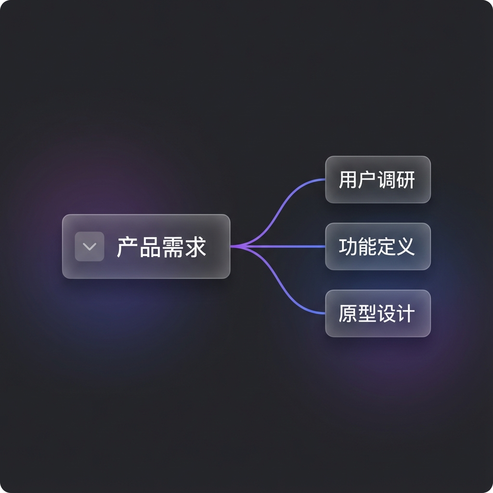
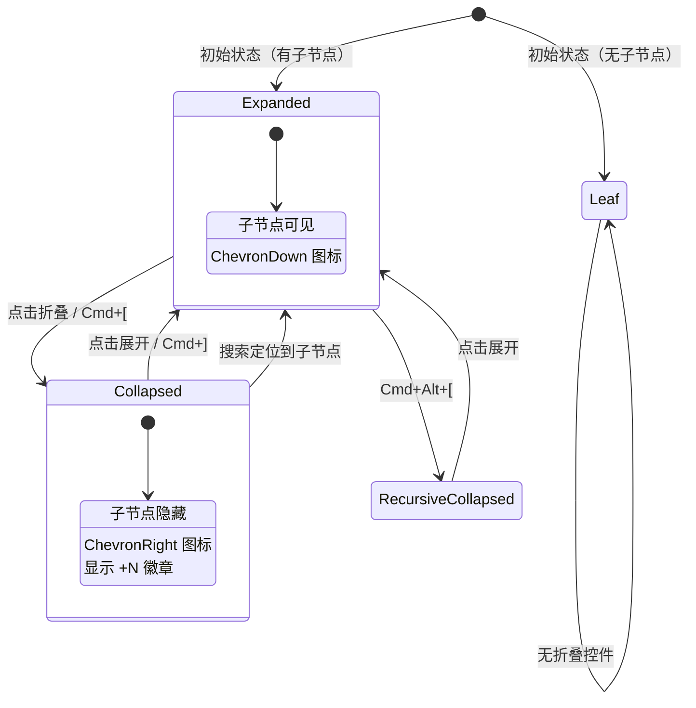

# Story 8.1: 节点折叠/展开 (Node Collapse & Expand)

Status: review
Tech-Spec: [tech-spec-8-1-node-collapse-expand.md](./tech-spec-8-1-node-collapse-expand.md)

<!-- Note: Validation is optional. Run validate-create-story for quality check before dev-story. -->

## 审查修订记录

> **修订日期**: 2026-01-04  
> **审查文件**: `validation-report-2026-01-04T20-50-03+0800.md`  
> **修订内容**:
> - ✅ 修正文档落点与导出策略：`packages/ui/src/components/CollapseToggle.tsx` → `packages/ui/src/collapse-toggle.tsx`
> - ✅ 修正文档落点：`apps/web/components/nodes/components/ChildCountBadge.tsx` → `apps/web/components/nodes/ChildCountBadge.tsx`
> - ✅ 右键菜单落点改为 `apps/web/components/graph/parts/NodeContextMenu.tsx`（避免误改 Edge 菜单 hook）
> - ✅ AC5 导航入口统一：在 `apps/web/contexts/GraphContext.navigateToNode` 处理“展开祖先路径”
> - ✅ 数据流对齐 GraphSyncManager：本地操作更新 X6 Node data，由同步管理器写入 Yjs（避免 UI 侧直接写 Yjs Map 覆盖 UI-only 字段）

## Story

As a **用户**,
I want **折叠和展开节点的子树**,
so that **我能减少视觉复杂度，专注于当前关注的分支。**

## Acceptance Criteria (验收标准)

### AC1: 基础折叠/展开交互
**Given** 一个有子节点的节点
**When** 点击节点左侧的折叠图标（或按快捷键 `Cmd/Ctrl + [`）
**Then** 该节点的**所有后代节点**应隐藏，父节点显示**隐藏后代数量**徽章 (如 "+12")

### AC2: 展开恢复
**When** 再次点击展开图标（或按快捷键 `Cmd/Ctrl + ]`）
**Then** 子树应恢复显示，**节点坐标不变**（不触发布局重排）

### AC3: 递归折叠
**When** 按下 `Cmd/Ctrl + Alt + [`
**Then** 递归折叠当前节点及所有后代节点

### AC4: 状态持久化
**And** 折叠状态应持久化，刷新后保留（Yjs 文档持久化为主；可选写入 localStorage 作为快速恢复缓存）

### AC5: 搜索自动展开
**When** 通过搜索定位到被折叠的节点时
**Then** 祖先路径应自动展开，使目标节点可见

---

## 🎨 UI 设计规范 (UI Design Specification)

### 交互流程概览


### 状态对比

````carousel

<!-- slide -->

````

---

### 组件规范

#### 1. CollapseToggle 组件


| 属性 | 规范 |
|------|------|
| **尺寸** | 16×16px 图标，24×24px 点击热区 |
| **位置** | 节点左侧 6px 处 |
| **图标** | Lucide `ChevronDown` (展开) / `ChevronRight` (折叠) |
| **颜色** | `text-muted-foreground` (#6B7280) |
| **Hover** | 背景 `bg-muted` (#374151)，圆角 4px |
| **动画** | `transition-transform duration-200 ease-out` 旋转 |

```tsx
// 实现参考
<button
  data-testid="collapse-toggle"
  aria-expanded={!isCollapsed}
  aria-label={isCollapsed ? "展开子节点" : "折叠子节点"}
  onClick={(e) => { e.stopPropagation(); onToggle(); }}
  className={cn(
    "w-4 h-4 flex items-center justify-center rounded",
    "text-muted-foreground hover:bg-muted",
    "transition-transform duration-200 ease-out",
    isCollapsed && "rotate-[-90deg]"
  )}
>
  <ChevronDown className="w-4 h-4" />
</button>
```

---

#### 2. ChildCountBadge 组件


| 属性 | 规范 |
|------|------|
| **格式** | `+{count}`，超过 99 显示 `+99+` |
| **位置** | 节点右侧 8px 处 |
| **背景** | Glassmorphism: `bg-primary/10 backdrop-blur-sm` |
| **边框** | `border border-white/10` |
| **圆角** | `rounded-full` (pill 形状) |
| **内边距** | `px-2 py-0.5` |
| **字体** | 11px, medium weight, `text-primary-foreground` |

```tsx
// 实现参考
<span
  data-testid="child-count-badge"
  onClick={(e) => { e.stopPropagation(); onExpand(); }}
  className={cn(
    "absolute right-[-32px] top-1/2 -translate-y-1/2",
    "px-2 py-0.5 rounded-full",
    "bg-primary/10 backdrop-blur-sm",
    "border border-white/10",
    "text-[11px] font-medium text-primary-foreground",
    "cursor-pointer hover:bg-primary/20",
    "transition-colors duration-150"
  )}
>
  +{count > 99 ? '99+' : count}
</span>
```

---

### 设计 Token

```css
/* 折叠/展开功能设计 Token */
:root {
  /* Toggle Button */
  --collapse-toggle-size: 16px;
  --collapse-toggle-hit-area: 24px;
  --collapse-toggle-offset: -24px;  /* 相对节点左边缘 */
  --collapse-toggle-color: var(--muted-foreground);
  --collapse-toggle-hover-bg: var(--muted);
  
  /* Badge */
  --badge-bg: rgba(99, 102, 241, 0.1);  /* primary/10 */
  --badge-blur: 8px;
  --badge-border: rgba(255, 255, 255, 0.1);
  --badge-font-size: 11px;
  --badge-padding-x: 8px;
  --badge-padding-y: 2px;
  
  /* Animation */
  --collapse-animation-duration: 200ms;
  --collapse-animation-easing: ease-out;
}
```

---

### 交互状态机



---

### 响应式与可访问性

| 需求 | 实现方式 |
|------|----------|
| **键盘导航** | `Cmd/Ctrl + [` 折叠, `Cmd/Ctrl + ]` 展开 |
| **屏幕阅读器** | `aria-expanded`, `aria-label` 属性 |
| **触屏设备** | 24×24px 点击热区满足 44px 最小触摸目标 |
| **色盲支持** | 不仅依赖颜色，图标形状区分状态 |
| **动效减弱** | 遵守 `prefers-reduced-motion` 媒体查询 |

```css
@media (prefers-reduced-motion: reduce) {
  .collapse-toggle {
    transition: none;
  }
}
```

---

## Tasks / Subtasks

### Phase 1: 核心 Hook 实现 (AC: #1, #4)

> ⚠️ **重要发现**: `NodeData.collapsed` 字段**已存在**于 `packages/types/src/index.ts` (L8)，无需修改类型定义

- [ ] Task 1.1: 创建 `useNodeCollapse` hook (AC: #1, #2, #3)
  - [ ] 1.1.1 创建文件 `apps/web/components/graph/hooks/useNodeCollapse.ts`
  - [ ] 1.1.2 实现 Hook 接口：
    ```typescript
    interface UseNodeCollapseReturn {
      isCollapsed: (nodeId: string) => boolean;
      toggleCollapse: (nodeId: string) => void;
      collapseNode: (nodeId: string) => void;
      expandNode: (nodeId: string) => void;
      collapseDescendants: (nodeId: string) => void;
      expandPathToNode: (nodeId: string) => void;
      getChildCount: (nodeId: string) => number;
    }
    ```
  - [ ] 1.1.3 以 X6 Node data 作为本地入口：读取 `node.getData().collapsed`，更新用 `node.setData({ collapsed })`（由 GraphSyncManager 同步到 Yjs）
  - [ ] 1.1.4 监听 `node:change:data`（覆盖远端协作更新）：当 `collapsed` 变化时重放子树可见性
  - [ ] 1.1.5 使用 `graph.getSuccessors()` 获取所有后代节点
  - [ ] 1.1.6 批量调用 `cell.setVisible(false)` 隐藏节点和边（展开时恢复）
  - [ ] 1.1.7 在 `hooks/index.ts` 中导出 hook

- [ ] Task 1.2: 创建 `useCollapseStorage` hook (AC: #4，可选缓存)
  - [ ] 1.2.1 创建文件 `apps/web/hooks/useCollapseStorage.ts`
  - [ ] 1.2.2 实现 localStorage 存储结构：
    ```typescript
    interface CollapsePreference {
      graphId: string;
      collapsedNodes: string[];
      lastUpdated: string;
    }
    // 存储 key: `cdm-collapse-pref-${graphId}`
    ```
  - [ ] 1.2.3 页面加载时恢复折叠状态（以 Yjs 为准；localStorage 仅用于快速恢复/离线兜底）

### Phase 2: UI 组件实现 (AC: #1, #2)

- [ ] Task 2.1: 创建 `CollapseToggle` 原子组件 (AC: #1)
  - [ ] 2.1.1 创建文件 `packages/ui/src/collapse-toggle.tsx`
  - [ ] 2.1.2 实现接口：
    ```typescript
    interface CollapseToggleProps {
      isCollapsed: boolean;
      childCount: number;
      onToggle: () => void;
      className?: string;
    }
    ```
  - [ ] 2.1.3 视觉规范：
    - 图标: Lucide `ChevronRight` (折叠) / `ChevronDown` (展开)
    - 尺寸: 16x16px
    - 颜色: `text-muted-foreground`
    - 过渡: `transition-transform duration-200`
  - [ ] 2.1.4 在 `packages/ui/src/index.ts` 中导出

- [ ] Task 2.2: 创建 `ChildCountBadge` 组件 (AC: #1)
  - [ ] 2.2.1 创建文件 `apps/web/components/nodes/ChildCountBadge.tsx`
  - [ ] 2.2.2 视觉规范：
    - 背景: `bg-primary/10 backdrop-blur-sm` (glassmorphism)
    - 文本: `+{count}` 格式
    - 位置: 折叠节点右侧

- [ ] Task 2.3: 集成到 MindNode 组件 (AC: #1, #2)
  - [ ] 2.3.1 修改 `apps/web/components/nodes/MindNode.tsx`
  - [ ] 2.3.2 添加折叠控件渲染逻辑：
    ```tsx
    {hasChildren && (
      <div className="absolute -left-6 top-1/2 -translate-y-1/2">
        <CollapseToggle
          isCollapsed={nodeData.collapsed ?? false}
          childCount={childCount}
          onToggle={handleToggleCollapse}
        />
      </div>
    )}
    {nodeData.collapsed && childCount > 0 && (
      <ChildCountBadge count={childCount} onClick={handleExpand} />
    )}
    ```

### Phase 3: 快捷键与右键菜单 (AC: #1, #3)

- [ ] Task 3.1: 添加折叠快捷键 (AC: #1, #3)
  - [ ] 3.1.1 修改 `apps/web/components/graph/hooks/useGraphHotkeys.ts`
  - [ ] 3.1.2 添加快捷键处理：
    ```typescript
    // Cmd/Ctrl + [ : 折叠当前节点
    if (e.key === '[' && (e.metaKey || e.ctrlKey) && !e.altKey) {
      e.preventDefault();
      collapseNode(selectedNodeId);
    }

    // Cmd/Ctrl + ] : 展开当前节点  
    if (e.key === ']' && (e.metaKey || e.ctrlKey)) {
      e.preventDefault();
      expandNode(selectedNodeId);
    }

    // Cmd/Ctrl + Alt + [ : 递归折叠所有后代
    if (e.key === '[' && e.altKey && (e.metaKey || e.ctrlKey)) {
      e.preventDefault();
      collapseDescendants(selectedNodeId);
    }
    ```

- [ ] Task 3.2: 添加右键菜单选项 (AC: #1, #3)
  - [ ] 3.2.1 修改 `apps/web/components/graph/parts/NodeContextMenu.tsx`
  - [ ] 3.2.2 修改 `apps/web/components/graph/GraphComponent.tsx`（注入 collapse/expand handlers）
  - [ ] 3.2.3 添加菜单项：
    - "折叠子节点" (有子节点且未折叠时显示)
    - "展开子节点" (已折叠时显示)
    - "折叠所有后代" (有后代时显示)

### Phase 4: 搜索集成 (AC: #5)

- [ ] Task 4.1: 搜索结果自动展开路径 (AC: #5)
  - [ ] 4.1.1 修改 `apps/web/contexts/GraphContext.tsx`
  - [ ] 4.1.2 在 `navigateToNode(nodeId)` 内部调用 `expandPathToNode(nodeId)`，确保所有入口（搜索/通知/未来大纲）行为一致
  - [ ] 4.1.3 实现导航时序（展开 → 定位）：
    ```typescript
    // GraphContext.navigateToNode 内部
    expandPathToNode(nodeId);
    // 等待折叠展开渲染完成后再定位（可用 requestAnimationFrame 或 setTimeout 兜底）
    setTimeout(() => centerAndSelect(nodeId), 250);
    ```

### Phase 5: 测试 (All ACs)

- [ ] Task 5.1: 单元测试 (Vitest)
  - [ ] 5.1.1 创建 `apps/web/__tests__/hooks/useNodeCollapse.test.ts`
  - [ ] 5.1.2 创建 `apps/web/__tests__/components/CollapseToggle.test.tsx`
  - [ ] 5.1.3 创建 `apps/web/__tests__/hooks/useCollapseStorage.test.ts`

- [ ] Task 5.2: E2E 测试 (Playwright)
  - [ ] 5.2.1 创建 `apps/web/e2e/node-collapse.spec.ts`
  - [ ] 5.2.2 实现 AC1-AC5 完整测试覆盖

### Review Follow-ups (AI)

- [x] [AI-Review][HIGH] 当前 story 状态为 `in-progress`（未进入 `review`），却触发 code-review；先完成实现并按流程推进到 `review` 再审 [docs/sprint-artifacts/story-8-1-node-collapse-expand.md:3]
- [x] [AI-Review][HIGH] 核心实现与测试补齐：`useNodeCollapse` / `CollapseToggle` / `ChildCountBadge` / 单测与 E2E 已落地；localStorage 缓存（useCollapseStorage）按“Yjs 为准”策略暂不实现 [docs/sprint-artifacts/story-8-1-node-collapse-expand.md:210]
- [x] [AI-Review][HIGH] 规格冲突：AC4 要求 localStorage 持久化（偏“个人偏好”），但又要求 Yjs Map.set 同步（偏“协作共享”）；必须先明确“折叠状态是否协作共享”再定实现路径 [docs/sprint-artifacts/story-8-1-node-collapse-expand.md:30]
- [x] [AI-Review][MEDIUM] `packages/ui` 当前无 `src/components/` 目录；story 指定的 `packages/ui/src/components/CollapseToggle.tsx` 路径不符合现状，需先修正文档与导出策略 [docs/sprint-artifacts/story-8-1-node-collapse-expand.md:245]
- [x] [AI-Review][MEDIUM] `apps/web/components/nodes` 当前无 `components/` 子目录；`apps/web/components/nodes/components/ChildCountBadge.tsx` 路径不符合现状，需先对齐目录结构 [docs/sprint-artifacts/story-8-1-node-collapse-expand.md:263]
- [x] [AI-Review][MEDIUM] 右键菜单落点疑似错误：`useGraphContextMenu.ts` 目前仅处理 **Edge** 菜单；Node 菜单在 `apps/web/components/graph/parts/NodeContextMenu.tsx`，请更新 story 的修改清单/任务 [apps/web/components/graph/hooks/useGraphContextMenu.ts:48]
- [x] [AI-Review][MEDIUM] AC5（搜索自动展开）应在导航层统一处理：`GlobalSearchDialog` 只是 `onSelect`，真正跳转在 `GraphContext.navigateToNode`；否则通知跳转等入口不会自动展开 [apps/web/contexts/GraphContext.tsx:40]
- [x] [AI-Review][MEDIUM] Dev Agent Record 不可审计：`### File List` 为空，缺少可追溯的变更清单；实现 PR 必须补齐 touched files [docs/sprint-artifacts/story-8-1-node-collapse-expand.md:1173]
- [x] [AI-Review][LOW] 文档内嵌的大段测试/实现示例需迁移到真实测试文件并在 CI 跑通，避免“文档代码漂移” [docs/sprint-artifacts/story-8-1-node-collapse-expand.md:362]

---

## 🧪 测试设计 (Test Design)

### 测试文件清单

| 文件路径 | 类型 | 覆盖 AC |
|----------|------|---------|
| `apps/web/__tests__/hooks/useNodeCollapse.test.ts` | 单元测试 | AC1, AC2, AC3 |
| `apps/web/__tests__/hooks/useCollapseStorage.test.ts` | 单元测试 | AC4 |
| `apps/web/__tests__/components/CollapseToggle.test.tsx` | 组件测试 | AC1 |
| `apps/web/e2e/node-collapse.spec.ts` | E2E 测试 | AC1-AC5 |

---

### 单元测试: `useNodeCollapse.test.ts`

**文件**: `apps/web/__tests__/hooks/useNodeCollapse.test.ts`

```typescript
/**
 * Story 8.1: Node Collapse & Expand
 * Unit tests for useNodeCollapse hook
 */
import { describe, it, expect, vi, beforeEach, afterEach } from 'vitest';
import { renderHook, act } from '@testing-library/react';
import { useNodeCollapse } from '@/components/graph/hooks/useNodeCollapse';

// Mock X6 Graph
const createMockGraph = () => {
  const nodes = [
    { id: 'root', isNode: () => true },
    { id: 'child-1', isNode: () => true },
    { id: 'child-2', isNode: () => true },
    { id: 'grandchild-1', isNode: () => true },
  ];
  const edges = [
    { id: 'edge-1', setVisible: vi.fn() },
    { id: 'edge-2', setVisible: vi.fn() },
  ];

  return {
    getCellById: vi.fn((id: string) => nodes.find(n => n.id === id)),
    getSuccessors: vi.fn((cell) => {
      if (cell.id === 'root') return nodes.slice(1);
      if (cell.id === 'child-1') return [nodes[3]];
      return [];
    }),
    getNeighbors: vi.fn((cell, opts) => {
      if (cell.id === 'root' && opts?.outgoing) return [nodes[1], nodes[2]];
      return [];
    }),
    getConnectedEdges: vi.fn(() => edges),
    batchUpdate: vi.fn((fn) => fn()),
  };
};

// Mock Yjs Doc
const createMockYDoc = () => {
  const nodesMap = new Map();
  nodesMap.set('root', { id: 'root', collapsed: false });
  nodesMap.set('child-1', { id: 'child-1', collapsed: false });

  return {
    getMap: vi.fn(() => ({
      get: (id: string) => nodesMap.get(id),
      set: vi.fn((id: string, data: any) => nodesMap.set(id, data)),
      observe: vi.fn(),
    })),
  };
};

describe('useNodeCollapse', () => {
  let mockGraph: ReturnType<typeof createMockGraph>;
  let mockYDoc: ReturnType<typeof createMockYDoc>;

  beforeEach(() => {
    mockGraph = createMockGraph();
    mockYDoc = createMockYDoc();
  });

  afterEach(() => {
    vi.clearAllMocks();
  });

  describe('isCollapsed', () => {
    it('should return false for non-collapsed node', () => {
      const { result } = renderHook(() =>
        useNodeCollapse({ graph: mockGraph as any, ydoc: mockYDoc as any })
      );
      expect(result.current.isCollapsed('root')).toBe(false);
    });

    it('should return true for collapsed node', () => {
      mockYDoc.getMap().get = vi.fn().mockReturnValue({ collapsed: true });
      const { result } = renderHook(() =>
        useNodeCollapse({ graph: mockGraph as any, ydoc: mockYDoc as any })
      );
      expect(result.current.isCollapsed('root')).toBe(true);
    });
  });

  describe('collapseNode (AC1)', () => {
    it('should hide all descendant nodes', () => {
      const { result } = renderHook(() =>
        useNodeCollapse({ graph: mockGraph as any, ydoc: mockYDoc as any })
      );

      act(() => {
        result.current.collapseNode('root');
      });

      expect(mockGraph.getSuccessors).toHaveBeenCalled();
      expect(mockGraph.batchUpdate).toHaveBeenCalled();
    });

    it('should hide connected edges', () => {
      const { result } = renderHook(() =>
        useNodeCollapse({ graph: mockGraph as any, ydoc: mockYDoc as any })
      );

      act(() => {
        result.current.collapseNode('root');
      });

      expect(mockGraph.getConnectedEdges).toHaveBeenCalled();
    });

    it('should update Yjs state', () => {
      const { result } = renderHook(() =>
        useNodeCollapse({ graph: mockGraph as any, ydoc: mockYDoc as any })
      );

      act(() => {
        result.current.collapseNode('root');
      });

      const nodesMap = mockYDoc.getMap();
      expect(nodesMap.set).toHaveBeenCalledWith('root', expect.objectContaining({ collapsed: true }));
    });
  });

  describe('expandNode (AC2)', () => {
    it('should show all descendant nodes', () => {
      mockYDoc.getMap().get = vi.fn().mockReturnValue({ collapsed: true });
      const { result } = renderHook(() =>
        useNodeCollapse({ graph: mockGraph as any, ydoc: mockYDoc as any })
      );

      act(() => {
        result.current.expandNode('root');
      });

      expect(mockGraph.getSuccessors).toHaveBeenCalled();
    });
  });

  describe('collapseDescendants (AC3)', () => {
    it('should recursively collapse all descendants', () => {
      const { result } = renderHook(() =>
        useNodeCollapse({ graph: mockGraph as any, ydoc: mockYDoc as any })
      );

      act(() => {
        result.current.collapseDescendants('root');
      });

      // Should be called multiple times for each level
      expect(mockGraph.getSuccessors).toHaveBeenCalled();
    });
  });

  describe('getChildCount', () => {
    it('should return direct child count', () => {
      const { result } = renderHook(() =>
        useNodeCollapse({ graph: mockGraph as any, ydoc: mockYDoc as any })
      );

      expect(result.current.getChildCount('root')).toBe(2);
    });

    it('should return 0 for leaf node', () => {
      const { result } = renderHook(() =>
        useNodeCollapse({ graph: mockGraph as any, ydoc: mockYDoc as any })
      );

      expect(result.current.getChildCount('grandchild-1')).toBe(0);
    });
  });

  describe('expandPathToNode (AC5)', () => {
    it('should expand all ancestors of target node', () => {
      const { result } = renderHook(() =>
        useNodeCollapse({ graph: mockGraph as any, ydoc: mockYDoc as any })
      );

      act(() => {
        result.current.expandPathToNode('grandchild-1');
      });

      // Should expand parent nodes
      expect(mockGraph.getCellById).toHaveBeenCalled();
    });
  });

  describe('null graph handling', () => {
    it('should handle null graph gracefully', () => {
      const { result } = renderHook(() =>
        useNodeCollapse({ graph: null, ydoc: null })
      );

      expect(result.current.isCollapsed('any')).toBe(false);
      expect(result.current.getChildCount('any')).toBe(0);

      // Operations should not throw
      act(() => {
        result.current.collapseNode('any');
        result.current.expandNode('any');
      });
    });
  });
});
```

---

### 单元测试: `useCollapseStorage.test.ts`

**文件**: `apps/web/__tests__/hooks/useCollapseStorage.test.ts`

```typescript
/**
 * Story 8.1: Node Collapse & Expand
 * Unit tests for useCollapseStorage hook (AC4: State Persistence)
 */
import { describe, it, expect, vi, beforeEach, afterEach } from 'vitest';
import { renderHook, act } from '@testing-library/react';
import { useCollapseStorage } from '@/hooks/useCollapseStorage';

describe('useCollapseStorage (AC4)', () => {
  const GRAPH_ID = 'test-graph-123';
  const STORAGE_KEY = `cdm-collapse-pref-${GRAPH_ID}`;

  beforeEach(() => {
    localStorage.clear();
  });

  afterEach(() => {
    vi.clearAllMocks();
  });

  describe('initial state', () => {
    it('should return empty array when no saved state', () => {
      const { result } = renderHook(() => useCollapseStorage(GRAPH_ID));
      expect(result.current.collapsedNodes).toEqual([]);
    });

    it('should restore saved collapsed nodes', () => {
      const savedState = {
        graphId: GRAPH_ID,
        collapsedNodes: ['node-1', 'node-2'],
        lastUpdated: new Date().toISOString(),
      };
      localStorage.setItem(STORAGE_KEY, JSON.stringify(savedState));

      const { result } = renderHook(() => useCollapseStorage(GRAPH_ID));
      expect(result.current.collapsedNodes).toEqual(['node-1', 'node-2']);
    });
  });

  describe('saveCollapsedNodes', () => {
    it('should save collapsed nodes to localStorage', () => {
      const { result } = renderHook(() => useCollapseStorage(GRAPH_ID));

      act(() => {
        result.current.saveCollapsedNodes(['node-1', 'node-3']);
      });

      const saved = JSON.parse(localStorage.getItem(STORAGE_KEY) || '{}');
      expect(saved.collapsedNodes).toEqual(['node-1', 'node-3']);
      expect(saved.graphId).toBe(GRAPH_ID);
    });

    it('should update lastUpdated timestamp', () => {
      const { result } = renderHook(() => useCollapseStorage(GRAPH_ID));

      act(() => {
        result.current.saveCollapsedNodes(['node-1']);
      });

      const saved = JSON.parse(localStorage.getItem(STORAGE_KEY) || '{}');
      expect(saved.lastUpdated).toBeDefined();
    });
  });

  describe('addCollapsedNode', () => {
    it('should add new node to collapsed list', () => {
      const { result } = renderHook(() => useCollapseStorage(GRAPH_ID));

      act(() => {
        result.current.addCollapsedNode('node-1');
      });

      expect(result.current.collapsedNodes).toContain('node-1');
    });

    it('should not duplicate nodes', () => {
      const { result } = renderHook(() => useCollapseStorage(GRAPH_ID));

      act(() => {
        result.current.addCollapsedNode('node-1');
        result.current.addCollapsedNode('node-1');
      });

      expect(result.current.collapsedNodes.filter(n => n === 'node-1')).toHaveLength(1);
    });
  });

  describe('removeCollapsedNode', () => {
    it('should remove node from collapsed list', () => {
      localStorage.setItem(STORAGE_KEY, JSON.stringify({
        graphId: GRAPH_ID,
        collapsedNodes: ['node-1', 'node-2'],
        lastUpdated: new Date().toISOString(),
      }));

      const { result } = renderHook(() => useCollapseStorage(GRAPH_ID));

      act(() => {
        result.current.removeCollapsedNode('node-1');
      });

      expect(result.current.collapsedNodes).toEqual(['node-2']);
    });
  });

  describe('clearCollapsedNodes', () => {
    it('should clear all collapsed nodes', () => {
      localStorage.setItem(STORAGE_KEY, JSON.stringify({
        graphId: GRAPH_ID,
        collapsedNodes: ['node-1', 'node-2'],
        lastUpdated: new Date().toISOString(),
      }));

      const { result } = renderHook(() => useCollapseStorage(GRAPH_ID));

      act(() => {
        result.current.clearCollapsedNodes();
      });

      expect(result.current.collapsedNodes).toEqual([]);
    });
  });

  describe('persistence across page reload', () => {
    it('should persist state when hook unmounts and remounts', () => {
      const { result, unmount } = renderHook(() => useCollapseStorage(GRAPH_ID));

      act(() => {
        result.current.addCollapsedNode('node-1');
        result.current.addCollapsedNode('node-2');
      });

      unmount();

      const { result: result2 } = renderHook(() => useCollapseStorage(GRAPH_ID));
      expect(result2.current.collapsedNodes).toEqual(['node-1', 'node-2']);
    });
  });
});
```

---

### 组件测试: `CollapseToggle.test.tsx`

**文件**: `apps/web/__tests__/components/CollapseToggle.test.tsx`

```typescript
/**
 * Story 8.1: Node Collapse & Expand
 * Component tests for CollapseToggle
 */
import { describe, it, expect, vi } from 'vitest';
import { render, screen, fireEvent } from '@testing-library/react';
import { CollapseToggle } from '@cdm/ui';

describe('CollapseToggle', () => {
  describe('rendering', () => {
    it('should render ChevronDown when expanded', () => {
      render(
        <CollapseToggle isCollapsed={false} childCount={3} onToggle={() => {}} />
      );
      // ChevronDown icon should be visible
      expect(screen.getByTestId('collapse-toggle')).toBeInTheDocument();
    });

    it('should render ChevronRight when collapsed', () => {
      render(
        <CollapseToggle isCollapsed={true} childCount={3} onToggle={() => {}} />
      );
      expect(screen.getByTestId('collapse-toggle')).toBeInTheDocument();
    });

    it('should apply custom className', () => {
      render(
        <CollapseToggle
          isCollapsed={false}
          childCount={3}
          onToggle={() => {}}
          className="custom-class"
        />
      );
      expect(screen.getByTestId('collapse-toggle')).toHaveClass('custom-class');
    });
  });

  describe('interaction', () => {
    it('should call onToggle when clicked', () => {
      const onToggle = vi.fn();
      render(
        <CollapseToggle isCollapsed={false} childCount={3} onToggle={onToggle} />
      );

      fireEvent.click(screen.getByTestId('collapse-toggle'));
      expect(onToggle).toHaveBeenCalledTimes(1);
    });

    it('should stop event propagation', () => {
      const onToggle = vi.fn();
      const onParentClick = vi.fn();

      render(
        <div onClick={onParentClick}>
          <CollapseToggle isCollapsed={false} childCount={3} onToggle={onToggle} />
        </div>
      );

      fireEvent.click(screen.getByTestId('collapse-toggle'));
      expect(onToggle).toHaveBeenCalled();
      expect(onParentClick).not.toHaveBeenCalled();
    });
  });

  describe('accessibility', () => {
    it('should have proper aria-label', () => {
      render(
        <CollapseToggle isCollapsed={false} childCount={3} onToggle={() => {}} />
      );
      expect(screen.getByTestId('collapse-toggle')).toHaveAttribute('aria-label');
    });

    it('should have aria-expanded attribute', () => {
      const { rerender } = render(
        <CollapseToggle isCollapsed={false} childCount={3} onToggle={() => {}} />
      );
      expect(screen.getByTestId('collapse-toggle')).toHaveAttribute('aria-expanded', 'true');

      rerender(
        <CollapseToggle isCollapsed={true} childCount={3} onToggle={() => {}} />
      );
      expect(screen.getByTestId('collapse-toggle')).toHaveAttribute('aria-expanded', 'false');
    });
  });
});
```

---

### E2E 测试: `node-collapse.spec.ts`

**文件**: `apps/web/e2e/node-collapse.spec.ts`

```typescript
/**
 * Story 8.1: Node Collapse & Expand
 * E2E tests using Playwright
 */
import { test, expect } from '@playwright/test';
import { gotoTestGraph } from './testUtils';

test.describe('Node Collapse & Expand (Story 8.1)', () => {
  test.beforeEach(async ({ page }, testInfo) => {
    await gotoTestGraph(page, testInfo);
    await page.waitForSelector('[data-shape="mind-node"]');

    // Create a tree structure for testing
    const rootNode = page.locator('.x6-node').first();
    await rootNode.click();

    // Add 3 child nodes
    for (let i = 1; i <= 3; i++) {
      await page.keyboard.press('Tab');
      await page.keyboard.type(`子节点${i}`);
      await page.keyboard.press('Escape');
      await rootNode.click();
    }

    // Add grandchild to first child
    await page.locator('.x6-node').nth(1).click();
    await page.keyboard.press('Tab');
    await page.keyboard.type('孙节点');
    await page.keyboard.press('Escape');

    await page.waitForTimeout(500);
  });

  test.describe('AC1: Basic Collapse', () => {
    test('should collapse node when clicking toggle icon', async ({ page }) => {
      // Select root node
      const rootNode = page.locator('.x6-node').first();
      await rootNode.click();

      // Find and click collapse toggle
      const collapseToggle = page.locator('[data-testid="collapse-toggle"]').first();
      await expect(collapseToggle).toBeVisible();
      await collapseToggle.click();

      await page.waitForTimeout(300);

      // Child nodes should be hidden
      const visibleNodes = await page.locator('[data-shape="mind-node"]:visible').count();
      expect(visibleNodes).toBe(1); // Only root visible
    });

    test('should show child count badge when collapsed', async ({ page }) => {
      const rootNode = page.locator('.x6-node').first();
      await rootNode.click();

      await page.locator('[data-testid="collapse-toggle"]').first().click();
      await page.waitForTimeout(300);

      // Badge should show child count
      const badge = page.locator('[data-testid="child-count-badge"]');
      await expect(badge).toBeVisible();
      await expect(badge).toContainText('+');
    });

    test('should collapse node with keyboard shortcut Cmd+[', async ({ page }) => {
      const rootNode = page.locator('.x6-node').first();
      await rootNode.click();

      const initialCount = await page.locator('[data-shape="mind-node"]:visible').count();

      await page.keyboard.press('Meta+[');
      await page.waitForTimeout(300);

      const afterCount = await page.locator('[data-shape="mind-node"]:visible').count();
      expect(afterCount).toBeLessThan(initialCount);
    });
  });

  test.describe('AC2: Expand Restore', () => {
    test('should expand node when clicking toggle again', async ({ page }) => {
      const rootNode = page.locator('.x6-node').first();
      await rootNode.click();

      const initialCount = await page.locator('[data-shape="mind-node"]:visible').count();

      // Collapse
      await page.locator('[data-testid="collapse-toggle"]').first().click();
      await page.waitForTimeout(300);

      // Expand
      await page.locator('[data-testid="collapse-toggle"]').first().click();
      await page.waitForTimeout(300);

      const finalCount = await page.locator('[data-shape="mind-node"]:visible').count();
      expect(finalCount).toBe(initialCount);
    });

    test('should expand with keyboard shortcut Cmd+]', async ({ page }) => {
      const rootNode = page.locator('.x6-node').first();
      await rootNode.click();

      // Collapse first
      await page.keyboard.press('Meta+[');
      await page.waitForTimeout(300);

      const collapsedCount = await page.locator('[data-shape="mind-node"]:visible').count();

      // Expand
      await page.keyboard.press('Meta+]');
      await page.waitForTimeout(300);

      const expandedCount = await page.locator('[data-shape="mind-node"]:visible').count();
      expect(expandedCount).toBeGreaterThan(collapsedCount);
    });

    test('should hide badge after expanding', async ({ page }) => {
      const rootNode = page.locator('.x6-node').first();
      await rootNode.click();

      await page.locator('[data-testid="collapse-toggle"]').first().click();
      await page.waitForTimeout(300);
      await expect(page.locator('[data-testid="child-count-badge"]')).toBeVisible();

      await page.locator('[data-testid="collapse-toggle"]').first().click();
      await page.waitForTimeout(300);
      await expect(page.locator('[data-testid="child-count-badge"]')).not.toBeVisible();
    });
  });

  test.describe('AC3: Recursive Collapse', () => {
    test('should collapse all descendants with Cmd+Alt+[', async ({ page }) => {
      const rootNode = page.locator('.x6-node').first();
      await rootNode.click();

      await page.keyboard.press('Meta+Alt+[');
      await page.waitForTimeout(300);

      const visibleNodes = await page.locator('[data-shape="mind-node"]:visible').count();
      expect(visibleNodes).toBe(1);
    });

    test('should recursively collapse via context menu', async ({ page }) => {
      const rootNode = page.locator('.x6-node').first();
      await rootNode.click({ button: 'right' });

      await page.waitForTimeout(200);

      const menuItem = page.locator('text=折叠所有后代');
      if (await menuItem.isVisible()) {
        await menuItem.click();
        await page.waitForTimeout(300);

        const visibleNodes = await page.locator('[data-shape="mind-node"]:visible').count();
        expect(visibleNodes).toBe(1);
      }
    });
  });

  test.describe('AC4: State Persistence', () => {
    test('should persist collapse state after page reload', async ({ page }) => {
      const rootNode = page.locator('.x6-node').first();
      await rootNode.click();

      await page.locator('[data-testid="collapse-toggle"]').first().click();
      await page.waitForTimeout(300);

      // Check localStorage
      const savedState = await page.evaluate(() => {
        const keys = Object.keys(localStorage).filter(k => k.startsWith('cdm-collapse-pref-'));
        return keys.length > 0 ? localStorage.getItem(keys[0]) : null;
      });
      expect(savedState).not.toBeNull();

      // Reload page
      await page.reload();
      await page.waitForSelector('[data-shape="mind-node"]');
      await page.waitForTimeout(500);

      // Collapse state should be restored
      const visibleNodes = await page.locator('[data-shape="mind-node"]:visible').count();
      expect(visibleNodes).toBe(1);
    });
  });

  test.describe('AC5: Search Auto-Expand', () => {
    test('should auto-expand path when searching collapsed node', async ({ page }) => {
      const rootNode = page.locator('.x6-node').first();
      await rootNode.click();

      // Collapse root
      await page.keyboard.press('Meta+[');
      await page.waitForTimeout(300);

      // Open search
      await page.keyboard.press('Meta+k');
      await page.waitForTimeout(200);

      // Search for grandchild
      await page.keyboard.type('孙节点');
      await page.waitForTimeout(300);

      // Click search result
      const searchResult = page.locator('[data-testid="search-result"]').first();
      if (await searchResult.isVisible()) {
        await searchResult.click();
        await page.waitForTimeout(500);

        // Path should be auto-expanded, grandchild visible
        const grandchild = page.locator('text=孙节点');
        await expect(grandchild).toBeVisible();
      }
    });
  });

  test.describe('Edge Cases', () => {
    test('should not show collapse toggle for leaf nodes', async ({ page }) => {
      // Find a leaf node (孙节点)
      const leafNode = page.locator('.x6-node:has-text("孙节点")');
      await leafNode.click();

      const toggle = leafNode.locator('[data-testid="collapse-toggle"]');
      await expect(toggle).not.toBeVisible();
    });

    test('should handle rapid collapse/expand gracefully', async ({ page }) => {
      const rootNode = page.locator('.x6-node').first();
      await rootNode.click();

      // Rapid toggle
      for (let i = 0; i < 5; i++) {
        await page.keyboard.press('Meta+[');
        await page.keyboard.press('Meta+]');
      }

      await page.waitForTimeout(500);

      // Should be in a consistent state
      const count = await page.locator('[data-shape="mind-node"]:visible').count();
      expect(count).toBeGreaterThan(0);
    });
  });
});
```

---

## Dev Notes (开发注意事项)

### ⚠️ 重要发现

| 项目 | 状态 | 说明 |
|------|------|------|
| `NodeData.collapsed` | ✅ 已存在 | `packages/types/src/index.ts` L8，**无需修改类型** |
| 所有依赖 | ✅ 已安装 | `@antv/x6`, `yjs`, `lucide-react` |

### 🏗️ 架构遵循 (Architecture Compliance)

#### Yjs-First 单向数据流 (CRITICAL)
```
用户操作 → X6 Node.setData() → GraphSyncManager → Yjs Map.set() → Hocuspocus 同步 → 后端 Hooks → 所有客户端更新 → React 重渲染
```
- **禁止**: 直接 `setState` 后调用 API 保存（导致协作脑裂）
- **必须**: 折叠状态变更以 **X6 Node.setData({ collapsed })** 作为本地入口，由 `GraphSyncManager` 同步到 Yjs（避免 UI 侧直接写 `yDoc.getMap('nodes')` 覆盖 UI-only 字段）
- **参考**: [Source: docs/architecture.md#Process Patterns]

#### Hook-First 逻辑封装
- **必须**: 所有折叠逻辑封装在 `useNodeCollapse` hook 中
- **禁止**: 在组件中直接写业务逻辑
- **参考**: [Source: docs/project-context.md#Hook-First 逻辑封装]

### 📁 文件修改清单

| 文件 | 类型 | 说明 |
|------|------|------|
| `apps/web/components/graph/hooks/useNodeCollapse.ts` | NEW | 折叠状态管理核心 hook |
| `apps/web/hooks/useCollapseStorage.ts` | NEW | localStorage 缓存（可选） |
| `packages/ui/src/collapse-toggle.tsx` | NEW | 折叠切换原子组件 |
| `apps/web/components/nodes/ChildCountBadge.tsx` | NEW | 子节点数量徽章 |
| `apps/web/components/graph/hooks/useGraphHotkeys.ts` | MODIFY | 添加折叠快捷键 |
| `apps/web/components/graph/parts/NodeContextMenu.tsx` | MODIFY | 添加右键菜单项 |
| `apps/web/components/graph/GraphComponent.tsx` | MODIFY | 注入 collapse/expand handlers |
| `apps/web/components/nodes/MindNode.tsx` | MODIFY | 集成折叠控件 |
| `apps/web/contexts/GraphContext.tsx` | MODIFY | 导航时自动展开祖先路径 |
| `apps/web/components/graph/hooks/index.ts` | MODIFY | 导出新 hook |

### 🧪 测试文件清单

| 文件 | 类型 |
|------|------|
| `apps/web/__tests__/hooks/useNodeCollapse.test.ts` | NEW |
| `apps/web/__tests__/hooks/useCollapseStorage.test.ts` | NEW |
| `apps/web/__tests__/components/CollapseToggle.test.tsx` | NEW |
| `apps/web/e2e/node-collapse.spec.ts` | NEW |

### 🔧 技术实现要点

#### X6 图形操作 API
```typescript
// 节点隐藏/显示
cell.setVisible(boolean);

// 获取子节点
graph.getSuccessors(cell);  // 所有后代
graph.getNeighbors(cell, { outgoing: true });  // 直接子节点

// 获取相关边并隐藏
graph.getConnectedEdges(cell).forEach(edge => edge.setVisible(false));

// 批量操作避免多次重渲染
graph.batchUpdate(() => {
  // 多个节点操作
});
```

#### 快捷键定义

| 快捷键 | 功能 |
|--------|------|
| `Cmd/Ctrl + [` | 折叠当前节点 |
| `Cmd/Ctrl + ]` | 展开当前节点 |
| `Cmd/Ctrl + Alt + [` | 递归折叠所有后代 |

### 🎨 UI/UX 设计要求

- **折叠图标**: Lucide `ChevronRight` (折叠) / `ChevronDown` (展开)
- **徽章样式**: `bg-primary/10 backdrop-blur-sm` (glassmorphism)
- **动画**: CSS transition 200ms ease-out
- **图标位置**: 节点左侧 (-left-6)

### 📊 性能考虑

1. **批量操作**: 使用 `graph.batchUpdate()` 包装避免多次重渲染
2. **子节点计算缓存**: 使用 `useMemo` 缓存 `getChildCount` 结果
3. **节流**: 快速连续折叠/展开操作节流 100ms

### References (参考资源)

- [Tech-Spec](./tech-spec-8-1-node-collapse-expand.md) - 完整技术规范
- [Source: docs/architecture.md] - 系统架构
- [Source: docs/project-context.md] - 项目上下文
- [AntV X6 文档](https://x6.antv.antgroup.com/) - 图形操作 API
- [Yjs 文档](https://docs.yjs.dev/) - CRDT 同步

## Dev Agent Record

### Validation Applied

- ✅ [2026-01-04] validate-create-story 完成（见 `validation-report-2026-01-04T20-50-03+0800.md`）

### Agent Model Used

GPT-5.2 (Codex CLI)

### Debug Log References

N/A - 未保留额外 debug 日志；验证以单元测试 + Playwright E2E 为准

### Completion Notes List

- ✅ 新增 `useNodeCollapse`：折叠/展开/递归折叠/展开祖先路径（AC1-AC5）
- ✅ UI：`CollapseToggle` + `ChildCountBadge`，并接入 `MindNode`（仅对层级边生效，跳过 dependency 边）
- ✅ 修复 `getOutgoingEdges()` 可能返回 `null/undefined` 导致的折叠逻辑中断
- ✅ 处理“后加载节点”场景：协作/刷新后新增节点会继承祖先折叠状态（避免漏显）
- ✅ Playwright：新增 `e2e/node-collapse.spec.ts` 覆盖 AC1-AC5，并修复本机代理/NO_PROXY 导致的 webServer 探测问题
- ✅ 通过：`pnpm --filter @cdm/web test`、`pnpm lint`、`pnpm --filter @cdm/web exec playwright test e2e/node-collapse.spec.ts`

### Definition of Done (DoD)

- [x] 单元测试通过：`pnpm --filter @cdm/web test`
- [x] E2E 通过（Story 8.1）：`pnpm --filter @cdm/web exec playwright test e2e/node-collapse.spec.ts`（覆盖 AC1-AC5）
- [x] Lint 通过：`pnpm lint`

### File List

**新增文件：**
- `apps/web/components/graph/hooks/useNodeCollapse.ts`
- `apps/web/components/nodes/ChildCountBadge.tsx`
- `apps/web/__tests__/hooks/useNodeCollapse.test.ts`
- `apps/web/e2e/node-collapse.spec.ts`
- `packages/ui/src/collapse-toggle.tsx`
- `docs/sprint-artifacts/story-8-1-node-collapse-expand.md`
- `docs/sprint-artifacts/tech-spec-8-1-node-collapse-expand.md`
- `docs/sprint-artifacts/validation-report-2026-01-04T20-50-03+0800.md`
- `docs/prototypes/story-8-1/*`

**修改文件：**
- `apps/web/components/graph/GraphComponent.tsx`
- `apps/web/components/graph/hooks/index.ts`
- `apps/web/components/graph/hooks/useGraphHotkeys.ts`
- `apps/web/components/graph/parts/NodeContextMenu.tsx`
- `apps/web/components/nodes/MindNode.tsx`
- `apps/web/components/nodes/hooks/useNodeDataSync.ts`
- `apps/web/contexts/GraphContext.tsx`
- `apps/web/playwright.config.ts`
- `apps/web/__tests__/GraphComponent.test.tsx`
- `packages/ui/src/index.ts`
- `docs/sprint-artifacts/sprint-status.yaml`
