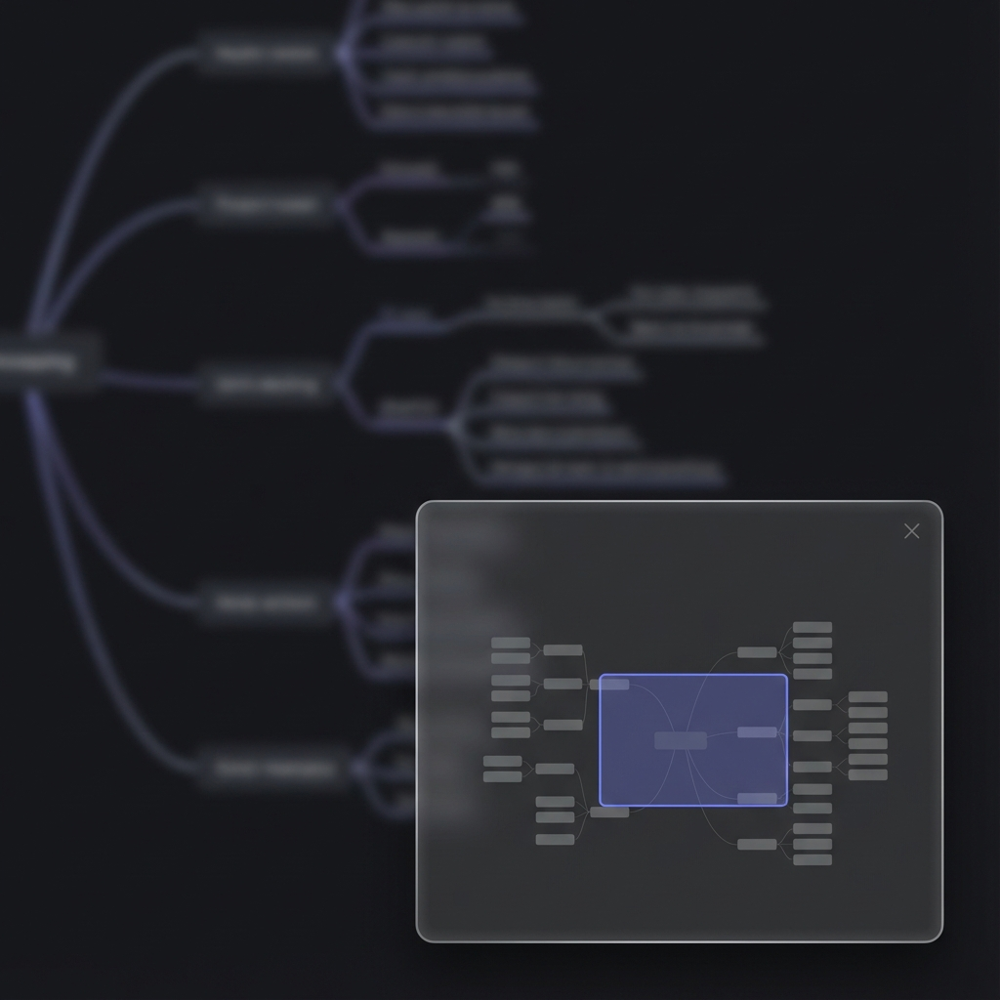
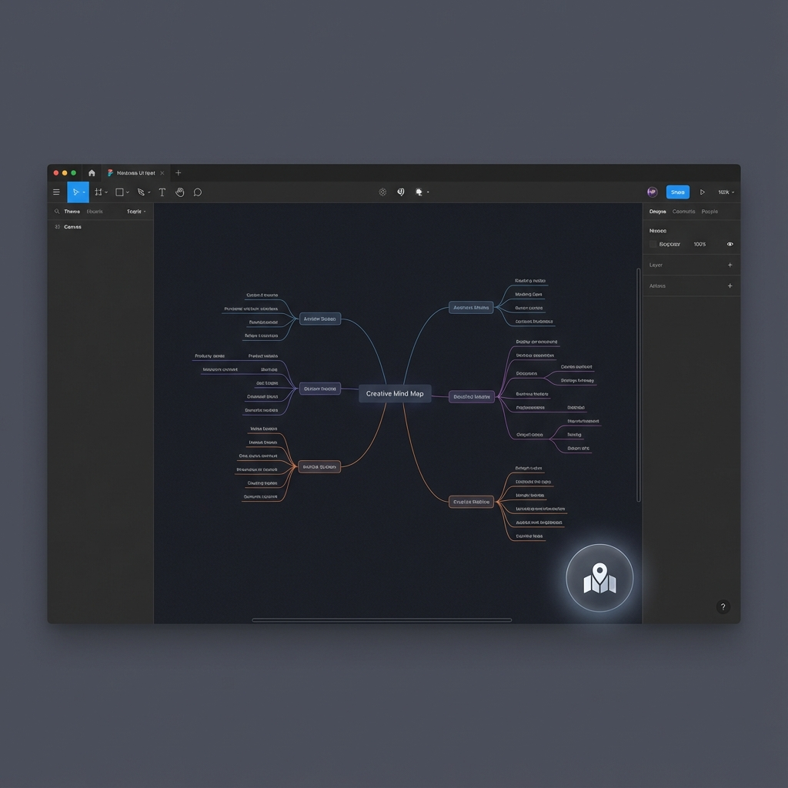
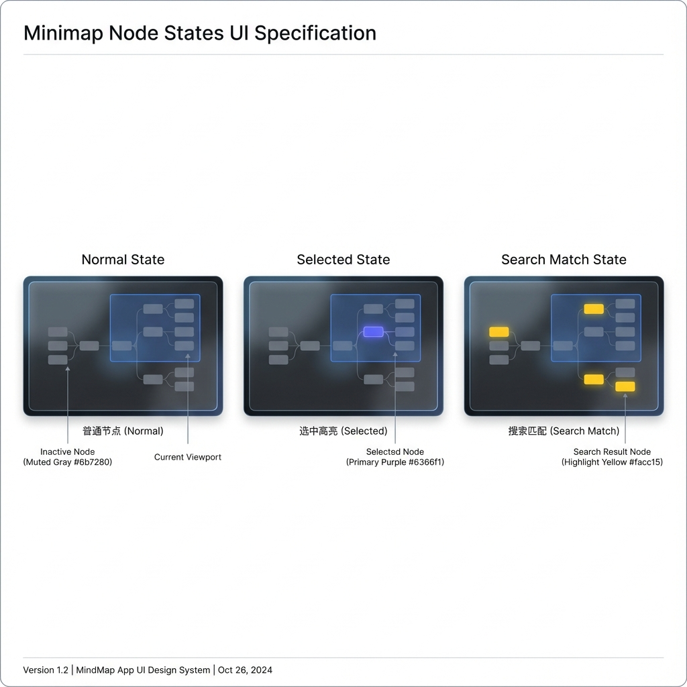
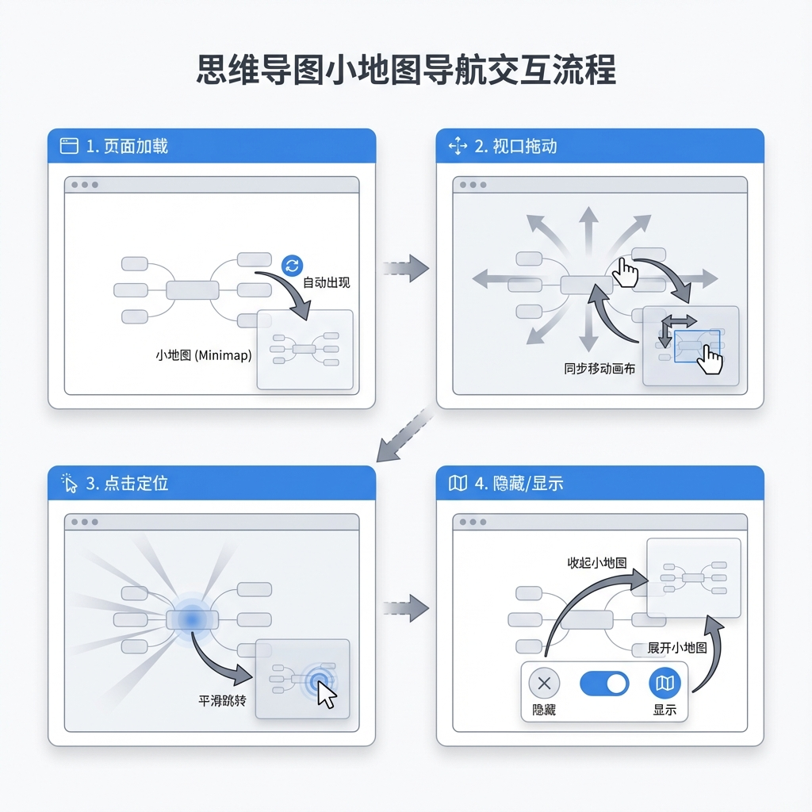
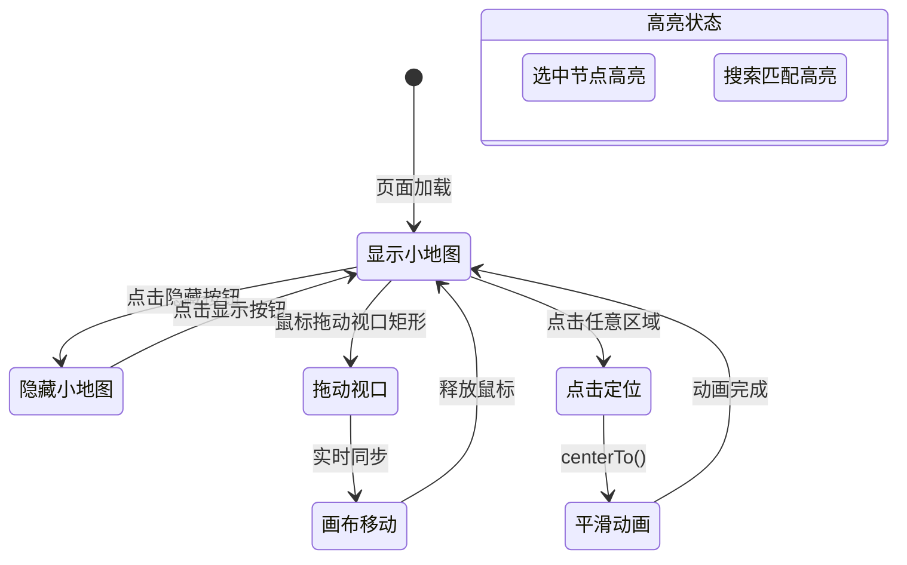

# Story 8.2: 小地图导航 (Minimap Navigation)

Status: done
Tech-Spec: [tech-spec-8-2-minimap-navigation.md](./tech-spec-8-2-minimap-navigation.md)

<!-- Note: Validation is optional. Run validate-create-story for quality check before dev-story. -->

## Story

As a **用户**,
I want **通过小地图快速了解全图结构并导航定位**,
so that **我在处理大型图谱时不会迷失方向。**

## Acceptance Criteria (验收标准)

### AC1: 小地图基础渲染
**Given** 一个包含 100+ 节点的图谱
**When** 页面加载时
**Then** 右下角应显示小地图（默认启用，可通过按钮隐藏）

### AC2: 视口矩形拖动
**When** 拖动小地图中的视口矩形
**Then** 主画布应实时平移到对应位置

### AC3: 点击快速定位
**When** 点击小地图上的某个区域
**Then** 主画布应快速定位（带平滑动画）到该位置

### AC4: 节点缩略显示
**And** 小地图应显示节点的缩略轮廓（简化渲染以提升性能）

### AC5: 选中节点高亮
**And** 当前选中节点在小地图上高亮显示

### AC6: 搜索匹配高亮
**And** 搜索匹配的节点在小地图上高亮标记

---

## 🎨 UI 设计规范 (UI Design Specification)

### 📸 高精度 UI 设计 (High-Fidelity UI Mockups)

#### 小地图展开状态 (Minimap Expanded State)



**设计要点:**
- 固定在画布右下角，距边缘 16px
- Glassmorphism 毛玻璃效果背景
- 视口矩形使用主色边框 (`border-primary`)
- 右上角 X 按钮隐藏小地图

---

#### 小地图隐藏状态 (Minimap Hidden - Toggle Button)



**设计要点:**
- 32×32px 圆形/圆角按钮
- Map 图标提示用户可展开
- 悬停时显示 tooltip: "显示小地图 (M)"

---

#### 节点高亮状态对比 (Node Highlight States)



| 状态 | 颜色 | 用途 |
|------|------|------|
| 普通 | `var(--muted)` 灰色 | 默认节点显示 |
| 选中 | `var(--primary)` 紫/蓝 | AC5: 当前选中节点 |
| 搜索匹配 | `#facc15` 黄色 | AC6: 搜索结果高亮 |

---

#### 交互流程图 (Interaction Flow)



---

### 交互流程概览 (Mermaid)



---

### 组件规范

#### 1. Minimap 容器

| 属性 | 规范 |
|------|------|
| **位置** | 固定在右下角，距边缘 16px |
| **默认尺寸** | 200×150px |
| **最小尺寸** | 160×120px |
| **最大尺寸** | 300×200px |
| **背景** | `bg-background/80 backdrop-blur-sm` (Glassmorphism) |
| **边框** | `border border-border/50 rounded-lg` |
| **阴影** | `shadow-lg` |
| **Z-Index** | `z-50`（低于 Modal，高于画布） |

```tsx
// 容器样式参考
<div
  data-testid="minimap-container"
  className={cn(
    "fixed bottom-4 right-4 z-50",
    "w-[200px] h-[150px]",
    "bg-background/80 backdrop-blur-sm",
    "border border-border/50 rounded-lg shadow-lg",
    "overflow-hidden",
    isHidden && "hidden"
  )}
>
  {/* Minimap 内容 */}
</div>
```

---

#### 2. 视口矩形 (Viewport Rect)

| 属性 | 规范 |
|------|------|
| **边框** | `border-2 border-primary` |
| **背景** | `bg-primary/10` (半透明填充) |
| **圆角** | `rounded-sm` |
| **光标** | `cursor-move` |
| **拖动** | 支持鼠标拖动，实时更新主画布 |

---

#### 3. 节点缩略图 (Node Thumbnails)

| 属性 | 规范 |
|------|------|
| **普通节点** | `bg-muted` 矩形块 |
| **选中节点** | `bg-primary` 高亮 (AC5) |
| **搜索匹配** | `bg-yellow-400` 或 `ring-2 ring-yellow-400` (AC6) |
| **折叠节点** | 仍然显示折叠父节点，不显示隐藏的子节点 |

---

#### 4. 隐藏/显示按钮

| 属性 | 规范 |
|------|------|
| **位置** | 小地图右上角（内部） |
| **图标** | Lucide `X` (隐藏) / `Map` (显示) |
| **尺寸** | 16×16px 图标，24×24px 点击区域 |
| **悬停** | `bg-muted` 背景 |
| **隐藏后** | 右下角仅显示一个小型"显示地图"按钮 |

```tsx
// 隐藏按钮实现
<button
  data-testid="minimap-toggle"
  aria-label={isHidden ? "显示小地图" : "隐藏小地图"}
  onClick={() => setIsHidden(prev => !prev)}
  className={cn(
    "absolute top-1 right-1 p-1 rounded",
    "text-muted-foreground hover:bg-muted",
    "transition-colors duration-150"
  )}
>
  {isHidden ? <Map className="w-4 h-4" /> : <X className="w-4 h-4" />}
</button>
```

---

#### 5. 测试钩子 (data-testid / class)

| 元素 | Hook |
|------|------|
| Graph 画布容器 | `data-testid="graph-canvas"` |
| MindNode 根容器 | `data-testid="mind-node"` |
| 搜索输入框 | `data-testid="global-search-input"` |
| Minimap 容器 | `data-testid="minimap-container"` |
| Minimap 节点 | `class="minimap-node"` |
| 选中高亮 | `class="selected-node-highlight"` |
| 搜索高亮 | `class="search-match-highlight"` |

---

### 设计 Token

```css
/* 小地图功能设计 Token */
:root {
  /* Container */
  --minimap-width: 200px;
  --minimap-height: 150px;
  --minimap-offset: 16px;
  --minimap-bg: rgba(var(--background), 0.8);
  --minimap-border: rgba(var(--border), 0.5);
  --minimap-radius: 8px;
  --minimap-shadow: 0 10px 15px -3px rgba(0, 0, 0, 0.1);
  
  /* Viewport Rect */
  --viewport-border-width: 2px;
  --viewport-border-color: var(--primary);
  --viewport-bg: rgba(var(--primary), 0.1);
  
  /* Node Thumbnails */
  --node-normal-color: var(--muted);
  --node-selected-color: var(--primary);
  --node-search-highlight: #facc15; /* yellow-400 */
  
  /* Animation */
  --minimap-animation-duration: 200ms;
  --minimap-animation-easing: ease-out;
}
```

---

### 响应式与可访问性

| 需求 | 实现方式 |
|------|----------|
| **键盘导航** | `M` 键切换小地图显示/隐藏 |
| **屏幕阅读器** | `aria-label="小地图导航"`, `role="region"` |
| **触屏设备** | 支持触摸拖动视口矩形 |
| **小屏幕** | 屏幕宽度 < 768px 时默认隐藏 |
| **动效减弱** | 遵守 `prefers-reduced-motion` |

```css
@media (prefers-reduced-motion: reduce) {
  .minimap-viewport {
    transition: none;
  }
}

@media (max-width: 768px) {
  .minimap-container {
    /* 默认隐藏交由逻辑控制（useMediaQuery + localStorage），避免强制 display:none */
  }
}
```

---

## Tasks / Subtasks

### Phase 0: 对齐与测试钩子 (All ACs)

- [x] Task 0.1: 补齐测试选择器
  - [x] 0.1.1 在 GraphComponent 画布容器添加 `data-testid="graph-canvas"`（保留 `id="graph-container"`）
  - [x] 0.1.2 在 MindNode 三种渲染分支的根容器添加 `data-testid="mind-node"`
  - [x] 0.1.3 在 GlobalSearchDialog 搜索输入框添加 `data-testid="global-search-input"`

- [x] Task 0.2: 更新 graph/parts 导出
  - [x] 0.2.1 `apps/web/components/graph/parts/index.ts` 导出 `MinimapContainer` / `MinimapToggleButton`

### Phase 1: 依赖安装与 Hook 实现 (AC: #1, #2, #3, #5, #6)

- [x] Task 1.1: 安装 X6 Minimap 插件 (AC: #1)
  - [x] 1.1.1 运行 `pnpm add @antv/x6-plugin-minimap@^3.0.0 -F web`
  - [x] 1.1.2 验证 `apps/web/package.json` 已添加依赖

- [x] Task 1.2: 创建 `useMinimap` hook (AC: #1, #2, #3, #5, #6)
  - [x] 1.2.1 创建文件 `apps/web/components/graph/hooks/useMinimap.ts`
  - [x] 1.2.2 实现 Hook 接口：
    ```typescript
    interface UseMinimapOptions {
      graph: Graph | null;
      isReady: boolean;
      containerRef: RefObject<HTMLDivElement>;
      enabled?: boolean;
      width?: number;
      height?: number;
    }
    
    interface UseMinimapReturn {
      isEnabled: boolean;
      toggle: () => void;
      show: () => void;
      hide: () => void;
      highlightNodes: (nodeIds: string[], type: 'selected' | 'search') => void;
      clearHighlights: (type?: 'selected' | 'search') => void;
    }
    ```
  - [x] 1.2.3 在 Graph 初始化后调用 `graph.use(new MiniMap(options))`
  - [x] 1.2.4 配置 minimap 选项（简化渲染、仅节点）
  - [x] 1.2.5 高亮逻辑使用本地 UI 标记（如 `data._minimapHighlight`），**不得写入 Yjs**
  - [x] 1.2.6 为避免远端更新覆盖本地标记：扩展 `GraphSyncManager` 的 `localUiState` 保留 `_minimapHighlight`
  - [x] 1.2.7 在 `hooks/index.ts` 中导出 hook

- [x] Task 1.3: 创建 `useMinimapStorage` hook
  - [x] 1.3.1 创建文件 `apps/web/hooks/useMinimapStorage.ts`
  - [x] 1.3.2 实现 localStorage 存储显示/隐藏偏好
  - [x] 1.3.3 存储 key: `cdm-minimap-visible`

### Phase 2: UI 组件实现 (AC: #1, #4)

- [x] Task 2.1: 创建 `MinimapContainer` 组件 (AC: #1, #4)
  - [x] 2.1.1 创建文件 `apps/web/components/graph/parts/MinimapContainer.tsx`
  - [x] 2.1.2 Props 实现
  - [x] 2.1.3 实现容器样式（右下角固定位置，Glassmorphism 效果）
  - [x] 2.1.4 实现隐藏/显示切换按钮
  - [x] 2.1.5 创建 minimap 挂载容器 `ref`
  - [x] 2.1.6 调用 `useMinimap` 并联动 `selectedNodeId` / `searchMatchIds`

- [x] Task 2.2: 创建 `MinimapToggleButton` 组件
  - [x] 2.2.1 创建文件 `apps/web/components/graph/parts/MinimapToggleButton.tsx`
  - [x] 2.2.2 隐藏状态时显示在右下角的小型"显示地图"按钮

- [x] Task 2.3: 集成到 GraphComponent (AC: #1)
  - [x] 2.3.1 修改 `apps/web/components/graph/GraphComponent.tsx`
  - [x] 2.3.2 添加 MinimapContainer 组件渲染（优先复用 `useSelection`）
  - [x] 2.3.3 在 graph 初始化后启用 minimap
  - [x] 2.3.4 画布容器添加 `data-testid="graph-canvas"`

### Phase 3: 高亮与搜索集成 (AC: #5, #6)

- [x] Task 3.1: 选中节点高亮 (AC: #5)
  - [x] 3.1.1 监听 `selection:changed` 事件（或复用 `useSelection`）
  - [x] 3.1.2 仅高亮当前主选节点（多选时取最后选中或第一个）
  - [x] 3.1.3 对 minimap 节点添加类名：`minimap-node` + `selected-node-highlight`

- [x] Task 3.2: 搜索匹配高亮 (AC: #6)
  - [x] 3.2.1 在 `GlobalSearchDialog` 中监听 `results` 变化
  - [x] 3.2.2 派发事件：`window.dispatchEvent(new CustomEvent('mindmap:search-results', { detail: { graphId, nodeIds } }))`
  - [x] 3.2.3 `useMinimap` 订阅该事件，仅当 `graphId` 匹配当前图时高亮
  - [x] 3.2.4 搜索关闭/重置时发送空数组清理高亮
  - [x] 3.2.5 对 minimap 节点添加类名：`minimap-node` + `search-match-highlight`

### Phase 4: 快捷键、响应式与性能

- [x] Task 4.1: 添加 `M` 键快捷键 (AC: #1)
  - [x] 4.1.1 修改 `apps/web/components/graph/hooks/useGraphHotkeys.ts`
  - [x] 4.1.2 增加输入保护：当焦点在 `input/textarea/select` 或 `contentEditable` 时不触发
  - [x] 4.1.3 实现完成

- [x] Task 4.2: 响应式处理
  - [x] 4.2.1 创建 `apps/web/hooks/useMediaQuery.ts`（基于 `matchMedia`）
  - [x] 4.2.2 屏幕宽度 < 768px 时默认隐藏（但允许手动显示）

- [x] Task 4.3: 本地偏好持久化
  - [x] 4.3.1 使用 `useMinimapStorage` 读取/写入 `cdm-minimap-visible`
  - [x] 4.3.2 移动端优先级：`isMobile` 时强制默认隐藏

- [x] Task 4.4: 性能守卫（建议）
  - [x] 4.4.1 当节点数 >= 1000 时禁用 minimap，并提供用户可见提示
  - [x] 4.4.2 避免频繁重绘（高亮更新 debounce + 去重）

### Phase 5: 测试 (All ACs)

- [x] Task 5.1: 单元测试 (Vitest)
  - [x] 5.1.1 `apps/web/__tests__/hooks/useMinimap.test.ts`
  - [x] 5.1.2 覆盖：初始化、show/hide、highlight、dispose

- [x] Task 5.2: 组件测试 (Vitest)
  - [x] 5.2.1 `apps/web/__tests__/components/MinimapContainer.test.tsx`
  - [x] 5.2.2 覆盖：渲染、隐藏、toggle、aria-label

- [x] Task 5.3: E2E 测试 (Playwright)
  - [x] 5.3.1 `apps/web/e2e/minimap.spec.ts`
  - [x] 5.3.2 覆盖 AC1-AC6，使用 `data-testid` 和 `.selected-node-highlight` / `.search-match-highlight`

### Review Follow-ups (AI) - 2026-01-07 Verified

> 以下项目经 2026-01-07 代码审查二次验证，确认属实。

**AC 实现 (HIGH)**
- [x] [AI-Review][HIGH] AC3 点击定位带平滑动画：已覆盖 minimap 点击行为并加入平滑动画（遵守 prefers-reduced-motion）
- [x] [AI-Review][HIGH] AC4 节点缩略轮廓：已实现 lightweight `MinimapNodeView`（跳过边渲染）
- [x] [AI-Review][HIGH] AC5/AC6 高亮渲染：已在 minimap 节点视图中应用 `.selected-node-highlight` / `.search-match-highlight`

**协作 & 状态 (HIGH)**
- [x] [AI-Review][HIGH] minimap 可见性受控问题：`enabled` 变化会触发 dispose/re-init，避免旧 DOM 绑定
- [x] [AI-Review][HIGH] GraphSyncManager：已保留 `_minimapHighlight`（local UI state），并跳过纯 UI data 变更的 Yjs 同步

**测试 (MEDIUM)**
- [x] [AI-Review][MEDIUM] 组件测试：已新增 `MinimapContainer.test.tsx`
- [x] [AI-Review][MEDIUM] E2E 测试：已新增 `minimap.spec.ts`

**性能 (MEDIUM)**
- [x] [AI-Review][MEDIUM] 性能守卫用户提示：禁用时提供可见提示（不只 console.warn）
- [x] [AI-Review][MEDIUM] 高亮更新节流：highlightNodes 做去重 + debounce + batchUpdate

**其他 (LOW)**
- [ ] [AI-Review][LOW] 响应式策略：移动端默认隐藏仅初始化判断

---

## Dev Notes

### 技术决策 (Technical Decisions)

> 详细技术规格请参考：[tech-spec-8-2-minimap-navigation.md](./tech-spec-8-2-minimap-navigation.md)

#### TD-1: 使用官方 @antv/x6-plugin-minimap

**决策**: 使用 `@antv/x6-plugin-minimap` 而非自定义实现

**理由**:
- 官方维护，与 X6 3.1.2 兼容
- 内置视口拖动和点击定位
- 支持 `graphOptions` 自定义渲染
- 减少开发和维护成本

#### TD-2: 简化节点渲染

**决策**: Minimap 中只渲染节点色块，不渲染边

**理由**:
- 大量边会严重影响 minimap 渲染性能
- 小地图主要用于空间定位，边的细节不重要
- 通过 `graphOptions.createCellView` 返回 `null` 跳过边渲染

#### TD-3: 视口状态本地化

**决策**: Minimap 可见性偏好存储在 localStorage，不同步到 Yjs

**理由**:
- 各用户独立的视图偏好
- 避免协作时相互干扰
- 类似于 Story 8.1 的 collapse 视觉状态

#### TD-4: 高亮为本地 UI 状态（不写入 Yjs）

**决策**: `_minimapHighlight` 仅用于本地渲染，禁止进入 Yjs

**理由**:
- 协作中高亮属于本地视图偏好
- GraphSyncManager 远端更新会覆盖未保留的 UI 标记
- 保持协作数据最小化与一致性

#### TD-5: 搜索结果通过事件总线分发

**决策**: `GlobalSearchDialog` 派发 `mindmap:search-results` 事件，Minimap 订阅

**理由**:
- 搜索结果目前只存在于对话框内，无全局 store
- 事件模式已在项目中使用（`mindmap:open-search` 等）
- 降低新状态层引入的复杂度

---

### 📚 X6 MiniMap Plugin API

```typescript
import { MiniMap } from '@antv/x6';
import '@antv/x6-plugin-minimap/es/index.css';

const minimap = new MiniMap({
  container: containerElement,       // 必需: 挂载容器
  width: 200,                        // 默认 300
  height: 150,                       // 默认 200
  padding: 10,                       // 内边距
  scalable: true,                    // 是否可缩放
  minScale: 0.01,                    // 最小缩放
  maxScale: 1,                       // 最大缩放
  graphOptions: {                    // 自定义渲染
    createCellView(cell) {
      if (cell.isNode()) return SimpleNodeView;
      return null; // 不渲染边
    }
  }
});

graph.use(minimap);

// 方法
minimap.show();
minimap.hide();
minimap.dispose();
```

---

### 🎨 SimpleNodeView 高亮实现

```typescript
import { NodeView } from '@antv/x6';

// 普通节点视图 - 简单矩形
class SimpleNodeView extends NodeView {
  render() {
    const { width, height } = this.cell.getSize();
    return this.container.innerHTML = `
      <rect class="minimap-node" width="${width}" height="${height}" 
            fill="var(--muted)" rx="2" />
    `;
  }
}

// 选中节点视图 - 主色填充
class SelectedNodeView extends NodeView {
  render() {
    const { width, height } = this.cell.getSize();
    return this.container.innerHTML = `
      <rect class="minimap-node selected-node-highlight" width="${width}" height="${height}" 
            fill="var(--primary)" rx="2" />
    `;
  }
}

// 搜索匹配视图 - 黄色高亮
class SearchMatchNodeView extends NodeView {
  render() {
    const { width, height } = this.cell.getSize();
    return this.container.innerHTML = `
      <rect class="minimap-node search-match-highlight" width="${width}" height="${height}" 
            fill="#facc15" rx="2" />
    `;
  }
}
```

---

### 🏗️ 架构对齐

**技术栈参考**:
- 使用 `@antv/x6-plugin-minimap` 官方插件（需新安装）
- 版本要求：`@antv/x6-plugin-minimap` ^3.0.x（X6 v3 下插件代码内置于 `@antv/x6`，该包提供样式）
- 遵循项目现有 X6 插件模式（参考 `@antv/x6` 内置插件使用方式）
- Hook-First 架构：核心逻辑在 `useMinimap` hook

**Yjs 协作注意**:
- 小地图为**只读视图**，不涉及 Yjs 状态修改
- 视口状态为**本地状态**，不同步到协作用户（各用户独立视角）
- 选中节点高亮需响应协作同步的选中状态变化
- `_minimapHighlight` 属于本地 UI 标记，若写入 `node.setData`，需在 `GraphSyncManager` 保留该字段或重刷高亮

**性能考量**:
- 参考 Story 3.5 性能优化：大规模节点时可能需要延迟初始化 minimap
- `graphOptions` 中使用简化渲染（仅渲染节点色块，不渲染边）
- 在 1000+ 节点时禁用或延迟初始化 minimap，并提示用户

**集成要点**:
- GraphComponent 已使用 `useSelection`，优先复用而非再订阅一次 selection
- 搜索结果来自 `GlobalSearchDialog`，通过事件分发到 minimap，避免新建全局 store
- 高亮为本地 UI 状态，避免污染协作数据

### 🧠 Prior Review Feedback (from Story 8.1)

- **本地 UI 状态不要进入 Yjs**：可视化/交互标记（如 `_minimapHighlight`）必须保持本地，仅用于渲染。必要时在 GraphSyncManager 保留本地字段或在变更后重刷高亮。
- **测试选择器要与真实 DOM 对齐**：Story 8.1 曾因缺失 `data-testid` 导致 E2E 不稳定。本 Story 已强制列出 Graph/MindNode/Search 的 testid。
- **导出路径一致**：Graph 部件需通过 `apps/web/components/graph/parts/index.ts` 统一导出，避免引用分散。

### ⚠️ Known Pitfalls & Fixes

- **热键误触**：`M` 键必须跳过输入框/编辑态（contentEditable）以避免编辑中误触发。
- **远端更新覆盖高亮**：协作同步会覆盖未保留的 UI 字段；如使用 `node.setData` 标记高亮，需保留 `_minimapHighlight` 或在 `node:change:data` 后重刷高亮。
- **初始化时机**：必须在 `graph && isReady && containerRef.current` 后初始化 minimap，避免空容器导致插件异常。
- **搜索结果联动缺失**：搜索结果仅在 `GlobalSearchDialog` 中存在，需事件总线传递 `nodeIds`。

### 🧭 Workflow Note

- `create-story` 工作流期望 `sprint_artifacts` 配置字段；当前缺失时，请以 `docs/sprint-artifacts/` 作为兜底路径。

### 📁 项目结构落点

| 文件 | 类型 | 描述 |
|------|------|------|
| `apps/web/components/graph/hooks/useMinimap.ts` | [NEW] | 核心 hook，封装 minimap 插件逻辑 |
| `apps/web/components/graph/parts/MinimapContainer.tsx` | [NEW] | UI 容器组件 |
| `apps/web/components/graph/parts/MinimapToggleButton.tsx` | [NEW] | 隐藏时的显示按钮 |
| `apps/web/components/graph/parts/index.ts` | [MODIFY] | 导出 minimap 组件 |
| `apps/web/components/graph/hooks/index.ts` | [MODIFY] | 导出 useMinimap |
| `apps/web/components/graph/GraphComponent.tsx` | [MODIFY] | 集成 minimap + `data-testid` |
| `apps/web/components/graph/hooks/useGraphHotkeys.ts` | [MODIFY] | 添加 M 键快捷键 |
| `apps/web/components/CommandPalette/GlobalSearchDialog.tsx` | [MODIFY] | 派发搜索结果事件 + 测试钩子 |
| `apps/web/components/nodes/MindNode.tsx` | [MODIFY] | 添加 `data-testid="mind-node"` |
| `apps/web/hooks/useMinimapStorage.ts` | [NEW] | localStorage 持久化 |
| `apps/web/hooks/useMediaQuery.ts` | [NEW] | 响应式检测 |
| `apps/web/features/collab/GraphSyncManager.ts` | [MODIFY] | 保留 `_minimapHighlight`（如采用数据标记） |

### 📦 依赖安装

```bash
# 安装 X6 Minimap 插件
pnpm add @antv/x6-plugin-minimap@^3.0.0 -F web
```

### 🔗 References

**技术规格**:
- [tech-spec-8-2-minimap-navigation.md](./tech-spec-8-2-minimap-navigation.md) - 完整技术规格

**源文档**:
- [Source: docs/epics.md#Story-8.2] 原始需求定义
- [Source: docs/architecture.md#NocoBase-Patterns] 插件架构模式
- [Source: docs/project-context.md#Framework-Rules] Hook-First / Yjs-First 规则
- [Source: apps/web/contexts/GraphContext.tsx] 导航/选中模式
- [Source: apps/web/hooks/useGlobalShortcut.ts] 快捷键处理模式
- [Source: apps/web/components/CommandPalette/GlobalSearchDialog.tsx] 搜索事件模式
- [Source: apps/web/components/graph/GraphComponent.tsx] 画布容器与集成方式
- [Source: apps/web/components/nodes/MindNode.tsx] 节点根容器（测试钩子）

**前置 Story**:
- Story 8.1 (Node Collapse) - 已完成，提供折叠状态上下文
- Story 2.5 (Global Search) - 搜索结果高亮需要集成

**X6 官方文档**:
- [MiniMap Plugin](https://x6.antv.vision/zh/docs/api/graph/minimap) - 配置选项参考

---

## 🧪 测试设计 (Test Design)

### 测试文件清单

| 文件路径 | 类型 | 覆盖 AC |
|----------|------|---------|
| `apps/web/__tests__/hooks/useMinimap.test.ts` | 单元测试 | AC1, AC2, AC3 |
| `apps/web/__tests__/components/MinimapContainer.test.tsx` | 组件测试 | AC1, AC4 |
| `apps/web/e2e/minimap.spec.ts` | E2E 测试 | AC1-AC6 |

---

### 单元测试: `useMinimap.test.ts`

**文件**: `apps/web/__tests__/hooks/useMinimap.test.ts`

**要点断言:**
- 初始化仅在 `graph && isReady && containerRef.current` 时发生（AC1）
- `toggle/show/hide` 更新状态并调用 minimap 实例方法（AC1）
- `highlightNodes/clearHighlights` 仅作用于本地 UI 标记（AC5/AC6）
- 卸载时 `dispose` 被调用

---

### 组件测试: `MinimapContainer.test.tsx`

**文件**: `apps/web/__tests__/components/MinimapContainer.test.tsx`

**要点断言:**
- 可见/隐藏状态切换（AC1）
- `minimap-toggle` 触发 `onToggle`（AC1）
- `role="region"` + `aria-label="小地图导航"`（可访问性）

---

### E2E 测试: `minimap.spec.ts`

**文件**: `apps/web/e2e/minimap.spec.ts`

**要点断言:**
- AC1: minimap 可见、隐藏按钮与 `M` 键可切换
- AC2: 拖动 `.x6-widget-minimap-viewport` 后画布 transform 变化
- AC3: 点击 minimap 后画布 transform 变化（可用 `#graph-container` 或 `window.__cdmGraph.translate()` 断言）
- AC5: 选中节点后 `.selected-node-highlight` 可见
- AC6: 搜索后 `.search-match-highlight` 可见，输入框使用 `data-testid="global-search-input"`

---

## Dev Agent Record

### Validation Applied

- [x] validate-create-story 完成：2026-01-06（见 `docs/sprint-artifacts/validation-report-2026-01-06T16-05-18+0800.md`）

### Agent Model Used

GPT-5.2 (Codex CLI)

### Debug Log References

### Completion Notes List

- AC3/AC4/AC5/AC6 已补齐实现，并补齐 unit/component/e2e 测试文件。
- 运行 E2E 前需安装 Playwright 浏览器：`pnpm --filter @cdm/web exec playwright install`
### Definition of Done (DoD)

- [x] 单元测试通过：`pnpm --filter @cdm/web test` (530/530)
- [ ] E2E 通过：`pnpm --filter @cdm/web test:e2e` (需先安装 Playwright)
- [x] Lint 通过：`pnpm lint` (0 errors)

### File List (2026-01-07)

**Modified:**
- `apps/web/components/CommandPalette/GlobalSearchDialog.tsx`
- `apps/web/components/graph/GraphComponent.tsx`
- `apps/web/components/graph/hooks/index.ts`
- `apps/web/components/graph/hooks/useGraphHotkeys.ts`
- `apps/web/components/graph/parts/index.ts`
- `apps/web/features/collab/GraphSyncManager.ts`
- `apps/web/package.json`
- `pnpm-lock.yaml`

**New:**
- `apps/web/components/graph/hooks/useMinimap.ts`
- `apps/web/components/graph/parts/MinimapContainer.tsx`
- `apps/web/components/graph/parts/MinimapToggleButton.tsx`
- `apps/web/hooks/useMinimapStorage.ts`
- `apps/web/__tests__/components/MinimapContainer.test.tsx`
- `apps/web/__tests__/hooks/useMinimap.test.ts`
- `apps/web/__tests__/hooks/useMinimapStorage.test.ts`
- `apps/web/e2e/minimap.spec.ts`
- `docs/sprint-artifacts/story-8-2-minimap-navigation.md`
- `docs/sprint-artifacts/tech-spec-8-2-minimap-navigation.md`
- `docs/prototypes/story-8-2/*`
