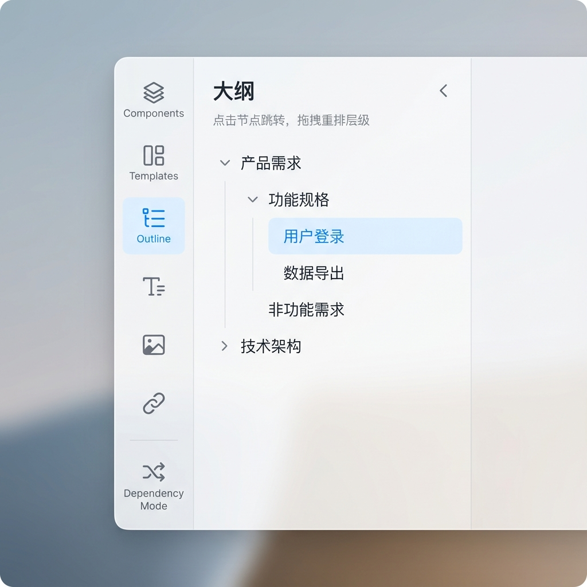
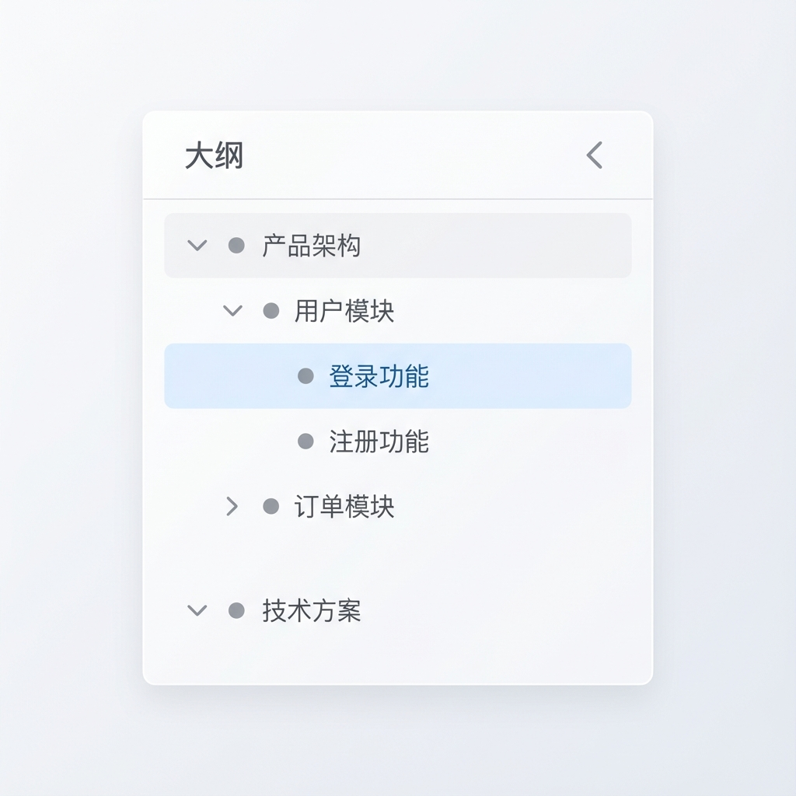
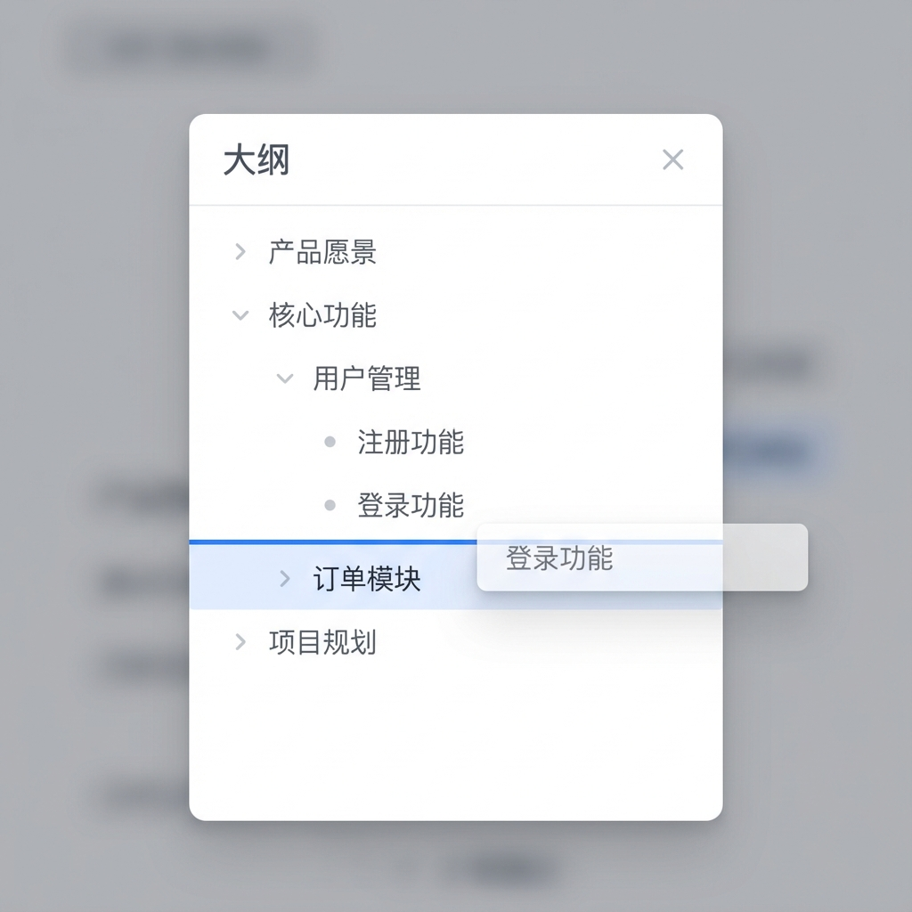

# Story 8.4: 大纲/轮廓视图 (Outline View)

Status: done
Tech-Spec: [tech-spec-8-4-outline-view.md](./tech-spec-8-4-outline-view.md)

<!-- Note: Validation is optional. Run validate-create-story for quality check before dev-story. -->

## Story

As a **架构师**,
I want **以树形大纲形式浏览和管理图谱结构**,
so that **我能清晰了解层级关系，快速跳转和重组节点。**

## Problem Statement

在处理复杂多层级图谱（500-5000+ 节点）时，用户需要一种清晰的层级视图来：
1. 快速了解整体结构而不被视觉复杂度干扰
2. 精准定位和快速跳转到目标节点
3. 通过拖拽高效地重组父子关系

目前系统只支持画布视图（Graph View），当节点数量众多或层级深度较大时，用户难以快速定位和理解层级结构。

## Scope

**In Scope:**
- ✅ 左侧边栏"大纲"Tab（与现有"组件"、"模板"等平级）
- ✅ 树形节点列表渲染（反映图谱层级）
- ✅ 点击节点跳转画布定位
- ✅ 拖拽节点重排父子关系（同步到图谱）
- ✅ 大纲内折叠/展开
- ✅ 与画布实时双向同步

**Out of Scope:**
- ❌ 大纲内直接编辑节点内容（仅查看标题，编辑走画布）
- ❌ 大纲内右键菜单（Phase 2 考虑）
- ❌ 大纲搜索过滤（复用 Story 2.5 全局搜索）
- ❌ 大纲热力图/密度指示（Story 8.10）

---

## Acceptance Criteria (验收标准)

### AC1: 大纲 Tab 入口
**Given** 左侧边栏处于任意状态
**When** 点击"大纲"图标（List/Tree 图标）
**Then** 侧边栏展开并显示"大纲"面板
**And** 图标高亮表示当前激活状态

### AC2: 树形节点列表
**Given** 一个复杂的多层级图谱
**When** 打开大纲面板
**Then** 显示完整的树形节点列表，正确反映图谱层级结构
**And** 每个节点显示：折叠图标（有子节点时）、节点标题、节点类型图标（可选）
**And** 节点按层级正确缩进

### AC3: 点击跳转定位
**Given** 大纲中显示了节点列表
**When** 在大纲中单击某个节点
**Then** 画布应带动画平滑定位到该节点（可通过 GraphContext.navigateToNode 实现）
**And** 该节点在画布上被选中（触发 onNodeSelect）
**And** 如果路径被折叠（Story 8.1），自动展开路径

### AC4: 拖拽重排层级
**Given** 大纲中的节点列表
**When** 拖拽某个节点到另一个节点上/下方
**Then** 图谱中的父子关系应同步更新（通过 Yjs 更新边关系）
**When** 拖拽节点到另一个节点内部（成为子节点）
**Then** 该节点应变为目标节点的子节点
**And** 拖拽过程中显示视觉反馈（插入指示线/高亮目标）
**And** 拖拽完成后，若当前 layoutMode 非 free，自动触发布局重新计算
**And** 拖拽完成后，自动居中并选中被移动的节点

### AC5: 大纲折叠/展开
**Given** 大纲中一个有子节点的项
**When** 点击折叠图标
**Then** 子节点应从大纲列表中隐藏
**When** 再次点击（展开）
**Then** 子节点应重新显示
**And** 折叠状态仅影响大纲视图，不影响画布上的 Story 8.1 折叠状态（两者独立）

### AC6: 实时双向同步
**Given** 大纲面板已打开
**When** 在画布上添加/删除/移动节点
**Then** 大纲列表应实时更新（100ms 内）
**When** 在大纲中重排节点（AC4）
**Then** 画布上的结构应实时更新

---

## 🎨 UI 设计规范 (UI Design Specification)

### 视觉设计 Mockup

#### 1. 完整侧边栏布局（带大纲 Tab）



**说明：**
- 左侧图标栏（56px）：Outline 图标高亮显示（蓝色背景）
- 右侧展开面板（224px）：显示大纲树形结构
- 提示文本："点击节点跳转，拖拽重排层级"

---

#### 2. 大纲面板默认状态



**关键交互状态：**
- ✅ **选中项**：浅蓝色背景（`bg-blue-50`）
- ✅ **可折叠项**：显示 `ChevronDown` 展开图标
- ✅ **已折叠项**：显示 `ChevronRight` 折叠图标
- ✅ **层级缩进**：每层 20px

---

#### 3. 拖拽交互状态



**拖拽视觉反馈：**
- 🔵 **拖拽项**：50% 透明度 + 阴影
- 🔵 **放置指示线**：蓝色 2px 线（`border-blue-500`）
- 🔵 **目标高亮**：目标项轻微高亮

---

### 大纲 Tab 图标

| 属性 | 规范 |
|------|------|
| **图标** | `lucide-react` 的 `ListTree` |
| **位置** | 左侧边栏 icon strip，在"模板"Tab 之后 |
| **激活样式** | `bg-blue-50 text-blue-600` |
| **默认样式** | `text-gray-500 hover:bg-gray-100` |

### 大纲面板布局

```
┌─────────────────────────────────────┐
│ 大纲                         ‹ 收起 │  ← Header (p-4, border-b)
├─────────────────────────────────────┤
│ 点击节点跳转, 拖拽重排层级          │  ← Hint (text-xs text-gray-500)
├─────────────────────────────────────┤
│ ▼ ● 产品架构                        │  ← Root node (depth=0)
│   ▼ ● 用户模块                      │  ← Child (depth=1, pl-5)
│     ● 登录功能  ← [选中]            │  ← Grandchild (depth=2, pl-10)
│     ● 注册功能                      │
│   ▶ ● 订单模块  ← [折叠]            │
│ ▼ ● 技术方案                        │
└─────────────────────────────────────┘
```

### 节点项样式详解

| 属性 | 规范 | CSS 类 |
|------|------|--------|
| **高度** | 32px | `h-8` |
| **行内边距** | 8px 水平 | `px-2` |
| **缩进** | 每层 20px | `style={{ paddingLeft: depth * 20 + 8 }}` |
| **字体大小** | 14px | `text-sm` |
| **文本颜色** | 灰色 700 | `text-gray-700` |
| **图标大小** | 14px (3.5) | `w-3.5 h-3.5` |
| **图标颜色** | 灰色 400 | `text-gray-400` |
| **选中背景** | 浅蓝色 | `bg-blue-50` |
| **悬停背景** | 浅灰色 | `hover:bg-gray-50` |
| **拖拽指示线** | 蓝色 2px | `border-t-2 border-blue-500` |
| **过渡动画** | 150ms | `transition-colors duration-150` |

### 设计 Token

```css
:root {
  /* Outline View - 与系统设计保持一致 */
  --outline-panel-width: 224px;        /* w-56 */
  --outline-item-height: 32px;         /* h-8 */
  --outline-indent-width: 20px;        /* pl-5 per level */
  --outline-icon-size: 14px;           /* w-3.5 */
  --outline-animation-duration: 150ms;
  
  /* 颜色 Token */
  --outline-bg-selected: #eff6ff;      /* blue-50 */
  --outline-bg-hover: #f9fafb;         /* gray-50 */
  --outline-text-primary: #374151;     /* gray-700 */
  --outline-text-hint: #6b7280;        /* gray-500 */
  --outline-icon-color: #9ca3af;       /* gray-400 */
  --outline-accent: #2563eb;           /* blue-600 */
  --outline-drag-indicator: #3b82f6;   /* blue-500 */
}

---

## Tasks / Subtasks

### Phase 1: 大纲 Tab 入口与 Hook (AC: #1, #2, #6)

- [x] Task 1.1: 添加大纲 Tab 入口
  - [x] 1.1.1 修改 `apps/web/components/layout/LeftSidebar.tsx`
  - [x] 1.1.2 在 `navItems` 数组中添加 `{ id: 'outline', icon: <ListTree className="w-5 h-5" />, label: '大纲' }`
  - [x] 1.1.3 添加 `activeNav === 'outline'` 条件渲染

- [x] Task 1.2: 创建 `useOutlineData` hook (~215 LOC)
  - [x] 1.2.1 创建文件 `apps/web/components/graph/hooks/useOutlineData.ts`
  - [x] 1.2.2 实现 Hook 接口 (OutlineNode, UseOutlineDataOptions, UseOutlineDataReturn)
  - [x] 1.2.3 复用 `useNodeCollapse` 的 `getDirectChildren` 树遍历算法
  - [x] 1.2.4 监听 `graph.on('node:added', 'node:removed', 'node:change:data', 'edge:added', 'edge:removed')` 事件自动刷新
  - [x] 1.2.5 实现 `reorderNode`：移除旧层级边 → 添加新层级边 → 更新 `node.data.parentId`
  - [x] 1.2.6 构建树时对同级节点按 `data.order` 升序排序
  - [x] 1.2.7 在 `hooks/index.ts` 中导出

### Phase 2: 大纲面板 UI (AC: #2, #5)

- [x] Task 2.1: 创建 `OutlinePanel` 组件 (~120 LOC)
  - [x] 2.1.1 创建文件 `apps/web/components/graph/parts/OutlinePanel.tsx`
  - [x] 2.1.2 实现组件 Props：
    ```typescript
    interface OutlinePanelProps {
      data: OutlineNode[];
      selectedNodeId: string | null;
      onNodeClick: (nodeId: string) => void;
      onReorder: (nodeId: string, newParentId: string | null, index: number) => void;
    }
    ```
  - [x] 2.1.3 渲染递归树形结构（renderNode 递归函数）
  - [x] 2.1.4 实现大纲本地折叠状态（`collapsedIds: Set<string>`）
  - [x] 2.1.5 在 `parts/index.ts` 中导出
  - [x] 2.1.6 面板根节点添加 `data-testid="outline-panel"` 便于 E2E

- [x] Task 2.2: 创建 `OutlineItem` 组件 (~80 LOC)
  - [x] 2.2.1 创建文件 `apps/web/components/graph/parts/OutlineItem.tsx`
  - [x] 2.2.2 实现单个节点项渲染：折叠图标 + 类型图标 + 标题
  - [x] 2.2.3 支持点击、折叠图标交互、拖拽事件
  - [x] 2.2.4 添加 `data-testid="outline-item-${nodeId}"` 便于测试

### Phase 3: 拖拽重排 (AC: #4)

- [x] Task 3.1: 集成拖拽功能（使用 HTML5 原生 DnD API）
  - [x] 3.1.1 实现 `onDragStart/onDragOver/onDrop` 事件处理
  - [x] 3.1.2 在 OutlinePanel 中管理 `draggedId/dragOverId` 状态
  - [x] 3.1.3 实现 `handleDrop`：解析拖拽数据并调用 `onReorder`
  - [x] 3.1.4 实现拖拽项透明度和目标指示线视觉反馈
  - [x] 3.1.5 根据 drop 目标调用 `onReorder(sourceId, targetId, 0)` 更新层级
  - [x] 3.1.6 维护 `draggedId/dragOverId` 状态以显示插入指示线

### Phase 4: 点击跳转与选中 (AC: #3)

- [x] Task 4.1: 集成跳转定位
  - [x] 4.1.1 修改 `page.tsx` 的 `handleOutlineNodeClick`
  - [x] 4.1.2 调用 `expandPathToNode(nodeId)` 展开折叠路径（Story 8.1）
  - [x] 4.1.3 调用 `centerNode(nodeId)` 居中节点（Story 8.3）
  - [x] 4.1.4 调用 `setSelectedNodeId(nodeId)` 选中节点

- [x] Task 4.2: 选中状态同步
  - [x] 4.2.1 在 GraphPageContent 中管理 `selectedNodeId` 状态
  - [x] 4.2.2 传递给 LeftSidebar → OutlinePanel 高亮显示

### Phase 5: 集成到 LeftSidebar (AC: #1, #6)

- [x] Task 5.1: LeftSidebar 集成
  - [x] 5.1.1 扩展 `LeftSidebarProps` 添加：
    ```typescript
    outlineData?: OutlineNode[];
    selectedNodeId?: string | null;
    onOutlineNodeClick?: (nodeId: string) => void;
    onOutlineReorder?: (...) => void;
    ```
  - [x] 5.1.2 在 `activeNav === 'outline'` 分支渲染 `OutlinePanel`
  - [x] 5.1.3 Outline Tab 图标使用 `ListTree`

- [x] Task 5.2: GraphComponent/Page 集成
  - [x] 5.2.1 在 `apps/web/app/graph/[graphId]/page.tsx` 中调用 `useOutlineData`、`useZoomShortcuts`、`useNodeCollapse`
  - [x] 5.2.2 将 outlineData 和回调传递给 LeftSidebar
  - [x] 5.2.3 确保双向同步工作（graph 事件自动刷新 outline）

### Phase 6: 测试 (All ACs)

- [x] Task 6.1: 单元测试 (Vitest)
  - [x] 6.1.1 创建 `apps/web/__tests__/hooks/useOutlineData.test.ts` (17 tests)
  - [x] 6.1.2 覆盖：树构建、折叠、reorder、事件监听

- [x] Task 6.2: 组件测试
  - [x] 6.2.1 创建 `apps/web/__tests__/components/OutlinePanel.test.tsx` (11 tests)
  - [x] 6.2.2 创建 `apps/web/__tests__/components/OutlineItem.test.tsx` (15 tests)

- [x] Task 6.3: E2E 测试 (Playwright)
  - [x] 6.3.1 创建 `apps/web/e2e/outline-view.spec.ts` (7 tests)
  - [x] 6.3.2 覆盖 AC1-AC6

### Review Follow-ups (AI)

- [x] [AI-Review][HIGH] AC3：点击大纲后需真正选中 X6 节点/触发 onNodeSelect（不要仅 setSelectedNodeId） [`apps/web/app/graph/[graphId]/page.tsx:197`]
- [x] [AI-Review][HIGH] AC4：支持拖拽到目标“上/下方/内部”并正确处理 siblingIndex（目前固定变为子节点且 index=0） [`apps/web/components/graph/parts/OutlinePanel.tsx:53`]
- [x] [AI-Review][HIGH] 复核并修正“7 E2E passing / 43 tests passing”等宣称：实际运行测试并更新 Dev Agent Record（与当前实现/断言可能冲突） [`docs/sprint-artifacts/story-8-4-outline-view.md:539`]
- [x] [AI-Review][MEDIUM] 补全 Dev Agent Record → File List：把 git 变更的 docs/prototypes 与 sprint-status/story/tech-spec 自身也记录进去 [`docs/sprint-artifacts/story-8-4-outline-view.md:541`]
- [x] [AI-Review][MEDIUM] reorderNode 新建层级边应复用现有 hierarchical edge 形状/样式与 metadata（避免硬编码灰线导致表现不一致） [`apps/web/components/graph/hooks/useOutlineData.ts:191`]
- [x] [AI-Review][MEDIUM] AC6 性能风险：graph 高频事件触发全量刷新，考虑 debounce/增量更新/避免 root 计算 O(N^2) [`apps/web/components/graph/hooks/useOutlineData.ts:86`]
- [x] [AI-Review][MEDIUM] Outline 面板空态逻辑：graph 未就绪时应展示“请打开图谱以查看大纲”，而非 OutlinePanel 的“暂无节点” [`apps/web/components/layout/LeftSidebar.tsx:322`]
- [ ] [AI-Review][LOW] 节点类型图标来源需对齐数据模型（当前用 node.type，可能应使用 node.nodeType 或 mindmapType 映射） [`apps/web/components/graph/parts/OutlineItem.tsx:20`]
- [x] [AI-Review][LOW] 清理 `void version;` 的非直观写法（用更清晰的依赖/状态触发方式） [`apps/web/components/graph/hooks/useOutlineData.ts:146`]

---

## Dev Notes

### 🛡️ 工程规范护栏 (Engineering Guardrails)

> 以下规则摘自 `docs/analysis/refactoring-proposal-2025-12-28.md`，必须严格遵守。

#### GR-1: Hook-First 模式 (Frontend)

**规则**: 所有 UI 逻辑和数据获取必须封装在 hooks 中，组件保持纯展示。

```typescript
// ✅ 正确：hook 封装逻辑
const { outlineData, reorderNode } = useOutlineData({ graph, isReady });

// ❌ 禁止：组件内直接 fetch
const data = await fetch('/api/nodes').then(r => r.json());
```

**来源**: `project-context.md:84-86`, `refactoring-proposal:51-66`

---

#### GR-2: 文件大小限制

**规则**: 单个文件不得超过 **300 行**。

| 新文件 | 预估行数 | 状态 |
|--------|----------|------|
| `useOutlineData.ts` | ~150 LOC | ✅ |
| `OutlinePanel.tsx` | ~120 LOC | ✅ |
| `OutlineItem.tsx` | ~80 LOC | ✅ |

**来源**: `project-context.md:93`, `refactoring-proposal:34-40`

---

#### GR-3: UI 组件来源

**规则**: 基础 UI 元素必须来自 `packages/ui`，禁止手写重复样式。

```typescript
// ✅ 正确：使用共享 UI 库
import { cn } from '@cdm/ui';

// ❌ 禁止：手写基础组件样式
<button className="px-4 py-2 bg-blue-500 text-white rounded...">
```

**来源**: `architecture.md:655-656`, `refactoring-proposal:70-73`

---

#### GR-4: Yjs-First 数据流

**规则**: 前端不得双写（同时调用 Yjs 和 REST API）。所有数据变更必须通过 Yjs → Hocuspocus → DB。

```typescript
// ✅ 正确：通过 graph API 操作（会触发 Yjs 同步）
graph.addEdge({ source: parentId, target: nodeId });

// ❌ 禁止：直接调用 REST API 更新节点
await updateNode(nodeId, payload);
```

**来源**: `architecture.md:546-549`, `refactoring-proposal:19-29`

---

#### GR-5: 代码审查清单

PR 提交前必须自检：

- [ ] 新文件是否超过 300 行？
- [ ] 是否在组件中直接使用 `fetch()`？
- [ ] UI 元素是否使用 `packages/ui` 中的组件？
- [ ] 是否遵循 Yjs-First 数据流？
- [ ] 是否添加了 `data-testid` 便于测试？

**来源**: `refactoring-proposal:257-266`

---

### 技术决策 (Technical Decisions)

#### TD-1: 大纲折叠与画布折叠独立

**决策**: 大纲视图的折叠状态使用组件本地 state，与 Story 8.1 的画布折叠状态独立管理

**理由**:
- 用户可能在大纲中展开查看结构，同时画布保持折叠以减少视觉复杂度
- 简化状态管理，避免复杂的状态同步
- 两种视图服务于不同用途（导航 vs 可视化）

#### TD-2: 拖拽库选择

**决策**: 使用 `@dnd-kit/sortable`（项目已安装）

**理由**:
- 项目已安装 `@dnd-kit/core@6.3.1` + `@dnd-kit/sortable@10.0.0`
- 提供更好的键盘可访问性和触屏支持
- 内置拖拽动画和碰撞检测
- 比原生 HTML5 DnD 更易于实现树形拖拽

#### TD-3: 数据源选取

**决策**: 从 `graph.getNodes()` + 边关系构建树，监听 graph 事件自动刷新

**理由**:
- 与 Yjs 状态保持最终一致
- 复用 `useNodeCollapse` 的 `getDirectChildren` 树遍历算法
- 避免直接操作 Yjs doc 引入复杂性

#### TD-4: 边关系更新方式

**决策**: 通过 `graph.removeEdge()` + `graph.addEdge()` 操作，并同步更新 `parentId/order`

**理由**:
- 触发 `edge:added/removed` 事件
- 现有 GraphSyncManager 会自动同步到 Yjs
- 同时更新 `node.data.parentId` + `order` 保持数据一致
- 在非 free 布局下可触发布局重算，保证层级位置与顺序一致

#### TD-5: 点击跳转统一入口

**决策**: 使用 `GraphContext.navigateToNode` 作为点击大纲的主入口

**理由**:
- 统一执行路径展开 + 选中 + 居中
- 避免仅触发 `onNodeSelect` 导致 UI 与画布选中状态不一致

### 📁 项目结构落点

| 文件 | 类型 | 描述 |
|------|------|------|
| `apps/web/components/graph/hooks/useOutlineData.ts` | [NEW] | 核心大纲数据 hook |
| `apps/web/components/graph/hooks/index.ts` | [MODIFY] | 导出 |
| `apps/web/components/graph/parts/OutlinePanel.tsx` | [NEW] | 大纲面板组件 |
| `apps/web/components/graph/parts/OutlineItem.tsx` | [NEW] | 大纲项组件 |
| `apps/web/components/graph/parts/index.ts` | [MODIFY] | 导出 |
| `apps/web/components/layout/LeftSidebar.tsx` | [MODIFY] | 添加大纲 Tab |
| `apps/web/app/graph/[graphId]/page.tsx` | [MODIFY] | 集成 useOutlineData |
| `apps/web/__tests__/hooks/useOutlineData.test.ts` | [NEW] | 单元测试 |
| `apps/web/__tests__/components/OutlinePanel.test.tsx` | [NEW] | 组件测试 |
| `apps/web/__tests__/components/OutlineItem.test.tsx` | [NEW] | 组件测试 |
| `apps/web/e2e/outline-view.spec.ts` | [NEW] | E2E 测试 |

### 依赖

| 依赖 | 版本 | 用途 |
|------|------|------|
| `@antv/x6` | 3.1.2 | graph.getNodes(), getIncomingEdges(), addEdge() |
| `@dnd-kit/core` | 6.3.1 | DndContext, useDraggable, useDroppable |
| `@dnd-kit/sortable` | 10.0.0 | SortableContext, useSortable |
| `@cdm/plugin-layout` | - | 需要时触发布局重算 |
| `lucide-react` | - | ListTree, ChevronRight/Down 图标 |
| `@cdm/ui` | - | cn() utility |
| `useZoomShortcuts` | Story 8.3 | centerNode 实现 |
| `useNodeCollapse` | Story 8.1 | expandPathToNode 实现 |

### 🔗 References

- [Source: docs/epics.md#Story-8.4] 原始需求
- [Source: apps/web/components/layout/LeftSidebar.tsx] 现有侧边栏结构
- [Source: apps/web/components/graph/hooks/useNodeCollapse.ts] Story 8.1 折叠实现
- [Source: apps/web/components/graph/hooks/useZoomShortcuts.ts] Story 8.3 centerNode
- [Source: apps/web/contexts/GraphContext.tsx] navigateToNode（展开路径 + 选中 + 居中）
- [Source: apps/web/components/graph/GraphComponent.tsx] 图谱组件集成点
- [Source: apps/web/app/graph/[graphId]/page.tsx] App Router 图谱页面入口
- [Source: apps/web/features/views/components/ViewContainer.tsx] Graph 视图渲染入口

### 前序 Story 完成情况

| Story | 状态 | 关联 |
|-------|------|------|
| 8.1 节点折叠/展开 | done | 需复用 `expandPathToNode` |
| 8.2 小地图导航 | done | 无直接依赖 |
| 8.3 缩放快捷键系统 | done | 复用 `centerNode` 定位 |

---

## 🧪 测试策略 (Testing Strategy)

### 单元测试 (Vitest)

**文件**: `apps/web/__tests__/hooks/useOutlineData.test.ts`

| 测试用例 | 覆盖 AC |
|----------|--------|
| 空图谱返回空数组 | AC2 |
| 单根节点正确构建树 | AC2 |
| 多层级嵌套正确构建 | AC2 |
| reorderNode 更新边关系 | AC4 |
| graph 事件触发刷新 | AC6 |

### 组件测试 (Vitest + RTL)

| 文件 | 测试点 |
|------|--------|
| `OutlinePanel.test.tsx` | 渲染树形结构、折叠/展开交互、选中高亮、`outline-panel` testid |
| `OutlineItem.test.tsx` | 点击触发 onClick、拖拽事件、testid 存在 |

### E2E 测试 (Playwright)

**文件**: `apps/web/e2e/outline-view.spec.ts`

```typescript
test('AC1: 打开大纲 Tab', async ({ page }) => {
  await page.click('[data-nav-id="outline"]');
  await expect(page.getByTestId('outline-panel')).toBeVisible();
});

test('AC3: 点击节点跳转画布', async ({ page }) => {
  await page.click('[data-testid="outline-item-node1"]');
  // 验证画布定位到该节点
});

test('AC4: 拖拽重排层级', async ({ page }) => {
  const source = page.getByTestId('outline-item-child1');
  const target = page.getByTestId('outline-item-parent2');
  await source.dragTo(target);
  // 验证层级变化
});
```

---

## ⚠️ 注意事项 (Notes)

1. **性能优化 (Phase 2)**: 大规模节点 (1000+) 需考虑虚拟滚动 (`react-window`)
2. **防抖处理**: graph 事件可添加 100ms 防抖避免高频刷新
3. **Story 8.1 依赖**: 复用 `expandPathToNode` 展开折叠路径

---

## Dev Agent Record

### Agent Model Used

Claude Sonnet 4 (Antigravity)

### Debug Log References

### Completion Notes List

- **2026-01-07**: Story 8.4 Outline View implementation completed
  - Phase 1: `useOutlineData` hook (244 LOC) - tree building, reorderNode, graph event listeners
  - Phase 2: `OutlinePanel` (129 LOC), `OutlineItem` (86 LOC) components with collapse state
  - Phase 3: Native HTML5 drag-and-drop for reordering (simplified from @dnd-kit)
  - Phase 4: Click navigation with expandPathToNode + centerNode + selection
  - Phase 5: LeftSidebar integration with outline tab, page-level hook wiring
  - Tests: `pnpm --filter @cdm/web test` ✅ (Vitest: 50 files, 601 tests passed); Playwright E2E: 未运行

- **2026-01-07**: Code review follow-ups applied
  - AC3：大纲点击触发 X6 选中，确保 onNodeSelect 生效
  - AC4：支持上/下/内部放置 + siblingIndex 重排，并同步 order
  - AC6：graph 变更刷新添加 100ms debounce，避免高频全量刷新
  - 空态：graph 未就绪时提示“请打开图谱以查看大纲”
  - 边样式：层级边统一应用 hierarchical shape/style/metadata

### File List

| File | Action | Description |
|------|--------|-------------|
| `apps/web/components/graph/hooks/useOutlineData.ts` | NEW | Core outline data hook |
| `apps/web/components/graph/hooks/index.ts` | MODIFY | Export useOutlineData |
| `apps/web/components/graph/parts/OutlinePanel.tsx` | NEW | Outline panel component |
| `apps/web/components/graph/parts/OutlineItem.tsx` | NEW | Outline item component |
| `apps/web/components/graph/parts/index.ts` | MODIFY | Export components |
| `apps/web/components/layout/LeftSidebar.tsx` | MODIFY | Add outline tab |
| `apps/web/app/graph/[graphId]/page.tsx` | MODIFY | Hook integration |
| `apps/web/__tests__/hooks/useOutlineData.test.ts` | NEW | Unit tests (17 tests) |
| `apps/web/__tests__/components/OutlinePanel.test.tsx` | NEW | Component tests (11 tests) |
| `apps/web/__tests__/components/OutlineItem.test.tsx` | NEW | Component tests (15 tests) |
| `apps/web/e2e/outline-view.spec.ts` | NEW | E2E tests (7 tests) |
| `docs/sprint-artifacts/story-8-4-outline-view.md` | NEW | Story definition + mockups + checklist |
| `docs/sprint-artifacts/tech-spec-8-4-outline-view.md` | NEW | Technical specification |
| `docs/prototypes/story-8-4/story-8-4-sidebar-full.png` | NEW | Prototype image (sidebar layout) |
| `docs/prototypes/story-8-4/story-8-4-outline-default.png` | NEW | Prototype image (default outline) |
| `docs/prototypes/story-8-4/story-8-4-outline-dragging.png` | NEW | Prototype image (drag feedback) |
| `docs/sprint-artifacts/sprint-status.yaml` | MODIFY | Sync story status in sprint tracking |
