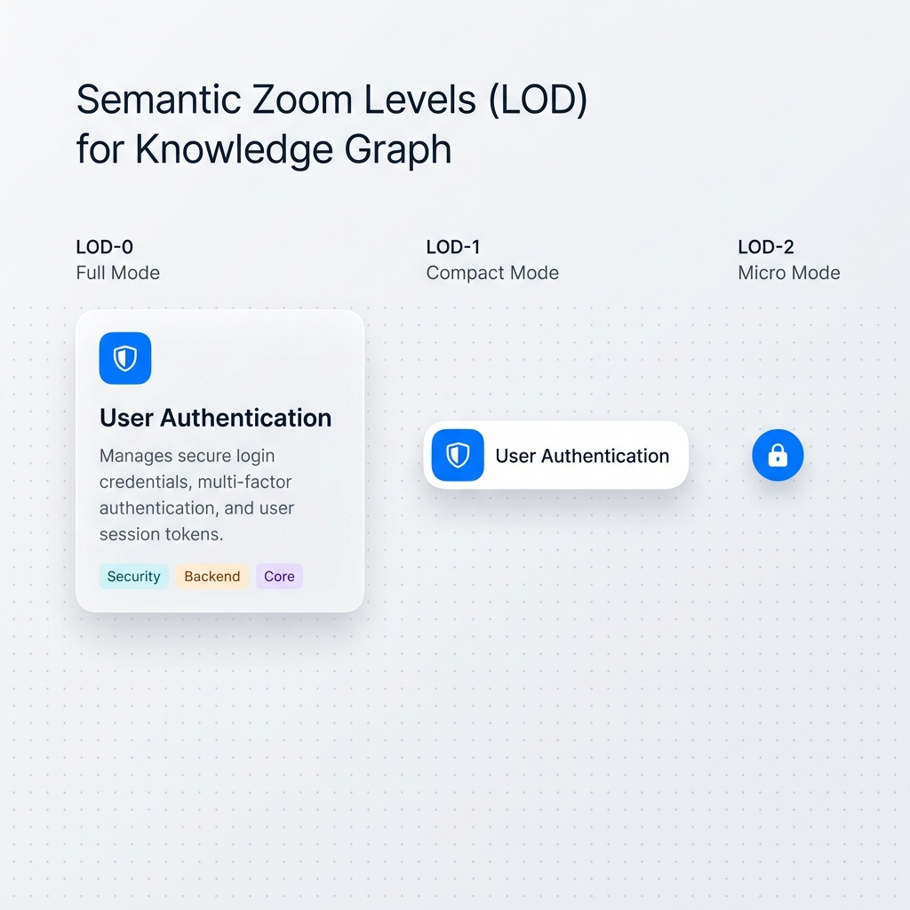

# Story 8.8: 语义缩放 LOD (Semantic Zoom / Level of Detail)

Status: done
Tech-Spec: [tech-spec-8-8-semantic-zoom-lod.md](./tech-spec-8-8-semantic-zoom-lod.md)

<!-- Note: Validation is optional. Run validate-create-story for quality check before dev-story. -->

## Story

As a **用户**,
I want **缩放时节点自动调整显示详细程度**,
so that **我在缩小全局视图时仍能获取关键信息而不杂乱。**

## Problem Statement

在处理大规模图谱（500-5000+ 节点）时，用户缩小画布查看全局结构时，节点内容（标题、描述、属性标签）全部挤在一起变得难以辨认。当前系统在任何缩放级别都显示节点的完整内容，这在低缩放级别下造成：
- 文字过小难以阅读
- 视觉过于拥挤，无法快速识别结构
- 重要信息（标题）被次要信息（描述、属性）淹没

语义缩放 / LOD（Level of Detail）通过根据当前缩放级别动态调整节点显示详细程度，让用户在缩小时仍能获取关键信息（标题/图标），在放大时看到完整细节。

## Scope

**In Scope:**
- ✅ 缩放级别检测与阈值定义（X6 `graph.zoom()` / `useGraphTransform().scale`，`1.0 = 100%`）：
  - **LOD-0 (Full)**：`scale >= 0.5`
  - **LOD-1 (Compact)**：`0.25 <= scale < 0.5`
  - **LOD-2 (Micro)**：`scale < 0.25`
- ✅ 节点内容分层显示（对“有详细内容的节点”生效：`RichNode` / `LegacyCardNode`）：
  - **Full**：Icon + Title + Metrics/Description + Tags + Footer Actions
  - **Compact**：Icon + Title（隐藏 Metrics/Description、Tags、Footer）
  - **Micro**：仅 Icon/色块（隐藏 Title + 其余内容）
- ✅ 普通节点（`OrdinaryNode`）：
  - **Full/Compact**：保持现状（仅标题）
  - **Micro**：隐藏文字，显示色块/圆点占位（保证仍可辨识节点存在）
- ✅ LOD 过渡平滑无跳变（opacity/scale），遵守 `prefers-reduced-motion`
- ✅ 与现有 Focus Mode（Story 8.5）、Collapse（Story 8.1）兼容（LOD 只调整节点内部内容，不覆盖 Focus Mode 的 X6 `fo/opacity`）

**Out of Scope:**
- ❌ 边的 LOD（边在低缩放级别可保持不变）
- ❌ LOD 阈值用户可配置（Phase 2 考虑）
- ❌ 性能虚拟化优化（Story 3.5 性能优化）

---

## Acceptance Criteria (验收标准)

### AC1: 缩放到 < 50% 时隐藏描述和属性
**Given** 一个包含详细内容的节点（有标题、描述、属性标签）
**When** 缩放到 < 50% 时
**Then** 节点应只显示标题，隐藏描述和属性标签
**And** **边界值**：`scale === 0.5` 视为 **Full**（不进入 Compact）

### AC2: 缩放到 < 25% 时只显示图标/色块
**Given** 一个包含详细内容的节点
**When** 缩放到 < 25% 时
**Then** 节点应只显示类型图标或颜色色块，隐藏标题
**And** 图标/色块应足够大以便用户识别节点存在
**And** **边界值**：`scale === 0.25` 视为 **Compact**（不进入 Micro）

### AC3: 放大恢复完整显示
**Given** 当前缩放级别 < 50%（节点处于简洁/图标模式）
**When** 放大回 ≥ 50% 时
**Then** 节点应恢复完整显示（标题 + 描述 + 属性）
**And** 过渡应平滑，无明显跳变

### AC4: 过渡平滑无跳变
**Given** 用户正在连续缩放画布
**When** 缩放级别跨越阈值边界（50%、25%）
**Then** 节点内容变化应使用过渡动画（opacity/scale）
**And** 遵守 `prefers-reduced-motion` 用户偏好
**And** 无突然的尺寸跳变或内容闪烁

### AC5: 与 Focus Mode 兼容
**Given** 聚焦模式（Story 8.5）激活中
**When** 同时缩放画布
**Then** LOD 效果应叠加在聚焦透明度之上（淡化节点也应用 LOD）
**And** 两个功能互不干扰

---

## 🎨 High-Precision UI Design Specification (高精度 UI 设计规范)



> **Design Philosophy**: 遵循 "Arc/Linear" 风格，结合 Magic UI 的流动感与 AntV X6 的高性能。核心目标是创造 "Fluidity"（流体感）与 "Clarity"（清晰度）。

### 1. Visual States & LOD Thresholds

| LOD Level | Scale Range | Visual Style | Content | Transition Behavior |
|-----------|-------------|--------------|---------|---------------------|
| **LOD-0 (Full)** | `scale >= 0.5` | **Information Card**<br>`bg-background/95` + `backdrop-blur-sm`<br>`border-border/40` | • Icon + Title<br>• Metrics/Description<br>• Tags + Badges<br>• Footer Actions (Hover) | Default. Maximum clarity. |
| **LOD-1 (Compact)** | `0.25 <= scale < 0.5` | **Compact Card**<br>`bg-background/90`<br>`shadow-sm` | • Icon + Title（单行）<br>• *Hidden: Metrics/Desc, Tags, Footer* | Detail blocks fade out (`opacity → 0`). |
| **LOD-2 (Micro)** | `scale < 0.25` | **Semantic Marker**<br>高对比色块/图标 | • Icon/色块<br>• *No Text* | Title fades out; marker stays visible. |

### 2. High-Fidelity Rendering Specs

#### 2.1 LOD-0 (Full) - "The Information Card"
- **Container**:
  - `rounded-lg` (or `rounded-xl` for large containers)
  - Border: `1px solid rgba(var(--border-rgb), 0.1)`
  - Shadow: `0 2px 8px -2px rgba(0, 0, 0, 0.05)` (Soft ambient shadow)
- **Typography**:
  - Title: `font-semibold text-foreground tracking-tight`
  - Desc: `text-sm text-muted-foreground leading-relaxed line-clamp-3`

#### 2.2 LOD-1 (Compact) - "The Scanner"
- **Container**:
  - Height: Fixed `36px` (or `40px` touch-friendly)
  - `rounded-md`
- **Typography**:
  - Title: `text-sm font-medium truncate`
  - Mask: `mask-image: linear-gradient(to right, black 85%, transparent 100%)` (Soft truncation)

#### 2.3 LOD-2 (Micro) - "The Structure Node"
- **Container**:
  - 目标是“远看可辨识”：以 **Icon/色块** 替代文本（避免固定像素尺寸在 canvas 缩放下过小）。
  - 通过更高对比的背景色和更少的内部元素提高可见性。

### 3. Motion & Transitions (Magic UI)

本 Story **不引入新动画依赖**（例如 `framer-motion`），使用 CSS/Tailwind 过渡即可满足 AC4。

- **Opacity**: `duration-200 ease-out`（或同等效果）
- **Reduced Motion**: 使用 Tailwind `motion-reduce:*` 变体禁用过渡（满足 `prefers-reduced-motion`）

> **Micro-Interaction**:
> 当鼠标悬停在 **LOD-2 (Micro)** 节点上时：使用 `title={label}` 或轻量 Tooltip 展示完整标题（不新增依赖）。

### 4. Implementation Tokens (Tailwind)

```tsx
// lod-layer-styles
const lodStyles = {
  full: "bg-background/95 backdrop-blur-sm border border-border/40 shadow-sm transition-all duration-200",
  compact: "bg-background/90 border border-border/30 shadow-sm transition-all duration-200",
  micro: "bg-primary text-primary-foreground border border-border/20 shadow-md transition-all duration-200",
}
```

### 5. Accessibility & Dark Mode
- **Dark Mode**: 确保 LOD-2 的 Micro 节点在深色背景下有足够的对比度（增加白色/高亮描边）。
- **Reduced Motion**: `prefers-reduced-motion` 下禁用过渡（使用 Tailwind `motion-reduce:*`）。

---

## Tasks / Subtasks

> **关键实现约束（避免踩坑）**：X6 的 `mind-node` React Shape 通过 portal/独立渲染树挂载，**无法访问 GraphComponent 的 React Context**。这是本仓库已验证的事实（参见 `apps/web/lib/subscriptionStore.ts` 与 `apps/web/lib/commentCountStore.ts` 头部注释）。因此 LOD 状态请使用全局 store（pub/sub 或 Zustand）在不同 React roots 间共享。

> **⚡ 实现简化**：直接复用 `useGraphTransform` 提供的 `scale` 值，无需新建图层级监听。

### Phase 1: LOD 工具函数 + 全局 Store (AC: #1, #2, #3)

- [x] Task 1.1: 新增 `semanticZoomLOD` 实现（可跨 React roots 使用）
  - [x] 1.1.1 创建文件 `apps/web/lib/semanticZoomLOD.ts`
  - [x] 1.1.2 定义 `type LODLevel = 'full' | 'compact' | 'micro'`
  - [x] 1.1.3 定义阈值函数 `getLODLevel(scale: number): LODLevel`
    - `scale >= 0.5` → `full`
    - `0.25 <= scale < 0.5` → `compact`
    - `scale < 0.25` → `micro`
  - [x] 1.1.4 Store API：`setGraphScale(scale)` / `getCurrentLOD()` / `subscribe(listener)`
    - 仅当 **LODLevel 发生变化** 时才 notify（避免连续缩放时高频刷新）
  - [x] 1.1.5 React Hook：`useLODLevel()`（建议用 `useSyncExternalStore` 订阅 store）

### Phase 2: GraphComponent 集成 (AC: #1, #2, #3)

- [x] Task 2.1: 在 GraphComponent 中写入缩放值到 LOD Store
  - [x] 2.1.1 在 `apps/web/components/graph/GraphComponent.tsx` 导入 `setGraphScale`
  - [x] 2.1.2 基于现有 `useGraphTransform` 的 `scale` 在 `useEffect` 中调用 `setGraphScale(scale)`
  - [x] 2.1.3 **禁止**写入 Yjs（LOD 为纯 UI 状态）

### Phase 3: 节点渲染器 LOD 支持 (AC: #1, #2, #3)

> **📋 现状**：MindNode 已在 Story 7.4 拆出 `OrdinaryNode` / `RichNode` / `LegacyCardNode`。MindNode 当前约 374 行（已超 300 行规则），本 Story 对 MindNode 的修改应保持“最小化”（只做 LOD 注入/属性标记）。

- [x] Task 3.1: MindNode 注入 LOD（最小改动）
  - [x] 3.1.1 `apps/web/components/nodes/MindNode.tsx` 内使用 `useLODLevel()` 获取当前 LOD
  - [x] 3.1.2 在 `data-testid=\"mind-node\"` 容器上补充 `data-lod={lod}`（E2E 稳定选择器）
  - [x] 3.1.3 将 `lod` 作为 prop 传入 `OrdinaryNode` / `RichNode` / `LegacyCardNode`（避免子组件重复订阅）

- [x] Task 3.2: 修改 `OrdinaryNode.tsx` 支持 LOD
  - [x] 3.2.1 `lod==='micro'`：隐藏标题，显示色块/圆点（满足 AC2）
  - [x] 3.2.2 添加稳定选择器：`data-testid=\"mind-node-title\"` / `data-testid=\"mind-node-micro\"`

- [x] Task 3.3: 修改 `RichNode.tsx` 支持 LOD
  - [x] 3.3.1 `compact`：隐藏 `MetricsRow`、Tags Row、Footer（保留 Icon + Title）
  - [x] 3.3.2 `micro`：隐藏 Title 文本，仅保留 Icon/色块占位（可用 `title={label}` 作为 tooltip）
  - [x] 3.3.3 添加稳定选择器：Title/Tags/Footer/Micro（同上）

- [x] Task 3.4: 修改 `LegacyCardNode.tsx` 支持 LOD（兼容旧渲染路径）
  - [x] 3.4.1 `compact`：隐藏 Description + Footer
  - [x] 3.4.2 `micro`：仅显示 Icon/色块，隐藏 Title/Description

### Phase 4: 过渡动画 (AC: #4)

- [x] Task 4.1: CSS 过渡实现
  - [x] 4.1.1 添加 CSS transition 类
  - [x] 4.1.2 使用 Tailwind `motion-reduce:*` 变体禁用动画（满足 `prefers-reduced-motion`）

### Phase 5: Focus Mode 兼容验证 (AC: #5)

- [x] Task 5.1: 验证 LOD 与 Focus Mode 叠加

### Phase 6: 测试 (All ACs)

- [x] Task 6.1: 单元测试 (Vitest)
- [x] Task 6.2: 组件测试 (Vitest + RTL)
- [x] Task 6.3: E2E 测试 (Playwright)

---

## Dev Notes

### 🛡️ 工程规范护栏 (Engineering Guardrails)

#### GR-1: Hook-First 模式 (Frontend) 🔴 强制
所有 UI 逻辑必须封装在 hooks 或 Context 中。

#### GR-2: 文件大小限制 (300 行) 🔴 强制
单个文件不得超过 300 行。

#### GR-3: 禁止组件内直接 fetch 🔴 强制
本 Story 不涉及 API 调用。

#### GR-4: 过渡动画遵守 prefers-reduced-motion
所有动画必须检查用户偏好。

#### GR-5: Context vs setData 选择 (性能)
**不要**使用 React Context 从 GraphComponent 向 MindNode 传递 LOD（节点渲染在 React tree 之外拿不到 Context）。使用全局 store（参照 `apps/web/lib/commentCountStore.ts`、`apps/web/lib/subscriptionStore.ts`）来跨 React roots 共享 LOD，并避免逐节点 `node.setData()`。

---

### 💡 技术决策 (Technical Decisions)

| 决策 | 说明 |
|------|------|
| TD-1 | 复用 `useGraphTransform` 的 `scale`，无需新建监听 |
| TD-2 | Phase 1 仅隐藏/简化内容，**不调用** `node.setSize()`（避免布局跳变与性能回归） |
| TD-3 | 不新增动画依赖（不引入 `framer-motion`），使用 CSS/Tailwind 过渡 + `motion-reduce` |
| TD-4 | LOD 状态通过 `apps/web/lib/semanticZoomLOD.ts` 全局 store 在不同 React roots 间共享 |

---

### 📁 项目结构落点

| 文件 | 类型 | 描述 |
|------|------|------|
| `apps/web/lib/semanticZoomLOD.ts` | [NEW] | LOD 阈值 + 全局 store + hook |
| `apps/web/components/graph/GraphComponent.tsx` | [MODIFY] | 将 `scale` 写入 LOD store |
| `apps/web/components/nodes/MindNode.tsx` | [MODIFY] | 注入 LOD、`data-lod`、向子渲染器传递 |
| `apps/web/components/nodes/OrdinaryNode.tsx` | [MODIFY] | LOD 条件渲染 |
| `apps/web/components/nodes/RichNode.tsx` | [MODIFY] | LOD 条件渲染 |
| `apps/web/components/nodes/LegacyCardNode.tsx` | [MODIFY] | LOD 条件渲染 |
| `apps/web/e2e/semantic-zoom.spec.ts` | [NEW] | E2E：LOD 阈值 + 内容显示 |
| `apps/web/__tests__/lib/semanticZoomLOD.test.ts` | [NEW] | 单元：阈值/边界值 |
| `docs/prototypes/story-8-8/semantic-zoom-lod-prototype.png` | [NEW] | 语义缩放原型图 |

---

## 🧪 测试策略 (Testing Strategy)

### 测试覆盖矩阵

| AC | 描述 | 单元测试 | 组件测试 | E2E 测试 |
|----|------|:--------:|:--------:|:--------:|
| AC1 | 缩放到 <50% 时隐藏描述和属性 | ✅ | ✅ | ✅ |
| AC2 | 缩放到 <25% 时只显示图标/色块 | ✅ | ✅ | ✅ |
| AC3 | 放大恢复完整显示 | ✅ | ✅ | ✅ |
| AC4 | 过渡平滑无跳变 | ✅ | ✅ | ✅ |
| AC5 | 与 Focus Mode 兼容 | ✅ | ✅ | ✅ |

---

### 单元测试 (Vitest)

**文件**: `apps/web/__tests__/lib/semanticZoomLOD.test.ts`

#### 阈值函数测试

| 测试用例 | 覆盖 AC | 描述 |
|----------|--------|------|
| `getLODLevel(0.6)` 返回 'full' | AC1 | 正常缩放级别 |
| `getLODLevel(0.4)` 返回 'compact' | AC1 | 中等缩放级别 |
| `getLODLevel(0.2)` 返回 'micro' | AC2 | 极小缩放级别 |
| `getLODLevel(0.5)` 返回 'full' | AC1 | 边界值：0.5 为 full |
| `getLODLevel(0.499)` 返回 'compact' | AC1 | 边界值：刚低于 0.5 |
| `getLODLevel(0.25)` 返回 'compact' | AC2 | 边界值：0.25 为 compact |
| `getLODLevel(0.249)` 返回 'micro' | AC2 | 边界值：刚低于 0.25 |

#### LOD 状态变化测试

| 测试用例 | 覆盖 AC | 描述 |
|----------|--------|------|
| `setGraphScale()` 仅在 level 变化时 notify | AC4 | 性能护栏：避免高频刷新 |
| full → compact 变化正确 | AC1 | 状态转换 |
| compact → micro 变化正确 | AC2 | 状态转换 |
| micro → compact → full 恢复正确 | AC3 | 恢复场景 |

---

### 组件测试 (Vitest + RTL)

#### 通用 LOD 渲染测试

**文件**: `apps/web/__tests__/components/nodes/SemanticZoomLOD.test.tsx`

| 测试用例 | 覆盖 AC | 描述 |
|----------|--------|------|
| LOD='full' 显示 Title + Tags/Footer（Rich/Legacy） | AC1 | 完整内容渲染 |
| LOD='compact' 仅显示 Icon + Title（隐藏 Tags/Footer/Desc） | AC1 | 简洁模式 |
| LOD='micro' 仅显示 Icon/色块（隐藏 Title） | AC2 | Micro 模式 |
| LOD 从 compact/micro 变回 full 恢复完整内容 | AC3 | 恢复测试 |

#### 各渲染器分别测试

**文件**: `apps/web/__tests__/components/nodes/OrdinaryNodeLOD.test.tsx`

| 测试用例 | 覆盖 AC |
|----------|--------|
| OrdinaryNode LOD='full' 显示标题 | AC1 |
| OrdinaryNode LOD='compact' 显示标题 | AC1 |
| OrdinaryNode LOD='micro' 显示色块，隐藏标题 | AC2 |

**文件**: `apps/web/__tests__/components/nodes/RichNodeLOD.test.tsx`

| 测试用例 | 覆盖 AC |
|----------|--------|
| RichNode (Task) LOD='full' 显示 Tags/Footer | AC1 |
| RichNode (PBS) LOD='compact' 隐藏 Tags/Footer | AC1 |
| RichNode (App) LOD='micro' 隐藏 Title，仅显示 Icon | AC2 |

**文件**: `apps/web/__tests__/components/nodes/LegacyCardNodeLOD.test.tsx`

| 测试用例 | 覆盖 AC |
|----------|--------|
| LegacyCardNode LOD='full' 显示标题+描述+tags | AC1 |
| LegacyCardNode LOD='compact' 仅显示标题 | AC1 |
| LegacyCardNode LOD='micro' 仅显示色块/图标 | AC2 |

#### 过渡动画测试

| 测试用例 | 覆盖 AC | 描述 |
|----------|--------|------|
| LOD 变化时关键元素具备 transition class | AC4 | 动画存在 |
| `motion-reduce:*` 下不应用 transition | AC4 | 无障碍支持 |

#### Focus Mode 兼容测试

| 测试用例 | 覆盖 AC | 描述 |
|----------|--------|------|
| Focus Mode 淡化节点同时应用 LOD='compact' | AC5 | 叠加测试 |
| Focus Mode 淡化节点同时应用 LOD='micro' | AC5 | 叠加测试 |
| LOD 和 Focus Mode opacity 属性不冲突 | AC5 | CSS 兼容 |
| 退出 Focus Mode 后 LOD 效果保持 | AC5 | 独立性 |

---

### E2E 测试 (Playwright)

**文件**: `apps/web/e2e/semantic-zoom.spec.ts`

**E2E 约束（必须对齐现有测试基建）**
- 使用 `gotoTestGraph(page, testInfo)`（参见 `apps/web/e2e/testUtils.ts`），不要 hardcode `/graph/test-graph?...`
- 缩放通过 `window.__cdmGraph.zoomTo(scale)`（参见 `apps/web/hooks/useGraph.ts` 暴露逻辑，以及 `apps/web/e2e/zoom-shortcuts.spec.ts` 用法）
- 断言不要依赖不存在的 `.node-title/.node-description/.node-tags` class；使用本 Story 要求新增的 `data-testid`（或 `data-lod`）

**最小测试用例集合（建议）**
- AC1：`zoomTo(0.4)` → `data-lod='compact'`，Tags/Footer/Desc 不可见/不存在，Title 存在
- AC1 boundary：`zoomTo(0.5)` → `data-lod='full'`
- AC2：`zoomTo(0.2)` → `data-lod='micro'`，Title 不存在/不可见，Micro 指示器存在
- AC2 boundary：`zoomTo(0.25)` → `data-lod='compact'`
- AC3：`zoomTo(0.2)` → `zoomTo(0.6)` → 恢复 full
- AC5：启用 Focus Mode 后再切换 LOD，确保 `fo/opacity` 不被 LOD 覆盖（仅验证内容层级即可）

---

### 测试运行命令

```bash
# 单元测试 + 组件测试 (Vitest)
pnpm --filter @cdm/web test

# 运行特定测试文件
pnpm --filter @cdm/web test semanticZoomLOD
pnpm --filter @cdm/web test SemanticZoomLOD

# E2E 测试 (Playwright)
pnpm --filter @cdm/web test:e2e

# 运行特定 E2E 测试
pnpm --filter @cdm/web test:e2e semantic-zoom
```

---

## ⚠️ 注意事项 (Notes)

1. **⚡ 实现简化**: 直接复用 `useGraphTransform` 的 `scale`，无需新建 hook
2. **📏 行数检查**: 修改渲染器前先检查当前行数，避免超过 300 行限制
3. **🔢 边界值**: 50% 和 25% 是精确阈值，覆盖边界值测试（0.5, 0.25, 0.249, 0.499）
4. **🎭 Focus Mode**: LOD 只控制内容显隐，不修改 X6 `fo/opacity`（Focus Mode 负责透明度）
5. **🧩 React Context 坑**: `mind-node` 渲染在 React tree 之外，LOD/计数等状态必须走全局 store（已有先例：comment/subscription stores）
6. **🚀 Phase 2**: 如需“保持 Micro 图标在屏幕像素大小恒定”，再考虑做 scale 反向补偿/节点 resize（本 Story 不做）

---

## Senior Developer Review (AI)

### Review Summary

- ✅ AC1/AC2/AC3/AC4/AC5 已对齐实现与测试覆盖（含 Focus Mode `fo/opacity` 叠加校验）
- ✅ 发现并修复关键实现缺陷：RichNode Micro 模式背景色误用（hex 被当作 className，导致 marker 不生效）
- ✅ 补齐稳定选择器（`data-testid`/`data-lod`）以支持 E2E 断言

### Notes

- 本 Story 为纯 UI LOD 状态：仅依赖 `useGraphTransform().scale`，不写入 Yjs（避免协作状态污染）

---

## Dev Agent Record

### Agent Model Used

GPT-5.2 (Codex CLI)

### Debug Log References

### Completion Notes List

- Implemented semantic zoom LOD store + node renderers.
- Added tests (unit + component + E2E).

### File List

**Modified**
- `apps/web/components/graph/GraphComponent.tsx`
- `apps/web/components/nodes/LegacyCardNode.tsx`
- `apps/web/components/nodes/MindNode.tsx`
- `apps/web/components/nodes/OrdinaryNode.tsx`
- `apps/web/components/nodes/RichNode.tsx`
- `apps/web/components/nodes/rich/TitleRow.tsx`
- `docs/sprint-artifacts/sprint-status.yaml`

**Added**
- `apps/web/lib/semanticZoomLOD.ts`
- `apps/web/__tests__/lib/semanticZoomLOD.test.ts`
- `apps/web/__tests__/components/nodes/SemanticZoomLOD.test.tsx`
- `apps/web/e2e/semantic-zoom-lod.spec.ts`
- `docs/sprint-artifacts/story-8-8-semantic-zoom-lod.md`

### Change Log

- Added global LOD store (`semanticZoomLOD`) with stable threshold logic and `useSyncExternalStore` hook.
- Wired Graph scale → LOD store via `useGraphTransform().scale` (local-only UI state, not persisted to Yjs).
- Added `data-lod` on `MindNode` root and propagated `lod` into node renderers.
- Implemented Full/Compact/Micro rendering for Ordinary/Rich/Legacy nodes, with stable selectors for E2E.
- Fixed RichNode micro marker background color to use inline style instead of invalid className.
- Added smooth transitions with `motion-reduce:*` and crossfade/unmount behavior across LOD boundaries.
- Added unit + component + E2E coverage for AC1–AC5.

### Tests Run

- `pnpm --filter @cdm/web test semanticZoomLOD`
- `pnpm --filter @cdm/web test:e2e -- semantic-zoom-lod.spec.ts`
