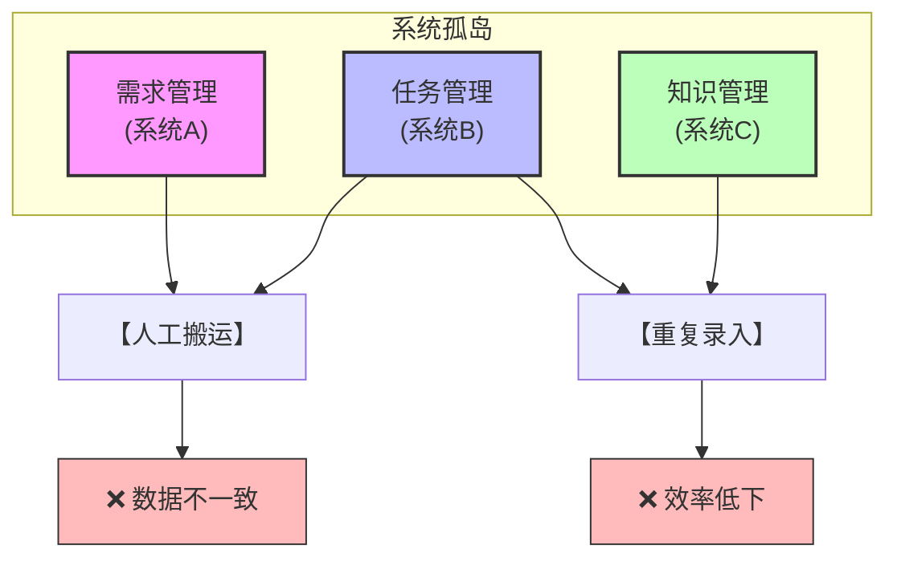
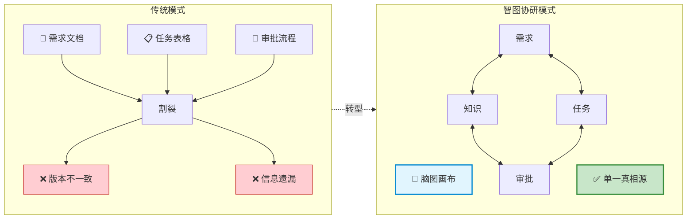
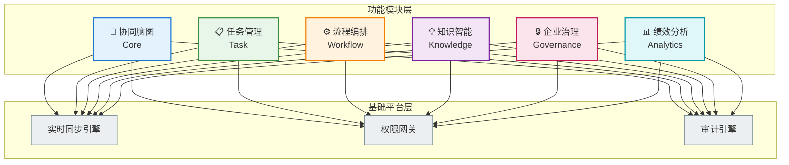
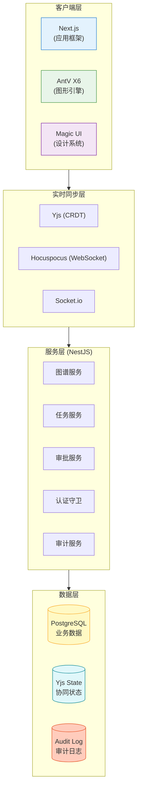

# 智图协研 IntelliGraph

## 脑图驱动的协同研发平台

### — 高精尖装备研发新范式 —

**产品白皮书 V1.0**

*2026年1月*

---

# 摘要

**智图协研 (IntelliGraph)** 是一款专为高精尖装备研发领域打造的**脑图驱动协同研发平台**。它以可视化脑图作为项目的"单一真相源 (Single Source of Truth)"，将需求分解、任务管理、知识复用、审批流转、执行追踪统一在同一可视化空间中流动，实现从构想到交付的全流程实时协同。

**核心价值主张：**

- 🎯 **可视化驱动** — 思维即流程，打破"项目-任务-汇报"的割裂模式
- ⚡ **实时协同** — 1000+节点、50人并发，P95交互响应<100ms
- 🔒 **企业级安全** — 密级/字段/附件级权限，动态水印，全生命周期审计
- 🤖 **智能辅助** — AI驱动的知识生成与推荐，加速决策与复用
- 📊 **多维视图** — 脑图/甘特/看板/时间轴无缝联动，一份数据多维呈现

---

# 目录

1. [行业洞察](#第一部分行业洞察)
   - 1.1 高精尖装备研发的时代背景
   - 1.2 传统研发模式的六大痛点
   - 1.3 数字化转型的迫切需求

2. [产品价值](#第二部分产品价值)
   - 2.1 产品愿景与定位
   - 2.2 核心价值主张
   - 2.3 目标用户画像

3. [功能全景](#第三部分功能全景)
   - 3.1 功能架构总览
   - 3.2 核心模块详解
   - 3.3 产品界面展示

4. [技术实力](#第四部分技术实力)
   - 4.1 技术架构设计
   - 4.2 性能与可靠性

5. [结语与展望](#第五部分结语与展望)

---

# 第一部分：行业洞察

## 1.1 高精尖装备研发的时代背景

在航空航天、国防军工、高端装备制造等战略性领域，产品研发正面临前所未有的复杂性挑战：

| 维度 | 特征 | 挑战 |
|------|------|------|
| **系统复杂度** | 数万零部件，数百子系统 | 协同接口爆炸式增长 |
| **研发周期** | 跨越5-15年 | 知识传承与版本管理困难 |
| **参与规模** | 数百人跨专业团队 | 沟通成本指数级上升 |
| **质量要求** | 零容错，高可靠 | 全过程可追溯审计 |
| **安全等级** | 涉密分级管理 | 细粒度权限控制 |

> **核心矛盾**：研发效率与管理合规之间的张力日益突出。团队需要更高效的协作工具，同时必须满足严苛的安全与审计要求。

## 1.2 传统研发模式的六大痛点

### 痛点一：信息孤岛与系统割裂

- 需求管理、任务跟踪、知识沉淀分散在3-5套系统中
- 关键信息依赖人工搬运，版本不一致时有发生
- 跨系统检索困难，知识复用率低于20%

### 痛点二：协同效率低下

- 传统"邮件+会议+文档"模式，信息传递滞后
- 变更通知淹没在海量邮件中，关键信息遗漏
- 50人以上团队的同步成本每增加10人上升40%

### 痛点三：依赖关系不可视

- 任务间的逻辑依赖靠人脑记忆或Excel维护
- 上游变更无法自动触发下游预警
- 风险识别严重滞后，问题发现时往往已成既定事实

### 痛点四：权限管理粗放

- 传统系统仅支持文档/文件夹级权限
- 无法满足"同一文档，不同人看到不同内容"的涉密场景需求
- 临时授权流程繁琐，影响协作效率

### 痛点五：审计追溯困难

- 操作日志分散在各子系统，难以统一查询
- 无法快速回答"谁在什么时间做了什么修改"
- 合规审计需要大量人工整理，成本高昂

### 痛点六：通知噪音过载

- 系统变更通知不区分优先级，一律推送
- 高频操作导致邮件/消息刷屏，真正重要的信息被淹没
- 团队成员逐渐"免疫"通知，形成恶性循环

## 1.3 数字化转型的迫切需求

行业正在呼唤一种**全新的研发协作范式**：

| 需求层次 | 传统模式 | 期望模式 |
|----------|----------|----------|
| 信息组织 | 文档/文件夹 | **图谱化/可视化** |
| 协作方式 | 异步/串行 | **实时/并行** |
| 依赖管理 | 人工维护 | **自动推演** |
| 权限控制 | 文件级 | **字段级/内容级** |
| 状态追踪 | 主动查询 | **智能推送** |
| 知识复用 | 手动检索 | **AI推荐** |

**智图协研 (IntelliGraph)** 正是为响应这一需求而诞生。

---

# 第二部分：产品价值

## 2.1 产品愿景与定位

### 愿景

> **以脑图为单一真相源，让研发协作像思维流动一样自然。**

### 定位

**智图协研**是一款面向高精尖装备研发场景的**企业级协同研发平台**，它将：

- 🧠 **思维导图** — 可视化的信息组织方式
- 📋 **项目管理** — 任务分解、依赖、进度追踪
- 🔐 **安全管控** — 涉密环境的权限与审计
- 🤝 **实时协同** — 多人同时在线编辑
- 🤖 **智能辅助** — AI驱动的知识生成与推荐

融合为统一的可视化工作空间。

### 核心理念：脑图即操作系统

## 2.2 核心价值主张

### 价值一：可视化驱动 — 思维即流程

- **脑图即工作流**：每个节点不仅是信息载体，更是可执行的业务对象
- **多种布局模式**：自由/树状/逻辑图无缝切换，适应不同思维场景
- **下钻与回链**：复杂子系统可下钻为独立子图，同时保持与父图的引用关系

### 价值二：实时协同 — 零延迟共创

- **多人光标可见**：实时看到队友在哪里工作，避免重复劳动
- **即时同步**：任何修改在100ms内推送到所有在线成员
- **冲突智能处理**：基于CRDT算法的并发编辑，自动合并无冲突变更

### 价值三：企业级安全 — 涉密场景专属

- **四级密级控制**：公开/内部/秘密/机密，与用户密级自动匹配
- **字段级权限**：同一节点，不同人看到不同字段内容
- **动态水印**：实时覆盖用户ID+时间，防止截图泄密
- **全程审计**：所有操作append-only记录，保留≥1年

### 价值四：智能辅助 — AI赋能效率

- **AI骨架生成**：输入主题，一键生成脑图分支结构
- **知识推荐**：基于当前节点内容，智能推荐相关历史知识
- **智能节流**：通知去重与汇总，只推送真正重要的信息

### 价值五：多维视图 — 一份数据多维呈现

| 视图类型 | 适用场景 | 核心能力 |
|----------|----------|----------|
| 🧠 脑图视图 | 需求分解、头脑风暴 | 可视化结构、快速编辑 |
| 📊 甘特视图 | 进度规划、资源调度 | 时间轴、依赖关系线 |
| 📋 看板视图 | 敏捷迭代、状态跟踪 | 拖拽流转、WIP限制 |
| ⏰ 时间轴视图 | 里程碑规划、汇报 | 关键节点、进度对比 |

> **核心优势**：四种视图共享同一份数据源，任一视图的修改实时同步到其他视图。

## 2.3 目标用户画像

### 用户一：项目/系统工程经理

**角色特征**：
- 负责项目全局规划与资源调配
- 需要实时掌握各子系统进度
- 重点关注风险识别与依赖阻塞

**核心诉求**：
- ✅ 一张图看清项目全貌与依赖关系
- ✅ 关键节点变更自动预警
- ✅ 多维视图切换，适应不同汇报场景

### 用户二：研发/架构/测试工程师

**角色特征**：
- 承担具体技术任务的执行
- 需要频繁协同与信息同步
- 追求高效的工具操作体验

**核心诉求**：
- ✅ 键盘优先的极速操作（兼容XMind快捷键）
- ✅ 实时看到队友的工作状态
- ✅ 快速检索与复用历史知识

### 用户三：安全/合规负责人

**角色特征**：
- 负责数据安全与合规审计
- 需要配置复杂的权限策略
- 定期执行合规检查与报告

**核心诉求**：
- ✅ 细粒度的密级与权限配置
- ✅ 全操作审计日志，可导出报告
- ✅ 动态水印防止截图泄密

### 用户四：知识管理专员

**角色特征**：
- 负责组织知识的沉淀与复用
- 需要建立标准化的模板体系
- 推动最佳实践的跨项目推广

**核心诉求**：
- ✅ 模板库与子树片段复用
- ✅ 跨图引用与知识血缘追踪
- ✅ AI辅助的知识推荐与生成

---

# 第三部分：功能全景

## 3.1 功能架构总览

## 3.2 核心模块详解

### 模块一：协同脑图核心 (Collaborative Graph Core)

> **核心价值**：团队可以"在一起"即时思考和创作，无需等待文件传输。

#### 1.1 画布与节点操作
- **多布局引擎**：自由布局 / 逻辑图（向右） / 思维导图（放射）三种模式
- **XMind级快捷键**：Enter(兄弟节点) / Tab(子节点) / Space(编辑) / Delete(删除)
- **命令面板**：`/` 唤起全功能命令菜单，减少鼠标操作
- **批量粘贴成树**：复制多行文本，自动识别缩进生成层级结构

#### 1.2 实时协同引擎
- **多人光标**：实时显示所有在线成员的光标位置与选中状态
- **Yjs+Hocuspocus**：基于CRDT的冲突自动解决，协同延迟<200ms
- **节点锁定**：编辑中的节点自动锁定，防止并发覆盖

#### 1.3 高级布局控制
- **对齐辅助**：对齐线 / 吸附 / 网格开关
- **距离指示**：拖拽时实时显示与相邻节点的距离
- **布局状态持久化**：切换布局模式后可恢复到之前的位置

#### 1.4 快速上手支持
- **快捷键提示**：`?` 键弹出完整快捷键列表
- **粘贴预览**：批量粘贴前可预览生成的树结构
- **AI骨架生成**：一键生成主题相关的分支骨架

---

### 模块二：任务与视图管理 (Task & View Management)

> **核心价值**：项目经理和执行者可以在同一数据源上无缝切换视角。

#### 2.1 任务转换与属性
- **节点转任务**：普通节点一键转换为可执行任务
- **任务属性**：开始/截止时间、优先级、执行人、进度百分比
- **状态流转**：Draft → Todo → InProgress → Done，支持自定义状态

#### 2.2 依赖关系网络
- **四种依赖类型**：FS(完成-开始) / SS(开始-开始) / FF(完成-完成) / SF(开始-完成)
- **循环依赖检测**：系统自动拦截并提示循环依赖错误
- **依赖可视化**：专属连线样式区分依赖关系与层级关系

#### 2.3 多视图联动
- **甘特视图**：任务按时间轴排列，依赖关系连线可见
- **看板视图**：按状态分组，支持拖拽流转
- **时间轴视图**：关键里程碑与进度对比
- **视图同步**：任一视图的修改实时反映到其他视图

---

### 模块三：评论与通知系统

> **核心价值**：围绕具体内容进行上下文沟通，重要信息不遗漏。

#### 3.1 节点评论
- **上下文评论**：评论直接关联到具体节点，保持讨论焦点
- **线程回复**：支持多层级回复形成讨论线程
- **@提及**：输入@弹出成员列表，被提及人收到即时通知
- **未读标记**：有未读评论的节点显示红点提示

#### 3.2 通知中心
- **5分钟去重**：同一对象的同类事件在时间窗内合并
- **5分钟汇总**：批量变更汇总为"张三修改了5个节点"
- **优先级通道**：@提及、审批请求等高优事件绕过节流即时送达
- **未读管理**：清晰的已读/未读状态，支持一键全部标为已读

#### 3.3 订阅关注
- **分支订阅**：关注特定分支的变更通知
- **节点订阅**：关注单个关键节点
- **邮件通知**：支持配置邮件通知推送

---

### 模块四：模板与知识库

> **核心价值**：从"从零开始"变为"站在巨人的肩膀上"。

#### 4.1 模板库
- **预置模板**：敏捷研发、故障复盘、FMEA分析等行业模板
- **自定义模板**：将常用子树结构保存为模板
- **一键实例化**：选择模板创建新图，自动填充结构与属性

#### 4.2 知识库关联
- **知识推荐**：基于当前节点内容，智能推荐相关历史知识
- **知识引用**：在节点中引用知识库条目
- **双向链接**：知识库与脑图节点双向关联

#### 4.3 产品库复用
- **产品搜索**：从共享产品库搜索标准化产品
- **产品引用**：在PBS节点中引用产品，保持同步更新
- **指标继承**：引用产品的指标自动继承到节点

---

### 模块五：应用集成

> **核心价值**：打通工业软件生态，实现工作流一体化。

#### 5.1 APP节点
- **应用注册**：管理员预配置可调用的应用列表
- **启动调用**：节点上点击启动按钮调用外部应用
- **参数传递**：通过数据线传递上下游参数

#### 5.2 文件附件
- **附件上传**：节点可关联多种格式的文件附件
- **在线预览**：支持常用文档格式的在线预览
- **版本管理**：附件支持版本历史

---

## 3.3 产品界面展示

### 主界面效果

*脑图画布主界面：支持多人实时协同编辑，右侧为属性面板*

### 协作场景

*多团队协同研发场景：工程师在大屏上进行需求分解与讨论*

---

# 第四部分：技术实力

## 4.1 技术架构设计

### 整体架构

### 技术栈一览

| 层次 | 技术选型 | 版本 | 选型理由 |
|------|----------|------|----------|
| **前端框架** | Next.js | 16.0+ | React生态、SSR支持、企业级稳定性 |
| **图形引擎** | AntV X6 | 3.1+ | 1k+节点性能、深度定制能力 |
| **UI组件** | Shadcn + Magic UI | - | 无障碍交互 + 高级视觉效果 |
| **样式方案** | TailwindCSS | 3.4+ | Utility-First、零运行时 |
| **后端框架** | NestJS | 11+ | 模块化、企业级、TypeScript原生 |
| **实时同步** | Yjs + Hocuspocus | - | CRDT算法、冲突自动解决 |
| **数据库** | PostgreSQL | 16+ | 可靠性、JSON支持、企业级 |
| **ORM** | Prisma | - | 类型安全、迁移管理 |
| **状态管理** | Zustand | 5.0+ | 轻量、React友好 |

### 后端模块架构

当前已实现的核心服务模块：

| 模块 | 功能描述 |
|------|----------|
| `collab` | 实时协同服务，基于Hocuspocus |
| `graphs` | 图谱CRUD与版本管理 |
| `notification` | 通知中心与消息推送 |
| `subscriptions` | 节点/分支订阅机制 |
| `file` | 文件上传与附件管理 |
| `users` | 用户管理与认证 |
| `product-library` | 产品库管理与搜索 |
| `knowledge-library` | 知识库管理 |
| `app-library` | 应用注册与调用 |
| `plugin-kernel` | 微内核插件加载器 |

### 前端组件架构

| 组件目录 | 功能描述 |
|----------|----------|
| `graph/` | 图谱画布核心组件 |
| `nodes/` | 节点渲染与类型 |
| `PropertyPanel/` | 右侧属性面板 |
| `Comments/` | 评论系统 |
| `TemplateLibrary/` | 模板库 |
| `ProductLibrary/` | 产品库 |
| `Knowledge/` | 知识关联 |
| `notifications/` | 通知中心 |
| `collab/` | 协同状态展示 |
| `CommandPalette/` | 命令面板 |

## 4.2 性能与可靠性

### 性能指标承诺

| 场景 | 指标 | 目标值 | 测试条件 |
|------|------|--------|----------|
| **初始加载** | 首屏时间 | < 2s | 1000节点图 |
| **交互响应** | P95延迟 | < 100ms | 缩放/平移/折叠 |
| **协同同步** | 延迟 | < 200ms | 50人并发 |
| **批量操作** | P95延迟 | < 400ms | 100节点批量移动 |
| **渲染帧率** | FPS | ≥ 60 | 1000节点画布 |

### 性能优化策略

1. **视口裁剪**：仅渲染可视区域内的节点，视口外节点虚拟化
2. **懒加载分片**：大图分片加载，按需请求节点数据
3. **增量渲染**：变更时仅重绘受影响的节点，非全量刷新
4. **WebSocket压缩**：Yjs二进制差分传输，减少网络开销

### 可靠性保障

- **自动快照**：关键操作触发自动快照，可随时回滚
- **冲突解决**：CRDT算法保证并发编辑最终一致性
- **零数据丢失**：所有操作先写入日志，再应用状态
- **断线重连**：网络中断后自动重连并同步增量变更

---

# 第五部分：结语与展望

## 总结

**智图协研 (IntelliGraph)** 代表了高精尖装备研发协作工具的新一代形态：

- 🧠 **思维可视化** — 复杂系统结构化呈现，一图胜千言
- ⚡ **实时协同化** — 多人同时在线，思维同频共振  
- 🔒 **安全合规化** — 涉密场景专属，审计追溯无忧
- 🤖 **智能自动化** — AI赋能知识复用，审批驱动流程自动推演
- 📊 **视图多元化** — 脑图/甘特/看板/时间轴，一份数据多维呈现

我们相信，**智图协研**将帮助高精尖装备研发团队：

> **从"项目-任务-汇报"的割裂模式，迈向"脑图驱动协同执行"的新范式。**

## 展望

未来，我们将持续迭代和增强：

- 🔗 **深度集成**：与主流PLM/PDM/ALM系统对接
- 🌐 **国产化适配**：支持国产操作系统与国密算法
- 📱 **移动端支持**：随时随地查看与轻量编辑
- 🤖 **AI深化**：大模型驱动的智能分析与预警

---

## 联系我们

如您希望进一步了解**智图协研**或申请产品演示，请通过以下方式联系：

- 📧 **邮箱**：contact@intelligraph.com
- 📞 **电话**：400-XXX-XXXX
- 🌐 **官网**：www.intelligraph.com

---

**智图协研 IntelliGraph**

*让研发协作像思维流动一样自然*

© 2026 IntelliGraph. All Rights Reserved.

---

# 附录

## 附录A：完整功能点清单

详见独立文档 **[feature-list.md](./feature-list.md)**

---

*文档版本：V1.0*  
*发布日期：2026年1月*  
*文档密级：商业机密*
